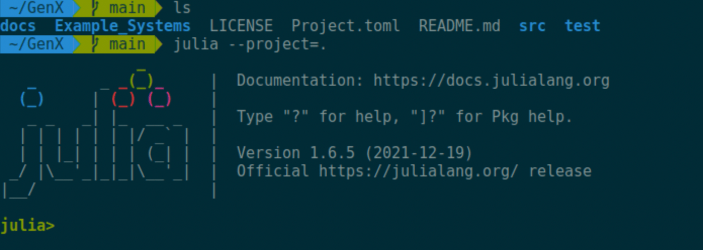
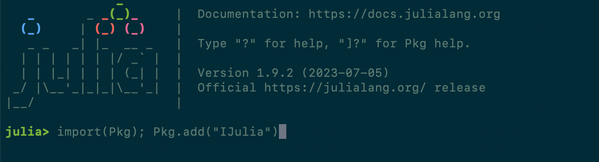
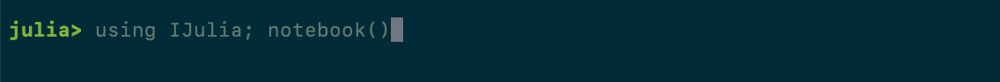
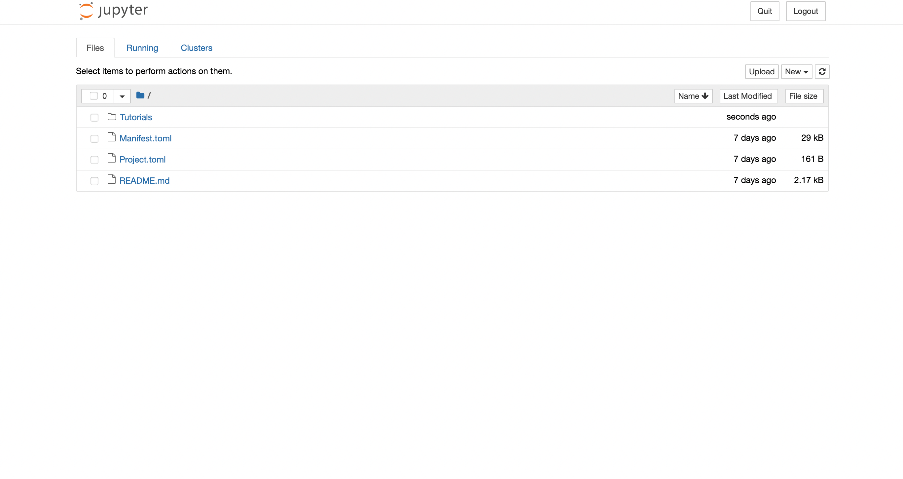

# Tutorial 0: Getting Started

In this tutorial, we go through setting up GenX on Jupyter and navigating to the `Tutorials` file from there.

First, as in the documentation, open a terminal window on your computer and navigate to GenX. Then, navigate to Julia and open a project using the command `julia --project=.`.


```@raw html

```

If you don't already have the package IJulia, add it here using `import(Pkg); Pkg.add("IJulia")`:

```@raw html

```

Next, add the GenX package by pressing the `]` key and typing `add https://github.com/GenXProject/GenX.git`

```@raw html

```

After IJulia is added, open a Jupyter notebook with `using IJulia; notebook()`:

```@raw html

```

This will open a notebook in your default browser. From there, navigate through the directory to the `Tutorials` folder and you're good to go!

```@raw html

```

**For a more detailed explanation of IJulia, Jupyter, and downloading packages, see this**[link](https://docs.google.com/document/d/1Qb9yQL1McZGCiFb8yoO4Evrh8oATE2Fias_FvuuEirs/edit).
