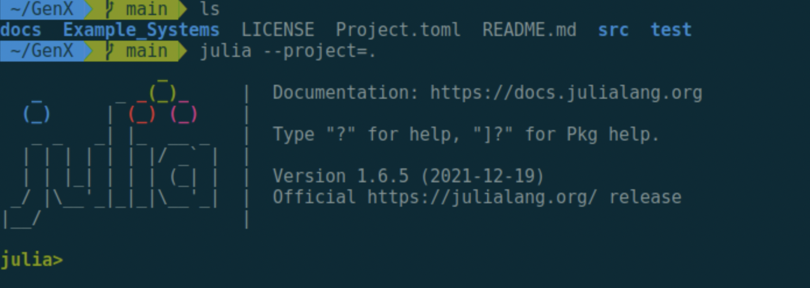
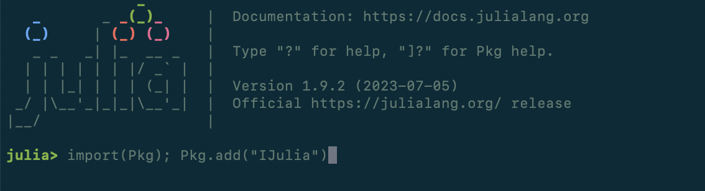
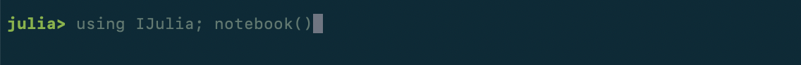
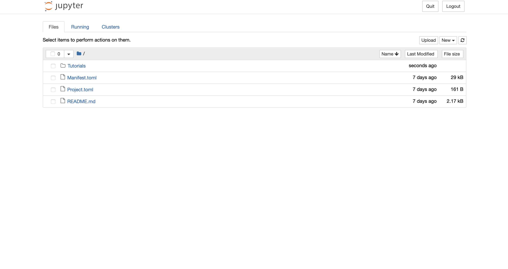

# Tutorial 0: Getting Started

Welcome to the GenX tutorials! In the following tutorials, we outline some important features of GenX and how to run them.

Running these notebooks follows similar steps to those in the GenX documentation <a href="https://genxproject.github.io/GenX.jl/dev/installation/" target="_blank">here</a>. In this tutorial, we go through setting up GenX on Jupyter and navigating to the `Tutorials` file from there.

First, as in the documentation, open a terminal window on your computer and navigate to GenX. Then, navigate to Julia and open a project using the command `julia --project=.`.

If you don't already have the package IJulia, add it here using `import(Pkg); Pkg.add("IJulia")`:

Next, add the GenX package by  typing `Pkg.add("GenX")`

After IJulia is added, open a Jupyter notebook with `using IJulia; notebook()`:

This will open a notebook in your default browser. From there, navigate through the directory to the `Tutorials` folder and you're good to go!

**For a more detailed explanation of IJulia, Jupyter, and downloading packages, see <a href="https://docs.google.com/document/d/1Qb9yQL1McZGCiFb8yoO4Evrh8oATE2Fias_FvuuEirs/edit" target="_blank">here</a>.**
