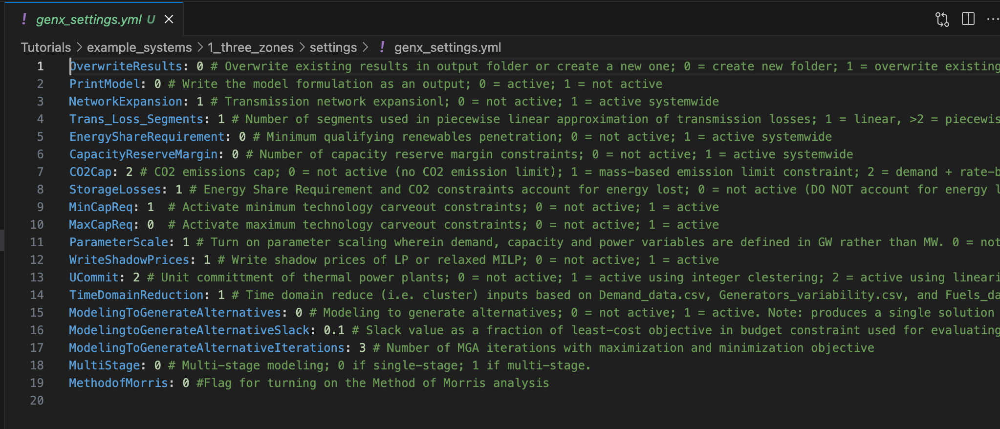
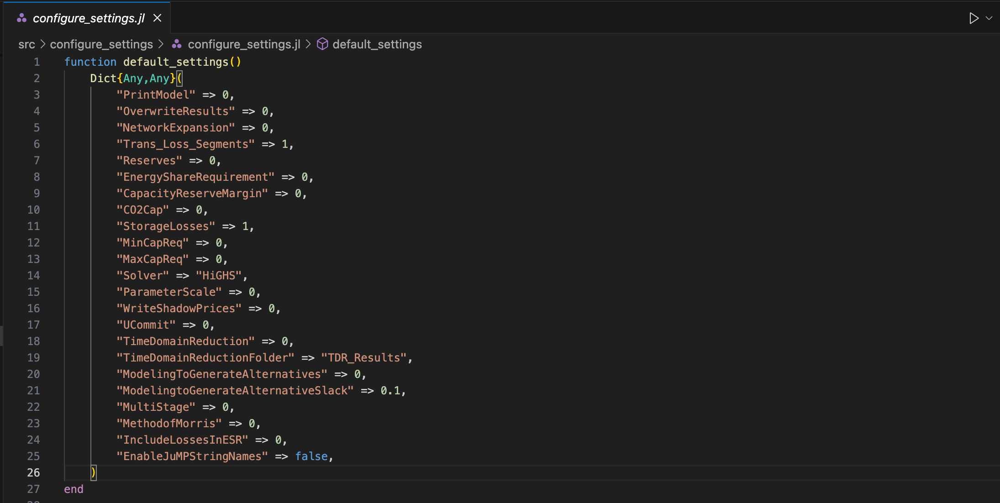
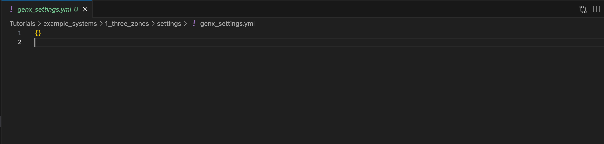

# Tutorial 1: Configuring Settings

[Interactive Notebook of the tutorial](https://github.com/GenXProject/GenX-Tutorials/blob/main/Tutorials/Tutorial_1_Configuring_Settings.ipynb)

GenX is easy to customize to fit a variety of problems. In this tutorial, we show which settings are available to change, what their defaults are, and how to change them in your code.

## What settings are there?

There are 21 settings available to edit in GenX, found in the file `genx_settings.yml`. These settings are described at the [Model settings parameters
](@ref) page of the documentation. The file is located in the `settings` folder in the working directory. To change the location of the file, edit the `settings_path` variable in `Run.jl` within your directory.

Most settings are set as either 0 or 1, which correspond to whether or not to include a specific feature. For example, to use `TimeDomainReduction`, you would set its parameter to 1 within `genx_settings.yml`. If you would like to run GenX without it, you would set its parameter to 0.

Other settings, such as `CO2Cap`, have more options corresponding to integers, while some settings such as `ModelingtoGenerateAlternativeSlack` take a numerical input directly (in this case, the slack value). Two settings, `Solver` and `TimeDomainReductionFolder` take in text as input. To learn more about different solvers, read [here](https://github.com/GenXProject/GenX.jl/blob/main/docs/src/User_Guide/solver_configuration.md). For `TimeDomainReductionFolder`, specify the name of the directory you wish to see the results in. For a more comprehensive description of the input options, see the documentation linked above.

To see how changing the settings affects the outputs, see Tutorials 3 and 7.

Below is the settings file for `example_systems/1_three_zones`:



All `genx_settings.yml` files in `example_systems` specify most parameters. When configuring your own settings, however, it is not necessary to input all parameters as defaults are specified for each one in `configure_settings.jl`.



To open `genx_settings.yml` in Jupyter, use the function `YAML.load(open(...))` and navigate to file in the desired directory:


```julia
using YAML
genx_settings_SNE = YAML.load(open("example_systems/1_three_zones/settings/genx_settings.yml"))
```

```
    Dict{Any, Any} with 19 entries:
      "NetworkExpansion"                        => 1
      "ModelingToGenerateAlternativeIterations" => 3
      "ParameterScale"                          => 1
      "EnergyShareRequirement"                  => 0
      "PrintModel"                              => 0
      "TimeDomainReduction"                     => 1
      "Trans_Loss_Segments"                     => 1
      "CapacityReserveMargin"                   => 0
      "ModelingtoGenerateAlternativeSlack"      => 0.1
      "MethodofMorris"                          => 0
      "StorageLosses"                           => 1
      "MultiStage"                              => 0
      "OverwriteResults"                        => 0
      "UCommit"                                 => 2
      "ModelingToGenerateAlternatives"          => 0
      "MaxCapReq"                               => 0
      "MinCapReq"                               => 1
      "CO2Cap"                                  => 2
      "WriteShadowPrices"                       => 1
```


Since all settings have defaults, you only need to specify the settings you would like to change. In fact, you can leave your settings file completely blank and it will still run! Let's try editing `genx_settings` in `example_systems/1_three_zones` to contain no parameters:


```julia
new_params = Dict() # Empty dictionary
YAML.write_file("example_systems/1_three_zones/settings/genx_settings.yml", new_params)
```

The empty file will look like this:



Now, we run GenX and output the file `capacity.csv` from the `results` folder. To do this, we use the function `include`, which takes a .jl file and runs it in jupyter notebook:


```julia
include("example_systems/1_three_zones/Run.jl")
```

```
    Configuring Settings
    Configuring Solver
    Loading Inputs
    Reading Input CSV Files
    Network.csv Successfully Read!
    Demand (load) data Successfully Read!
    Fuels_data.csv Successfully Read!


    [ Info: Thermal.csv Successfully Read.
    [ Info: Vre.csv Successfully Read.
    [ Info: Storage.csv Successfully Read.
    [ Info: Resource_minimum_capacity_requirement.csv Successfully Read.

    Summary of resources loaded into the model:
    -------------------------------------------------------
    	Resource type 		Number of resources
    =======================================================
    	Thermal        		3
    	VRE            		4
    	Storage        		3
    =======================================================
    Total number of resources: 10
    -------------------------------------------------------
    Generators_variability.csv Successfully Read!
    Validating time basis
    CSV Files Successfully Read In From GenX-Tutorials/Tutorials/example_systems/1_three_zones
    Generating the Optimization Model
    Discharge Module
    Non-served Energy Module
    Investment Discharge Module
    Fuel Module
    CO2 Module
    Investment Transmission Module
    Transmission Module
    Dispatchable Resources Module
    Storage Resources Module
    Storage Investment Module
    Storage Core Resources Module
    Storage Resources with Symmetric Charge/Discharge Capacity Module
    Thermal (No Unit Commitment) Resources Module
    Time elapsed for model building is
    5.677411542
    Solving Model
    Running HiGHS 1.6.0: Copyright (c) 2023 HiGHS under MIT licence terms
    Presolving model
    402430 rows, 306077 cols, 1216044 nonzeros
    334406 rows, 273093 cols, 1179498 nonzeros
    Presolve : Reductions: rows 334406(-208720); columns 273093(-217481); elements 1179498(-265378)
    Solving the presolved LP
    IPX model has 334406 rows, 273093 columns and 1179498 nonzeros
    Input
        Number of variables:                                273093
        Number of free variables:                           0
        Number of constraints:                              334406
        Number of equality constraints:                     54616
        Number of matrix entries:                           1179498
        Matrix range:                                       [4e-07, 1e+01]
        RHS range:                                          [7e+02, 2e+04]
        Objective range:                                    [1e-01, 1e+05]
        Bounds range:                                       [2e+00, 2e+04]
    Preprocessing
        Dualized model:                                     no
        Number of dense columns:                            13
        Range of scaling factors:                           [5.00e-01, 1.00e+00]
    IPX version 1.0
    Interior Point Solve
     Iter     P.res    D.res            P.obj           D.obj        mu     Time
       0   7.92e+03 4.68e+04   3.32147673e+12 -5.29874805e+12  3.77e+08       0s
       1   2.52e+03 9.09e+03  -3.25877734e+12 -7.21381041e+12  1.13e+08       0s
       2   4.85e+02 2.35e+03  -3.11396725e+11 -5.19621090e+12  2.79e+07       1s
       3   3.29e+02 3.98e+02  -1.38395149e+11 -1.60011105e+12  1.06e+07       4s
     Constructing starting basis...
       4   2.79e+02 2.18e+02  -9.20089553e+10 -1.12770108e+12  6.86e+06      21s
       5   9.53e+00 7.39e+01   9.91668627e+10 -5.58589863e+11  1.62e+06      24s
       6   3.40e+00 1.42e+01   5.89999652e+10 -1.16297421e+11  3.82e+05      34s
       7   9.22e-01 2.82e+00   3.17189476e+10 -3.28274389e+10  1.18e+05      39s
       8   3.21e-01 9.06e-01   1.54947223e+10 -9.43126058e+09  4.16e+04      44s
       9   1.43e-01 7.07e-02   1.25444514e+10 -2.07076014e+09  2.26e+04      50s
      10   7.24e-02 2.69e-02   9.56770103e+09  6.98368943e+08  1.36e+04      59s
      11   5.85e-02 2.34e-02   9.04050442e+09  9.72471748e+08  1.23e+04      76s
      12   4.07e-02 1.86e-02   8.41352551e+09  1.36107427e+09  1.07e+04      91s
      13   2.13e-02 1.04e-02   7.27813663e+09  2.37139743e+09  7.40e+03     106s
      14   1.23e-02 9.58e-03   6.85995182e+09  2.42302634e+09  6.65e+03     121s
      15   6.29e-03 8.69e-03   6.30996161e+09  2.53750169e+09  5.63e+03     137s
      16   5.05e-03 4.32e-03   6.20375634e+09  3.06005287e+09  4.69e+03     153s
      17   3.10e-03 2.90e-03   5.81685189e+09  3.42321619e+09  3.56e+03     171s
      18   2.46e-03 1.90e-03   5.69010358e+09  3.69724506e+09  2.97e+03     193s
      19   2.17e-03 1.40e-03   5.64332584e+09  3.92063823e+09  2.56e+03     211s
      20   1.68e-03 1.08e-03   5.58574539e+09  4.00019716e+09  2.36e+03     225s
      21   1.67e-03 1.03e-03   5.58471864e+09  3.99434084e+09  2.36e+03     239s
      22   1.62e-03 7.41e-04   5.57432205e+09  4.11610384e+09  2.17e+03     253s
      23   1.30e-03 5.69e-04   5.49997107e+09  4.19795422e+09  1.94e+03     271s
      24   1.30e-03 5.50e-04   5.49974396e+09  4.19969138e+09  1.93e+03     290s
      25   1.02e-03 2.93e-04   5.41913926e+09  4.35952658e+09  1.57e+03     303s
      26   7.07e-04 2.24e-04   5.30762980e+09  4.42283116e+09  1.31e+03     348s
      27   6.98e-04 2.04e-04   5.30566881e+09  4.42740669e+09  1.30e+03     368s
      28   5.75e-04 1.34e-04   5.25404059e+09  4.51834486e+09  1.09e+03     384s
      29   5.11e-04 5.18e-05   5.23316215e+09  4.57449214e+09  9.78e+02     422s
      30   3.06e-04 3.13e-05   5.11136554e+09  4.65641695e+09  6.75e+02     463s
      31   2.48e-04 2.50e-05   5.07790558e+09  4.68190888e+09  5.88e+02     556s
      32   2.26e-04 1.93e-05   5.07281283e+09  4.69130536e+09  5.66e+02     578s
      33   1.57e-04 9.24e-06   5.02737766e+09  4.76799355e+09  3.85e+02     610s
      34   9.42e-05 6.90e-06   4.99047612e+09  4.78396507e+09  3.06e+02     633s
      35   9.03e-05 5.12e-06   4.98763526e+09  4.80106034e+09  2.77e+02     662s
      36   3.98e-05 2.82e-06   4.94599392e+09  4.83065342e+09  1.71e+02     671s
      37   2.58e-05 2.14e-06   4.93651437e+09  4.83728484e+09  1.47e+02     682s
      38   2.50e-05 1.47e-06   4.93618595e+09  4.83982232e+09  1.43e+02     693s
      39   2.07e-05 1.07e-06   4.93270993e+09  4.84546499e+09  1.29e+02     703s
      40   1.99e-05 9.16e-07   4.93246702e+09  4.84544485e+09  1.29e+02     712s
      41   1.27e-05 5.14e-07   4.92622155e+09  4.85308727e+09  1.08e+02     749s
      42   6.18e-06 2.78e-07   4.91448823e+09  4.86733398e+09  6.98e+01     756s
      43   5.75e-06 2.48e-07   4.91402422e+09  4.86791504e+09  6.83e+01     768s
      44   3.92e-06 2.41e-07   4.91163152e+09  4.86829302e+09  6.42e+01     772s
      45   3.73e-06 2.31e-07   4.91112985e+09  4.86905244e+09  6.23e+01     776s
      46   1.94e-06 1.39e-07   4.90762167e+09  4.87412061e+09  4.96e+01     779s
      47   1.92e-06 1.37e-07   4.90757967e+09  4.87423812e+09  4.94e+01     783s
      48   1.25e-06 1.12e-07   4.90638638e+09  4.87546419e+09  4.58e+01     787s
      49   7.47e-07 8.85e-08   4.90346514e+09  4.87810372e+09  3.75e+01     790s
      50   6.48e-07 7.92e-08   4.90314008e+09  4.87888853e+09  3.59e+01     794s
      51   4.98e-07 6.91e-08   4.90218004e+09  4.88024918e+09  3.25e+01     797s
      52   4.95e-07 6.83e-08   4.90215919e+09  4.88024410e+09  3.24e+01     801s
      53   4.90e-07 6.80e-08   4.90216775e+09  4.88028007e+09  3.24e+01     804s
      54   4.36e-07 6.78e-08   4.90188796e+09  4.88043523e+09  3.18e+01     806s
      55   2.99e-07 6.38e-08   4.90162529e+09  4.88076205e+09  3.09e+01     809s
      56   1.58e-07 4.39e-08   4.90042224e+09  4.88323839e+09  2.54e+01     811s
      57   1.34e-07 4.22e-08   4.90059270e+09  4.88334431e+09  2.55e+01     813s
      58   1.04e-07 3.50e-08   4.90003483e+09  4.88459728e+09  2.29e+01     815s
      59   9.50e-08 3.37e-08   4.90009649e+09  4.88472024e+09  2.28e+01     818s
      60   8.60e-08 3.33e-08   4.90001976e+09  4.88479577e+09  2.25e+01     820s
      61   7.03e-08 2.51e-08   4.89985257e+09  4.88580810e+09  2.08e+01     823s
      62   5.25e-08 2.49e-08   4.89952348e+09  4.88588451e+09  2.02e+01     825s
      63   4.41e-08 2.20e-08   4.89936497e+09  4.88640830e+09  1.92e+01     827s
      64   1.95e-08 2.05e-08   4.89921316e+09  4.88671585e+09  1.85e+01     829s
      65   1.85e-08 2.04e-08   4.89917163e+09  4.88677402e+09  1.84e+01     831s
      66   9.08e-09 1.50e-08   4.89794260e+09  4.88826475e+09  1.43e+01     832s
      67   3.26e-09 1.41e-08   4.89826703e+09  4.88831416e+09  1.47e+01     834s
      68   2.55e-09 9.27e-09   4.89776323e+09  4.89045614e+09  1.08e+01     836s
      69   4.15e-10 6.43e-09   4.89731419e+09  4.89088355e+09  9.52e+00     838s
      70   9.46e-11 6.14e-09   4.89657446e+09  4.89107504e+09  8.14e+00     840s
      71   7.28e-12 2.97e-09   4.89649409e+09  4.89256997e+09  5.81e+00     842s
      72   8.60e-12 2.23e-09   4.89597151e+09  4.89267917e+09  4.87e+00     844s
      73   7.28e-12 1.47e-09   4.89583195e+09  4.89300343e+09  4.19e+00     845s
      74   7.42e-12 1.28e-09   4.89583188e+09  4.89303732e+09  4.14e+00     847s
      75   7.03e-12 1.11e-09   4.89582547e+09  4.89341063e+09  3.57e+00     849s
      76   7.28e-12 6.11e-10   4.89574070e+09  4.89395382e+09  2.65e+00     850s
      77   5.46e-12 1.48e-09   4.89568118e+09  4.89402122e+09  2.46e+00     852s
      78   7.28e-12 5.82e-10   4.89555416e+09  4.89441725e+09  1.68e+00     854s
      79   5.46e-12 9.31e-10   4.89551185e+09  4.89441779e+09  1.62e+00     856s
      80   7.28e-12 8.00e-10   4.89548266e+09  4.89444930e+09  1.53e+00     858s
      81   5.46e-12 4.66e-10   4.89540821e+09  4.89457401e+09  1.23e+00     859s
      82   3.64e-12 4.95e-10   4.89518737e+09  4.89480554e+09  5.65e-01     861s
      83   7.28e-12 1.03e-09   4.89518640e+09  4.89481077e+09  5.56e-01     864s
      84   5.46e-12 8.59e-10   4.89516124e+09  4.89485596e+09  4.52e-01     866s
      85   3.64e-12 5.97e-10   4.89510929e+09  4.89488390e+09  3.34e-01     869s
      86   3.64e-12 7.28e-10   4.89511555e+09  4.89489396e+09  3.28e-01     870s
      87   3.64e-12 9.75e-10   4.89509232e+09  4.89493928e+09  2.27e-01     872s
      88   5.46e-12 1.35e-09   4.89508607e+09  4.89497465e+09  1.65e-01     875s
      89   5.46e-12 2.34e-09   4.89507160e+09  4.89500290e+09  1.02e-01     877s
      90   3.64e-12 4.66e-10   4.89506888e+09  4.89501168e+09  8.47e-02     879s
      91   3.64e-12 8.15e-10   4.89505281e+09  4.89502676e+09  3.86e-02     882s
      92   7.28e-12 2.90e-09   4.89504804e+09  4.89503126e+09  2.48e-02     884s
      93   7.28e-12 3.11e-09   4.89504828e+09  4.89503139e+09  2.50e-02     886s
      94   3.64e-12 3.94e-09   4.89504182e+09  4.89503147e+09  1.53e-02     887s
      95   7.28e-12 4.55e-09   4.89503900e+09  4.89503404e+09  7.34e-03     889s
      96   7.28e-12 3.97e-09   4.89503797e+09  4.89503587e+09  3.11e-03     891s
      97   3.64e-12 7.99e-09   4.89503736e+09  4.89503634e+09  1.50e-03     893s
      98   3.64e-12 7.41e-09   4.89503673e+09  4.89503642e+09  4.55e-04     895s
      99   3.64e-12 9.50e-09   4.89503663e+09  4.89503648e+09  2.22e-04     897s
     100*  3.64e-12 1.32e-08   4.89503652e+09  4.89503651e+09  1.82e-05     899s
     101*  3.64e-12 1.08e-08   4.89503652e+09  4.89503652e+09  2.25e-06     901s
     102*  3.64e-12 3.12e-08   4.89503652e+09  4.89503652e+09  1.34e-07     903s
     103*  3.64e-12 1.51e-08   4.89503652e+09  4.89503652e+09  8.82e-09     905s
    Running crossover as requested
        Primal residual before push phase:                  1.27e-04
        Dual residual before push phase:                    5.11e-05
        Number of dual pushes required:                     103575
        Number of primal pushes required:                   6498
    Summary
        Runtime:                                            905.57s
        Status interior point solve:                        optimal
        Status crossover:                                   optimal
        objective value:                                    4.89503652e+09
        interior solution primal residual (abs/rel):        6.64e-11 / 3.97e-15
        interior solution dual residual (abs/rel):          1.48e-08 / 1.05e-13
        interior solution objective gap (abs/rel):          1.62e-03 / 3.31e-13
        basic solution primal infeasibility:                8.04e-10
        basic solution dual infeasibility:                  2.05e-12
    Ipx: IPM       optimal
    Ipx: Crossover optimal
    Solving the original LP from the solution after postsolve
    Model   status      : Optimal
    IPM       iterations: 103
    Crossover iterations: 12550
    Objective value     :  4.8950365168e+09
    LP solved for primal
    Writing Output
    Time elapsed for writing costs is
    1.118419208
    Time elapsed for writing capacity is
    0.3498405
    Time elapsed for writing power is
    0.784041083
    Time elapsed for writing charge is
    0.317718542
    Time elapsed for writing capacity factor is
    0.262756083
    Time elapsed for writing storage is
    0.144432875
    Time elapsed for writing curtailment is
    0.235764667
    Time elapsed for writing nse is
    0.673588083
    Time elapsed for writing power balance is
    0.533529375
    Time elapsed for writing transmission flows is
    0.111765375
    Time elapsed for writing transmission losses is
    0.139880458
    Time elapsed for writing emissions is
    0.244327417
    Time elapsed for writing reliability is
    0.163886125
    Time elapsed for writing storage duals is
    0.43827175
    Time elapsed for writing fuel consumption is
    0.50627925
    Time elapsed for writing co2 is
    0.173650209
    Time elapsed for writing price is
    0.07908475
    Time elapsed for writing energy revenue is
    0.251686916
    Time elapsed for writing charging cost is
    0.174489958
    Time elapsed for writing subsidy is
    0.188284041
    Time elapsed for writing time weights is
    0.050749417
    Time elapsed for writing net revenue is
    0.797592334
    Wrote outputs to GenX-Tutorials/Tutorials/example_systems/1_three_zones/results
    Time elapsed for writing is
    8.276978416
```
The function `Run.jl` will build and then solve the model according to the specified parameters. These results will then be output into a `results` folder in the same directory. Note that the results folders are __not__ overwritten with each run.

```julia
using CSV
using DataFrames
results = CSV.read(open("example_systems/1_three_zones/Results/capacity.csv"),DataFrame)
```

```@raw html
<div><div style = "float: left;"><span>11×15 DataFrame</span></div><div style = "clear: both;"></div></div><div class = "data-frame" style = "overflow-x: scroll;"><table class = "data-frame" style = "margin-bottom: 6px;"><thead><tr class = "header"><th class = "rowNumber" style = "font-weight: bold; text-align: right;">Row</th><th style = "text-align: left;">Resource</th><th style = "text-align: left;">Zone</th><th style = "text-align: left;">StartCap</th><th style = "text-align: left;">RetCap</th><th style = "text-align: left;">NewCap</th><th style = "text-align: left;">EndCap</th><th style = "text-align: left;">CapacityConstraintDual</th><th style = "text-align: left;">StartEnergyCap</th><th style = "text-align: left;">RetEnergyCap</th><th style = "text-align: left;">NewEnergyCap</th><th style = "text-align: left;">EndEnergyCap</th><th style = "text-align: left;">StartChargeCap</th><th style = "text-align: left;">RetChargeCap</th><th style = "text-align: left;">NewChargeCap</th><th style = "text-align: left;">EndChargeCap</th></tr><tr class = "subheader headerLastRow"><th class = "rowNumber" style = "font-weight: bold; text-align: right;"></th><th title = "String31" style = "text-align: left;">String31</th><th title = "String3" style = "text-align: left;">String3</th><th title = "Float64" style = "text-align: left;">Float64</th><th title = "Float64" style = "text-align: left;">Float64</th><th title = "Float64" style = "text-align: left;">Float64</th><th title = "Float64" style = "text-align: left;">Float64</th><th title = "String3" style = "text-align: left;">String3</th><th title = "Float64" style = "text-align: left;">Float64</th><th title = "Float64" style = "text-align: left;">Float64</th><th title = "Float64" style = "text-align: left;">Float64</th><th title = "Float64" style = "text-align: left;">Float64</th><th title = "Float64" style = "text-align: left;">Float64</th><th title = "Float64" style = "text-align: left;">Float64</th><th title = "Float64" style = "text-align: left;">Float64</th><th title = "Float64" style = "text-align: left;">Float64</th></tr></thead><tbody><tr><td class = "rowNumber" style = "font-weight: bold; text-align: right;">1</td><td style = "text-align: left;">MA_natural_gas_combined_cycle</td><td style = "text-align: left;">1</td><td style = "text-align: right;">0.0</td><td style = "text-align: right;">0.0</td><td style = "text-align: right;">7394.75</td><td style = "text-align: right;">7394.75</td><td style = "text-align: left;">0.0</td><td style = "text-align: right;">0.0</td><td style = "text-align: right;">0.0</td><td style = "text-align: right;">0.0</td><td style = "text-align: right;">0.0</td><td style = "text-align: right;">0.0</td><td style = "text-align: right;">0.0</td><td style = "text-align: right;">0.0</td><td style = "text-align: right;">0.0</td></tr><tr><td class = "rowNumber" style = "font-weight: bold; text-align: right;">2</td><td style = "text-align: left;">CT_natural_gas_combined_cycle</td><td style = "text-align: left;">2</td><td style = "text-align: right;">0.0</td><td style = "text-align: right;">0.0</td><td style = "text-align: right;">2305.82</td><td style = "text-align: right;">2305.82</td><td style = "text-align: left;">0.0</td><td style = "text-align: right;">0.0</td><td style = "text-align: right;">0.0</td><td style = "text-align: right;">0.0</td><td style = "text-align: right;">0.0</td><td style = "text-align: right;">0.0</td><td style = "text-align: right;">0.0</td><td style = "text-align: right;">0.0</td><td style = "text-align: right;">0.0</td></tr><tr><td class = "rowNumber" style = "font-weight: bold; text-align: right;">3</td><td style = "text-align: left;">ME_natural_gas_combined_cycle</td><td style = "text-align: left;">3</td><td style = "text-align: right;">0.0</td><td style = "text-align: right;">0.0</td><td style = "text-align: right;">716.666</td><td style = "text-align: right;">716.666</td><td style = "text-align: left;">0.0</td><td style = "text-align: right;">0.0</td><td style = "text-align: right;">0.0</td><td style = "text-align: right;">0.0</td><td style = "text-align: right;">0.0</td><td style = "text-align: right;">0.0</td><td style = "text-align: right;">0.0</td><td style = "text-align: right;">0.0</td><td style = "text-align: right;">0.0</td></tr><tr><td class = "rowNumber" style = "font-weight: bold; text-align: right;">4</td><td style = "text-align: left;">MA_solar_pv</td><td style = "text-align: left;">1</td><td style = "text-align: right;">0.0</td><td style = "text-align: right;">0.0</td><td style = "text-align: right;">21186.5</td><td style = "text-align: right;">21186.5</td><td style = "text-align: left;">0.0</td><td style = "text-align: right;">0.0</td><td style = "text-align: right;">0.0</td><td style = "text-align: right;">0.0</td><td style = "text-align: right;">0.0</td><td style = "text-align: right;">0.0</td><td style = "text-align: right;">0.0</td><td style = "text-align: right;">0.0</td><td style = "text-align: right;">0.0</td></tr><tr><td class = "rowNumber" style = "font-weight: bold; text-align: right;">5</td><td style = "text-align: left;">CT_onshore_wind</td><td style = "text-align: left;">2</td><td style = "text-align: right;">0.0</td><td style = "text-align: right;">0.0</td><td style = "text-align: right;">11905.5</td><td style = "text-align: right;">11905.5</td><td style = "text-align: left;">0.0</td><td style = "text-align: right;">0.0</td><td style = "text-align: right;">0.0</td><td style = "text-align: right;">0.0</td><td style = "text-align: right;">0.0</td><td style = "text-align: right;">0.0</td><td style = "text-align: right;">0.0</td><td style = "text-align: right;">0.0</td><td style = "text-align: right;">0.0</td></tr><tr><td class = "rowNumber" style = "font-weight: bold; text-align: right;">6</td><td style = "text-align: left;">CT_solar_pv</td><td style = "text-align: left;">2</td><td style = "text-align: right;">0.0</td><td style = "text-align: right;">0.0</td><td style = "text-align: right;">16578.8</td><td style = "text-align: right;">16578.8</td><td style = "text-align: left;">0.0</td><td style = "text-align: right;">0.0</td><td style = "text-align: right;">0.0</td><td style = "text-align: right;">0.0</td><td style = "text-align: right;">0.0</td><td style = "text-align: right;">0.0</td><td style = "text-align: right;">0.0</td><td style = "text-align: right;">0.0</td><td style = "text-align: right;">0.0</td></tr><tr><td class = "rowNumber" style = "font-weight: bold; text-align: right;">7</td><td style = "text-align: left;">ME_onshore_wind</td><td style = "text-align: left;">3</td><td style = "text-align: right;">0.0</td><td style = "text-align: right;">0.0</td><td style = "text-align: right;">12767.3</td><td style = "text-align: right;">12767.3</td><td style = "text-align: left;">0.0</td><td style = "text-align: right;">0.0</td><td style = "text-align: right;">0.0</td><td style = "text-align: right;">0.0</td><td style = "text-align: right;">0.0</td><td style = "text-align: right;">0.0</td><td style = "text-align: right;">0.0</td><td style = "text-align: right;">0.0</td><td style = "text-align: right;">0.0</td></tr><tr><td class = "rowNumber" style = "font-weight: bold; text-align: right;">8</td><td style = "text-align: left;">MA_battery</td><td style = "text-align: left;">1</td><td style = "text-align: right;">0.0</td><td style = "text-align: right;">0.0</td><td style = "text-align: right;">3362.3</td><td style = "text-align: right;">3362.3</td><td style = "text-align: left;">0.0</td><td style = "text-align: right;">0.0</td><td style = "text-align: right;">0.0</td><td style = "text-align: right;">19427.7</td><td style = "text-align: right;">19427.7</td><td style = "text-align: right;">0.0</td><td style = "text-align: right;">0.0</td><td style = "text-align: right;">0.0</td><td style = "text-align: right;">0.0</td></tr><tr><td class = "rowNumber" style = "font-weight: bold; text-align: right;">9</td><td style = "text-align: left;">CT_battery</td><td style = "text-align: left;">2</td><td style = "text-align: right;">0.0</td><td style = "text-align: right;">0.0</td><td style = "text-align: right;">5318.36</td><td style = "text-align: right;">5318.36</td><td style = "text-align: left;">0.0</td><td style = "text-align: right;">0.0</td><td style = "text-align: right;">0.0</td><td style = "text-align: right;">27274.1</td><td style = "text-align: right;">27274.1</td><td style = "text-align: right;">0.0</td><td style = "text-align: right;">0.0</td><td style = "text-align: right;">0.0</td><td style = "text-align: right;">0.0</td></tr><tr><td class = "rowNumber" style = "font-weight: bold; text-align: right;">10</td><td style = "text-align: left;">ME_battery</td><td style = "text-align: left;">3</td><td style = "text-align: right;">0.0</td><td style = "text-align: right;">0.0</td><td style = "text-align: right;">2095.3</td><td style = "text-align: right;">2095.3</td><td style = "text-align: left;">0.0</td><td style = "text-align: right;">0.0</td><td style = "text-align: right;">0.0</td><td style = "text-align: right;">7096.27</td><td style = "text-align: right;">7096.27</td><td style = "text-align: right;">0.0</td><td style = "text-align: right;">0.0</td><td style = "text-align: right;">0.0</td><td style = "text-align: right;">0.0</td></tr><tr><td class = "rowNumber" style = "font-weight: bold; text-align: right;">11</td><td style = "text-align: left;">Total</td><td style = "text-align: left;">n/a</td><td style = "text-align: right;">0.0</td><td style = "text-align: right;">0.0</td><td style = "text-align: right;">83631.3</td><td style = "text-align: right;">83631.3</td><td style = "text-align: left;">n/a</td><td style = "text-align: right;">0.0</td><td style = "text-align: right;">0.0</td><td style = "text-align: right;">53798.1</td><td style = "text-align: right;">53798.1</td><td style = "text-align: right;">0.0</td><td style = "text-align: right;">0.0</td><td style = "text-align: right;">0.0</td><td style = "text-align: right;">0.0</td></tr></tbody></table></div>
```

As you can see, this runs without a problem! To try with your own parameters, edit the `new_params` dictionary with whatever parameters you'd like to try and run the cells again.Note: to output the results, you'll have to either delete the previous `results` folder, or input the name of the new results folder (e.g. `results_1`) when calling `CSV.read` as above.


Finally, let's rewite `genx_settings.yml` to put the original settings in the example back: 


```julia
YAML.write_file("example_systems/1_three_zones/settings/genx_settings.yml", genx_settings_TZ)
```
