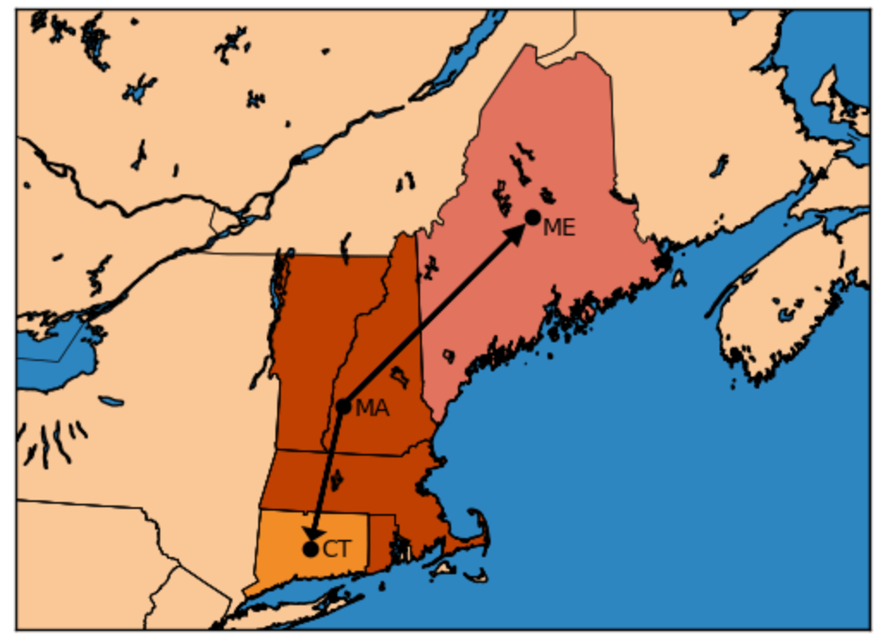

# Tutorial 2: Network Visualization

[Interactive Notebook of the tutorial](https://github.com/GenXProject/GenX-Tutorials/blob/main/Tutorials/Tutorial_2_Network_Visualization.ipynb)

To run GenX, there are five mandatory input files: `Fuels_data.csv`, `Network.csv`, `Demand_data.csv`, `Generators_variability.csv`, and `Generators_data.csv` (note that `Network.csv` is not mandatory if running a single-zone model). Detailed descriptions of these files can be found in the [GenX Inputs](@ref) page of the documentation.
This tutorial helps visualize the file `Network.csv` using the example system `example_systems/1_three_zones`.


```julia
using CSV
using DataFrames
```

The input file `Network.csv` contains the nodes of your network, how they connect to each other, and some important features about them. Below is the network file for `example_systems/1_three_zones`:


```julia
network = CSV.read("example_systems/1_three_zones/system/Network.csv",DataFrame,missingstring="NA")
```


```@raw html
<div><div style = "float: left;"><span>3×14 DataFrame</span></div><div style = "clear: both;"></div></div><div class = "data-frame" style = "overflow-x: scroll;"><table class = "data-frame" style = "margin-bottom: 6px;"><thead><tr class = "header"><th class = "rowNumber" style = "font-weight: bold; text-align: right;">Row</th><th style = "text-align: left;">Column1</th><th style = "text-align: left;">Network_zones</th><th style = "text-align: left;">Network_Lines</th><th style = "text-align: left;">Start_Zone</th><th style = "text-align: left;">End_Zone</th><th style = "text-align: left;">Line_Max_Flow_MW</th><th style = "text-align: left;">transmission_path_name</th><th style = "text-align: left;">distance_mile</th><th style = "text-align: left;">Line_Loss_Percentage</th><th style = "text-align: left;">Line_Max_Reinforcement_MW</th><th style = "text-align: left;">Line_Reinforcement_Cost_per_MWyr</th><th style = "text-align: left;">DerateCapRes_1</th><th style = "text-align: left;">CapRes_1</th><th style = "text-align: left;">CapRes_Excl_1</th></tr><tr class = "subheader headerLastRow"><th class = "rowNumber" style = "font-weight: bold; text-align: right;"></th><th title = "String3" style = "text-align: left;">String3</th><th title = "String3" style = "text-align: left;">String3</th><th title = "String3" style = "text-align: left;">String3</th><th title = "String3" style = "text-align: left;">String3</th><th title = "String3" style = "text-align: left;">String3</th><th title = "String7" style = "text-align: left;">String7</th><th title = "String15" style = "text-align: left;">String15</th><th title = "String15" style = "text-align: left;">String15</th><th title = "String15" style = "text-align: left;">String15</th><th title = "String7" style = "text-align: left;">String7</th><th title = "String7" style = "text-align: left;">String7</th><th title = "String7" style = "text-align: left;">String7</th><th title = "String3" style = "text-align: left;">String3</th><th title = "Union{Missing, Int64}" style = "text-align: left;">Int64?</th></tr></thead><tbody><tr><td class = "rowNumber" style = "font-weight: bold; text-align: right;">1</td><td style = "text-align: left;">MA</td><td style = "text-align: left;">z1</td><td style = "text-align: left;">1</td><td style = "text-align: left;">1</td><td style = "text-align: left;">2</td><td style = "text-align: left;">2950</td><td style = "text-align: left;">MA_to_CT</td><td style = "text-align: left;">123.0584</td><td style = "text-align: left;">0.012305837</td><td style = "text-align: left;">2950</td><td style = "text-align: left;">12060</td><td style = "text-align: left;">0.95</td><td style = "text-align: left;">0</td><td style = "text-align: right;">0</td></tr><tr><td class = "rowNumber" style = "font-weight: bold; text-align: right;">2</td><td style = "text-align: left;">CT</td><td style = "text-align: left;">z2</td><td style = "text-align: left;">2</td><td style = "text-align: left;">1</td><td style = "text-align: left;">3</td><td style = "text-align: left;">2000</td><td style = "text-align: left;">MA_to_ME</td><td style = "text-align: left;">196.5385</td><td style = "text-align: left;">0.019653847</td><td style = "text-align: left;">2000</td><td style = "text-align: left;">19261</td><td style = "text-align: left;">0.95</td><td style = "text-align: left;">0</td><td style = "text-align: right;">0</td></tr><tr><td class = "rowNumber" style = "font-weight: bold; text-align: right;">3</td><td style = "text-align: left;">ME</td><td style = "text-align: left;">z3</td><td style = "text-align: left;"></td><td style = "text-align: left;"></td><td style = "text-align: left;"></td><td style = "text-align: left;"></td><td style = "text-align: left;"></td><td style = "text-align: left;"></td><td style = "text-align: left;"></td><td style = "text-align: left;"></td><td style = "text-align: left;"></td><td style = "text-align: left;"></td><td style = "text-align: left;"></td><td style = "font-style: italic; text-align: right;">missing</td></tr></tbody></table></div>
```

MA, CT, and ME are the abbreviations for states Massachusetts, Connecticut, and Maine. However, since the US region of New England contains other states as well, MA in this case is also used to refer to those states.

Columns `Start_Zone` and `End_Zone` specify the network of the three regions. In this case, there are only two network lines, specified in the `Network_Lines` columns. The `Start_Zone` column indicates that the first node, MA, is the source of both lines as both rows have value 1. Rows `z1` and `z2` have values of 2 and 3 in `End_Zone`, which  means both nodes CT and ME recieve energy from node MA. This is also indicated in the column `transmission path name'. 

Below is a visualization of the network:



