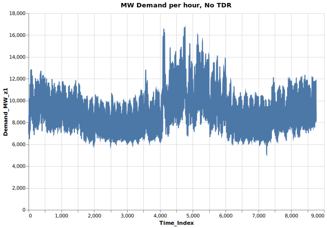
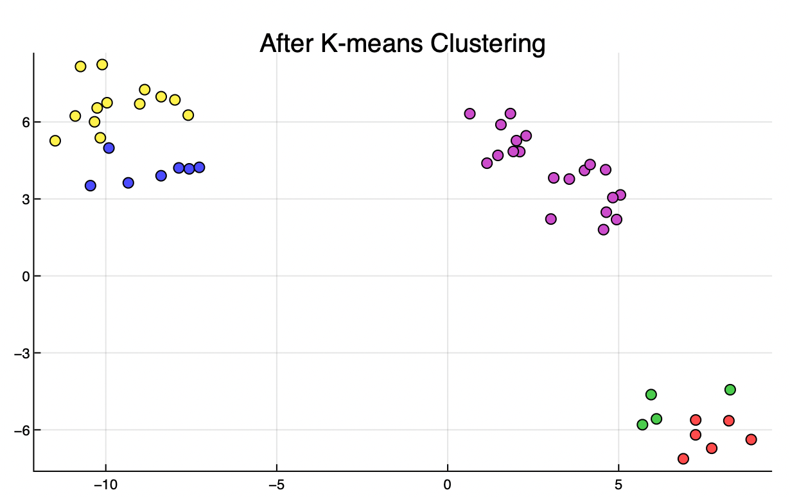
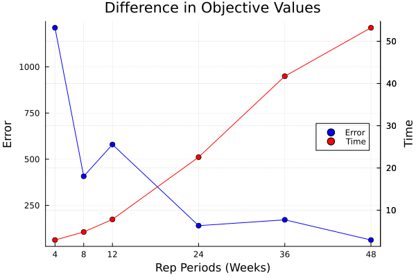

# Tutorial 3: K-Means and Time Domain Reduction

[Interactive Notebook of the tutorial](https://github.com/GenXProject/GenX-Tutorials/blob/main/Tutorials/Tutorial_3_K-means_Time_Domain_Reduction.ipynb)


A good tool to reduce computation time of GenX is to use [Time-domain reduction](@ref). Time-domain Reduction is a method that selects a smaller set of time steps from the data in a way that reduces computation time while still capturing the main information of the model. In this tutorial, we go over how TDR works in GenX and how it uses K-means clustering to choose the optimal time steps. For more information on TDR in capacity expansion models, see [Mallapragada et al](https://www.sciencedirect.com/science/article/pii/S0360544218315238).

### Table of Contents
* [Time Domain Reduction](#TDR)
* [K-Means Clustering](#Kmeans)
* [Results of Time Domain Reduction](#TDRResults)
* [Reconstruction](#Reconstruction)
* [Extreme Periods](#ExtPeriods)
* [Objective Values and Representative Periods](#ObjVals)

### Time Domain Reduction

To see how Time Domain Reduction works, let's look at the `Demand_data` in `example_systems/1_three_zones`:


```julia
# First, load all packages needed
using DataFrames
using CSV
using VegaLite
using YAML
using PlotlyJS
using Plots
using Clustering
using ScikitLearn
@sk_import datasets: (make_blobs)
```

```julia
case = joinpath("example_systems/1_three_zones");
```

```julia
demands =  CSV.read(joinpath(case,"system/Demand_data.csv"),DataFrame,missingstring="NA")
```

```@raw html
<div><div style = "float: left;"><span>8760×12 DataFrame</span></div><div style = "float: right;"><span style = "font-style: italic;">8735 rows omitted</span></div><div style = "clear: both;"></div></div><div class = "data-frame" style = "overflow-x: scroll;"><table class = "data-frame" style = "margin-bottom: 6px;"><thead><tr class = "header"><th class = "rowNumber" style = "font-weight: bold; text-align: right;">Row</th><th style = "text-align: left;">Voll</th><th style = "text-align: left;">Demand_Segment</th><th style = "text-align: left;">Cost_of_Demand_Curtailment_per_MW</th><th style = "text-align: left;">Max_Demand_Curtailment</th><th style = "text-align: left;">$/MWh</th><th style = "text-align: left;">Rep_Periods</th><th style = "text-align: left;">Timesteps_per_Rep_Period</th><th style = "text-align: left;">Sub_Weights</th><th style = "text-align: left;">Time_Index</th><th style = "text-align: left;">Demand_MW_z1</th><th style = "text-align: left;">Demand_MW_z2</th><th style = "text-align: left;">Demand_MW_z3</th></tr><tr class = "subheader headerLastRow"><th class = "rowNumber" style = "font-weight: bold; text-align: right;"></th><th title = "String7" style = "text-align: left;">String7</th><th title = "String3" style = "text-align: left;">String3</th><th title = "String7" style = "text-align: left;">String7</th><th title = "String7" style = "text-align: left;">String7</th><th title = "String7" style = "text-align: left;">String7</th><th title = "String3" style = "text-align: left;">String3</th><th title = "String7" style = "text-align: left;">String7</th><th title = "String7" style = "text-align: left;">String7</th><th title = "Int64" style = "text-align: left;">Int64</th><th title = "Int64" style = "text-align: left;">Int64</th><th title = "Int64" style = "text-align: left;">Int64</th><th title = "Int64" style = "text-align: left;">Int64</th></tr></thead><tbody><tr><td class = "rowNumber" style = "font-weight: bold; text-align: right;">1</td><td style = "text-align: left;">50000</td><td style = "text-align: left;">1</td><td style = "text-align: left;">1</td><td style = "text-align: left;">1</td><td style = "text-align: left;">2000</td><td style = "text-align: left;">1</td><td style = "text-align: left;">8760</td><td style = "text-align: left;">8760</td><td style = "text-align: right;">1</td><td style = "text-align: right;">7850</td><td style = "text-align: right;">2242</td><td style = "text-align: right;">1070</td></tr><tr><td class = "rowNumber" style = "font-weight: bold; text-align: right;">2</td><td style = "text-align: left;"></td><td style = "text-align: left;">2</td><td style = "text-align: left;">0.9</td><td style = "text-align: left;">0.04</td><td style = "text-align: left;">1800</td><td style = "text-align: left;"></td><td style = "text-align: left;"></td><td style = "text-align: left;"></td><td style = "text-align: right;">2</td><td style = "text-align: right;">7424</td><td style = "text-align: right;">2120</td><td style = "text-align: right;">1012</td></tr><tr><td class = "rowNumber" style = "font-weight: bold; text-align: right;">3</td><td style = "text-align: left;"></td><td style = "text-align: left;">3</td><td style = "text-align: left;">0.55</td><td style = "text-align: left;">0.024</td><td style = "text-align: left;">1100</td><td style = "text-align: left;"></td><td style = "text-align: left;"></td><td style = "text-align: left;"></td><td style = "text-align: right;">3</td><td style = "text-align: right;">7107</td><td style = "text-align: right;">2029</td><td style = "text-align: right;">969</td></tr><tr><td class = "rowNumber" style = "font-weight: bold; text-align: right;">4</td><td style = "text-align: left;"></td><td style = "text-align: left;">4</td><td style = "text-align: left;">0.2</td><td style = "text-align: left;">0.003</td><td style = "text-align: left;">400</td><td style = "text-align: left;"></td><td style = "text-align: left;"></td><td style = "text-align: left;"></td><td style = "text-align: right;">4</td><td style = "text-align: right;">6947</td><td style = "text-align: right;">1984</td><td style = "text-align: right;">947</td></tr><tr><td class = "rowNumber" style = "font-weight: bold; text-align: right;">5</td><td style = "text-align: left;"></td><td style = "text-align: left;"></td><td style = "text-align: left;"></td><td style = "text-align: left;"></td><td style = "text-align: left;"></td><td style = "text-align: left;"></td><td style = "text-align: left;"></td><td style = "text-align: left;"></td><td style = "text-align: right;">5</td><td style = "text-align: right;">6922</td><td style = "text-align: right;">1977</td><td style = "text-align: right;">944</td></tr><tr><td class = "rowNumber" style = "font-weight: bold; text-align: right;">6</td><td style = "text-align: left;"></td><td style = "text-align: left;"></td><td style = "text-align: left;"></td><td style = "text-align: left;"></td><td style = "text-align: left;"></td><td style = "text-align: left;"></td><td style = "text-align: left;"></td><td style = "text-align: left;"></td><td style = "text-align: right;">6</td><td style = "text-align: right;">7045</td><td style = "text-align: right;">2012</td><td style = "text-align: right;">960</td></tr><tr><td class = "rowNumber" style = "font-weight: bold; text-align: right;">7</td><td style = "text-align: left;"></td><td style = "text-align: left;"></td><td style = "text-align: left;"></td><td style = "text-align: left;"></td><td style = "text-align: left;"></td><td style = "text-align: left;"></td><td style = "text-align: left;"></td><td style = "text-align: left;"></td><td style = "text-align: right;">7</td><td style = "text-align: right;">7307</td><td style = "text-align: right;">2087</td><td style = "text-align: right;">996</td></tr><tr><td class = "rowNumber" style = "font-weight: bold; text-align: right;">8</td><td style = "text-align: left;"></td><td style = "text-align: left;"></td><td style = "text-align: left;"></td><td style = "text-align: left;"></td><td style = "text-align: left;"></td><td style = "text-align: left;"></td><td style = "text-align: left;"></td><td style = "text-align: left;"></td><td style = "text-align: right;">8</td><td style = "text-align: right;">7544</td><td style = "text-align: right;">2154</td><td style = "text-align: right;">1029</td></tr><tr><td class = "rowNumber" style = "font-weight: bold; text-align: right;">9</td><td style = "text-align: left;"></td><td style = "text-align: left;"></td><td style = "text-align: left;"></td><td style = "text-align: left;"></td><td style = "text-align: left;"></td><td style = "text-align: left;"></td><td style = "text-align: left;"></td><td style = "text-align: left;"></td><td style = "text-align: right;">9</td><td style = "text-align: right;">7946</td><td style = "text-align: right;">2269</td><td style = "text-align: right;">1083</td></tr><tr><td class = "rowNumber" style = "font-weight: bold; text-align: right;">10</td><td style = "text-align: left;"></td><td style = "text-align: left;"></td><td style = "text-align: left;"></td><td style = "text-align: left;"></td><td style = "text-align: left;"></td><td style = "text-align: left;"></td><td style = "text-align: left;"></td><td style = "text-align: left;"></td><td style = "text-align: right;">10</td><td style = "text-align: right;">8340</td><td style = "text-align: right;">2382</td><td style = "text-align: right;">1137</td></tr><tr><td class = "rowNumber" style = "font-weight: bold; text-align: right;">11</td><td style = "text-align: left;"></td><td style = "text-align: left;"></td><td style = "text-align: left;"></td><td style = "text-align: left;"></td><td style = "text-align: left;"></td><td style = "text-align: left;"></td><td style = "text-align: left;"></td><td style = "text-align: left;"></td><td style = "text-align: right;">11</td><td style = "text-align: right;">8578</td><td style = "text-align: right;">2449</td><td style = "text-align: right;">1169</td></tr><tr><td class = "rowNumber" style = "font-weight: bold; text-align: right;">12</td><td style = "text-align: left;"></td><td style = "text-align: left;"></td><td style = "text-align: left;"></td><td style = "text-align: left;"></td><td style = "text-align: left;"></td><td style = "text-align: left;"></td><td style = "text-align: left;"></td><td style = "text-align: left;"></td><td style = "text-align: right;">12</td><td style = "text-align: right;">8666</td><td style = "text-align: right;">2474</td><td style = "text-align: right;">1181</td></tr><tr><td class = "rowNumber" style = "font-weight: bold; text-align: right;">13</td><td style = "text-align: left;"></td><td style = "text-align: left;"></td><td style = "text-align: left;"></td><td style = "text-align: left;"></td><td style = "text-align: left;"></td><td style = "text-align: left;"></td><td style = "text-align: left;"></td><td style = "text-align: left;"></td><td style = "text-align: right;">13</td><td style = "text-align: right;">8707</td><td style = "text-align: right;">2487</td><td style = "text-align: right;">1187</td></tr><tr><td style = "text-align: right;">&vellip;</td><td style = "text-align: right;">&vellip;</td><td style = "text-align: right;">&vellip;</td><td style = "text-align: right;">&vellip;</td><td style = "text-align: right;">&vellip;</td><td style = "text-align: right;">&vellip;</td><td style = "text-align: right;">&vellip;</td><td style = "text-align: right;">&vellip;</td><td style = "text-align: right;">&vellip;</td><td style = "text-align: right;">&vellip;</td><td style = "text-align: right;">&vellip;</td><td style = "text-align: right;">&vellip;</td><td style = "text-align: right;">&vellip;</td></tr><tr><td class = "rowNumber" style = "font-weight: bold; text-align: right;">8749</td><td style = "text-align: left;"></td><td style = "text-align: left;"></td><td style = "text-align: left;"></td><td style = "text-align: left;"></td><td style = "text-align: left;"></td><td style = "text-align: left;"></td><td style = "text-align: left;"></td><td style = "text-align: left;"></td><td style = "text-align: right;">8749</td><td style = "text-align: right;">10730</td><td style = "text-align: right;">3064</td><td style = "text-align: right;">1463</td></tr><tr><td class = "rowNumber" style = "font-weight: bold; text-align: right;">8750</td><td style = "text-align: left;"></td><td style = "text-align: left;"></td><td style = "text-align: left;"></td><td style = "text-align: left;"></td><td style = "text-align: left;"></td><td style = "text-align: left;"></td><td style = "text-align: left;"></td><td style = "text-align: left;"></td><td style = "text-align: right;">8750</td><td style = "text-align: right;">10550</td><td style = "text-align: right;">3013</td><td style = "text-align: right;">1439</td></tr><tr><td class = "rowNumber" style = "font-weight: bold; text-align: right;">8751</td><td style = "text-align: left;"></td><td style = "text-align: left;"></td><td style = "text-align: left;"></td><td style = "text-align: left;"></td><td style = "text-align: left;"></td><td style = "text-align: left;"></td><td style = "text-align: left;"></td><td style = "text-align: left;"></td><td style = "text-align: right;">8751</td><td style = "text-align: right;">10438</td><td style = "text-align: right;">2981</td><td style = "text-align: right;">1423</td></tr><tr><td class = "rowNumber" style = "font-weight: bold; text-align: right;">8752</td><td style = "text-align: left;"></td><td style = "text-align: left;"></td><td style = "text-align: left;"></td><td style = "text-align: left;"></td><td style = "text-align: left;"></td><td style = "text-align: left;"></td><td style = "text-align: left;"></td><td style = "text-align: left;"></td><td style = "text-align: right;">8752</td><td style = "text-align: right;">10469</td><td style = "text-align: right;">2990</td><td style = "text-align: right;">1427</td></tr><tr><td class = "rowNumber" style = "font-weight: bold; text-align: right;">8753</td><td style = "text-align: left;"></td><td style = "text-align: left;"></td><td style = "text-align: left;"></td><td style = "text-align: left;"></td><td style = "text-align: left;"></td><td style = "text-align: left;"></td><td style = "text-align: left;"></td><td style = "text-align: left;"></td><td style = "text-align: right;">8753</td><td style = "text-align: right;">11228</td><td style = "text-align: right;">3206</td><td style = "text-align: right;">1531</td></tr><tr><td class = "rowNumber" style = "font-weight: bold; text-align: right;">8754</td><td style = "text-align: left;"></td><td style = "text-align: left;"></td><td style = "text-align: left;"></td><td style = "text-align: left;"></td><td style = "text-align: left;"></td><td style = "text-align: left;"></td><td style = "text-align: left;"></td><td style = "text-align: left;"></td><td style = "text-align: right;">8754</td><td style = "text-align: right;">11908</td><td style = "text-align: right;">3401</td><td style = "text-align: right;">1624</td></tr><tr><td class = "rowNumber" style = "font-weight: bold; text-align: right;">8755</td><td style = "text-align: left;"></td><td style = "text-align: left;"></td><td style = "text-align: left;"></td><td style = "text-align: left;"></td><td style = "text-align: left;"></td><td style = "text-align: left;"></td><td style = "text-align: left;"></td><td style = "text-align: left;"></td><td style = "text-align: right;">8755</td><td style = "text-align: right;">11562</td><td style = "text-align: right;">3302</td><td style = "text-align: right;">1576</td></tr><tr><td class = "rowNumber" style = "font-weight: bold; text-align: right;">8756</td><td style = "text-align: left;"></td><td style = "text-align: left;"></td><td style = "text-align: left;"></td><td style = "text-align: left;"></td><td style = "text-align: left;"></td><td style = "text-align: left;"></td><td style = "text-align: left;"></td><td style = "text-align: left;"></td><td style = "text-align: right;">8756</td><td style = "text-align: right;">9923</td><td style = "text-align: right;">3797</td><td style = "text-align: right;">1339</td></tr><tr><td class = "rowNumber" style = "font-weight: bold; text-align: right;">8757</td><td style = "text-align: left;"></td><td style = "text-align: left;"></td><td style = "text-align: left;"></td><td style = "text-align: left;"></td><td style = "text-align: left;"></td><td style = "text-align: left;"></td><td style = "text-align: left;"></td><td style = "text-align: left;"></td><td style = "text-align: right;">8757</td><td style = "text-align: right;">9461</td><td style = "text-align: right;">3621</td><td style = "text-align: right;">1277</td></tr><tr><td class = "rowNumber" style = "font-weight: bold; text-align: right;">8758</td><td style = "text-align: left;"></td><td style = "text-align: left;"></td><td style = "text-align: left;"></td><td style = "text-align: left;"></td><td style = "text-align: left;"></td><td style = "text-align: left;"></td><td style = "text-align: left;"></td><td style = "text-align: left;"></td><td style = "text-align: right;">8758</td><td style = "text-align: right;">9018</td><td style = "text-align: right;">3452</td><td style = "text-align: right;">1217</td></tr><tr><td class = "rowNumber" style = "font-weight: bold; text-align: right;">8759</td><td style = "text-align: left;"></td><td style = "text-align: left;"></td><td style = "text-align: left;"></td><td style = "text-align: left;"></td><td style = "text-align: left;"></td><td style = "text-align: left;"></td><td style = "text-align: left;"></td><td style = "text-align: left;"></td><td style = "text-align: right;">8759</td><td style = "text-align: right;">8551</td><td style = "text-align: right;">3281</td><td style = "text-align: right;">1154</td></tr><tr><td class = "rowNumber" style = "font-weight: bold; text-align: right;">8760</td><td style = "text-align: left;"></td><td style = "text-align: left;"></td><td style = "text-align: left;"></td><td style = "text-align: left;"></td><td style = "text-align: left;"></td><td style = "text-align: left;"></td><td style = "text-align: left;"></td><td style = "text-align: left;"></td><td style = "text-align: right;">8760</td><td style = "text-align: right;">8089</td><td style = "text-align: right;">3106</td><td style = "text-align: right;">1092</td></tr></tbody></table></div>
```


The columns to note in this file are `Rep_Periods`, `TimeSteps_Per_Rep_Period`, `Time_Index`, and `Demand_MW_`. This file shows the number of time steps used in GenX before applying TDR, i.e. every hour in a year, totaling 8,760 hours. This means that there is only one representative period, as seen in `Rep_Periods`.

TDR performs a "reduction" into a specified number of "representative periods", paring down the input data into a smaller set. The representative periods are then used in the GenX algorithm in place of the entire input data to reduce computation time. The TDR algorithm selects the representative periods to be the set of data whose results in GenX best match the results of the entire input data. To do this, TDR using k-means clustering, described in the next section.

When TDR is used, the file `time_domain_reduction_settings.yml` is called with a variety of specified settings, shown below:


```julia
time_domain_reduction_settings = YAML.load(open(joinpath(case,"settings/time_domain_reduction_settings.yml")))
```
```
    Dict{Any, Any} with 15 entries:
      "IterativelyAddPeriods" => 1
      "ExtremePeriods"        => Dict{Any, Any}("Wind"=>Dict{Any, Any}("System"=>Di…
      "UseExtremePeriods"     => 1
      "MinPeriods"            => 8
      "MaxPeriods"            => 11
      "DemandWeight"          => 1
      "ClusterFuelPrices"     => 1
      "nReps"                 => 100
      "MultiStageConcatenate" => 0
      "Threshold"             => 0.05
      "TimestepsPerRepPeriod" => 168
      "IterateMethod"         => "cluster"
      "ScalingMethod"         => "S"
      "ClusterMethod"         => "kmeans"
      "WeightTotal"           => 8760
```

Important here to note are `MinPeriods` and `MaxPeriods`. As TDR is performed, it is required to keep the number of representative periods to be between the min and max specified in the settings. This is to ensure that computation time is actually decreased and that the k-means algorithm doesn't just form one large cluster of all points. Additionally, `TimestepsPerRepPeriod` is set to 168, the number of hours in a week (`WeightTotal` includes all 8,760 timesteps, the number of hours in a year.) By specifying the number of timesteps in each representative period to be a week, we form 52 clusters from which the algorithm will choose 8-11.

For descriptions of all settings, see [`cluster_inputs`](@ref) in the documentation.

Now back to pre-TDR. Below shows the demand during each timestep in megawatts for the entire dataset, i.e. with only one representative period of 8760 hours. This is done for Zone 1:

```julia
demands |>
@vlplot(:line, 
    x=:Time_Index, y=:Demand_MW_z1, title="MW Demand per hour, No TDR",
    width=600,height=400,linewidth=.01)
```



As in [Tutorial 1: Configuring Settings](@ref), we can open the `genx_settings.yml` file for `1_three_zones` to see how `TimeDomainReduction` is set. If it's set to 1, this means TDR is being used.

```julia
genx_settings_TZ = YAML.load(open((joinpath(case,"settings/genx_settings.yml"))))
```
```
    Dict{Any, Any} with 19 entries:
      "NetworkExpansion"                        => 1
      "ModelingToGenerateAlternativeIterations" => 3
      "EnergyShareRequirement"                  => 0
      "PrintModel"                              => 0
      "TimeDomainReduction"                     => 1
      "Trans_Loss_Segments"                     => 1
      "CapacityReserveMargin"                   => 0
      "ModelingtoGenerateAlternativeSlack"      => 0.1
      "MethodofMorris"                          => 0
      "StorageLosses"                           => 1
      "MultiStage"                              => 0
      "OverwriteResults"                        => 0
      "UCommit"                                 => 2
      "ModelingToGenerateAlternatives"          => 0
      "MaxCapReq"                               => 0
      "MinCapReq"                               => 1
      "CO2Cap"                                  => 2
      "WriteShadowPrices"                       => 1
```

To visualize how TDR decreases computation time, let's start by running `example_systems/1_three_zones` without TDR. In the third section of this tutorial, we'll run the example again using TDR.

To run GenX without TDR, we start by editing the settings to set `TimeDomainReduction` to 0:


```julia
genx_settings_TZ["TimeDomainReduction"] = 0
genx_settings_TZ ## Output settings
```

```
    Dict{Any, Any} with 13 entries:
    "NetworkExpansion"       => 1
    "EnergyShareRequirement" => 0
    "TimeDomainReduction"    => 0
    "Trans_Loss_Segments"    => 1
    "CapacityReserveMargin"  => 0
    "StorageLosses"          => 1
    "ComputeConflicts"       => 1
    "UCommit"                => 2
    "MaxCapReq"              => 0
    "MinCapReq"              => 1
    "CO2Cap"                 => 2
    "WriteShadowPrices"      => 1
```

Then we write the edited settings to the file path:


```julia
YAML.write_file((joinpath(case,"settings/genx_settings.yml")), genx_settings_TZ)
```

And run it using `include`. (Note: this process will take a few minutes):


```julia
@time include("example_systems/1_three_zones/Run.jl")
```
Time elapsed for writing is
    142.404724 seconds

This took a little while to run, and would take even longer for larger systems. Let's see how we can get the run time down using Time Domain Reduction. The next sections go over how K-means clustering is used to perform TDR, and how to interpret the resulting files in GenX.

### K-means clustering

Let's go over how TDR works. To perform TDR, GenX uses __K-means clustering__. _K_-means is an optimization method that clusters data into several groups based on their proximity to "centers" determined by the algorithm. 

_K_-means finds a set number of groups such that the variance between the distance of each point in the group to the mean of the group is minimized. 

```math
\begin{align*}
\mathop{\arg \min}\limits_{\mathbf{S}} & \sum_{i = 1}^k \sum_{x \in S_i} ||x - \mu_i||^2 \\
\end{align*}
```

Where $\mathbf{S} = \{S_1, ... , S_k\}$ are the clusters, with $x$ denoting the elements of the clusters, and $\mu_i$ the mean of each cluster, i.e. the mean of the distances from each point to the center of the cluster. By taking the argmin over $\mathbf{S}$, the points $x$ are clustered into groups where their distance to the center is the smallest. For more information on how _k_-means works, see the [Wikipedia](https://en.wikipedia.org/wiki/K-means_clustering). 

GenX uses the package `Clustering.jl`, with documentation [here](https://juliastats.org/Clustering.jl/dev/kmeans.html#K-means). As an example, using the package `ScikitLearn.jl`, let's generate data that can cluster easily.


```julia
centers = 5
X, y = make_blobs(n_samples=50,centers=centers); # From scikit-learn
b = DataFrame(X,:auto)
```

Note that clustering works for data without obvious groupings, but using blobs as an example makes _k_-means easier to visualize.


```julia
plotly()
Plots.scatter(b[!,"x1"],b[!,"x2"],legend=false,title="Before K-means Clustering")
```


Now we use the function `kmeans`, which is also used in `src/time_domain_reduction` in GenX.


```julia
R = kmeans(transpose(Matrix(b)),centers)
```

`kmeans` returns three outputs: assignments, centers, and counts. Assignments shows to which cluster each points belongs, centers shows where the center coordinates of each cluster are, and counts shows how many points belong to each cluster.


```julia
println("Assignments = ",R.assignments)
println("")
println("Counts = ",R.counts)
println("")
println("Centers:")
R.centers
```


```julia
plotly()
Plots.scatter(b[!,"x1"],b[!,"x2"],legend=false,marker_z=R.assignments,c=:lightrainbow,title="After K-means Clustering")
```



In GenX, the representative periods are the centers of the clusters, each representing one week of the year. In the above example that would mean there are 52 data points gathered into 11 clusters (to see this for yourself, change `make_blobs` to have 52 data points and 11 clusters.)

### Results of Time Domain Reduction

To visualize the results of TDR, we'll set TDR = 1 back in the `genx_settings.yml` file in `example_systems/1_three_zones`:


```julia
genx_settings_TZ["TimeDomainReduction"] = 1;
```


```julia
genx_settings_TZ
```


```julia
YAML.write_file((joinpath(case,"settings/genx_settings.yml")), genx_settings_TZ)
```

And run GenX again with TDR:


```julia
@time include("example_systems/1_three_zones/Run.jl")
```

Csv files with the results of TDR are generated automatically in a folder called `TDR_results` found within the same folder containing the input csv files, in this case `example_systems/1_three_zones`. The csv files in this folder show the files used in `Run.jl` that have been pared down from the initial input files.

As an example, consider the input file `Fuels_data.csv`:


```julia
Fuels_original = CSV.read(joinpath(case,"system/Fuels_data.csv"),DataFrame,missingstring="NA")
```

Compared to `TDR_Results/Fuels_data.csv`:


```julia
Fuels_TDR = CSV.read(joinpath(case,"TDR_Results/Fuels_data.csv"),DataFrame,missingstring="NA")
```

As you can see, the original has all 8,760 hours, while the TDR version only has 1,848 hours.


```julia
demands_TDR = CSV.read(joinpath(case,"TDR_Results/Demand_data.csv"),DataFrame,missingstring="NA")
```

The 1,848 hours are divided into 11 sections of 168 hours, with each section representing one week of the original data.  The number of hours per representative period is set in `time_domain_reduction_settings.yml`. Also specified in the file are the minimum and maximum number of clusters we would like to have (in this case 8 and 11). The _k_-means algorithm will then select the number of clusters that should be sufficient to capture the GenX model in fewer time steps (in this case 11).


```julia
Gen_TDR = CSV.read(joinpath(case,"TDR_Results/Generators_variability.csv"),DataFrame,missingstring="NA")
```


```julia
generators = CSV.read(joinpath(case,"system/Generators_variability.csv"),DataFrame,missingstring="NA")
```

Below, we create arrays out of the representative weeks and plot them on the same plot used in the beginning of this tutorial. The file `Period_map` shows which periods (weeks) are used in TDR and which time step corresponds to each period:


```julia
Period_map = CSV.read(joinpath(case,"TDR_Results/Period_map.csv"),DataFrame,missingstring="NA")
```
``` @raw html
<div><div style = "float: left;"><span>52×3 DataFrame</span></div><div style = "float: right;"><span style = "font-style: italic;">27 rows omitted</span></div><div style = "clear: both;"></div></div><div class = "data-frame" style = "overflow-x: scroll;"><table class = "data-frame" style = "margin-bottom: 6px;"><thead><tr class = "header"><th class = "rowNumber" style = "font-weight: bold; text-align: right;">Row</th><th style = "text-align: left;">Period_Index</th><th style = "text-align: left;">Rep_Period</th><th style = "text-align: left;">Rep_Period_Index</th></tr><tr class = "subheader headerLastRow"><th class = "rowNumber" style = "font-weight: bold; text-align: right;"></th><th title = "Int64" style = "text-align: left;">Int64</th><th title = "Int64" style = "text-align: left;">Int64</th><th title = "Int64" style = "text-align: left;">Int64</th></tr></thead><tbody><tr><td class = "rowNumber" style = "font-weight: bold; text-align: right;">1</td><td style = "text-align: right;">1</td><td style = "text-align: right;">4</td><td style = "text-align: right;">1</td></tr><tr><td class = "rowNumber" style = "font-weight: bold; text-align: right;">2</td><td style = "text-align: right;">2</td><td style = "text-align: right;">4</td><td style = "text-align: right;">1</td></tr><tr><td class = "rowNumber" style = "font-weight: bold; text-align: right;">3</td><td style = "text-align: right;">3</td><td style = "text-align: right;">4</td><td style = "text-align: right;">1</td></tr><tr><td class = "rowNumber" style = "font-weight: bold; text-align: right;">4</td><td style = "text-align: right;">4</td><td style = "text-align: right;">4</td><td style = "text-align: right;">1</td></tr><tr><td class = "rowNumber" style = "font-weight: bold; text-align: right;">5</td><td style = "text-align: right;">5</td><td style = "text-align: right;">8</td><td style = "text-align: right;">2</td></tr><tr><td class = "rowNumber" style = "font-weight: bold; text-align: right;">6</td><td style = "text-align: right;">6</td><td style = "text-align: right;">8</td><td style = "text-align: right;">2</td></tr><tr><td class = "rowNumber" style = "font-weight: bold; text-align: right;">7</td><td style = "text-align: right;">7</td><td style = "text-align: right;">8</td><td style = "text-align: right;">2</td></tr><tr><td class = "rowNumber" style = "font-weight: bold; text-align: right;">8</td><td style = "text-align: right;">8</td><td style = "text-align: right;">8</td><td style = "text-align: right;">2</td></tr><tr><td class = "rowNumber" style = "font-weight: bold; text-align: right;">9</td><td style = "text-align: right;">9</td><td style = "text-align: right;">8</td><td style = "text-align: right;">2</td></tr><tr><td class = "rowNumber" style = "font-weight: bold; text-align: right;">10</td><td style = "text-align: right;">10</td><td style = "text-align: right;">12</td><td style = "text-align: right;">3</td></tr><tr><td class = "rowNumber" style = "font-weight: bold; text-align: right;">11</td><td style = "text-align: right;">11</td><td style = "text-align: right;">12</td><td style = "text-align: right;">3</td></tr><tr><td class = "rowNumber" style = "font-weight: bold; text-align: right;">12</td><td style = "text-align: right;">12</td><td style = "text-align: right;">12</td><td style = "text-align: right;">3</td></tr><tr><td class = "rowNumber" style = "font-weight: bold; text-align: right;">13</td><td style = "text-align: right;">13</td><td style = "text-align: right;">12</td><td style = "text-align: right;">3</td></tr><tr><td style = "text-align: right;">&vellip;</td><td style = "text-align: right;">&vellip;</td><td style = "text-align: right;">&vellip;</td><td style = "text-align: right;">&vellip;</td></tr><tr><td class = "rowNumber" style = "font-weight: bold; text-align: right;">41</td><td style = "text-align: right;">41</td><td style = "text-align: right;">20</td><td style = "text-align: right;">5</td></tr><tr><td class = "rowNumber" style = "font-weight: bold; text-align: right;">42</td><td style = "text-align: right;">42</td><td style = "text-align: right;">20</td><td style = "text-align: right;">5</td></tr><tr><td class = "rowNumber" style = "font-weight: bold; text-align: right;">43</td><td style = "text-align: right;">43</td><td style = "text-align: right;">23</td><td style = "text-align: right;">6</td></tr><tr><td class = "rowNumber" style = "font-weight: bold; text-align: right;">44</td><td style = "text-align: right;">44</td><td style = "text-align: right;">17</td><td style = "text-align: right;">4</td></tr><tr><td class = "rowNumber" style = "font-weight: bold; text-align: right;">45</td><td style = "text-align: right;">45</td><td style = "text-align: right;">48</td><td style = "text-align: right;">10</td></tr><tr><td class = "rowNumber" style = "font-weight: bold; text-align: right;">46</td><td style = "text-align: right;">46</td><td style = "text-align: right;">48</td><td style = "text-align: right;">10</td></tr><tr><td class = "rowNumber" style = "font-weight: bold; text-align: right;">47</td><td style = "text-align: right;">47</td><td style = "text-align: right;">48</td><td style = "text-align: right;">10</td></tr><tr><td class = "rowNumber" style = "font-weight: bold; text-align: right;">48</td><td style = "text-align: right;">48</td><td style = "text-align: right;">48</td><td style = "text-align: right;">10</td></tr><tr><td class = "rowNumber" style = "font-weight: bold; text-align: right;">49</td><td style = "text-align: right;">49</td><td style = "text-align: right;">49</td><td style = "text-align: right;">11</td></tr><tr><td class = "rowNumber" style = "font-weight: bold; text-align: right;">50</td><td style = "text-align: right;">50</td><td style = "text-align: right;">49</td><td style = "text-align: right;">11</td></tr><tr><td class = "rowNumber" style = "font-weight: bold; text-align: right;">51</td><td style = "text-align: right;">51</td><td style = "text-align: right;">8</td><td style = "text-align: right;">2</td></tr><tr><td class = "rowNumber" style = "font-weight: bold; text-align: right;">52</td><td style = "text-align: right;">52</td><td style = "text-align: right;">8</td><td style = "text-align: right;">2</td></tr></tbody></table></div>
```

```julia
# Find array of unique representative periods
rep_periods = unique(Period_map[!,"Rep_Period"])

# Create an array of the time steps and MW values of each representative period
weeks_demand = []
for i in rep_periods
    week_temp_demands = [repeat([i],168) demands[(168*i-167):168*i,"Time_Index"] demands[(168*i-167):168*i,"Demand_MW_z1"]]
    weeks_demand = [weeks_demand; week_temp_demands]
end

# Combine with Total (pre TDR)
demands_plot = [repeat(["Total"],8760) demands[!,"Time_Index"] demands[!,"Demand_MW_z1"]];

# Add column names and convert column type
demands_with_TDR = [demands_plot; weeks_demand]
demands_with_TDR = DataFrame(demands_with_TDR ,["Week","hour", "MW"])
demands_with_TDR[!,:hour] = convert.(Int64,demands_with_TDR[!,:hour]);
demands_with_TDR[!,:MW] = convert.(Float64,demands_with_TDR[!,:MW]);
```


```julia
demands_with_TDR  |>
@vlplot(mark={:line},
    x={:hour,title="Time Step (hours)",labels="Week:n"}, y={:MW,title="Demand (MW)"},
    color={"Week:n", scale={scheme="paired"},sort="decsending"}, title="MW Demand per hour with TDR Representative Weeks",
    width=845,height=400)
```


TDR is performed for four total data sets: demand (found in Demand.csv), wind and solar (found in Generators_variability.csv), and fuel prices (found in Fuels.csv). Above is just the demand for one of the three total nodes in the example system, which is why the data may not appear to "represent" all 52 weeks (notice there are fewer representative periods in the fall). Instead, the periods more accurately represent all the data time series combined, including some other parts of the data not seen in this particular plot.


### Extreme Periods Off

GenX has a feature called `ExtremePeriods`, which forces kmeans to include the highest and lowest points in the algorithm. This is done to ensure outliers are used, which is needed in planning energy capacity as the system needs to be able to account for outliers in energy needs. In the above graph, we can see that energy needs peak during the summer, and that the week with the highest demand is included as a representative week. Let's try turning extreme periods off, and see what happens. move this up


```julia
time_domain_reduction_settings["ExtremePeriods"] = 0;
YAML.write_file(joinpath(case,"settings/genx_settings.yml"), genx_settings_TZ);
rm(joinpath(case,"TDR_results"), recursive=true) 
```


```julia
include("example_systems/1_three_zones/Run.jl")
```


```julia
Demands_TDR2 = CSV.read(joinpath(case,"TDR_Results/Demand_data.csv"),DataFrame,missingstring="NA");
Period_map2 = CSV.read(joinpath(case,"TDR_Results/Period_map.csv"),DataFrame,missingstring="NA");
```


```julia
rep_periods2 = unique(Period_map2[!,"Rep_Period"])

weeks2 = []
for i in rep_periods2
    week_temp = [repeat([i],168) demands[(168*i-167):168*i,"Time_Index"] demands[(168*i-167):168*i,"Demand_MW_z1"]]
    weeks2 = [weeks2; week_temp]
end

weeks2 = [weeks2 repeat(["Off"],1848)];
```


```julia
demands_plotOff = [repeat(["Total"],8760) demands[!,"Time_Index"] demands[!,"Demand_MW_z1"] repeat(["Off"],8760) ];
demands_with_TDR[!,"Extreme_Periods"] = repeat(["On"],length(demands_with_TDR[!,1]));
demands_with_TDR2 = [demands_plotOff; weeks2]
```


```julia
demands_with_TDR2 = DataFrame(demands_with_TDR2 ,["Week","hour","MW","Extreme_Periods"])
demands_with_TDR2[!,:hour] = convert.(Int64,demands_with_TDR2[!,:hour]);
demands_with_TDR2[!,:MW] = convert.(Float64,demands_with_TDR2[!,:MW]);
```


```julia
# Define a new color scheme to accomodate more periods
myscheme = ["#a6cee3","#a6cee3","#1f78b4","#b2df8a","#33a02c","#fb9a99","#e31a1c","#fdbf6f","#ff7f00",
    "#cab2d6","#6a3d9a","#ffff99","#b15928","#b1ff00","#095768","#ce7e00","#b4a7d6"];
[demands_with_TDR; demands_with_TDR2] |>
@vlplot(mark={:line}, row="Extreme_Periods:n",
    x={:hour,title="Time Step (hours)",labels="Week:n"}, y={:MW,title="Demand (MW)"},
    color={"Week:n", scale={scheme="paired"},sort="decsending"}, 
    title="MW Demand per hour with TDR Representative Weeks, Extreme Periods Off",
    width=845,height=300)
```


The first plot (with Extreme Periods off) may not have the week with the highest peak highlighted. If the week with the highest demand is highlighted, try re-running the cell with Extreme Periods Off plotting the results.

Turn Extreme Periods back on:

```julia
time_domain_reduction_settings["ExtremePeriods"] = 1;
YAML.write_file(joinpath(case,"settings/time_domain_reduction_settings.yml"), time_domain_reduction_settings);
rm(joinpath(case,"TDR_results"), recursive=true) 
```

### Reconstruction

Below is a plot of a reconstruction of the data using only the weeks isolated as representative periods. This is what GenX reads when it runs the solver with TDR on.


```julia
recon = []
recon_noex = []
for i in range(1,52)
    index = Period_map[i,"Rep_Period"]
    recon_temp = [repeat([index],168) collect((168*i-167):168*i) demands[(168*index-167):168*index,"Demand_MW_z1"]]
    recon = [recon; recon_temp]
    
    index2 = Period_map2[i,"Rep_Period"]
    recon_noex_temp = [repeat([index2],168) collect((168*i-167):168*i) demands[(168*index2-167):168*index2,"Demand_MW_z1"]]
    recon_noex = [recon_noex; recon_noex_temp]
end

recon = DataFrame(recon,["Week","hour", "MW"])
recon[!,:hour] = convert.(Int64,recon[!,:hour]);
recon[!,:MW] = convert.(Float64,recon[!,:MW]);
recon[!,"Extreme_Periods"] = repeat(["On"],length(recon[!,1]));

recon_noex = [recon_noex repeat(["Off"],8736)];
recon_noex = DataFrame(recon_noex,["Week","hour", "MW", "Extreme_Periods"])
recon_noex[!,:hour] = convert.(Int64,recon_noex[!,:hour]);
recon_noex[!,:MW] = convert.(Float64,recon_noex[!,:MW]);
```


```julia
plotlyjs()
G1 = Plots.plot(recon_noex[!,:hour], recon_noex[!,:MW], linewidth=1.7,
    xticks=0:500:9000,xlabelfontsize=8,
    yticks=0:2000:18000,yformatter =:plain,ylims=(0,18000), ylabel="Demand (MW)",
    legend=false, title="Reconstruction, Extreme Periods Off", hover=recon_noex[!,:Week],
    color=recon_noex[!,:Week],size=(845,800),palette=:Paired_12)

G2 = Plots.plot(recon[!,:hour], recon[!,:MW], linewidth=1.7,
    xticks=0:500:9000,xlabel="Time Step (Hours)",xlabelfontsize=8,
    ylims=(0,18000),yticks=0:2000:18000,yformatter =:plain,ylabel="Demand (MW)",
    legend=false, title="Reconstruction, Extreme Periods On",hover=recon[!,:Week],
    color=recon[!,:Week],size=(845,800),palette=:Paired_12)

Plots.plot(G1,G2,layout=(2,1))
```


Each color represents one of the representative weeks.

The range of 8-11 representative periods was chosen by the developers because it was deemed to be the smallest set that still matches the optimal value of the data well. The next section of this Tutorial goes over how the optimal values of the data change as the number of representative periods changes.

### Objective Values and Representative Periods

Each time `Run.jl` is run, a `results` folder is produced. This folder contains numerous .csv files with output variable from the GenX model. For more information on all outputs, see the documentation [GenX Outputs](@ref).

This section focuses on the __objective value__ of the model. In optimization problems, the objective value is the main value minimized or maximized within the constraints of the model, according to the __objective function__ specified in the problem formulation. In the case of GenX, the objective function is the total annual electricity system cost. A detailed description of the optimization problem is [Objective Function](@ref) in the documentation. 

For the purpose of this tutorial, we focus on the objective value as a way to evaluate how well the representative periods actually "represent" the entire model. To see how well the objective value of representative periods aligns with that of the total period, we can run `example_systems/1_three_zone` with a variety of minimum and maximum total periods.

```julia
time_domain_reduction_settings
```

```
    Dict{Any, Any} with 15 entries:
    "IterativelyAddPeriods" => 1
    "ExtremePeriods"        => 1
    "UseExtremePeriods"     => 1
    "MinPeriods"            => 8
    "MaxPeriods"            => 11
    "DemandWeight"          => 1
    "ClusterFuelPrices"     => 1
    "nReps"                 => 100
    "MultiStageConcatenate" => 0
    "Threshold"             => 0.05
    "TimestepsPerRepPeriod" => 168
    "IterateMethod"         => "cluster"
    "ScalingMethod"         => "S"
    "ClusterMethod"         => "kmeans"
    "WeightTotal"           => 8760
```

Each time Run.jl is run, a new results folder appears in the model folder. These folders are not overwritten. So far, we've run the model three times, so we should have three results folders in the 1_three_zones folder, but you may have more if you've run the model more. To ensure that the following code works, we'll delete any results folders beyond the original.

```julia
folders = cd(readdir,case)
```

```
    10-element Vector{String}:
    ".DS_Store"
    "README.md"
    "Run.jl"
    "policies"
    "resources"
    "results"
    "results_1"
    "results_2"
    "settings"
    "system"
```

```julia
for folder in folders
    if length(folder) >= 8 && folder[1:8] == "results_"
        rm("example_systems/1_three_zones/" * folder,recursive=true) 
    end
end
     
cd(readdir,case) ## Make sure they were deleted
```

```
    8-element Vector{String}:
    ".DS_Store"
    "README.md"
    "Run.jl"
    "policies"
    "resources"
    "results"
    "settings"
    "system"
```
To demonstrate how the objective value changes as the number of representative periods does, we'll run GenX ten times, each with a different number of periods, and plot the objective values.


```julia
# Change MinPeriods and Max Periods, run `Run.jl`
# For simplicity, keep min and max periods the same
rep_periods = [4, 8, 12, 24, 36, 48]
times = [0.0,0.0,0.0,0.0,0.0,0.0]

for i in range(1,6)
    println(" ")
    println("----------------------------------------------------")
    println("Iteration ",i)
    println("Periods = ",rep_periods[i])
    println("----------------------------------------------------")
    time_domain_reduction_settings["MinPeriods"] = rep_periods[i]
    time_domain_reduction_settings["MaxPeriods"] = rep_periods[i]
    if "TDR_Results" in cd(readdir,case)
        rm(joinpath(case,"TDR_results", recursive=true)) 
    end
    println(" ")
    YAML.write_file(joinpath(case,"settings/time_domain_reduction_settings.yml"), time_domain_reduction_settings)
    time = @elapsed include("example_systmes/1_three_zones/Run.jl")
    times[i] = time
end
```

Note that as the number of periods increases, so does the time it takes to run.

Now, let's check that we have the correct Results folders and process the objecive values to plot. There should be seven results folders, including the original `results`.


```julia
cd(readdir,case)
```

The objective value is found in the files `costs.csv` and `status.csv`.


```julia
status = CSV.read(joinpath(case,"results/status.csv"),DataFrame,missingstring="NA")
```

```
 1×3 DataFrame
    Row  Status     Solve       Objval
         String     Float64     String
    ─────────────────────────────────────
     1	 OPTIMAL	53.9481	    9762.44
```


```julia
# Find objective values from each results folder:

OV_noTDR = CSV.read(joinpath(case,"Results/status.csv"),DataFrame);
OV_RP4 = CSV.read(joinpath(case,"Results_1/status.csv"),DataFrame);
OV_RP8 = CSV.read(joinpath(case,"Results_2/status.csv"),DataFrame);
OV_RP12 = CSV.read(joinpath(case,"Results_3/status.csv"),DataFrame);
OV_RP24 = CSV.read(joinpath(case,"Results_4/status.csv"),DataFrame);
OV_RP36 = CSV.read(joinpath(case,"Results_5/status.csv"),DataFrame);
OV_RP48 = CSV.read(joinpath(case,"Results_6/status.csv"),DataFrame);
```


```julia
# Isolate the objective values from the data frame
obj_val_tot = [1 OV_noTDR[!,3]; 
               4 OV_RP4[!,3];
               8 OV_RP8[!,3];
               12 OV_RP12[!,3]; 
               24 OV_RP24[!,3]; 
               36 OV_RP36[!,3]; 
               48 OV_RP48[!,3]]
```


```julia
# Take the absolute difference between the original objective value and the new ones
obj_val_plot = [4 abs(OV_noTDR[!,3][1]-OV_RP4[!,3][1]); 
                8 abs(OV_noTDR[!,3][1]-OV_RP8[!,3][1]); 
                12 abs(OV_noTDR[!,3][1]-OV_RP12[!,3][1]);
                24 abs(OV_noTDR[!,3][1]-OV_RP24[!,3][1]); 
                36 abs(OV_noTDR[!,3][1]-OV_RP36[!,3][1]); 
                48 abs(OV_noTDR[!,3][1]-OV_RP48[!,3][1])]
```


```julia
# Plot the differences as a function of number of representative periods
plotlyjs()
Plots.scatter(obj_val_plot[:,1],obj_val_plot[:,2],hover=obj_val_plot[:,2],legend=false,xticks=obj_val_plot[:,1],
                ylabel="|ObjValue[1] - ObjValue[x]|",xlabel="Rep Periods",title="Difference in Objective Values")
scatter!(twinx(),obj_val_plot[:,1],times,color=:red,markeralpha=.5,label=:"Time",legend=:topleft,
    yaxis=(label="Time"))
ygrid!(:on, :dashdot, 0.1)
```



Here, we can see that while having very few representative periods produces an objective value that differs greatly from the orignal, once we reach around 12 representative periods the difference begins to taper out. Therefore, the original choice of 11 maximum periods in `1_three_zones` decreases the run time of GenX significantly while while maintaining an objective value close to the original. 


It's important to note, however, that  the difference does not always taper out, and for some systems you'll find that the error in objective value continues to decrease as the number of representative periods increases. There also is no way to know apriori what number of periods works.

Finally, let's set TDR to have 8 and 11 min/max periods again, and delete the TDR Results folder.


```julia
time_domain_reduction_settings["MinPeriods"] = 8;
time_domain_reduction_settings["MaxPeriods"] = 11;
```


```julia
time_domain_reduction_settings
```


```julia
rm(joinpath(case,"TDR_results", recursive=true))
```


```julia
rm(joinpath(case,"TDR_results"), recursive=true) 
YAML.write_file(joinpath(case,"settings/time_domain_reduction_settings.yml"), time_domain_reduction_settings)
folders = cd(readdir,case)
for folder in folders
    if length(folder) >= 7 && folder[1:7] == "results"
        rm("example_systems/1_three_zones/" * folder,recursive=true) 
    end
end
```
