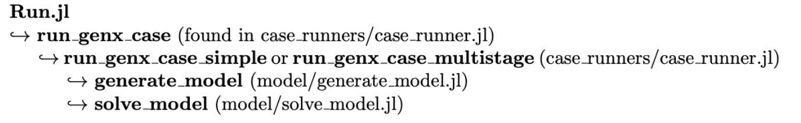

# Tutorial 4: Model Generation

To run GenX, we use the file `Run.jl`. This file will solve the optimization problem and generate the output files as described in the documentation and previous tutorial. It does so by first generating the model, then solving the model, both according to settings described in `genx_settings.yml`. However, `Run.jl` only contains one commmand, `run_genx_case!(dirname(@__FILE__))`. This can be confusing for users viewing the files for the first time. In reality, this function signals many more functions to run, generating and solving the model. This tutorial explains how the model in GenX is generated. The next tutorial will then describe how it is solved.

We'll start by explaining JuMP, the optimization package that GenX uses to generate and solve the model.

### Table of Contents
* [JuMP](#JuMP)
* [Generate Model](#GenerateModel)
    * [Arguments](#Arguments)
    * [Run generate_model](#Run)


### JuMP <a id="JuMP"></a>


JuMP is a modeling language for Julia. It allows users to create models for optimization problems, define variables and constraints, and apply a variety of solvers for the model. 

GenX is a __Linear Program (LP)__, which is a form of optimization problem in which a linear objective is minimized (or maximized) according to a set of linear constraints. For more information on LPs, see the <a href="https://en.wikipedia.org/wiki/Linear_programming" target="_blank">Wikipedia</a>. 


```julia
using JuMP
using HiGHS
```

Let's say we want to build a power grid consisting of and coal and wind plants. We want to decrease the cost of producing energy while still meeting a certain emissions threshold and full grid demand. Coal plants are cheaper to build and run but have higher emissions than wind farms. To find the minimum cost of a power grid meeting these constraints, we construct an LP using JuMP.

\begin{align}
& \min 10 x + 15 y &\text{Objective function (cost)}\\ 
& \text{s.t.} & \\
& x + y \geq 10 &\text{Grid Demand}\\
& 55x + 70y \leq \ 1000 &\text{Construction constraint}\\
& 40 x + 5 y \leq 200 &\text{Emissions constraint} \\
& x, y \geq 0 &\text{Non-negativity constraints}\\
\end{align}


The core of the JuMP model is the function `Model()`, which creates the structure of our LP. `Model()` takes an optimizer as its input.


```julia
power = Model(HiGHS.Optimizer)
```

The model needs variables, defined using the JuMP function `@variable`:


```julia
@variable(power,x) # Coal
@variable(power,y) # Wind
```

Using the JuMP function `@constraint`, we can add the constraints of the model:


```julia
@constraint(power, non_neg_x, x >= 0) # Non-negativity constraint (can't have negative power plants!)
@constraint(power, non_neg_y, y >= 0) # Non-negativity constraint

@constraint(power, emissions, 40x + 5y <= 200) # Emisisons constraint
@constraint(power, construction_costs, 55x + 70y <= 1000) # Cost of constructing a new plant

@constraint(power, demand, x + y >= 10) # Grid demand

```

Next, the function `@expression` defines an expression that can be used in either a constraint or objective function. In GenX, expressions are defined throughout the model generation and put into constraints and the objective function later.


```julia
@expression(power,objective,10x+15y)
```

Finally, we define the objective function itself:


```julia
@objective(power, Min, objective)
```

Our model is now set up! 


```julia
print(power)
```

In the next Tutorial, we go over how to use JuMP to solve the model we've constructed.

When `Run.jl` is called, the model for GenX is constructed in a similar way, but with many more factors to consider. The next section goes over how the GenX model is constructed before it is solved.

### Generate Model <a id="GenerateModel"></a>

The basic structure of the way `Run.jl` generates and solves the model is as follows:



The function `run_genx_case(case)` takes the "case" as its input. The case is all of the input files and settings found in the same folder as `Run.jl`. For example, in `example_systems/1_three_zones`, the case is:


```julia
cd(readdir,"example_systems/1_three_zones")
```


    9-element Vector{String}:
     ".DS_Store"
     "README.md"
     "Run.jl"
     "TDR_results"
     "policies"
     "resources"
     "results"
     "settings"
     "system"


`Run_genx_case` defines the __setup__, which are the settings in `genx_settings.yml`. From there, either `run_genx_case_simple(case, mysetup)` or`run_genx_case_multistage(case, mysetup)` is called. Both of these define the __inputs__ and __optimizer__. The inputs are a variety of parameters specified by the settings and csv files found in the folder. The optimizer is either specified in `Run.jl`, or is set to HiGHS by default. Both of these functions then call `generate_model(mysetup, myinputs, OPTIMIZER)`, which is the main subject of this tutorial.

As in the above example, `generate_model` utilizes the JuMP functions `Model()`, `@expression`, `@variable`, and `@constraints` to form a model. This section goes through `generate_model` and explains how the expressions are formed to create the model.

#### Arguments <a id="Arguments"></a>

`Generate_model` takes three arguments: setup, inputs, and optimizer:

To generate the arguments, we have to set a case path (this is set automatically when `Run.jl` is called):


```julia
using GenX
```


```julia
case = joinpath("example_systems/1_three_zones") 
```


    "example_systems/1_three_zones"


Setup includes the settings from `genx_settings.yml` along with the default settings found in `configure_settings.jl`. The function `configure_settings` combines the two.


```julia
genx_settings = GenX.get_settings_path(case, "genx_settings.yml") # Settings YAML file path
writeoutput_settings = GenX.get_settings_path(case, "output_settings.yml") # Set output path
setup = GenX.configure_settings(genx_settings,writeoutput_settings) # Combines genx_settings with defaults
```

    Configuring Settings


    Dict{Any, Any} with 33 entries:
      "HydrogenHourlyMatching"             => 0
      "NetworkExpansion"                   => 1
      "TimeDomainReductionFolder"          => "TDR_results"
      "WriteOutputs"                       => "full"
      "SystemFolder"                       => "system"
      "EnableJuMPStringNames"              => 1
      "Trans_Loss_Segments"                => 1
      "ModelingtoGenerateAlternativeSlack" => 0.1
      "PoliciesFolder"                     => "policies"
      "MultiStage"                         => 0
      "ComputeConflicts"                   => 1
      "OverwriteResults"                   => 0
      "ModelingToGenerateAlternatives"     => 0
      "MaxCapReq"                          => 0
      "MinCapReq"                          => 1
      "CO2Cap"                             => 2
      "WriteShadowPrices"                  => 1
      "OperationalReserves"                => 0
      "ParameterScale"                     => 1
      "EnergyShareRequirement"             => 0
      "PrintModel"                         => 0
      "TimeDomainReduction"                => 1
      "DC_OPF"                             => 0
      "CapacityReserveMargin"              => 0
      "MethodofMorris"                     => 0
      ⋮                                    => ⋮


It's here that we create the folder `TDR_results` before generating the model. This occurs if TimeDomainReduction is set to 1 in the setup. As a reminder, `TDR_results` is __not__ overwritten when called again. The cell below will delete a preexisting `TDR_results` folder if it is there.


```julia
TDRpath = joinpath(case, setup["TimeDomainReductionFolder"])
system_path = joinpath(case, setup["SystemFolder"])

settings_path = GenX.get_settings_path(case)

if "TDR_results" in cd(readdir,case)
    rm(joinpath(case,"TDR_results"), recursive=true) 
end

if setup["TimeDomainReduction"] == 1
    GenX.prevent_doubled_timedomainreduction(system_path)
    if !GenX.time_domain_reduced_files_exist(TDRpath)
        println("Clustering Time Series Data (Grouped)...")
        GenX.cluster_inputs(case, settings_path, setup)
    else
        println("Time Series Data Already Clustered.")
    end
end
```

    Clustering Time Series Data (Grouped)...
    Reading Input CSV Files
    Network.csv Successfully Read!
    Demand (load) data Successfully Read!
    Fuels_data.csv Successfully Read!


    [ Info: Thermal.csv Successfully Read.
    [ Info: Vre.csv Successfully Read.
    [ Info: Storage.csv Successfully Read.
    [ Info: Resource_energy_share_requirement.csv Successfully Read.
    [ Info: Resource_capacity_reserve_margin.csv Successfully Read.
    [ Info: Resource_minimum_capacity_requirement.csv Successfully Read.


    
    Summary of resources loaded into the model:
    -------------------------------------------------------
    	Resource type 		Number of resources
    =======================================================
    	Thermal        		3
    	VRE            		4
    	Storage        		3
    =======================================================
    Total number of resources: 10
    -------------------------------------------------------
    Generators_variability.csv Successfully Read!
    Validating time basis
    Minimum_capacity_requirement.csv Successfully Read!
    CO2_cap.csv Successfully Read!
    CSV Files Successfully Read In From example_systems/1_three_zones
    Error: Geography Key 1 is invalid. Select `System' or `Zone'.


    Dict{String, Any} with 9 entries:
      "RMSE"          => Dict("ME_NG"=>0.223948, "ME_onshore_wind_z3"=>0.313229, "D…
      "OutputDF"      => 1848×19 DataFrame…
      "ColToZoneMap"  => Dict("Demand_MW_z3"=>3, "CT_battery_z2"=>2, "MA_natural_ga…
      "ClusterObject" => KmeansResult{Matrix{Float64}, Float64, Int64}([-0.740093 2…
      "TDRsetup"      => Dict{Any, Any}("IterativelyAddPeriods"=>1, "ExtremePeriods…
      "Assignments"   => [1, 1, 1, 1, 2, 11, 2, 2, 2, 3  …  6, 9, 10, 10, 10, 10, 1…
      "InputDF"       => 1680×52 DataFrame…
      "Weights"       => [673.846, 673.846, 673.846, 673.846, 1010.77, 1010.77, 505…
      "Centers"       => Any[4, 7, 12, 15, 20, 23, 30, 34, 37, 48, 51]


Then we configure the optimizer:


```julia
OPTIMIZER =  GenX.configure_solver(settings_path,HiGHS.Optimizer);
```

The function `configure_solver` sets a <a href="https://jump.dev/MathOptInterface.jl/stable/" target="_blank">MathOptInterface</a> optimizer so it can be used in the JuMP model as the optimizer. It also goes into the settings file for the specified solver (in this case HiGHS, so `1_three_zones/settings/highs_settings.yml`) and uses the settings to configure the solver to be used later. For more information on the settings, see Tutorial 6.


```julia
typeof(OPTIMIZER)
```


    MathOptInterface.OptimizerWithAttributes


The "inputs" argument is generated by the function `load_inputs` from the case in `run_genx_case_simple` (or multistage). If TDR is set to 1 in the settings file, then `load_inputs` will draw some of the files from the `TDR_results` folder. `TDR_results` is produced when the case is run. 


```julia
inputs = GenX.load_inputs(setup, case)
```

    Reading Input CSV Files
    Network.csv Successfully Read!
    Demand (load) data Successfully Read!
    Fuels_data.csv Successfully Read!
    
    Summary of resources loaded into the model:
    -------------------------------------------------------
    	Resource type 		Number of resources
    =======================================================
    	Thermal        		3
    	VRE            		4
    	Storage        		3
    =======================================================
    Total number of resources: 10
    -------------------------------------------------------
    Generators_variability.csv Successfully Read!
    Validating time basis
    Minimum_capacity_requirement.csv Successfully Read!
    CO2_cap.csv Successfully Read!
    CSV Files Successfully Read In From example_systems/1_three_zones


    [ Info: Thermal.csv Successfully Read.
    [ Info: Vre.csv Successfully Read.
    [ Info: Storage.csv Successfully Read.
    [ Info: Resource_energy_share_requirement.csv Successfully Read.
    [ Info: Resource_capacity_reserve_margin.csv Successfully Read.
    [ Info: Resource_minimum_capacity_requirement.csv Successfully Read.


    Dict{Any, Any} with 73 entries:
      "Z"                         => 3
      "LOSS_LINES"                => [1, 2]
      "STOR_HYDRO_SHORT_DURATION" => Int64[]
      "RET_CAP_CHARGE"            => Set{Int64}()
      "pC_D_Curtail"              => [50.0, 45.0, 27.5, 10.0]
      "pTrans_Max_Possible"       => [5.9, 4.0]
      "pNet_Map"                  => [1.0 -1.0 0.0; 1.0 0.0 -1.0]
      "omega"                     => [4.01099, 4.01099, 4.01099, 4.01099, 4.01099, …
      "pMax_Line_Reinforcement"   => [2.95, 2.0]
      "RET_CAP_ENERGY"            => Int64[]
      "RESOURCES"                 => AbstractResource[…
      "COMMIT"                    => [1, 2, 3]
      "pMax_D_Curtail"            => [1.0, 0.04, 0.024, 0.003]
      "STOR_ALL"                  => [8, 9, 10]
      "THERM_ALL"                 => [1, 2, 3]
      "dfCO2CapZones"             => [1 0 0; 0 1 0; 0 0 1]
      "REP_PERIOD"                => 11
      "MinCapReq"                 => [5.0, 10.0, 6.0]
      "PWFU_Num_Segments"         => 0
      "STOR_LONG_DURATION"        => Int64[]
      "THERM_COMMIT_PWFU"         => Int64[]
      "STOR_SYMMETRIC"            => [8, 9, 10]
      "VRE"                       => [4, 5, 6, 7]
      "RETRO"                     => Int64[]
      "THERM_COMMIT"              => [1, 2, 3]
      ⋮                           => ⋮


Now that we have our arguments, we're ready to generate the model itself.

#### Run generate_model <a id="Run"></a>

This subsection replicates the arguments in the function `generate_model`.  __Note:__ Running some of these cells for a second time will throw an error as the code will attempt to define a new expression with the name of an existing expression. To run the Tutorial again, clear and restart the kernel.

 First, we initialize a model and define the time step and zone variables


```julia
EP = Model(OPTIMIZER)  # From JuMP
```


    A JuMP Model
    Feasibility problem with:
    Variables: 0
    Model mode: AUTOMATIC
    CachingOptimizer state: EMPTY_OPTIMIZER
    Solver name: HiGHS


```julia
T = inputs["T"];   # Number of time steps (hours)
Z = inputs["Z"];   # Number of zones
```

Next, the dummy variable vZERO, the objective function, the power balance expression, and zone generation expression are all initialized to zero:


```julia
# Introduce dummy variable fixed to zero to ensure that expressions like eTotalCap,
# eTotalCapCharge, eTotalCapEnergy and eAvail_Trans_Cap all have a JuMP variable

GenX.set_string_names_on_creation(EP, Bool(setup["EnableJuMPStringNames"]))
@variable(EP, vZERO == 0);

# Initialize Power Balance Expression
# Expression for "baseline" power balance constraint
GenX.create_empty_expression!(EP, :ePowerBalance, (T, Z))

# Initialize Objective Function Expression
EP[:eObj] = AffExpr(0.0)

GenX.create_empty_expression!(EP, :eGenerationByZone, (Z, T))

# Energy losses related to technologies
GenX.create_empty_expression!(EP, :eELOSSByZone, Z)
```

Next, we go through some of the settings in setup and, if they've been set to be utilized (i.e. have a nonzero value), define expressions from their corresponding input files:


```julia
# Initialize Capacity Reserve Margin Expression
if setup["CapacityReserveMargin"] > 0
    GenX.create_empty_expression!(EP, :eCapResMarBalance, (inputs["NCapacityReserveMargin"], T))
end

# Energy Share Requirement
if setup["EnergyShareRequirement"] >= 1
    GenX.create_empty_expression!(EP, :eESR, inputs["nESR"])
end

if setup["MinCapReq"] == 1
    GenX.create_empty_expression!(EP, :eMinCapRes, inputs["NumberOfMinCapReqs"])
end

if setup["MaxCapReq"] == 1
    GenX.create_empty_expression!(EP, :eMaxCapRes, inputs["NumberOfMaxCapReqs"])
end
```

The other settings will be used later on.

Next, we define the model infrastructure using functions found in `src/core`. These take entries from inputs and setup to create more expressions in our model (EP). To see what the functions do in more detail, see the source code and <a href="https://genxproject.github.io/GenX.jl/dev/Model_Reference/core/" target="_blank">core documentation</a>.


```julia
# Infrastructure
GenX.discharge!(EP, inputs, setup)

GenX.non_served_energy!(EP, inputs, setup)

GenX.investment_discharge!(EP, inputs, setup)

if setup["UCommit"] > 0
    GenX.ucommit!(EP, inputs, setup)
end

GenX.fuel!(EP, inputs, setup)

GenX.co2!(EP, inputs) 

if setup["OperationalReserves"] > 0
    GenX.operational_reserves!(EP, inputs, setup)
end

if Z > 1
    GenX.investment_transmission!(EP, inputs, setup)
    GenX.transmission!(EP, inputs, setup)
end

if Z > 1 && setup["DC_OPF"] != 0
    GenX.dcopf_transmission!(EP, inputs, setup)
end
```

    Discharge Module
    Non-served Energy Module
    Investment Discharge Module
    Unit Commitment Module
    Fuel Module
    CO2 Module
    Investment Transmission Module
    Transmission Module


We then define variables and expressions based on the resources in the inputs and setup arguments. The details of these can be found in the `src/resources` folder and the "Resources" folder under "Model Reference" in the documentation:


```julia
# Technologies
# Model constraints, variables, expression related to dispatchable renewable resources

if !isempty(inputs["VRE"])
    GenX.curtailable_variable_renewable!(EP, inputs, setup)
end

# Model constraints, variables, expression related to non-dispatchable renewable resources
if !isempty(inputs["MUST_RUN"])
    GenX/must_run!(EP, inputs, setup)
end

# Model constraints, variables, expression related to energy storage modeling
if !isempty(inputs["STOR_ALL"])
    GenX.storage!(EP, inputs, setup)
end

# Model constraints, variables, expression related to reservoir hydropower resources
if !isempty(inputs["HYDRO_RES"])
    GenX.hydro_res!(EP, inputs, setup)
end

if !isempty(inputs["ELECTROLYZER"])
    GenX.electrolyzer!(EP, inputs, setup)
end

# Model constraints, variables, expression related to reservoir hydropower resources with long duration storage
if inputs["REP_PERIOD"] > 1 && !isempty(inputs["STOR_HYDRO_LONG_DURATION"])
    GenX.hydro_inter_period_linkage!(EP, inputs)
end

# Model constraints, variables, expression related to demand flexibility resources
if !isempty(inputs["FLEX"])
    GenX.flexible_demand!(EP, inputs, setup)
end

# Model constraints, variables, expression related to thermal resource technologies
if !isempty(inputs["THERM_ALL"])
    GenX.thermal!(EP, inputs, setup)
end

# Model constraints, variables, expression related to retrofit technologies
if !isempty(inputs["RETRO"])
    EP = GenX.retrofit(EP, inputs)
end

# Model constraints, variables, expressions related to the co-located VRE-storage resources
if !isempty(inputs["VRE_STOR"])
    GenX.vre_stor!(EP, inputs, setup)
end

```

    Dispatchable Resources Module
    Storage Resources Module
    Storage Investment Module
    Storage Core Resources Module
    Storage Resources with Symmetric Charge/Discharge Capacity Module
    Thermal (Unit Commitment) Resources Module


Finally, we define expressions and variables using policies outlined in the inputs. These functions can be found in `src/policies` and in the <a href="https://genxproject.github.io/GenX.jl/dev/Model_Reference/policies/" target="_blank">policies documentation</a>:


```julia
# Policies

if setup["OperationalReserves"] > 0
    GenX.operational_reserves_constraints!(EP, inputs)
end

# CO2 emissions limits
if setup["CO2Cap"] > 0
    GenX.co2_cap!(EP, inputs, setup)
end

# Endogenous Retirements
if setup["MultiStage"] > 0
    GenX.endogenous_retirement!(EP, inputs, setup)
end

# Energy Share Requirement
if setup["EnergyShareRequirement"] >= 1
    GenX.energy_share_requirement!(EP, inputs, setup)
end

#Capacity Reserve Margin
if setup["CapacityReserveMargin"] > 0
    GenX.cap_reserve_margin!(EP, inputs, setup)
end

if (setup["MinCapReq"] == 1)
    GenX.minimum_capacity_requirement!(EP, inputs, setup)
end

if setup["MaxCapReq"] == 1
    GenX.maximum_capacity_requirement!(EP, inputs, setup)
end

```

    CO2 Policies Module
    Minimum Capacity Requirement Module


The expressions and variables for the model have all been defined! All that's left to do is define the constraints and objective function.

The  <a href="https://genxproject.github.io/GenX.jl/dev/Model_Concept_Overview/objective_function/" target="_blank">objective</a>  here is to minimize 


```julia
@objective(EP,Min,EP[:eObj])
```


$ 0.014239010989010991 vP_{1,1} + 0.014319230769230772 vP_{2,1} + 0.018049450549450553 vP_{3,1} + 0.0004010989010989012 vP_{5,1} + 0.0004010989010989012 vP_{7,1} + 0.0006016483516483517 vP_{8,1} + 0.0006016483516483517 vP_{9,1} + 0.0006016483516483517 vP_{10,1} + 0.014239010989010991 vP_{1,2} + 0.014319230769230772 vP_{2,2} + 0.018049450549450553 vP_{3,2} + 0.0004010989010989012 vP_{5,2} + 0.0004010989010989012 vP_{7,2} + 0.0006016483516483517 vP_{8,2} + 0.0006016483516483517 vP_{9,2} + 0.0006016483516483517 vP_{10,2} + 0.014239010989010991 vP_{1,3} + 0.014319230769230772 vP_{2,3} + 0.018049450549450553 vP_{3,3} + 0.0004010989010989012 vP_{5,3} + 0.0004010989010989012 vP_{7,3} + 0.0006016483516483517 vP_{8,3} + 0.0006016483516483517 vP_{9,3} + 0.0006016483516483517 vP_{10,3} + 0.014239010989010991 vP_{1,4} + 0.014319230769230772 vP_{2,4} + 0.018049450549450553 vP_{3,4} + 0.0004010989010989012 vP_{5,4} + 0.0004010989010989012 vP_{7,4} + 0.0006016483516483517 vP_{8,4} + [[\ldots\text{59091 terms omitted}\ldots]] + 0.0007520604395604396 vCHARGE_{8,1839} + 0.0007520604395604396 vCHARGE_{9,1839} + 0.0007520604395604396 vCHARGE_{10,1839} + 0.0007520604395604396 vCHARGE_{8,1840} + 0.0007520604395604396 vCHARGE_{9,1840} + 0.0007520604395604396 vCHARGE_{10,1840} + 0.0007520604395604396 vCHARGE_{8,1841} + 0.0007520604395604396 vCHARGE_{9,1841} + 0.0007520604395604396 vCHARGE_{10,1841} + 0.0007520604395604396 vCHARGE_{8,1842} + 0.0007520604395604396 vCHARGE_{9,1842} + 0.0007520604395604396 vCHARGE_{10,1842} + 0.0007520604395604396 vCHARGE_{8,1843} + 0.0007520604395604396 vCHARGE_{9,1843} + 0.0007520604395604396 vCHARGE_{10,1843} + 0.0007520604395604396 vCHARGE_{8,1844} + 0.0007520604395604396 vCHARGE_{9,1844} + 0.0007520604395604396 vCHARGE_{10,1844} + 0.0007520604395604396 vCHARGE_{8,1845} + 0.0007520604395604396 vCHARGE_{9,1845} + 0.0007520604395604396 vCHARGE_{10,1845} + 0.0007520604395604396 vCHARGE_{8,1846} + 0.0007520604395604396 vCHARGE_{9,1846} + 0.0007520604395604396 vCHARGE_{10,1846} + 0.0007520604395604396 vCHARGE_{8,1847} + 0.0007520604395604396 vCHARGE_{9,1847} + 0.0007520604395604396 vCHARGE_{10,1847} + 0.0007520604395604396 vCHARGE_{8,1848} + 0.0007520604395604396 vCHARGE_{9,1848} + 0.0007520604395604396 vCHARGE_{10,1848} $


Our constraint is the <a href="https://genxproject.github.io/GenX.jl/dev/Model_Concept_Overview/power_balance/" target="_blank">power balance</a>, which is set here to have to meet the demand of the network. The demand is outlined in the last columns of `Load_data.csv`, and is set to inputs in from the `load_load_data` function within `load_inputs`, used in `run_genx_case`.


```julia
## Power balance constraints
# demand = generation + storage discharge - storage charge - demand deferral + deferred demand satisfaction - demand curtailment (NSE)
#          + incoming power flows - outgoing power flows - flow losses - charge of heat storage + generation from NACC
@constraint(EP, cPowerBalance[t=1:T, z=1:Z], EP[:ePowerBalance][t,z] == inputs["pD"][t,z])

```


    1848×3 Matrix{ConstraintRef{Model, MathOptInterface.ConstraintIndex{MathOptInterface.ScalarAffineFunction{Float64}, MathOptInterface.EqualTo{Float64}}, ScalarShape}}:
     cPowerBalance[1,1] : vP[1,1] + vP[4,1] + vP[8,1] + vNSE[1,1,1] + vNSE[2,1,1] + vNSE[3,1,1] + vNSE[4,1,1] - vFLOW[1,1] - vFLOW[2,1] - 0.5 vTLOSS[1,1] - 0.5 vTLOSS[2,1] - vCHARGE[8,1] = 8.823295573512466                                          …  cPowerBalance[1,3] : vP[3,1] + vP[7,1] + vP[10,1] + vNSE[1,1,3] + vNSE[2,1,3] + vNSE[3,1,3] + vNSE[4,1,3] + vFLOW[2,1] - 0.5 vTLOSS[2,1] - vCHARGE[10,1] = 1.203488977406099
     cPowerBalance[2,1] : vP[1,2] + vP[4,2] + vP[8,2] + vNSE[1,2,1] + vNSE[2,2,1] + vNSE[3,2,1] + vNSE[4,2,1] - vFLOW[1,2] - vFLOW[2,2] - 0.5 vTLOSS[1,2] - 0.5 vTLOSS[2,2] - vCHARGE[8,2] = 8.534254844189547                                             cPowerBalance[2,3] : vP[3,2] + vP[7,2] + vP[10,2] + vNSE[1,2,3] + vNSE[2,2,3] + vNSE[3,2,3] + vNSE[4,2,3] + vFLOW[2,2] - 0.5 vTLOSS[2,2] - vCHARGE[10,2] = 1.1642119312815487
     cPowerBalance[3,1] : vP[1,3] + vP[4,3] + vP[8,3] + vNSE[1,3,1] + vNSE[2,3,1] + vNSE[3,3,1] + vNSE[4,3,1] - vFLOW[1,3] - vFLOW[2,3] - 0.5 vTLOSS[1,3] - 0.5 vTLOSS[2,3] - vCHARGE[8,3] = 8.395273587581316                                             cPowerBalance[3,3] : vP[3,3] + vP[7,3] + vP[10,3] + vNSE[1,3,3] + vNSE[2,3,3] + vNSE[3,3,3] + vNSE[4,3,3] + vFLOW[2,3] - 0.5 vTLOSS[2,3] - vCHARGE[10,3] = 1.1440698563458818
     cPowerBalance[4,1] : vP[1,4] + vP[4,4] + vP[8,4] + vNSE[1,4,1] + vNSE[2,4,1] + vNSE[3,4,1] + vNSE[4,4,1] - vFLOW[1,4] - vFLOW[2,4] - 0.5 vTLOSS[1,4] - 0.5 vTLOSS[2,4] - vCHARGE[8,4] = 8.333839843718257                                             cPowerBalance[4,3] : vP[3,4] + vP[7,4] + vP[10,4] + vNSE[1,4,3] + vNSE[2,4,3] + vNSE[3,4,3] + vNSE[4,4,3] + vFLOW[2,4] - 0.5 vTLOSS[2,4] - vCHARGE[10,4] = 1.1360130263716148
     cPowerBalance[5,1] : vP[1,5] + vP[4,5] + vP[8,5] + vNSE[1,5,1] + vNSE[2,5,1] + vNSE[3,5,1] + vNSE[4,5,1] - vFLOW[1,5] - vFLOW[2,5] - 0.5 vTLOSS[1,5] - 0.5 vTLOSS[2,5] - vCHARGE[8,5] = 8.389230924250523                                             cPowerBalance[5,3] : vP[3,5] + vP[7,5] + vP[10,5] + vNSE[1,5,3] + vNSE[2,5,3] + vNSE[3,5,3] + vNSE[4,5,3] + vFLOW[2,5] - 0.5 vTLOSS[2,5] - vCHARGE[10,5] = 1.1440698563458818
     cPowerBalance[6,1] : vP[1,6] + vP[4,6] + vP[8,6] + vNSE[1,6,1] + vNSE[2,6,1] + vNSE[3,6,1] + vNSE[4,6,1] - vFLOW[1,6] - vFLOW[2,6] - 0.5 vTLOSS[1,6] - 0.5 vTLOSS[2,6] - vCHARGE[8,6] = 8.617845020265513                                          …  cPowerBalance[6,3] : vP[3,6] + vP[7,6] + vP[10,6] + vNSE[1,6,3] + vNSE[2,6,3] + vNSE[3,6,3] + vNSE[4,6,3] + vFLOW[2,6] - 0.5 vTLOSS[2,6] - vCHARGE[10,6] = 1.174282968749382
     cPowerBalance[7,1] : vP[1,7] + vP[4,7] + vP[8,7] + vNSE[1,7,1] + vNSE[2,7,1] + vNSE[3,7,1] + vNSE[4,7,1] - vFLOW[1,7] - vFLOW[2,7] - 0.5 vTLOSS[1,7] - 0.5 vTLOSS[2,7] - vCHARGE[8,7] = 9.022703463428623                                             cPowerBalance[7,3] : vP[3,7] + vP[7,7] + vP[10,7] + vNSE[1,7,3] + vNSE[2,7,3] + vNSE[3,7,3] + vNSE[4,7,3] + vFLOW[2,7] - 0.5 vTLOSS[2,7] - vCHARGE[10,7] = 1.2306807785692495
     cPowerBalance[8,1] : vP[1,8] + vP[4,8] + vP[8,8] + vNSE[1,8,1] + vNSE[2,8,1] + vNSE[3,8,1] + vNSE[4,8,1] - vFLOW[1,8] - vFLOW[2,8] - 0.5 vTLOSS[1,8] - 0.5 vTLOSS[2,8] - vCHARGE[8,8] = 9.465832107686754                                             cPowerBalance[8,3] : vP[3,8] + vP[7,8] + vP[10,8] + vNSE[1,8,3] + vNSE[2,8,3] + vNSE[3,8,3] + vNSE[4,8,3] + vFLOW[2,8] - 0.5 vTLOSS[2,8] - vCHARGE[10,8] = 1.2911070033762504
     cPowerBalance[9,1] : vP[1,9] + vP[4,9] + vP[8,9] + vNSE[1,9,1] + vNSE[2,9,1] + vNSE[3,9,1] + vNSE[4,9,1] - vFLOW[1,9] - vFLOW[2,9] - 0.5 vTLOSS[1,9] - 0.5 vTLOSS[2,9] - vCHARGE[8,9] = 10.052977561328778                                            cPowerBalance[9,3] : vP[3,9] + vP[7,9] + vP[10,9] + vNSE[1,9,3] + vNSE[2,9,3] + vNSE[3,9,3] + vNSE[4,9,3] + vFLOW[2,9] - 0.5 vTLOSS[2,9] - vCHARGE[10,9] = 1.3706681993721348
     cPowerBalance[10,1] : vP[1,10] + vP[4,10] + vP[8,10] + vNSE[1,10,1] + vNSE[2,10,1] + vNSE[3,10,1] + vNSE[4,10,1] - vFLOW[1,10] - vFLOW[2,10] - 0.5 vTLOSS[1,10] - 0.5 vTLOSS[2,10] - vCHARGE[8,10] = 10.414530250621207                               cPowerBalance[10,3] : vP[3,10] + vP[7,10] + vP[10,10] + vNSE[1,10,3] + vNSE[2,10,3] + vNSE[3,10,3] + vNSE[4,10,3] + vFLOW[2,10] - 0.5 vTLOSS[2,10] - vCHARGE[10,10] = 1.4200162829645187
     cPowerBalance[11,1] : vP[1,11] + vP[4,11] + vP[8,11] + vNSE[1,11,1] + vNSE[2,11,1] + vNSE[3,11,1] + vNSE[4,11,1] - vFLOW[1,11] - vFLOW[2,11] - 0.5 vTLOSS[1,11] - 0.5 vTLOSS[2,11] - vCHARGE[8,11] = 10.557539949449968                            …  cPowerBalance[11,3] : vP[3,11] + vP[7,11] + vP[10,11] + vNSE[1,11,3] + vNSE[2,11,3] + vNSE[3,11,3] + vNSE[4,11,3] + vFLOW[2,11] - 0.5 vTLOSS[2,11] - vCHARGE[10,11] = 1.4391512541534024
     cPowerBalance[12,1] : vP[1,12] + vP[4,12] + vP[8,12] + vNSE[1,12,1] + vNSE[2,12,1] + vNSE[3,12,1] + vNSE[4,12,1] - vFLOW[1,12] - vFLOW[2,12] - 0.5 vTLOSS[1,12] - 0.5 vTLOSS[2,12] - vCHARGE[8,12] = 10.555525728339704                               cPowerBalance[12,3] : vP[3,12] + vP[7,12] + vP[10,12] + vNSE[1,12,3] + vNSE[2,12,3] + vNSE[3,12,3] + vNSE[4,12,3] + vFLOW[2,12] - 0.5 vTLOSS[2,12] - vCHARGE[10,12] = 1.438144150406619
     cPowerBalance[13,1] : vP[1,13] + vP[4,13] + vP[8,13] + vNSE[1,13,1] + vNSE[2,13,1] + vNSE[3,13,1] + vNSE[4,13,1] - vFLOW[1,13] - vFLOW[2,13] - 0.5 vTLOSS[1,13] - 0.5 vTLOSS[2,13] - vCHARGE[8,13] = 10.49207776336638                                cPowerBalance[13,3] : vP[3,13] + vP[7,13] + vP[10,13] + vNSE[1,13,3] + vNSE[2,13,3] + vNSE[3,13,3] + vNSE[4,13,3] + vFLOW[2,13] - 0.5 vTLOSS[2,13] - vCHARGE[10,13] = 1.430087320432352
     ⋮                                                                                                                                                                                                                                                  ⋱  
     cPowerBalance[1837,1] : vP[1,1837] + vP[4,1837] + vP[8,1837] + vNSE[1,1837,1] + vNSE[2,1837,1] + vNSE[3,1837,1] + vNSE[4,1837,1] - vFLOW[1,1837] - vFLOW[2,1837] - 0.5 vTLOSS[1,1837] - 0.5 vTLOSS[2,1837] - vCHARGE[8,1837] = 9.853569671412618      cPowerBalance[1837,3] : vP[3,1837] + vP[7,1837] + vP[10,1837] + vNSE[1,1837,3] + vNSE[2,1837,3] + vNSE[3,1837,3] + vNSE[4,1837,3] + vFLOW[2,1837] - 0.5 vTLOSS[2,1837] - vCHARGE[10,1837] = 1.342469294462201
     cPowerBalance[1838,1] : vP[1,1838] + vP[4,1838] + vP[8,1838] + vNSE[1,1838,1] + vNSE[2,1838,1] + vNSE[3,1838,1] + vNSE[4,1838,1] - vFLOW[1,1838] - vFLOW[2,1838] - 0.5 vTLOSS[1,1838] - 0.5 vTLOSS[2,1838] - vCHARGE[8,1838] = 9.7871003747739        cPowerBalance[1838,3] : vP[3,1838] + vP[7,1838] + vP[10,1838] + vNSE[1,1838,3] + vNSE[2,1838,3] + vNSE[3,1838,3] + vNSE[4,1838,3] + vFLOW[2,1838] - 0.5 vTLOSS[2,1838] - vCHARGE[10,1838] = 1.334412464487934
     cPowerBalance[1839,1] : vP[1,1839] + vP[4,1839] + vP[8,1839] + vNSE[1,1839,1] + vNSE[2,1839,1] + vNSE[3,1839,1] + vNSE[4,1839,1] - vFLOW[1,1839] - vFLOW[2,1839] - 0.5 vTLOSS[1,1839] - 0.5 vTLOSS[2,1839] - vCHARGE[8,1839] = 9.710559972583859      cPowerBalance[1839,3] : vP[3,1839] + vP[7,1839] + vP[10,1839] + vNSE[1,1839,3] + vNSE[2,1839,3] + vNSE[3,1839,3] + vNSE[4,1839,3] + vFLOW[2,1839] - 0.5 vTLOSS[2,1839] - vCHARGE[10,1839] = 1.3233343232733172
     cPowerBalance[1840,1] : vP[1,1840] + vP[4,1840] + vP[8,1840] + vNSE[1,1840,1] + vNSE[2,1840,1] + vNSE[3,1840,1] + vNSE[4,1840,1] - vFLOW[1,1840] - vFLOW[2,1840] - 0.5 vTLOSS[1,1840] - 0.5 vTLOSS[2,1840] - vCHARGE[8,1840] = 9.771993716446918      cPowerBalance[1840,3] : vP[3,1840] + vP[7,1840] + vP[10,1840] + vNSE[1,1840,3] + vNSE[2,1840,3] + vNSE[3,1840,3] + vNSE[4,1840,3] + vFLOW[2,1840] - 0.5 vTLOSS[2,1840] - vCHARGE[10,1840] = 1.3313911532475842
     cPowerBalance[1841,1] : vP[1,1841] + vP[4,1841] + vP[8,1841] + vNSE[1,1841,1] + vNSE[2,1841,1] + vNSE[3,1841,1] + vNSE[4,1841,1] - vFLOW[1,1841] - vFLOW[2,1841] - 0.5 vTLOSS[1,1841] - 0.5 vTLOSS[2,1841] - vCHARGE[8,1841] = 10.651201231077254  …  cPowerBalance[1841,3] : vP[3,1841] + vP[7,1841] + vP[10,1841] + vNSE[1,1841,3] + vNSE[2,1841,3] + vNSE[3,1841,3] + vNSE[4,1841,3] + vFLOW[2,1841] - 0.5 vTLOSS[2,1841] - vCHARGE[10,1841] = 1.4522436028615857
     cPowerBalance[1842,1] : vP[1,1842] + vP[4,1842] + vP[8,1842] + vNSE[1,1842,1] + vNSE[2,1842,1] + vNSE[3,1842,1] + vNSE[4,1842,1] - vFLOW[1,1842] - vFLOW[2,1842] - 0.5 vTLOSS[1,1842] - 0.5 vTLOSS[2,1842] - vCHARGE[8,1842] = 11.394448820764756     cPowerBalance[1842,3] : vP[3,1842] + vP[7,1842] + vP[10,1842] + vNSE[1,1842,3] + vNSE[2,1842,3] + vNSE[3,1842,3] + vNSE[4,1842,3] + vFLOW[2,1842] - 0.5 vTLOSS[2,1842] - vCHARGE[10,1842] = 1.5539610812867037
     cPowerBalance[1843,1] : vP[1,1843] + vP[4,1843] + vP[8,1843] + vNSE[1,1843,1] + vNSE[2,1843,1] + vNSE[3,1843,1] + vNSE[4,1843,1] - vFLOW[1,1843] - vFLOW[2,1843] - 0.5 vTLOSS[1,1843] - 0.5 vTLOSS[2,1843] - vCHARGE[8,1843] = 11.386391936323697     cPowerBalance[1843,3] : vP[3,1843] + vP[7,1843] + vP[10,1843] + vNSE[1,1843,3] + vNSE[2,1843,3] + vNSE[3,1843,3] + vNSE[4,1843,3] + vFLOW[2,1843] - 0.5 vTLOSS[2,1843] - vCHARGE[10,1843] = 1.551946873793137
     cPowerBalance[1844,1] : vP[1,1844] + vP[4,1844] + vP[8,1844] + vNSE[1,1844,1] + vNSE[2,1844,1] + vNSE[3,1844,1] + vNSE[4,1844,1] - vFLOW[1,1844] - vFLOW[2,1844] - 0.5 vTLOSS[1,1844] - 0.5 vTLOSS[2,1844] - vCHARGE[8,1844] = 11.17792005141135      cPowerBalance[1844,3] : vP[3,1844] + vP[7,1844] + vP[10,1844] + vNSE[1,1844,3] + vNSE[2,1844,3] + vNSE[3,1844,3] + vNSE[4,1844,3] + vFLOW[2,1844] - 0.5 vTLOSS[2,1844] - vCHARGE[10,1844] = 1.5237479688832034
     cPowerBalance[1845,1] : vP[1,1845] + vP[4,1845] + vP[8,1845] + vNSE[1,1845,1] + vNSE[2,1845,1] + vNSE[3,1845,1] + vNSE[4,1845,1] - vFLOW[1,1845] - vFLOW[2,1845] - 0.5 vTLOSS[1,1845] - 0.5 vTLOSS[2,1845] - vCHARGE[8,1845] = 10.90197175930515      cPowerBalance[1845,3] : vP[3,1845] + vP[7,1845] + vP[10,1845] + vNSE[1,1845,3] + vNSE[2,1845,3] + vNSE[3,1845,3] + vNSE[4,1845,3] + vFLOW[2,1845] - 0.5 vTLOSS[2,1845] - vCHARGE[10,1845] = 1.4864851302522195
     cPowerBalance[1846,1] : vP[1,1846] + vP[4,1846] + vP[8,1846] + vNSE[1,1846,1] + vNSE[2,1846,1] + vNSE[3,1846,1] + vNSE[4,1846,1] - vFLOW[1,1846] - vFLOW[2,1846] - 0.5 vTLOSS[1,1846] - 0.5 vTLOSS[2,1846] - vCHARGE[8,1846] = 10.385324044522376  …  cPowerBalance[1846,3] : vP[3,1846] + vP[7,1846] + vP[10,1846] + vNSE[1,1846,3] + vNSE[2,1846,3] + vNSE[3,1846,3] + vNSE[4,1846,3] + vFLOW[2,1846] - 0.5 vTLOSS[2,1846] - vCHARGE[10,1846] = 1.4159878679773854
     cPowerBalance[1847,1] : vP[1,1847] + vP[4,1847] + vP[8,1847] + vNSE[1,1847,1] + vNSE[2,1847,1] + vNSE[3,1847,1] + vNSE[4,1847,1] - vFLOW[1,1847] - vFLOW[2,1847] - 0.5 vTLOSS[1,1847] - 0.5 vTLOSS[2,1847] - vCHARGE[8,1847] = 9.647112007610534      cPowerBalance[1847,3] : vP[3,1847] + vP[7,1847] + vP[10,1847] + vNSE[1,1847,3] + vNSE[2,1847,3] + vNSE[3,1847,3] + vNSE[4,1847,3] + vFLOW[2,1847] - 0.5 vTLOSS[2,1847] - vCHARGE[10,1847] = 1.3152774932990505
     cPowerBalance[1848,1] : vP[1,1848] + vP[4,1848] + vP[8,1848] + vNSE[1,1848,1] + vNSE[2,1848,1] + vNSE[3,1848,1] + vNSE[4,1848,1] - vFLOW[1,1848] - vFLOW[2,1848] - 0.5 vTLOSS[1,1848] - 0.5 vTLOSS[2,1848] - vCHARGE[8,1848] = 8.774954266866123      cPowerBalance[1848,3] : vP[3,1848] + vP[7,1848] + vP[10,1848] + vNSE[1,1848,3] + vNSE[2,1848,3] + vNSE[3,1848,3] + vNSE[4,1848,3] + vFLOW[2,1848] - 0.5 vTLOSS[2,1848] - vCHARGE[10,1848] = 1.1954321474318323


After this final constraint is defined, `generate_model` finishes compiling the EP, and `run_genx_simple` (or multistage) uses `solve_model` to solve the EP.  This will be described in Tutorial 5.
