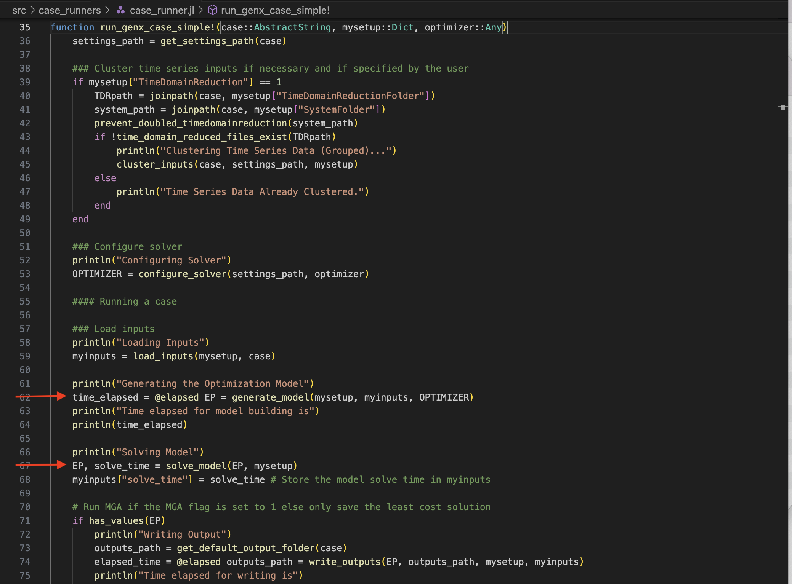

# Tutorial 5: Solving the Model

[Interactive Notebook of the tutorial](https://github.com/GenXProject/GenX-Tutorials/blob/main/Tutorials/Tutorial_5_Solve_Model.ipynb)

In Tutorial 4, we went over how the model is generated when GenX is run using `Run.jl`. In the function `run_genx_case_simple` (or multistage), after `generate_model` is called, `solve_model` is called to solve the EP.



In this tutorial, we go over how to use JuMP to solve a model, what it looks like to solve GenX, and how to edit the solver settings.

## Table of Contents
* [A Simple Example](#Simple)
* [GenX](#GenX)
* [Infeasibility](#Infeasibility)

## A Simple Example

From Tutorial 4, we have the model:

```math
\begin{aligned}
& \min 10 x + 15 y &\text{Objective function (cost)}\\ 
& \text{s.t.} & \\
& x + y \geq 10 &\text{Grid Demand}\\
& 55x + 70y \leq \ 1000 &\text{Construction constraint}\\
& 40 x + 5 y \leq 200 &\text{Emissions constraint} \\
& x, y \geq 0 &\text{Non-negativity constraints}\\
\end{aligned}
```


```julia
using JuMP
using HiGHS
```


```julia
power = Model(HiGHS.Optimizer)

@variable(power,x,Int) # Coal
@variable(power,y,Int) # Wind

@constraint(power, non_neg_x, x >= 0) # Non-negativity constraint (can't have negative power plants!)
@constraint(power, non_neg_y, y >= 0) # Non-negativity constraint

@constraint(power, emissions, 40x + 5y <= 200) # Emisisons constraint
@constraint(power, construction_costs, 55x + 70y <= 1000) # Cost of constructing a new plant

@constraint(power, demand, x + y >= 10) # Grid demand

@expression(power,objective,10x+15y)

@objective(power, Min, objective)
```

```math
10 x + 15 y 
```

JuMP uses the function `optimize!(model)` to solve the LP:

```julia
optimize!(power)
```

```
    Running HiGHS 1.6.0: Copyright (c) 2023 HiGHS under MIT licence terms
    Presolving model
    3 rows, 2 cols, 6 nonzeros
    3 rows, 2 cols, 6 nonzeros
    Objective function is integral with scale 0.2
    
    Solving MIP model with:
       3 rows
       2 cols (0 binary, 2 integer, 0 implied int., 0 continuous)
       6 nonzeros
    
            Nodes      |    B&B Tree     |            Objective Bounds              |  Dynamic Constraints |       Work      
         Proc. InQueue |  Leaves   Expl. | BestBound       BestSol              Gap |   Cuts   InLp Confl. | LpIters     Time
    
             0       0         0   0.00%   90              inf                  inf        0      0      0         0     0.0s
    
    Solving report
      Status            Optimal
      Primal bound      130
      Dual bound        130
      Gap               0% (tolerance: 0.01%)
      Solution status   feasible
                        130 (objective)
                        0 (bound viol.)
                        0 (int. viol.)
                        0 (row viol.)
      Timing            0.00 (total)
                        0.00 (presolve)
                        0.00 (postsolve)
      Nodes             1
      LP iterations     1 (total)
                        0 (strong br.)
                        0 (separation)
                        0 (heuristics)
```

We can use the function `value.()` to get the value of each variable, and `objective_value()` to get the total objective value.


```julia
println("# Coal Plants: ", value.(x))
println("# Wind Farms: ", value.(y))
println("Cost: ", objective_value(power))
```

```
    # Coal Plants: 4.0
    # Wind Farms: 6.0
    Cost: 130.0
```

We can also use the JuMP function `solution_summary` to see more details of the [solution](https://jump.dev/JuMP.jl/stable/manual/solutions/):


```julia
solution_summary(power)
```

```
    * Solver : HiGHS
    
    * Status
      Result count       : 1
      Termination status : OPTIMAL
      Message from the solver:
      "kHighsModelStatusOptimal"
    
    * Candidate solution (result #1)
      Primal status      : FEASIBLE_POINT
      Dual status        : NO_SOLUTION
      Objective value    : 1.30000e+02
      Objective bound    : 1.30000e+02
      Relative gap       : 0.00000e+00
    
    * Work counters
      Solve time (sec)   : 3.36621e-03
      Simplex iterations : 1
      Barrier iterations : -1
      Node count         : 1
```

## GenX

Let's optimize the GenX model created in the last Tutorial. To do so, we'll create the inputs for `generate_model` and run it. 


```julia
using GenX
```


```julia
case = joinpath("example_systems/1_three_zones") 

genx_settings = GenX.get_settings_path(case, "genx_settings.yml");
writeoutput_settings = GenX.get_settings_path(case, "output_settings.yml")
setup = GenX.configure_settings(genx_settings,writeoutput_settings)

settings_path = GenX.get_settings_path(case)

### Create TDR_Results
TDRpath = joinpath(case, setup["TimeDomainReductionFolder"])
system_path = joinpath(case, setup["SystemFolder"])

if setup["TimeDomainReduction"] == 1
    GenX.prevent_doubled_timedomainreduction(system_path)
    if !GenX.time_domain_reduced_files_exist(TDRpath)
        println("Clustering Time Series Data (Grouped)...")
        GenX.cluster_inputs(case, settings_path, setup)
    else
        println("Time Series Data Already Clustered.")
    end
end

OPTIMIZER =  GenX.configure_solver(settings_path,HiGHS.Optimizer);

inputs = GenX.load_inputs(setup, case)
```

```julia
EP = GenX.generate_model(setup,inputs,OPTIMIZER)
```

```
    Discharge Module
    Non-served Energy Module
    Investment Discharge Module
    Unit Commitment Module
    Emissions Module (for CO2 Policy modularization
    Dispatchable Resources Module
    Storage Resources Module
    Storage Investment Module
    Storage Core Resources Module
    Storage Resources with Symmetric Charge/Discharge Capacity Module
    Thermal (Unit Commitment) Resources Module
    C02 Policies Module
    Energy Share Requirement Policies Module
    Capacity Reserve Margin Policies Module
    Minimum Capacity Requirement Module
    Maximum Capacity Requirement Module

    A JuMP Model
    Minimization problem with:
    Variables: 18492
    Objective function type: AffExpr
    `AffExpr`-in-`MathOptInterface.EqualTo{Float64}`: 5544 constraints
    `AffExpr`-in-`MathOptInterface.GreaterThan{Float64}`: 7398 constraints
    `AffExpr`-in-`MathOptInterface.LessThan{Float64}`: 27730 constraints
    `VariableRef`-in-`MathOptInterface.EqualTo{Float64}`: 2 constraints
    `VariableRef`-in-`MathOptInterface.GreaterThan{Float64}`: 18490 constraints
    Model mode: AUTOMATIC
    CachingOptimizer state: EMPTY_OPTIMIZER
    Solver name: HiGHS
    Names registered in the model: cCO2Emissions_systemwide, cCapacityResMargin, cESRShare, cMaxCap, cMaxCapEnergy, cMaxCapEnergyDuration, cMaxNSE, cMaxRetCommit, cMaxRetEnergy, cMaxRetNoCommit, cMinCap, cMinCapEnergy, cMinCapEnergyDuration, cNSEPerSeg, cPowerBalance, cSoCBalInterior, cSoCBalStart, cZoneMaxCapReq, cZoneMinCapReq, eCFix, eCFixEnergy, eCNSE, eCStart, eCVar_in, eCVar_out, eCapResMarBalance, eCapResMarBalanceStor, eCapResMarBalanceThermal, eCapResMarBalanceVRE, eELOSS, eELOSSByZone, eESR, eESRDischarge, eEmissionsByPlant, eEmissionsByZone, eExistingCap, eExistingCapEnergy, eGenerationByThermAll, eGenerationByVRE, eGenerationByZone, eMaxCapRes, eMaxCapResInvest, eMinCapRes, eMinCapResInvest, eObj, ePowerBalance, ePowerBalanceDisp, ePowerBalanceNse, ePowerBalanceStor, ePowerBalanceThermCommit, eTotalCFix, eTotalCFixEnergy, eTotalCNSE, eTotalCNSET, eTotalCNSETS, eTotalCStart, eTotalCStartT, eTotalCVarIn, eTotalCVarInT, eTotalCVarOut, eTotalCVarOutT, eTotalCap, eTotalCapEnergy, vCAP, vCAPENERGY, vCHARGE, vCO2Cap_slack, vCOMMIT, vNSE, vP, vRETCAP, vRETCAPENERGY, vS, vSHUT, vSTART, vZERO
```


The function `solve_model(model, setup)` uses `optimize` to optimize the model:


```julia
solution = optimize!(EP) # GenX.solve_model(EP,setup)
```


```julia
objective_value(EP)
```

```
    9776.57688838726
```

## Infeasibility 

In some cases, your model may not be able to return a value. This happens when no value can be found that satisfies all constraints. To see this, let's go back to our simple example and change one of the parameters to break the model.

```math
\begin{aligned}
& \min 10 x + 15 y &\text{Objective function (cost)}\\ 
& \text{s.t.} & \\
& x + y \geq 10 &\text{Grid Demand}\\
& 55x + 70y \leq \ 1000 &\text{Construction constraint}\\
& 40 x + 5 y \leq 200 &\text{Emissions constraint} \\
& 7 x + 30 y \geq 500 &\textbf{New Constraint} \\
& x, y \geq 0 &\text{Non-negativity constraints}\\
\end{aligned}
```

```julia
@constraint(power, new, 7x + 30y >= 500)

```

```math
7 x + 30 y \geq 500 
```

```julia
print(power)
```

```math
\begin{aligned}
\min\quad & 10 x + 15 y\\
\text{Subject to} \quad & x \geq 0\\
 & y \geq 0\\
 & x + y \geq 10\\
 & 7 x + 30 y \geq 500\\
 & 40 x + 5 y \leq 200\\
 & 55 x + 70 y \leq 1000\\
 & x \in \mathbb{Z}\\
 & y \in \mathbb{Z}\\
\end{aligned} 
```

```julia
optimize!(power)
```

```
    Presolving model
    Presolve: Infeasible
    
    Solving report
      Status            Infeasible
      Primal bound      inf
      Dual bound        -inf
      Gap               inf
      Solution status   -
      Timing            0.00 (total)
                        0.00 (presolve)
                        0.00 (postsolve)
      Nodes             0
      LP iterations     0 (total)
                        0 (strong br.)
                        0 (separation)
                        0 (heuristics)
```

In this case, the infeasibility was detected on the presovle since it's clear no solution would fit within all constraints. For information on how to debug an infeasible solution, see the [JuMP documentaion](https://jump.dev/JuMP.jl/stable/manual/solutions/#Conflicts). Some solvers, such as Gurobi, will compute what is causing the conflict, e.g. which constraints are infeasible with one another (HiGHS does not do this). 

GenX version 0.4 has the feature `ComputeConflict` in settings. If the model does not work, try setting `ComputeConflict = 1`, and the conflicting constraints will be returned.

Tutorial 6 describes the solver settings, how to change them, and the effects of PreSolve, Crossover, and Feasibility Tolerance.

