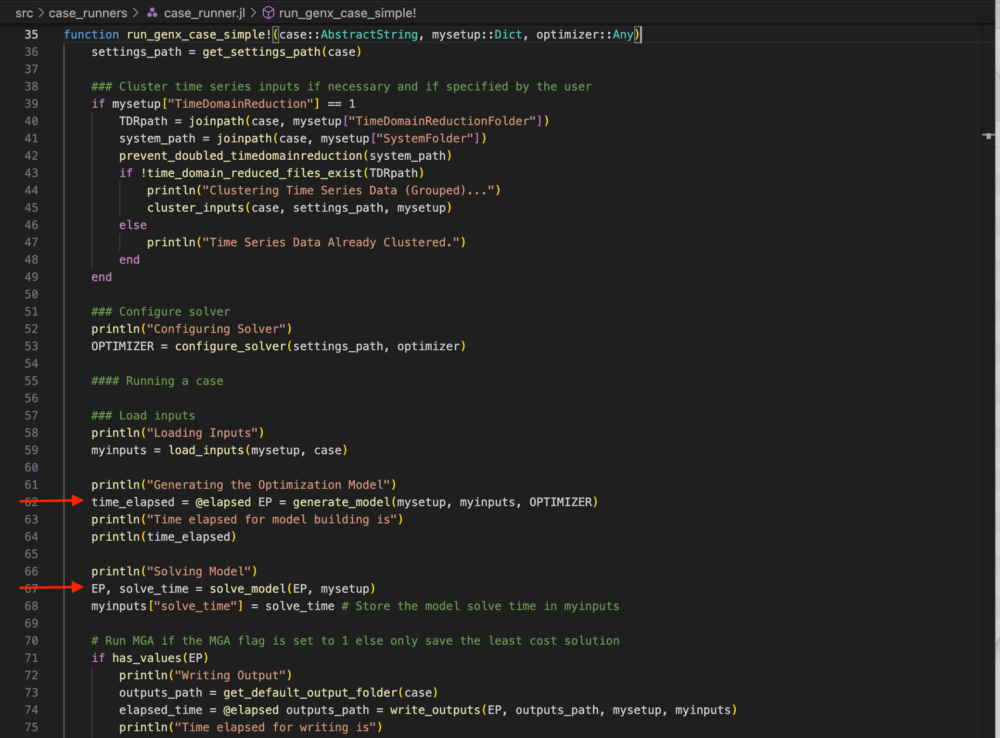

# Tutorial 5: Solving the Model

In Tutorial 4, we went over how the model is generated when GenX is run using `Run.jl`. In the function `run_genx_case_simple` (or multistage), after `generate_model` is called, `solve_model` is called to solve the EP.



In this tutorial, we go over how to use JuMP to solve a model, what it looks like to solve GenX, and how to handle infeasibilities.

## Table of Contents
* [A Simple Example](#Simple)
* [GenX](#GenX)
* [Infeasibility](#Infeasibility)

## A Simple Example <a id="Simple"></a>

From Tutorial 4, we have the model:

\begin{align}
& \min 10 x + 15 y &\text{Objective function (cost)}\\ 
& \text{s.t.} & \\
& x + y \geq 10 &\text{Grid Demand}\\
& 55x + 70y \leq \ 1000 &\text{Construction constraint}\\
& 40 x + 5 y \leq 200 &\text{Emissions constraint} \\
& x, y \geq 0 &\text{Non-negativity constraints}\\
\end{align}


```julia
using JuMP
using HiGHS
```


```julia
power = Model(HiGHS.Optimizer)

@variable(power,x,Int) # Coal
@variable(power,y,Int) # Wind

@constraint(power, non_neg_x, x >= 0) # Non-negativity constraint (can't have negative power plants!)
@constraint(power, non_neg_y, y >= 0) # Non-negativity constraint

@constraint(power, emissions, 40x + 5y <= 200) # Emisisons constraint
@constraint(power, construction_costs, 55x + 70y <= 1000) # Cost of constructing a new plant

@constraint(power, demand, x + y >= 10) # Grid demand

@expression(power,objective,10x+15y)

@objective(power, Min, objective)
```


$ 10 x + 15 y $


JuMP uses the function `optimize!(model)` to solve the LP:


```julia
optimize!(power)
```

    Running HiGHS 1.6.0: Copyright (c) 2023 HiGHS under MIT licence terms
    Presolving model
    3 rows, 2 cols, 6 nonzeros
    3 rows, 2 cols, 6 nonzeros
    Objective function is integral with scale 0.2
    
    Solving MIP model with:
       3 rows
       2 cols (0 binary, 2 integer, 0 implied int., 0 continuous)
       6 nonzeros
    
            Nodes      |    B&B Tree     |            Objective Bounds              |  Dynamic Constraints |       Work      
         Proc. InQueue |  Leaves   Expl. | BestBound       BestSol              Gap |   Cuts   InLp Confl. | LpIters     Time
    
             0       0         0   0.00%   90              inf                  inf        0      0      0         0     0.0s
    
    Solving report
      Status            Optimal
      Primal bound      130
      Dual bound        130
      Gap               0% (tolerance: 0.01%)
      Solution status   feasible
                        130 (objective)
                        0 (bound viol.)
                        0 (int. viol.)
                        0 (row viol.)
      Timing            0.00 (total)
                        0.00 (presolve)
                        0.00 (postsolve)
      Nodes             1
      LP iterations     1 (total)
                        0 (strong br.)
                        0 (separation)
                        0 (heuristics)


We can use the function `value.()` to get the value of each variable, and `objective_value()` to get the total objective value.


```julia
println("# Coal Plants: ", value.(x))
println("# Wind Farms: ", value.(y))
println("Cost: ", objective_value(power))
```

    # Coal Plants: 4.0
    # Wind Farms: 6.0
    Cost: 130.0


We can also use the JuMP function `solution_summary` to see more details of the <a href="https://jump.dev/JuMP.jl/stable/manual/solutions/" target="_blank">solution</a>:


```julia
solution_summary(power)
```


    * Solver : HiGHS
    
    * Status
      Result count       : 1
      Termination status : OPTIMAL
      Message from the solver:
      "kHighsModelStatusOptimal"
    
    * Candidate solution (result #1)
      Primal status      : FEASIBLE_POINT
      Dual status        : NO_SOLUTION
      Objective value    : 1.30000e+02
      Objective bound    : 1.30000e+02
      Relative gap       : 0.00000e+00
    
    * Work counters
      Solve time (sec)   : 5.69000e-04
      Simplex iterations : 1
      Barrier iterations : -1
      Node count         : 1


## GenX <a id="GenX"></a>

Let's optimize the GenX model created in the last Tutorial. To do so, we'll create the inputs for `generate_model` and run it. 


```julia
using GenX
```


```julia
case = joinpath("example_systems/1_three_zones") 

genx_settings = GenX.get_settings_path(case, "genx_settings.yml");
writeoutput_settings = GenX.get_settings_path(case, "output_settings.yml")
setup = GenX.configure_settings(genx_settings,writeoutput_settings)

settings_path = GenX.get_settings_path(case)

### Create TDR_Results
TDRpath = joinpath(case, setup["TimeDomainReductionFolder"])
system_path = joinpath(case, setup["SystemFolder"])

if setup["TimeDomainReduction"] == 1
    GenX.prevent_doubled_timedomainreduction(system_path)
    if !GenX.time_domain_reduced_files_exist(TDRpath)
        println("Clustering Time Series Data (Grouped)...")
        GenX.cluster_inputs(case, settings_path, setup)
    else
        println("Time Series Data Already Clustered.")
    end
end

OPTIMIZER =  GenX.configure_solver(settings_path,HiGHS.Optimizer);

inputs = GenX.load_inputs(setup, case)
```

    Configuring Settings
    Time Series Data Already Clustered.
    Reading Input CSV Files
    Network.csv Successfully Read!
    Demand (load) data Successfully Read!
    Fuels_data.csv Successfully Read!


    [ Info: Thermal.csv Successfully Read.
    [ Info: Vre.csv Successfully Read.
    [ Info: Storage.csv Successfully Read.
    [ Info: Resource_energy_share_requirement.csv Successfully Read.
    [ Info: Resource_capacity_reserve_margin.csv Successfully Read.
    [ Info: Resource_minimum_capacity_requirement.csv Successfully Read.


    
    Summary of resources loaded into the model:
    -------------------------------------------------------
    	Resource type 		Number of resources
    =======================================================
    	Thermal        		3
    	VRE            		4
    	Storage        		3
    =======================================================
    Total number of resources: 10
    -------------------------------------------------------
    Generators_variability.csv Successfully Read!
    Validating time basis
    Minimum_capacity_requirement.csv Successfully Read!
    CO2_cap.csv Successfully Read!
    CSV Files Successfully Read In From example_systems/1_three_zones


    Dict{Any, Any} with 73 entries:
      "Z"                         => 3
      "LOSS_LINES"                => [1, 2]
      "STOR_HYDRO_SHORT_DURATION" => Int64[]
      "RET_CAP_CHARGE"            => Set{Int64}()
      "pC_D_Curtail"              => [50.0, 45.0, 27.5, 10.0]
      "pTrans_Max_Possible"       => [5.9, 4.0]
      "pNet_Map"                  => [1.0 -1.0 0.0; 1.0 0.0 -1.0]
      "omega"                     => [4.01099, 4.01099, 4.01099, 4.01099, 4.01099, …
      "pMax_Line_Reinforcement"   => [2.95, 2.0]
      "RET_CAP_ENERGY"            => Int64[]
      "RESOURCES"                 => AbstractResource[…
      "COMMIT"                    => [1, 2, 3]
      "pMax_D_Curtail"            => [1.0, 0.04, 0.024, 0.003]
      "STOR_ALL"                  => [8, 9, 10]
      "THERM_ALL"                 => [1, 2, 3]
      "dfCO2CapZones"             => [1 0 0; 0 1 0; 0 0 1]
      "REP_PERIOD"                => 11
      "MinCapReq"                 => [5.0, 10.0, 6.0]
      "PWFU_Num_Segments"         => 0
      "STOR_LONG_DURATION"        => Int64[]
      "THERM_COMMIT_PWFU"         => Int64[]
      "STOR_SYMMETRIC"            => [8, 9, 10]
      "VRE"                       => [4, 5, 6, 7]
      "RETRO"                     => Int64[]
      "THERM_COMMIT"              => [1, 2, 3]
      ⋮                           => ⋮


```julia
EP = GenX.generate_model(setup,inputs,OPTIMIZER)
```

    Discharge Module
    Non-served Energy Module
    Investment Discharge Module
    Unit Commitment Module
    Fuel Module
    CO2 Module
    Investment Transmission Module
    Transmission Module
    Dispatchable Resources Module
    Storage Resources Module
    Storage Investment Module
    Storage Core Resources Module
    Storage Resources with Symmetric Charge/Discharge Capacity Module
    Thermal (Unit Commitment) Resources Module
    CO2 Policies Module
    Minimum Capacity Requirement Module


    A JuMP Model
    Minimization problem with:
    Variables: 120139
    Objective function type: AffExpr
    `AffExpr`-in-`MathOptInterface.EqualTo{Float64}`: 35112 constraints
    `AffExpr`-in-`MathOptInterface.GreaterThan{Float64}`: 20334 constraints
    `AffExpr`-in-`MathOptInterface.LessThan{Float64}`: 97952 constraints
    `VariableRef`-in-`MathOptInterface.EqualTo{Float64}`: 4 constraints
    `VariableRef`-in-`MathOptInterface.GreaterThan{Float64}`: 116439 constraints
    Model mode: AUTOMATIC
    CachingOptimizer state: EMPTY_OPTIMIZER
    Solver name: HiGHS
    Names registered in the model: FuelCalculationCommit_single, cCO2Emissions_systemwide, cFuelCalculation_single, cMaxCap, cMaxCapEnergy, cMaxCapEnergyDuration, cMaxFlow_in, cMaxFlow_out, cMaxLineReinforcement, cMaxNSE, cMaxRetCommit, cMaxRetEnergy, cMaxRetNoCommit, cMinCap, cMinCapEnergy, cMinCapEnergyDuration, cNSEPerSeg, cPowerBalance, cSoCBalInterior, cSoCBalStart, cStartFuel_single, cTAuxLimit, cTAuxSum, cTLoss, cZoneMinCapReq, eAvail_Trans_Cap, eCFix, eCFixEnergy, eCFuelOut, eCFuelStart, eCNSE, eCStart, eCVar_in, eCVar_out, eELOSS, eELOSSByZone, eEmissionsByPlant, eEmissionsByZone, eExistingCap, eExistingCapEnergy, eFuelConsumption, eFuelConsumptionYear, eFuelConsumption_single, eGenerationByThermAll, eGenerationByVRE, eGenerationByZone, eLosses_By_Zone, eMinCapRes, eMinCapResInvest, eNet_Export_Flows, eObj, ePlantCFuelOut, ePlantCFuelStart, ePlantFuel_generation, ePlantFuel_start, ePowerBalance, ePowerBalanceDisp, ePowerBalanceLossesByZone, ePowerBalanceNetExportFlows, ePowerBalanceNse, ePowerBalanceStor, ePowerBalanceThermCommit, eStartFuel, eTotalCFix, eTotalCFixEnergy, eTotalCFuelOut, eTotalCFuelStart, eTotalCNSE, eTotalCNSET, eTotalCNSETS, eTotalCNetworkExp, eTotalCStart, eTotalCStartT, eTotalCVarIn, eTotalCVarInT, eTotalCVarOut, eTotalCVarOutT, eTotalCap, eTotalCapEnergy, eTransMax, eZonalCFuelOut, eZonalCFuelStart, vCAP, vCAPENERGY, vCHARGE, vCO2Cap_slack, vCOMMIT, vFLOW, vFuel, vNEW_TRANS_CAP, vNSE, vP, vRETCAP, vRETCAPENERGY, vS, vSHUT, vSTART, vStartFuel, vTAUX_NEG, vTAUX_POS, vTLOSS, vZERO


The function `solve_model(model, setup)` uses the JuMP function `optimize` to optimize the model:


```julia
solution = optimize!(EP) # GenX.solve_model(EP,setup)
```

    Running HiGHS 1.6.0: Copyright (c) 2023 HiGHS under MIT licence terms
    Presolving model
    118138 rows, 81183 cols, 467127 nonzeros
    110719 rows, 73764 cols, 468669 nonzeros
    Presolve : Reductions: rows 110719(-42679); columns 73764(-46375); elements 468669(-46801)
    Solving the presolved LP
    IPX model has 110719 rows, 73764 columns and 468669 nonzeros
    Input
        Number of variables:                                73764
        Number of free variables:                           3696
        Number of constraints:                              110719
        Number of equality constraints:                     16605
        Number of matrix entries:                           468669
        Matrix range:                                       [4e-07, 1e+01]
        RHS range:                                          [8e-01, 4e+03]
        Objective range:                                    [1e-04, 5e+02]
        Bounds range:                                       [2e-03, 1e+01]
    Preprocessing
        Dualized model:                                     no
        Number of dense columns:                            15
        Range of scaling factors:                           [5.00e-01, 8.00e+00]
    IPX version 1.0
    Interior Point Solve
     Iter     P.res    D.res            P.obj           D.obj        mu     Time
       0   2.35e+01 4.02e+02   2.55794230e+06 -5.90523190e+06  9.40e+03       0s
       1   1.44e+01 1.56e+02  -4.97462084e+06 -9.27951524e+06  5.68e+03       0s
       2   1.39e+01 1.17e+02  -5.05015693e+06 -2.08614894e+07  5.84e+03       1s
       3   5.84e+00 6.92e+01  -5.75553612e+06 -2.72320526e+07  3.39e+03       1s
     Constructing starting basis...
       4   2.69e+00 3.28e+01  -2.13307807e+06 -2.71201994e+07  1.71e+03       4s
       5   2.46e+00 2.75e+01  -1.82691471e+06 -2.60698174e+07  1.54e+03       6s
       6   4.30e-01 1.23e+01   9.77610337e+05 -2.05362897e+07  6.60e+02       7s
       7   3.95e-02 1.41e+00   8.53197557e+05 -3.88346245e+06  8.37e+01      10s
       8   8.08e-04 4.19e-01   3.23644045e+05 -1.24164555e+06  2.39e+01      11s
       9   3.58e-04 1.74e-01   2.78546103e+05 -7.75131744e+05  1.28e+01      12s
      10   1.90e-04 1.18e-01   2.45864095e+05 -6.12794990e+05  9.95e+00      13s
      11   8.01e-05 8.76e-02   2.06769748e+05 -4.96752733e+05  7.92e+00      14s
      12   3.65e-05 4.96e-02   1.72208448e+05 -3.22206968e+05  4.96e+00      15s
      13   2.02e-05 3.80e-02   1.46996573e+05 -2.62166133e+05  3.88e+00      16s
      14   7.83e-06 2.10e-02   1.14573837e+05 -1.66726045e+05  2.35e+00      17s
      15   4.34e-06 1.67e-02   9.30230140e+04 -1.38424813e+05  1.83e+00      19s
      16   1.90e-06 7.98e-03   5.99637627e+04 -6.90454749e+04  9.04e-01      20s
      17   1.07e-06 3.13e-03   4.54862160e+04 -2.87383575e+04  4.65e-01      21s
      18   5.89e-07 2.31e-03   3.87509978e+04 -2.27744787e+04  3.72e-01      22s
      19   2.99e-07 1.37e-03   3.02245647e+04 -1.30901385e+04  2.52e-01      23s
      20   2.18e-07 1.26e-03   2.90441217e+04 -1.23204944e+04  2.39e-01      25s
      21   1.15e-07 8.18e-04   2.27329394e+04 -6.78757953e+03  1.67e-01      26s
      22   7.93e-08 6.38e-04   2.08054160e+04 -4.28238384e+03  1.40e-01      28s
      23   4.15e-08 3.66e-04   1.82114279e+04 -2.65215635e+02  1.02e-01      30s
      24   3.34e-08 2.30e-04   1.73842998e+04  2.12823174e+03  8.35e-02      31s
      25   2.41e-08 1.19e-04   1.62180168e+04  4.26655916e+03  6.49e-02      33s
      26   1.79e-08 7.58e-05   1.50084614e+04  5.61128409e+03  5.08e-02      36s
      27   1.55e-08 5.01e-05   1.45848735e+04  6.33319808e+03  4.45e-02      38s
      28   8.96e-09 2.92e-05   1.31027130e+04  7.23313275e+03  3.16e-02      40s
      29   8.20e-09 2.10e-05   1.29628312e+04  7.47741647e+03  2.95e-02      42s
      30   6.66e-09 1.45e-05   1.25255942e+04  7.93185780e+03  2.47e-02      44s
      31   5.85e-09 1.02e-05   1.23262615e+04  8.18755863e+03  2.23e-02      46s
      32   3.54e-09 5.28e-06   1.16830212e+04  8.60188031e+03  1.66e-02      48s
      33   3.18e-09 4.53e-06   1.15675791e+04  8.69465433e+03  1.54e-02      51s
      34   2.22e-09 3.46e-06   1.11950855e+04  8.87536254e+03  1.25e-02      52s
      35   1.36e-09 2.40e-06   1.09195252e+04  9.01669482e+03  1.02e-02      54s
      36   6.55e-10 2.21e-06   1.07022429e+04  9.04545061e+03  8.90e-03      58s
      37   5.84e-10 1.35e-06   1.06679199e+04  9.19918655e+03  7.89e-03      59s
      38   3.39e-10 1.16e-06   1.04848129e+04  9.26319212e+03  6.56e-03      61s
      39   3.18e-10 8.84e-07   1.04716353e+04  9.34692366e+03  6.04e-03      62s
      40   2.89e-10 6.08e-07   1.04482070e+04  9.44850220e+03  5.37e-03      63s
      41   2.41e-10 5.41e-07   1.04075789e+04  9.47756049e+03  4.99e-03      65s
      42   1.15e-10 5.02e-07   1.02910751e+04  9.49595050e+03  4.27e-03      66s
      43   8.92e-11 4.26e-07   1.02421841e+04  9.55676747e+03  3.68e-03      67s
      44   8.06e-11 4.13e-07   1.02362380e+04  9.55992151e+03  3.63e-03      68s
      45   7.01e-11 3.91e-07   1.02334836e+04  9.56918667e+03  3.57e-03      69s
      46   5.54e-11 3.39e-07   1.02201544e+04  9.58933595e+03  3.39e-03      70s
      47   4.44e-11 2.72e-07   1.02032239e+04  9.63451981e+03  3.05e-03      70s
      48   3.25e-11 2.39e-07   1.01842995e+04  9.65423119e+03  2.85e-03      71s
      49   2.05e-11 1.36e-07   1.01543857e+04  9.73823290e+03  2.23e-03      72s
      50   2.37e-11 9.61e-08   1.01255127e+04  9.78832063e+03  1.81e-03      73s
      51   2.93e-11 6.64e-08   1.00849935e+04  9.82680862e+03  1.39e-03      74s
      52   5.20e-11 4.89e-08   1.00635721e+04  9.85777756e+03  1.10e-03      75s
      53   3.70e-11 3.34e-08   1.00399150e+04  9.89150857e+03  7.96e-04      76s
      54   7.08e-12 2.10e-08   1.00279072e+04  9.92373195e+03  5.59e-04      77s
      55   1.86e-11 1.21e-08   1.00205444e+04  9.94486930e+03  4.06e-04      78s
      56   1.33e-11 7.93e-09   1.00163154e+04  9.95804515e+03  3.13e-04      79s
      57   3.86e-12 5.05e-09   1.00143941e+04  9.96828004e+03  2.47e-04      80s
      58   2.06e-12 4.06e-09   1.00115662e+04  9.97162815e+03  2.14e-04      81s
      59   2.49e-12 3.18e-09   1.00102116e+04  9.97536716e+03  1.87e-04      82s
      60   1.78e-11 2.21e-09   1.00049671e+04  9.98048902e+03  1.31e-04      82s
      61   1.56e-11 1.73e-09   1.00038481e+04  9.98378838e+03  1.08e-04      83s
      62   2.50e-11 9.17e-10   1.00042290e+04  9.98670937e+03  9.40e-05      84s
      63   4.94e-11 3.90e-10   1.00026652e+04  9.99248789e+03  5.46e-05      84s
      64   6.99e-11 2.36e-10   1.00015309e+04  9.99408284e+03  4.00e-05      85s
      65   7.38e-11 1.89e-10   1.00004698e+04  9.99464649e+03  3.12e-05      86s
      66   2.69e-11 8.62e-11   9.99996043e+03  9.99659582e+03  1.81e-05      86s
      67   1.17e-10 5.72e-11   9.99954890e+03  9.99699185e+03  1.37e-05      87s
      68   2.60e-10 2.41e-11   9.99923249e+03  9.99779948e+03  7.69e-06      88s
      69   3.17e-10 4.26e-12   9.99902981e+03  9.99838315e+03  3.47e-06      88s
      70   1.15e-10 9.38e-13   9.99883216e+03  9.99862287e+03  1.12e-06      89s
      71   5.48e-11 2.56e-13   9.99877152e+03  9.99866148e+03  5.91e-07      90s
      72   2.91e-10 1.36e-12   9.99873447e+03  9.99868544e+03  2.63e-07      91s
      73   3.13e-10 1.00e-12   9.99871750e+03  9.99869564e+03  1.17e-07      91s
      74   2.00e-10 5.26e-13   9.99870896e+03  9.99870051e+03  4.54e-08      92s
      75   3.17e-10 6.54e-13   9.99870590e+03  9.99870342e+03  1.33e-08      92s
      76   1.21e-10 1.81e-12   9.99870482e+03  9.99870438e+03  2.37e-09      93s
      77*  1.13e-09 2.64e-12   9.99870470e+03  9.99870462e+03  4.07e-10      94s
      78*  4.76e-10 4.47e-12   9.99870469e+03  9.99870468e+03  6.66e-11      95s
      79*  3.64e-10 6.20e-12   9.99870469e+03  9.99870469e+03  1.05e-11      97s
    Running crossover as requested
        Primal residual before push phase:                  4.93e-06
        Dual residual before push phase:                    2.95e-06
        Number of dual pushes required:                     25828
        Number of primal pushes required:                   3962
    Summary
        Runtime:                                            100.60s
        Status interior point solve:                        optimal
        Status crossover:                                   optimal
        objective value:                                    9.99870469e+03
        interior solution primal residual (abs/rel):        4.15e-08 / 1.01e-11
        interior solution dual residual (abs/rel):          7.29e-09 / 1.45e-11
        interior solution objective gap (abs/rel):          1.81e-06 / 1.81e-10
        basic solution primal infeasibility:                7.69e-13
        basic solution dual infeasibility:                  8.88e-16
    Ipx: IPM       optimal
    Ipx: Crossover optimal
    Solving the original LP from the solution after postsolve
    Model   status      : Optimal
    IPM       iterations: 79
    Crossover iterations: 3185
    Objective value     :  9.9987046894e+03
    HiGHS run time      :        100.86


We can use the command `objective_value` to get the optimial cost of our system as determined by the model. In GenX, the objective value is in dollars.


```julia
objective_value(EP)
```


    9998.704689371445


## Infeasibility <a id="Infeasibility"></a>

In some cases, your model may not be able to return a value. This happens when no value can be found that satisfies all constraints. To see this, let's go back to our simple example and add a new constraint to break the model.

\begin{align}
& \min 10 x + 15 y &\text{Objective function (cost)}\\ 
& \text{s.t.} & \\
& x + y \geq 10 &\text{Grid Demand}\\
& 55x + 70y \leq \ 1000 &\text{Construction constraint}\\
& 40 x + 5 y \leq 200 &\text{Emissions constraint} \\
& 7 x + 30 y \geq 500 &\textbf{New Constraint} \\
& x, y \geq 0 &\text{Non-negativity constraints}\\
\end{align}


```julia
@constraint(power, new, 7x + 30y >= 500)
```


$$ 7 x + 30 y \geq 500 $$


```julia
print(power)
```


$$ \begin{aligned}
\min\quad & 10 x + 15 y\\
\text{Subject to} \quad & x \geq 0\\
 & y \geq 0\\
 & x + y \geq 10\\
 & 7 x + 30 y \geq 500\\
 & 40 x + 5 y \leq 200\\
 & 55 x + 70 y \leq 1000\\
 & x \in \mathbb{Z}\\
 & y \in \mathbb{Z}\\
\end{aligned} $$


```julia
optimize!(power)
```

    Presolving model
    Presolve: Infeasible
    
    Solving report
      Status            Infeasible
      Primal bound      inf
      Dual bound        -inf
      Gap               inf
      Solution status   -
      Timing            0.00 (total)
                        0.00 (presolve)
                        0.00 (postsolve)
      Nodes             0
      LP iterations     0 (total)
                        0 (strong br.)
                        0 (separation)
                        0 (heuristics)


In this case, the infeasibility was detected on the presovle since it's clear no solution would fit within all constraints. For information on how to debug an infeasible solution, see the <a href="https://jump.dev/JuMP.jl/stable/manual/solutions/#Conflicts" target="_blank">JuMP documentaion</a>. Some solvers, such as Gurobi, will compute what is causing the conflict, e.g. which constraints are infeasible with one another (HiGHS does not do this). 

GenX version 0.4 has the feature `ComputeConflict` in settings. If the model does not work, try setting `ComputeConflict = 1`, and the conflicting constraints will be returned.

Tutorial 6 describes the solver settings, how to change them, and the effects of PreSolve, Crossover, and Feasibility Tolerance.
