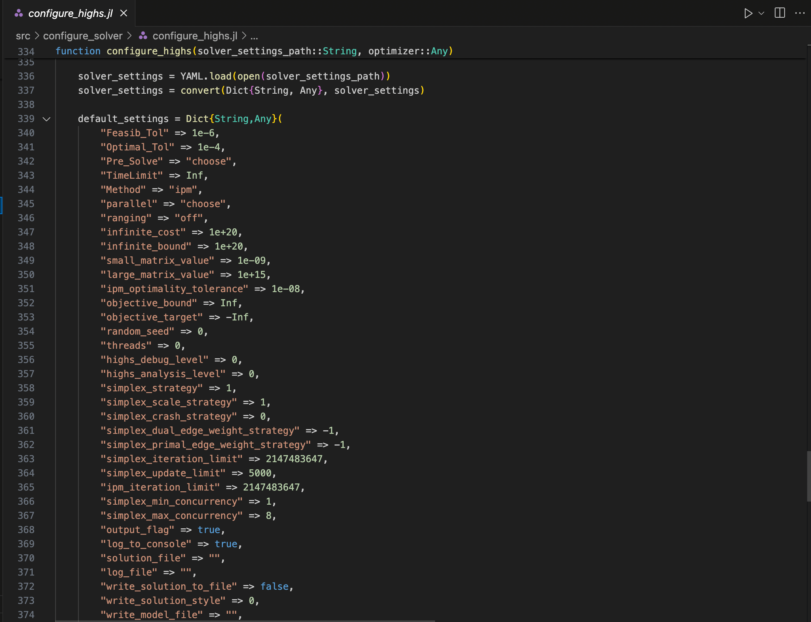
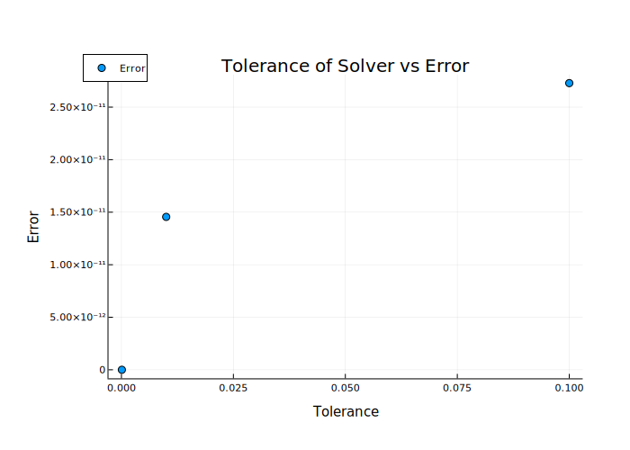

# Tutorial 6: Solver Settings

[Interactive Notebook of the tutorial](https://github.com/GenXProject/GenX-Tutorials/blob/main/Tutorials/Tutorial_6_Solver_Settings.ipynb)

Though solving the model relies only on `optimize`, there are a number of ways to change the way in which the model is optimized. This tutorial goes over solver parameters and how they affect the model solution.

## Table of Contents
* [The HiGHs Solver](#HiGHs)
* [Feasibility Tolerance](#Feasibility)
* [PreSolve](#PreSolve)
* [Crossover](#Crossover)


```julia
using YAML
using GenX
using JuMP
using HiGHS
using DataFrames
using Plots
using Plotly
```

```julia
case = joinpath("example_systems/1_three_zones") 

genx_settings = GenX.get_settings_path(case, "genx_settings.yml");
writeoutput_settings = GenX.get_settings_path(case, "output_settings.yml")
setup = GenX.configure_settings(genx_settings,writeoutput_settings) 
settings_path = GenX.get_settings_path(case)
```
```
    Configuring Settings

    "example_systems/1_three_zones/settings"
```

```julia
### Create TDR_Results
if "TDR_results" in cd(readdir,case)
    rm(joinpath(case,"TDR_results"), recursive=true) 
end

TDRpath = joinpath(case, setup["TimeDomainReductionFolder"])
system_path = joinpath(case, setup["SystemFolder"])

if setup["TimeDomainReduction"] == 1
    GenX.prevent_doubled_timedomainreduction(system_path)
    if !GenX.time_domain_reduced_files_exist(TDRpath)
        println("Clustering Time Series Data (Grouped)...")
        GenX.cluster_inputs(case, settings_path, setup)
    else
        println("Time Series Data Already Clustered.")
    end
end

inputs = GenX.load_inputs(setup, case)
```

### The HiGHS Solver

In the example files, the solver is [HiGHS](https://highs.dev). HiGHS is freely available for all to use. Other solvers, such as [Gurobi](https://www.gurobi.com), are available for free for academics. For the purpose of this tutorial, we will be focusing on HiGHS. 

To set the solver preferences, go into the settings folder of your case and select the YAML file of the solver you're using.


```julia
settings_folder = cd(readdir,joinpath(case,"Settings")) # Print Settings folder
```
```
    7-element Vector{String}:
    ".DS_Store"
    "clp_settings.yml"
    "cplex_settings.yml"
    "genx_settings.yml"
    "gurobi_settings.yml"
    "highs_settings.yml"
    "time_domain_reduction_settings.yml"
```
    
```julia
highs_settings = YAML.load(open(joinpath(case,"Settings/highs_settings.yml")))
```
```
    Dict{Any, Any} with 6 entries:
      "Method"        => "choose"
      "Feasib_Tol"    => 0.1
      "run_crossover" => "on"
      "TimeLimit"     => 1.0e23
      "Optimal_Tol"   => 0.1
      "Pre_Solve"     => "choose"
```

The function `configure_highs` in `src/configure_solver` contains a list of default settings for the HiGHS solver



There are about 80, so we'll only focus on a few for now. In most cases, you can leave the other settings on default. 

The default settings are combined with the settings you specify in `highs_settings.yml` in `configure_highs`, which is called from `configure_solver` in `run_genx_case_simple` right before the model is generated.


### Feasibility Tolerance

The parameters `Feasib_Tol` and `Optimal_Tol` represent the feasibility of the primal and dual functions respectively. Without going into too much detail, a [__dual function__](https://en.wikipedia.org/wiki/Duality_(optimization)) is an analagous formulation of the original ("primal") function whose objective value acts as a lower bound to the primal function. The objective value of the primal function is then the upper bound of the dual function. HiGHS will solve the dual and primal at each time step, then terminate when the solutions of the two are within a certain tolerance range. For more information on how this works specifically in HiGHS, see the [HiGHS documentaion](https://ergo-code.github.io/HiGHS/dev/terminology). 

If we decrease the tolerance parameters, the objective value becomes closer to the "true" optimal value.


```julia
# Change tolerance, generate and solve model`
tols = [1e-7,1e-4,1e-2,1e-1]
OV = zeros(1,4)

for i in range(1,length(tols))
    println(" ")
    println("----------------------------------------------------")
    println("Iteration ",i)
    println("Tolerance = ",tols[i])
    println("----------------------------------------------------")
    highs_settings["Feasib_Tol"] = tols[i]
    highs_settings["Optimal_Tol"] = tols[i]
    YAML.write_file(joinpath(case,"settings/highs_settings.yml"), highs_settings)
    OPTIMIZER1 = GenX.configure_solver(settings_path,HiGHS.Optimizer)
    EP = GenX.generate_model(setup,inputs,OPTIMIZER1)
    GenX.solve_model(EP,setup)
    OV[i] = objective_value(EP)
end
```
Using the smallest tolerance as our base, we can see the error as the tolerance increases:

```julia
DataFrame([tols[2:end] abs.(OV[2:end] .- OV[1])],["Tolerance", "Error"])
```
```
3×2 DataFrame
    Row	Tolerance	Error
        Float64	    Float64
    ───────────────────────────
    1	0.0001	    0.0
    2	0.01	    1.81899e-12
    3	0.1	        3.45608e-11
```

```julia
using Plots
using Plotly
```


```julia
# Plot the error as a function of the tolerance
plotlyjs()
Plots.scatter(tols[2:end], abs.(OV[2:end] .- OV[1]),legend=:topleft,
                ylabel="Error", xlabel="Tolerance",size=(920,400),label=:"Error",title="Tolerance of Solver vs Error")
ygrid!(:on, :dashdot, 0.1)
```



### PreSolve

In optimization, presolve is a stage at the beginning of the solver in which the problem is simplified to remove redunant constraints and otherwise simplify the problem before the optimization itself begins. The default for presolve in GenX is "choose", allowing the solver to use presolve only if it will reduce computation time. 

Let's try setting presolve to off and on, then compare computation times.


```julia
# First, set tolerances back to original
highs_settings["Feasib_Tol"] = 1e-5
highs_settings["Optimal_Tol"] = 1e-5
YAML.write_file(joinpath(case,"Settings/highs_settings.yml"), highs_settings)    
```

```julia
highs_settings["Pre_Solve"] = "off"
YAML.write_file(joinpath(case,"Settings/highs_settings.yml"), highs_settings)
OPTIMIZER2 = GenX.configure_solver(setup["Solver"], settings_path);
EP2 = GenX.generate_model(setup,inputs,OPTIMIZER2)
```
```
    Discharge Module
    Non-served Energy Module
    Investment Discharge Module
    Unit Commitment Module
    Emissions Module (for CO2 Policy modularization
    Dispatchable Resources Module
    Storage Resources Module
    Storage Investment Module
    Storage Core Resources Module
    Storage Resources with Symmetric Charge/Discharge Capacity Module
    Thermal (Unit Commitment) Resources Module
    C02 Policies Module
    Energy Share Requirement Policies Module
    Capacity Reserve Margin Policies Module
    Minimum Capacity Requirement Module
    Maximum Capacity Requirement Module

    A JuMP Model
    Minimization problem with:
    Variables: 18492
    Objective function type: AffExpr
    `AffExpr`-in-`MathOptInterface.EqualTo{Float64}`: 5544 constraints
    `AffExpr`-in-`MathOptInterface.GreaterThan{Float64}`: 7398 constraints
    `AffExpr`-in-`MathOptInterface.LessThan{Float64}`: 27730 constraints
    `VariableRef`-in-`MathOptInterface.EqualTo{Float64}`: 2 constraints
    `VariableRef`-in-`MathOptInterface.GreaterThan{Float64}`: 18490 constraints
    Model mode: AUTOMATIC
    CachingOptimizer state: EMPTY_OPTIMIZER
    Solver name: HiGHS
    Names registered in the model: cCO2Emissions_systemwide, cCapacityResMargin, cESRShare, cMaxCap, cMaxCapEnergy, cMaxCapEnergyDuration, cMaxNSE, cMaxRetCommit, cMaxRetEnergy, cMaxRetNoCommit, cMinCap, cMinCapEnergy, cMinCapEnergyDuration, cNSEPerSeg, cPowerBalance, cSoCBalInterior, cSoCBalStart, cZoneMaxCapReq, cZoneMinCapReq, eCFix, eCFixEnergy, eCNSE, eCStart, eCVar_in, eCVar_out, eCapResMarBalance, eCapResMarBalanceStor, eCapResMarBalanceThermal, eCapResMarBalanceVRE, eELOSS, eELOSSByZone, eESR, eESRDischarge, eEmissionsByPlant, eEmissionsByZone, eExistingCap, eExistingCapEnergy, eGenerationByThermAll, eGenerationByVRE, eGenerationByZone, eMaxCapRes, eMaxCapResInvest, eMinCapRes, eMinCapResInvest, eObj, ePowerBalance, ePowerBalanceDisp, ePowerBalanceNse, ePowerBalanceStor, ePowerBalanceThermCommit, eTotalCFix, eTotalCFixEnergy, eTotalCNSE, eTotalCNSET, eTotalCNSETS, eTotalCStart, eTotalCStartT, eTotalCVarIn, eTotalCVarInT, eTotalCVarOut, eTotalCVarOutT, eTotalCap, eTotalCapEnergy, vCAP, vCAPENERGY, vCHARGE, vCO2Cap_slack, vCOMMIT, vNSE, vP, vRETCAP, vRETCAPENERGY, vS, vSHUT, vSTART, vZERO
```

```julia
solution2 = @elapsed GenX.solve_model(EP2,setup)
```
```
    Running HiGHS 1.6.0: Copyright (c) 2023 HiGHS under MIT licence terms
    Solving LP without presolve or with basis
    Using EKK dual simplex solver - serial
      Iteration        Objective     Infeasibilities num(sum)
              0    -4.3842305368e+02 Ph1: 19318(12391.6); Du: 5(438.423) 0s
          18662     9.5083526285e+03 Pr: 3142(5018.36); Du: 0(0.000872182) 5s
          23359     9.8583752055e+03 Pr: 0(0); Du: 0(1.27565e-13) 6s
    Model   status      : Optimal
    Simplex   iterations: 23359
    Objective value     :  9.8583752055e+03
    HiGHS run time      :          6.77
    LP solved for primal

    6.84933975
```

```julia
highs_settings["Pre_Solve"] = "on"
YAML.write_file(joinpath(case,"Settings/highs_settings.yml"), highs_settings)
OPTIMIZER3 = GenX.configure_solver(setup["Solver"], settings_path);
EP3 = GenX.generate_model(setup,inputs,OPTIMIZER3)
```
```
    Discharge Module
    Non-served Energy Module
    Investment Discharge Module
    Unit Commitment Module
    Emissions Module (for CO2 Policy modularization
    Dispatchable Resources Module
    Storage Resources Module
    Storage Investment Module
    Storage Core Resources Module
    Storage Resources with Symmetric Charge/Discharge Capacity Module
    Thermal (Unit Commitment) Resources Module
    C02 Policies Module
    Energy Share Requirement Policies Module
    Capacity Reserve Margin Policies Module
    Minimum Capacity Requirement Module
    Maximum Capacity Requirement Module

    A JuMP Model
    Minimization problem with:
    Variables: 18492
    Objective function type: AffExpr
    `AffExpr`-in-`MathOptInterface.EqualTo{Float64}`: 5544 constraints
    `AffExpr`-in-`MathOptInterface.GreaterThan{Float64}`: 7398 constraints
    `AffExpr`-in-`MathOptInterface.LessThan{Float64}`: 27730 constraints
    `VariableRef`-in-`MathOptInterface.EqualTo{Float64}`: 2 constraints
    `VariableRef`-in-`MathOptInterface.GreaterThan{Float64}`: 18490 constraints
    Model mode: AUTOMATIC
    CachingOptimizer state: EMPTY_OPTIMIZER
    Solver name: HiGHS
    Names registered in the model: cCO2Emissions_systemwide, cCapacityResMargin, cESRShare, cMaxCap, cMaxCapEnergy, cMaxCapEnergyDuration, cMaxNSE, cMaxRetCommit, cMaxRetEnergy, cMaxRetNoCommit, cMinCap, cMinCapEnergy, cMinCapEnergyDuration, cNSEPerSeg, cPowerBalance, cSoCBalInterior, cSoCBalStart, cZoneMaxCapReq, cZoneMinCapReq, eCFix, eCFixEnergy, eCNSE, eCStart, eCVar_in, eCVar_out, eCapResMarBalance, eCapResMarBalanceStor, eCapResMarBalanceThermal, eCapResMarBalanceVRE, eELOSS, eELOSSByZone, eESR, eESRDischarge, eEmissionsByPlant, eEmissionsByZone, eExistingCap, eExistingCapEnergy, eGenerationByThermAll, eGenerationByVRE, eGenerationByZone, eMaxCapRes, eMaxCapResInvest, eMinCapRes, eMinCapResInvest, eObj, ePowerBalance, ePowerBalanceDisp, ePowerBalanceNse, ePowerBalanceStor, ePowerBalanceThermCommit, eTotalCFix, eTotalCFixEnergy, eTotalCNSE, eTotalCNSET, eTotalCNSETS, eTotalCStart, eTotalCStartT, eTotalCVarIn, eTotalCVarInT, eTotalCVarOut, eTotalCVarOutT, eTotalCap, eTotalCapEnergy, vCAP, vCAPENERGY, vCHARGE, vCO2Cap_slack, vCOMMIT, vNSE, vP, vRETCAP, vRETCAPENERGY, vS, vSHUT, vSTART, vZERO
```

```julia
solution3 = @elapsed GenX.solve_model(EP3,setup)
```

```
    Running HiGHS 1.6.0: Copyright (c) 2023 HiGHS under MIT licence terms
    Presolving model
    35947 rows, 17464 cols, 136177 nonzeros
    34470 rows, 15991 cols, 136110 nonzeros
    Presolve : Reductions: rows 34470(-6202); columns 15991(-2501); elements 136110(-29848)
    Solving the presolved LP
    Using EKK dual simplex solver - serial
      Iteration        Objective     Infeasibilities num(sum)
              0    -2.9011432493e+00 Ph1: 118(557.293); Du: 15(2.90114) 0s
          16445     9.8583752055e+03 Pr: 0(0); Du: 0(1.25316e-13) 4s
    Solving the original LP from the solution after postsolve
    Model   status      : Optimal
    Simplex   iterations: 16445
    Objective value     :  9.8583752055e+03
    HiGHS run time      :          4.55
    LP solved for primal

    4.655439792
```

As we can see, the runtime with PreSolve is shorter, and would be even shorter for a larger system. However, it could introduce numerical inaccuracies. If you find the model is struggling to converge, try turn PreSolve off.

```julia
# Write PreSolve back to choose
highs_settings["Pre_Solve"] = "choose"
YAML.write_file(joinpath(case,"Settings/highs_settings.yml"), highs_settings)
```

### Crossover

Crossover is a method in which, at each step of the optimization algorithm, the solution is pushed to the boundary of the solution space. This allows for a potentially more accurate solution, but can be computationally intensive. Let's try turning crossover on and off and see what solutions we get:


```julia
highs_settings["run_crossover"] = "off"
YAML.write_file(joinpath(case,"Settings/highs_settings.yml"), highs_settings)
OPTIMIZER4 = GenX.configure_solver(setup["Solver"], settings_path);
EP4 = GenX.generate_model(setup,inputs,OPTIMIZER4)
```

```
    Discharge Module
    Non-served Energy Module
    Investment Discharge Module
    Unit Commitment Module
    Emissions Module (for CO2 Policy modularization
    Transmission Module
    Dispatchable Resources Module
    Storage Resources Module
    Storage Investment Module
    Storage Core Resources Module
    Storage Resources with Symmetric Charge/Discharge Capacity Module
    Thermal (Unit Commitment) Resources Module
    C02 Policies Module
    Minimum Capacity Requirement Module

    A JuMP Model
    Minimization problem with:
    Variables: 83192
    Objective function type: AffExpr
    `AffExpr`-in-`MathOptInterface.EqualTo{Float64}`: 24024 constraints
    `AffExpr`-in-`MathOptInterface.GreaterThan{Float64}`: 20334 constraints
    `AffExpr`-in-`MathOptInterface.LessThan{Float64}`: 103509 constraints
    `VariableRef`-in-`MathOptInterface.EqualTo{Float64}`: 4 constraints
    `VariableRef`-in-`MathOptInterface.GreaterThan{Float64}`: 79492 constraints
    Model mode: AUTOMATIC
    CachingOptimizer state: EMPTY_OPTIMIZER
    Solver name: HiGHS
    Names registered in the model: cCO2Emissions_systemwide, cMaxCap, cMaxCapEnergy, cMaxCapEnergyDuration, cMaxFlow_in, cMaxFlow_out, cMaxLineReinforcement, cMaxNSE, cMaxRetCommit, cMaxRetEnergy, cMaxRetNoCommit, cMinCap, cMinCapEnergy, cMinCapEnergyDuration, cNSEPerSeg, cPowerBalance, cSoCBalInterior, cSoCBalStart, cTAuxLimit, cTAuxSum, cTLoss, cZoneMinCapReq, eAvail_Trans_Cap, eCFix, eCFixEnergy, eCNSE, eCStart, eCVar_in, eCVar_out, eELOSS, eELOSSByZone, eEmissionsByPlant, eEmissionsByZone, eExistingCap, eExistingCapEnergy, eGenerationByThermAll, eGenerationByVRE, eGenerationByZone, eLosses_By_Zone, eMinCapRes, eMinCapResInvest, eNet_Export_Flows, eObj, ePowerBalance, ePowerBalanceDisp, ePowerBalanceLossesByZone, ePowerBalanceNetExportFlows, ePowerBalanceNse, ePowerBalanceStor, ePowerBalanceThermCommit, eTotalCFix, eTotalCFixEnergy, eTotalCNSE, eTotalCNSET, eTotalCNSETS, eTotalCNetworkExp, eTotalCStart, eTotalCStartT, eTotalCVarIn, eTotalCVarInT, eTotalCVarOut, eTotalCVarOutT, eTotalCap, eTotalCapEnergy, eTransMax, vCAP, vCAPENERGY, vCHARGE, vCO2Cap_slack, vCOMMIT, vFLOW, vNEW_TRANS_CAP, vNSE, vP, vRETCAP, vRETCAPENERGY, vS, vSHUT, vSTART, vTAUX_NEG, vTAUX_POS, vTLOSS, vZERO
```

```julia
solution4 = @elapsed GenX.solve_model(EP4,setup)
```

```
    Running HiGHS 1.6.0: Copyright (c) 2023 HiGHS under MIT licence terms
    Presolving model
    123675 rows, 81174 cols, 478190 nonzeros
    116575 rows, 74076 cols, 478470 nonzeros
    Presolve : Reductions: rows 116575(-31292); columns 74076(-9116); elements 478470(-75676)
    Solving the presolved LP
    Using EKK dual simplex solver - serial
      Iteration        Objective     Infeasibilities num(sum)
              0     1.9243583242e+03 Pr: 5545(9397.81); Du: 0(3.92542e-09) 0s
          13530     2.9999821788e+03 Pr: 30131(9.49605e+06); Du: 0(0.0013131) 5s
          17547     3.5484267823e+03 Pr: 19414(952045); Du: 0(0.00175439) 10s
          20723     4.7298157079e+03 Pr: 29321(991206); Du: 0(0.00183106) 15s
          23580     5.7123748112e+03 Pr: 32150(7.12339e+06); Du: 0(0.00148821) 21s
          26170     6.1864339355e+03 Pr: 23825(7.35638e+06); Du: 0(0.00149712) 26s
          29149     6.6441899572e+03 Pr: 27775(3.51868e+06); Du: 0(0.00148729) 31s
          31348     6.8846964690e+03 Pr: 35484(2.8051e+06); Du: 0(0.00139557) 36s
          33603     6.9920173954e+03 Pr: 24118(2.03558e+06); Du: 0(0.00124593) 42s
          35671     7.2015870783e+03 Pr: 34108(1.48506e+07); Du: 0(0.00155189) 47s
          37885     7.4048679609e+03 Pr: 31619(4.35123e+07); Du: 0(0.00179926) 52s
          40109     7.6356641465e+03 Pr: 25843(2.88592e+06); Du: 0(0.00205301) 58s
          42353     7.8375259516e+03 Pr: 31443(8.49023e+06); Du: 0(0.00226205) 64s
          45258     8.1692860958e+03 Pr: 37870(5.26412e+06); Du: 0(0.00255441) 69s
          48083     8.3152673717e+03 Pr: 40961(1.14875e+07); Du: 0(0.00294817) 75s
          50545     8.4510258333e+03 Pr: 30790(3.72272e+08); Du: 0(0.00304629) 80s
          52861     8.5807507297e+03 Pr: 22492(930796); Du: 0(0.00320519) 85s
          54980     8.6629986832e+03 Pr: 30776(2.08885e+07); Du: 0(0.00337039) 91s
          57333     8.7549581833e+03 Pr: 26257(1.13046e+06); Du: 0(0.00357615) 96s
          59389     8.8000584935e+03 Pr: 36678(2.40379e+06); Du: 0(0.00364701) 101s
          61669     8.8767323679e+03 Pr: 35715(2.44371e+06); Du: 0(0.00390224) 107s
          63914     8.9782186363e+03 Pr: 43654(3.60725e+06); Du: 0(0.00423026) 113s
          66084     9.0603325781e+03 Pr: 22220(2.48776e+06); Du: 0(0.00410399) 118s
          69022     9.1231092369e+03 Pr: 22727(1.78641e+06); Du: 0(0.00444875) 124s
          71953     9.1538574545e+03 Pr: 22264(5.37124e+06); Du: 0(0.00461629) 129s
          74846     9.1867207120e+03 Pr: 26970(1.49142e+06); Du: 0(0.00477614) 135s
          77129     9.2058130738e+03 Pr: 0(0); Du: 0(0.00107487) 140s
          77129     9.2058130738e+03 Pr: 0(0); Du: 0(0.00107487) 140s
    Using EKK dual simplex solver - serial
      Iteration        Objective     Infeasibilities num(sum)
          77129     9.2058130738e+03 Pr: 1(0.000235421); Du: 0(0.000836801) 140s
          77136     9.2058130749e+03 Pr: 0(0); Du: 0(0.000836801) 140s
          77136     9.2058130749e+03 Pr: 0(0); Du: 0(0.000836801) 140s
    Solving the original LP from the solution after postsolve
    Model   status      : Optimal
    Simplex   iterations: 77136
    Objective value     :  9.2058130749e+03
    HiGHS run time      :        140.51
    LP solved for primal

    140.762363
```

```julia
highs_settings["run_crossover"] = "on"
YAML.write_file(joinpath(case,"Settings/highs_settings.yml"), highs_settings)
OPTIMIZER5 = GenX.configure_solver(setup["Solver"], settings_path);
EP5 = GenX.generate_model(setup,inputs,OPTIMIZER5)
```

```
    Discharge Module
    Non-served Energy Module
    Investment Discharge Module
    Unit Commitment Module
    Emissions Module (for CO2 Policy modularization
    Transmission Module
    Dispatchable Resources Module
    Storage Resources Module
    Storage Investment Module
    Storage Core Resources Module
    Storage Resources with Symmetric Charge/Discharge Capacity Module
    Thermal (Unit Commitment) Resources Module
    C02 Policies Module
    Minimum Capacity Requirement Module

    A JuMP Model
    Minimization problem with:
    Variables: 83192
    Objective function type: AffExpr
    `AffExpr`-in-`MathOptInterface.EqualTo{Float64}`: 24024 constraints
    `AffExpr`-in-`MathOptInterface.GreaterThan{Float64}`: 20334 constraints
    `AffExpr`-in-`MathOptInterface.LessThan{Float64}`: 103509 constraints
    `VariableRef`-in-`MathOptInterface.EqualTo{Float64}`: 4 constraints
    `VariableRef`-in-`MathOptInterface.GreaterThan{Float64}`: 79492 constraints
    Model mode: AUTOMATIC
    CachingOptimizer state: EMPTY_OPTIMIZER
    Solver name: HiGHS
    Names registered in the model: cCO2Emissions_systemwide, cMaxCap, cMaxCapEnergy, cMaxCapEnergyDuration, cMaxFlow_in, cMaxFlow_out, cMaxLineReinforcement, cMaxNSE, cMaxRetCommit, cMaxRetEnergy, cMaxRetNoCommit, cMinCap, cMinCapEnergy, cMinCapEnergyDuration, cNSEPerSeg, cPowerBalance, cSoCBalInterior, cSoCBalStart, cTAuxLimit, cTAuxSum, cTLoss, cZoneMinCapReq, eAvail_Trans_Cap, eCFix, eCFixEnergy, eCNSE, eCStart, eCVar_in, eCVar_out, eELOSS, eELOSSByZone, eEmissionsByPlant, eEmissionsByZone, eExistingCap, eExistingCapEnergy, eGenerationByThermAll, eGenerationByVRE, eGenerationByZone, eLosses_By_Zone, eMinCapRes, eMinCapResInvest, eNet_Export_Flows, eObj, ePowerBalance, ePowerBalanceDisp, ePowerBalanceLossesByZone, ePowerBalanceNetExportFlows, ePowerBalanceNse, ePowerBalanceStor, ePowerBalanceThermCommit, eTotalCFix, eTotalCFixEnergy, eTotalCNSE, eTotalCNSET, eTotalCNSETS, eTotalCNetworkExp, eTotalCStart, eTotalCStartT, eTotalCVarIn, eTotalCVarInT, eTotalCVarOut, eTotalCVarOutT, eTotalCap, eTotalCapEnergy, eTransMax, vCAP, vCAPENERGY, vCHARGE, vCO2Cap_slack, vCOMMIT, vFLOW, vNEW_TRANS_CAP, vNSE, vP, vRETCAP, vRETCAPENERGY, vS, vSHUT, vSTART, vTAUX_NEG, vTAUX_POS, vTLOSS, vZERO
```

```julia
solution5 = @elapsed GenX.solve_model(EP5,setup)
```

```
    Running HiGHS 1.6.0: Copyright (c) 2023 HiGHS under MIT licence terms
    Presolving model
    123675 rows, 81174 cols, 478190 nonzeros
    116575 rows, 74076 cols, 478470 nonzeros
    Presolve : Reductions: rows 116575(-31292); columns 74076(-9116); elements 478470(-75676)
    Solving the presolved LP
    Using EKK dual simplex solver - serial
      Iteration        Objective     Infeasibilities num(sum)
              0     1.9243583242e+03 Pr: 5545(9397.81); Du: 0(3.92542e-09) 0s
          13530     2.9999821788e+03 Pr: 30131(9.49605e+06); Du: 0(0.0013131) 5s
          17547     3.5484267823e+03 Pr: 19414(952045); Du: 0(0.00175439) 10s
          20723     4.7298157079e+03 Pr: 29321(991206); Du: 0(0.00183106) 15s
          23580     5.7123748112e+03 Pr: 32150(7.12339e+06); Du: 0(0.00148821) 21s
          26170     6.1864339355e+03 Pr: 23825(7.35638e+06); Du: 0(0.00149712) 26s
          29149     6.6441899572e+03 Pr: 27775(3.51868e+06); Du: 0(0.00148729) 31s
          31348     6.8846964690e+03 Pr: 35484(2.8051e+06); Du: 0(0.00139557) 36s
          33603     6.9920173954e+03 Pr: 24118(2.03558e+06); Du: 0(0.00124593) 42s
          35671     7.2015870783e+03 Pr: 34108(1.48506e+07); Du: 0(0.00155189) 47s
          37885     7.4048679609e+03 Pr: 31619(4.35123e+07); Du: 0(0.00179926) 52s
          40109     7.6356641465e+03 Pr: 25843(2.88592e+06); Du: 0(0.00205301) 58s
          42353     7.8375259516e+03 Pr: 31443(8.49023e+06); Du: 0(0.00226205) 63s
          45258     8.1692860958e+03 Pr: 37870(5.26412e+06); Du: 0(0.00255441) 69s
          48083     8.3152673717e+03 Pr: 40961(1.14875e+07); Du: 0(0.00294817) 75s
          50545     8.4510258333e+03 Pr: 30790(3.72272e+08); Du: 0(0.00304629) 80s
          52861     8.5807507297e+03 Pr: 22492(930796); Du: 0(0.00320519) 85s
          54980     8.6629986832e+03 Pr: 30776(2.08885e+07); Du: 0(0.00337039) 91s
          57333     8.7549581833e+03 Pr: 26257(1.13046e+06); Du: 0(0.00357615) 96s
          59389     8.8000584935e+03 Pr: 36678(2.40379e+06); Du: 0(0.00364701) 101s
          61669     8.8767323679e+03 Pr: 35715(2.44371e+06); Du: 0(0.00390224) 107s
          63914     8.9782186363e+03 Pr: 43654(3.60725e+06); Du: 0(0.00423026) 113s
          66084     9.0603325781e+03 Pr: 22220(2.48776e+06); Du: 0(0.00410399) 118s
          69022     9.1231092369e+03 Pr: 22727(1.78641e+06); Du: 0(0.00444875) 124s
          71953     9.1538574545e+03 Pr: 22264(5.37124e+06); Du: 0(0.00461629) 129s
          74408     9.1814081583e+03 Pr: 29329(5.2193e+06); Du: 0(0.00473215) 134s
          77012     9.2060247446e+03 Pr: 0(0); Du: 0(0.00509972) 140s
          77129     9.2058130738e+03 Pr: 0(0); Du: 0(0.00107487) 140s
          77129     9.2058130738e+03 Pr: 0(0); Du: 0(0.00107487) 140s
    Using EKK dual simplex solver - serial
      Iteration        Objective     Infeasibilities num(sum)
          77129     9.2058130738e+03 Pr: 1(0.000235421); Du: 0(0.000836801) 140s
          77136     9.2058130749e+03 Pr: 0(0); Du: 0(0.000836801) 140s
          77136     9.2058130749e+03 Pr: 0(0); Du: 0(0.000836801) 140s
    Solving the original LP from the solution after postsolve
    Model   status      : Optimal
    Simplex   iterations: 77136
    Objective value     :  9.2058130749e+03
    HiGHS run time      :        140.44
    LP solved for primal

    140.74829025
```