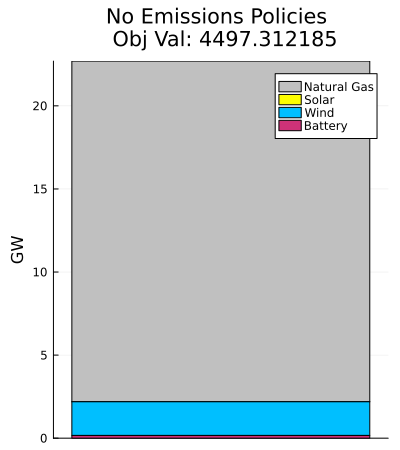
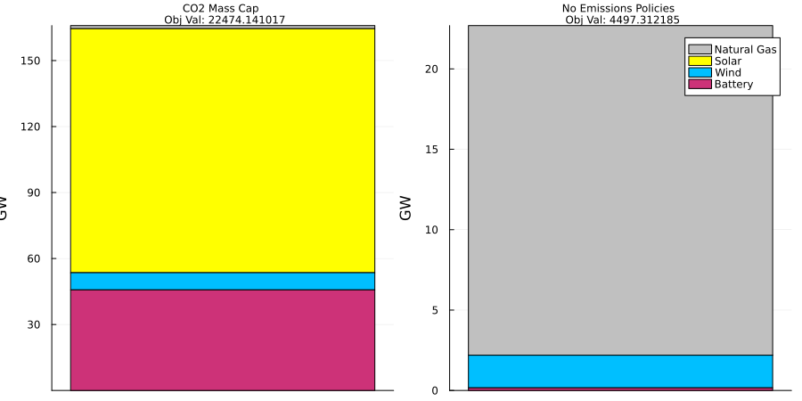
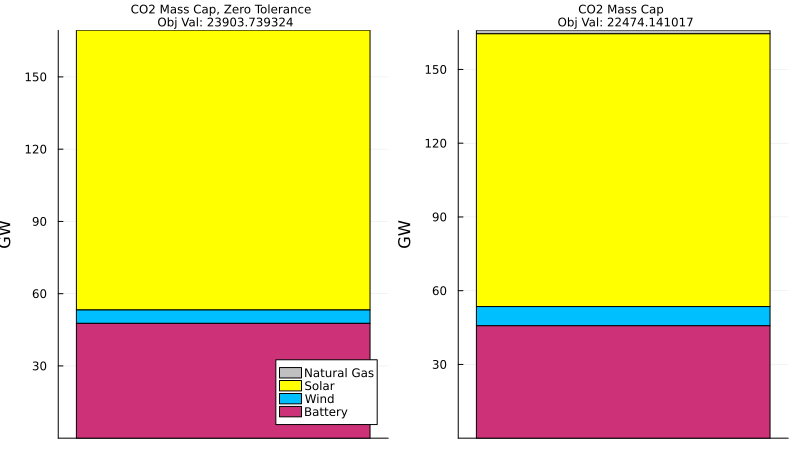
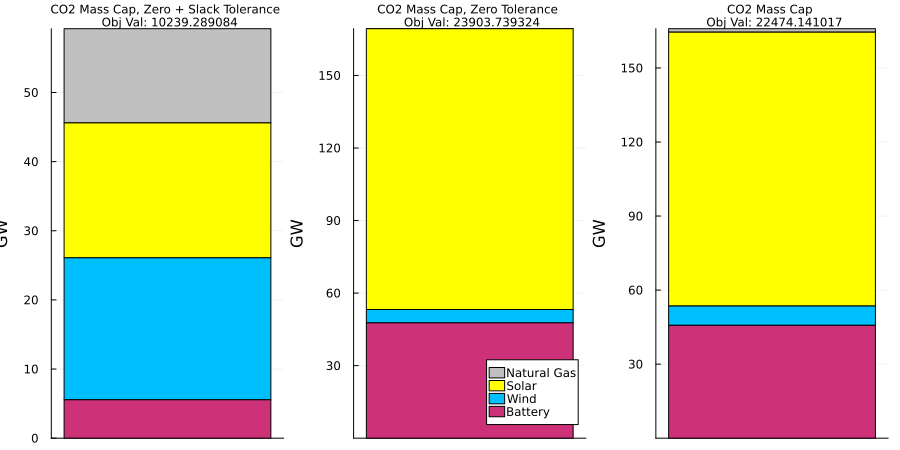
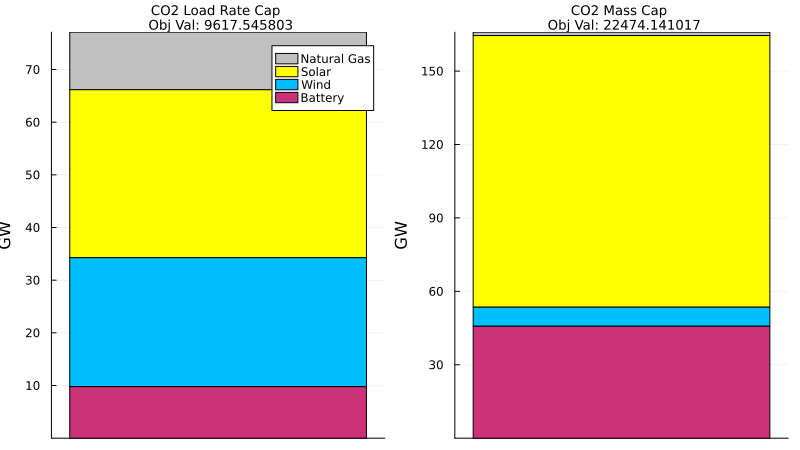
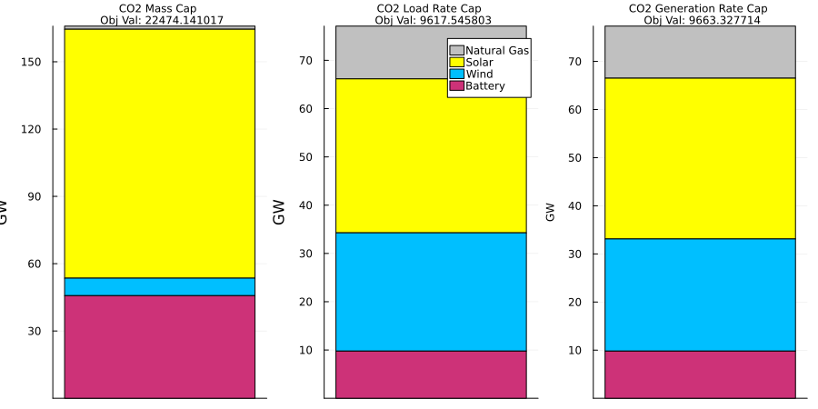
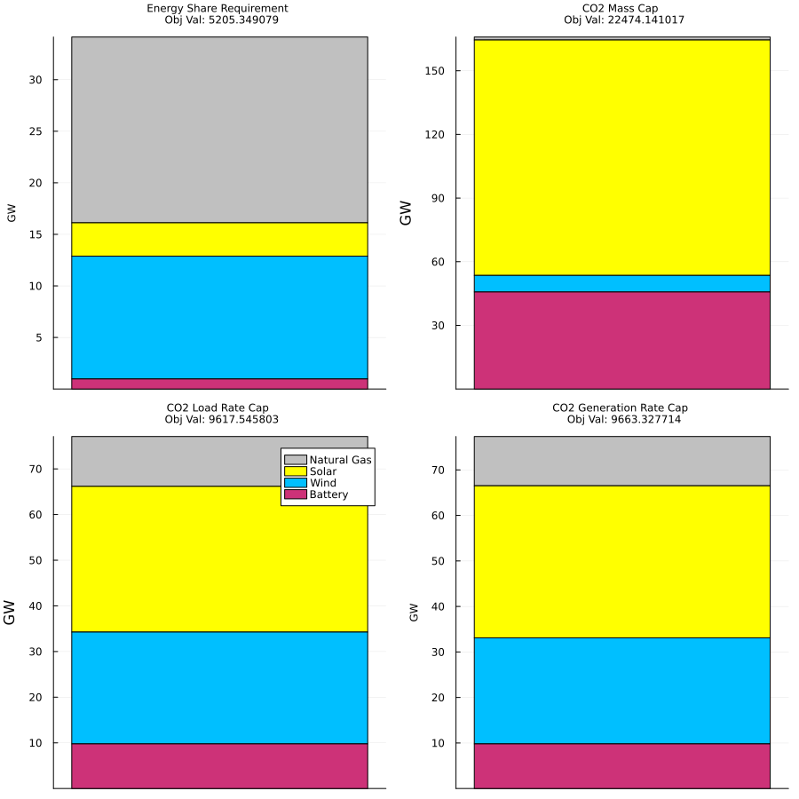
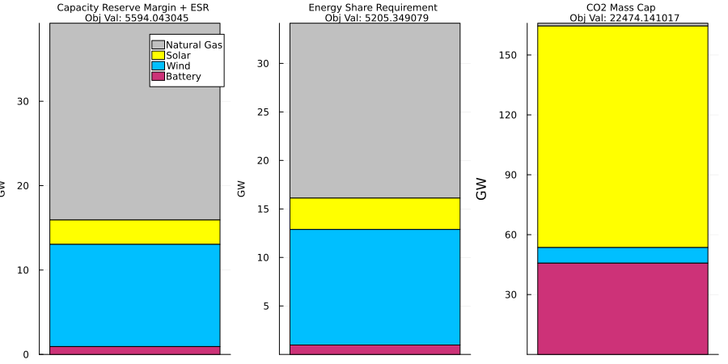
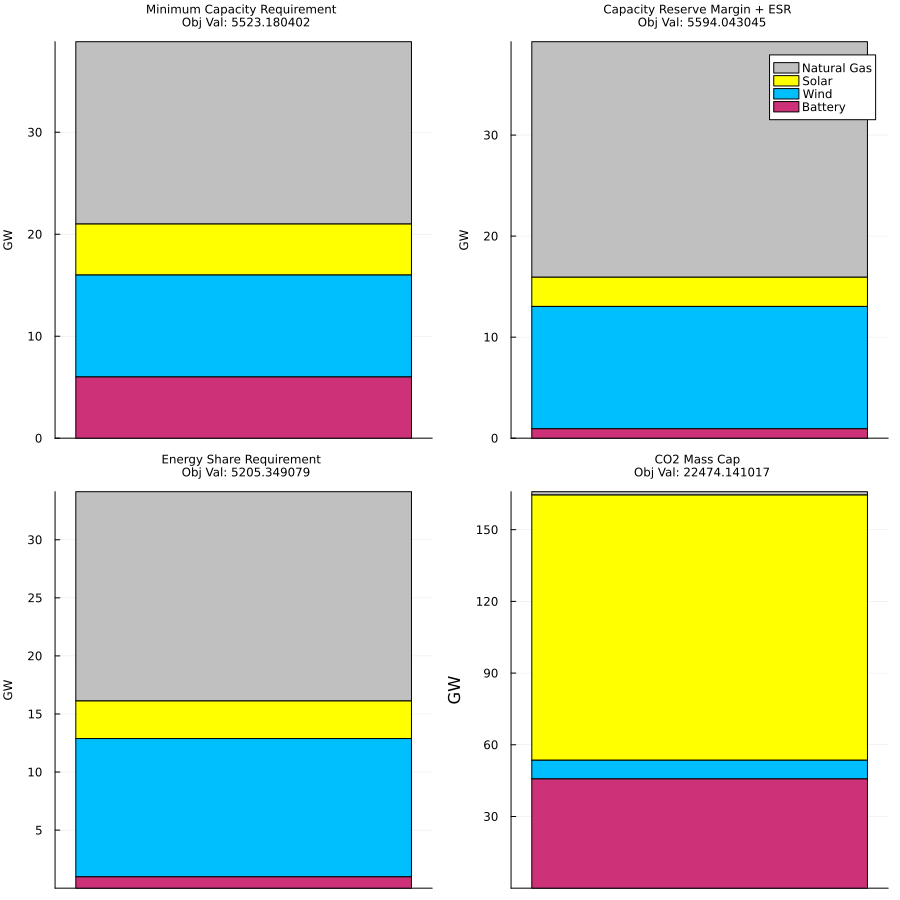

# Tutorial 7: Policy Constraints

[Interactive Notebook of the tutorial](https://github.com/GenXProject/GenX-Tutorials/blob/main/Tutorials/Tutorial_7_Setup.ipynb)

As show in previous tutorials, the settings file can be changed to adapt to a number of different systems. In Tutorial 3, we discussed how the setting Time Domain Reduction can reduce the computation time of the solver. Other settings, however, directly impact the values of the solution itself. This tutorial goes over the policy attributes in the settings and shows how implementing certain policies affects the optimal solution in GenX. To demonstrate these effects, we will be using `example_systems/1_three_zones`.

## Table of Contents
* [No Policy Constraints](#NoPolicies)
* [CO2 Cap](#CO2Cap)
    * [Mass Cap](#MassCap)
        * [Tolerance](#Tolerance)
        * [CO2 Slack](#CO2Slack)
    * [Demand-based Cap](#DemandCap)
    * [Generator-based Cap](#GenerateCap)
* [Energy Share Requirement](#ESR)
* [Capacity Reserve Margin](#CRM)
* [Minimum Capacity Requirement](#MCR)
* [All Together](#All)
        

## No Policy Constraints


```julia
using JuMP
using HiGHS
using GenX
using CSV
using DataFrames
using Plots
using StatsPlots
```


```julia
case = joinpath("example_systems/1_three_zones") 

genx_settings = GenX.get_settings_path(case, "genx_settings.yml");
writeoutput_settings = GenX.get_settings_path(case, "output_settings.yml")
setup = GenX.configure_settings(genx_settings,writeoutput_settings)
```

    Configuring Settings


    Dict{Any, Any} with 33 entries:
      "HydrogenHourlyMatching"             => 0
      "NetworkExpansion"                   => 1
      "TimeDomainReductionFolder"          => "TDR_results"
      "WriteOutputs"                       => "full"
      "SystemFolder"                       => "system"
      "EnableJuMPStringNames"              => 1
      "Trans_Loss_Segments"                => 1
      "ModelingtoGenerateAlternativeSlack" => 0.1
      "PoliciesFolder"                     => "policies"
      "MultiStage"                         => 0
      "ComputeConflicts"                   => 1
      "OverwriteResults"                   => 0
      "ModelingToGenerateAlternatives"     => 0
      "MaxCapReq"                          => 0
      "MinCapReq"                          => 1
      "CO2Cap"                             => 2
      "WriteShadowPrices"                  => 1
      "OperationalReserves"                => 0
      "EnergyShareRequirement"             => 0
      "PrintModel"                         => 0
      "TimeDomainReduction"                => 1
      "DC_OPF"                             => 0
      "CapacityReserveMargin"              => 0
      "MethodofMorris"                     => 0
      ⋮                                    => ⋮


The settings we'll focus on here are , `CO2Cap`, `EnergyShareRequirement`, `CapacityReserveMargin`, and `MinCapReq`. Each of these ensures that the environmental impact of the model is taken into account, and are therefore referred to as __policy settings__ . For more information on what each one does, see the documentation on [Emission mitigation policies].


```julia
println("MaxCapReq: ", setup["MaxCapReq"])
println("MinCapReq: ", setup["MinCapReq"])
println("CO2Cap: ", setup["CO2Cap"])
println("EnergyShareRequirement: ", setup["EnergyShareRequirement"])
println("CapacityReserveMargin: ", setup["CapacityReserveMargin"])
```

    MaxCapReq: 0
    MinCapReq: 1
    CO2Cap: 2
    EnergyShareRequirement: 0
    CapacityReserveMargin: 0


`1_three_zones` uses `MinCapReq` and `CO2Cap`. For the purpose of this tutorial, we're going to set these back to zero to start.


```julia
setup["MinCapReq"] = 0
setup["CO2Cap"] = 0;
```

Now, we'll generate and solve the model using these results:


```julia
## Delte Previous TDR Results
if "TDR_results" in cd(readdir,case)
    rm(joinpath(case,"TDR_results"), recursive=true) 
end

### Create TDR_Results
TDRpath = joinpath(case, setup["TimeDomainReductionFolder"])
system_path = joinpath(case, setup["SystemFolder"])
settings_path = GenX.get_settings_path(case)

if setup["TimeDomainReduction"] == 1
    GenX.prevent_doubled_timedomainreduction(system_path)
    if !GenX.time_domain_reduced_files_exist(TDRpath)
        println("Clustering Time Series Data (Grouped)...")
        GenX.cluster_inputs(case, settings_path, setup)
    else
        println("Time Series Data Already Clustered.")
    end
end

```

    Clustering Time Series Data (Grouped)...
    Reading Input CSV Files
    Network.csv Successfully Read!
    Demand (load) data Successfully Read!
    Fuels_data.csv Successfully Read!


    Thermal.csv Successfully Read.
    Vre.csv Successfully Read.
    Storage.csv Successfully Read.
    Resource_energy_share_requirement.csv Successfully Read.
    Resource_capacity_reserve_margin.csv Successfully Read.
    Resource_minimum_capacity_requirement.csv Successfully Read.

    
    Summary of resources loaded into the model:
    -------------------------------------------------------
    	Resource type 		Number of resources
    =======================================================
    	Thermal        		3
    	VRE            		4
    	Storage        		3
    =======================================================
    Total number of resources: 10
    -------------------------------------------------------
    Generators_variability.csv Successfully Read!
    Validating time basis
    CSV Files Successfully Read In From example_systems/1_three_zones
    Error: Geography Key 1 is invalid. Select `System' or `Zone'.


    Dict{String, Any} with 9 entries:
      "RMSE"          => Dict("ME_NG"=>0.210014, "ME_onshore_wind_z3"=>0.310986, "D…
      "OutputDF"      => 1848×19 DataFrame
      "ColToZoneMap"  => Dict("Demand_MW_z3"=>3, "CT_battery_z2"=>2, "MA_natural_ga…
      "ClusterObject" => KmeansResult{Matrix{Float64}, Float64, Int64}([-0.734116 2…
      "TDRsetup"      => Dict{Any, Any}("IterativelyAddPeriods"=>1, "ExtremePeriods…
      "Assignments"   => [1, 1, 1, 1, 2, 2, 2, 2, 2, 3  …  6, 9, 3, 10, 10, 10, 11,…
      "InputDF"       => 1680×52 DataFrame
      "Weights"       => [673.846, 1179.23, 842.308, 673.846, 1010.77, 1347.69, 134…
      "Centers"       => Any[4, 8, 12, 15, 20, 23, 27, 30, 44, 48, 49]


```julia
OPTIMIZER = GenX.configure_solver(settings_path,HiGHS.Optimizer);
inputs = GenX.load_inputs(setup, case)
```

    Reading Input CSV Files
    Network.csv Successfully Read!
    Demand (load) data Successfully Read!
    Fuels_data.csv Successfully Read!
    
    Summary of resources loaded into the model:
    -------------------------------------------------------
    	Resource type 		Number of resources
    =======================================================
    	Thermal        		3
    	VRE            		4
    	Storage        		3
    =======================================================
    Total number of resources: 10
    -------------------------------------------------------
    Generators_variability.csv Successfully Read!
    Validating time basis
    CSV Files Successfully Read In From example_systems/1_three_zones


    Thermal.csv Successfully Read.
    Vre.csv Successfully Read.
    Storage.csv Successfully Read.
    Resource_energy_share_requirement.csv Successfully Read.
    Resource_capacity_reserve_margin.csv Successfully Read.
    Resource_minimum_capacity_requirement.csv Successfully Read.


    Dict{Any, Any} with 67 entries:
      "Z"                         => 3
      "LOSS_LINES"                => [1, 2]
      "STOR_HYDRO_SHORT_DURATION" => Int64[]
      "RET_CAP_CHARGE"            => Set{Int64}()
      "pC_D_Curtail"              => [50.0, 45.0, 27.5, 10.0]
      "pTrans_Max_Possible"       => [5.9, 4.0]
      "pNet_Map"                  => [1.0 -1.0 0.0; 1.0 0.0 -1.0]
      "omega"                     => 4.01099, 4.01099, 4.01099, 4.01099, 4.01099, …
      "pMax_Line_Reinforcement"   => [2.95, 2.0]
      "RET_CAP_ENERGY"            => Int64[]
      "RESOURCES"                 => AbstractResource
      "COMMIT"                    => [1, 2, 3]
      "pMax_D_Curtail"            => [1.0, 0.04, 0.024, 0.003]
      "STOR_ALL"                  => [8, 9, 10]
      "THERM_ALL"                 => [1, 2, 3]
      "REP_PERIOD"                => 11
      "PWFU_Num_Segments"         => 0
      "STOR_LONG_DURATION"        => Int64[]
      "THERM_COMMIT_PWFU"         => Int64[]
      "STOR_SYMMETRIC"            => [8, 9, 10]
      "VRE"                       => [4, 5, 6, 7]
      "RETRO"                     => Int64[]
      "THERM_COMMIT"              => [1, 2, 3]
      "TRANS_LOSS_SEGS"           => 1
      "H"                         => 168
      ⋮                           => ⋮


```julia
EP = GenX.generate_model(setup,inputs,OPTIMIZER)
```

    Discharge Module
    Non-served Energy Module
    Investment Discharge Module
    Unit Commitment Module
    Fuel Module
    CO2 Module
    Investment Transmission Module
    Transmission Module
    Dispatchable Resources Module
    Storage Resources Module
    Storage Investment Module
    Storage Core Resources Module
    Storage Resources with Symmetric Charge/Discharge Capacity Module
    Thermal (Unit Commitment) Resources Module


    A JuMP Model
    Minimization problem with:
    Variables: 120136
    Objective function type: AffExpr
    `AffExpr`-in-`MathOptInterface.EqualTo{Float64}`: 35112 constraints
    `AffExpr`-in-`MathOptInterface.GreaterThan{Float64}`: 20331 constraints
    `AffExpr`-in-`MathOptInterface.LessThan{Float64}`: 97949 constraints
    `VariableRef`-in-`MathOptInterface.EqualTo{Float64}`: 1 constraint
    `VariableRef`-in-`MathOptInterface.GreaterThan{Float64}`: 116439 constraints
    Model mode: AUTOMATIC
    CachingOptimizer state: EMPTY_OPTIMIZER
    Solver name: HiGHS
    Names registered in the model: FuelCalculationCommit_single, cFuelCalculation_single, cMaxCap, cMaxCapEnergy, cMaxCapEnergyDuration, cMaxFlow_in, cMaxFlow_out, cMaxLineReinforcement, cMaxNSE, cMaxRetCommit, cMaxRetEnergy, cMaxRetNoCommit, cMinCap, cMinCapEnergy, cMinCapEnergyDuration, cNSEPerSeg, cPowerBalance, cSoCBalInterior, cSoCBalStart, cStartFuel_single, cTAuxLimit, cTAuxSum, cTLoss, eAvail_Trans_Cap, eCFix, eCFixEnergy, eCFuelOut, eCFuelStart, eCNSE, eCStart, eCVar_in, eCVar_out, eELOSS, eELOSSByZone, eEmissionsByPlant, eEmissionsByZone, eExistingCap, eExistingCapEnergy, eFuelConsumption, eFuelConsumptionYear, eFuelConsumption_single, eGenerationByThermAll, eGenerationByVRE, eGenerationByZone, eLosses_By_Zone, eNet_Export_Flows, eObj, ePlantCFuelOut, ePlantCFuelStart, ePlantFuel_generation, ePlantFuel_start, ePowerBalance, ePowerBalanceDisp, ePowerBalanceLossesByZone, ePowerBalanceNetExportFlows, ePowerBalanceNse, ePowerBalanceStor, ePowerBalanceThermCommit, eStartFuel, eTotalCFix, eTotalCFixEnergy, eTotalCFuelOut, eTotalCFuelStart, eTotalCNSE, eTotalCNSET, eTotalCNSETS, eTotalCNetworkExp, eTotalCStart, eTotalCStartT, eTotalCVarIn, eTotalCVarInT, eTotalCVarOut, eTotalCVarOutT, eTotalCap, eTotalCapEnergy, eTransMax, eZonalCFuelOut, eZonalCFuelStart, vCAP, vCAPENERGY, vCHARGE, vCOMMIT, vFLOW, vFuel, vNEW_TRANS_CAP, vNSE, vP, vRETCAP, vRETCAPENERGY, vS, vSHUT, vSTART, vStartFuel, vTAUX_NEG, vTAUX_POS, vTLOSS, vZERO


```julia
GenX.solve_model(EP,setup)
```

    Running HiGHS 1.6.0: Copyright (c) 2023 HiGHS under MIT licence terms
    Presolving model
    118155 rows, 81204 cols, 422835 nonzeros
    110998 rows, 74047 cols, 423349 nonzeros
    Presolve : Reductions: rows 110998(-42394); columns 74047(-46089); elements 423349(-47782)
    Solving the presolved LP
    IPX model has 110998 rows, 74047 columns and 423349 nonzeros
    Input
        Number of variables:                                74047
        Number of free variables:                           3696
        Number of constraints:                              110998
        Number of equality constraints:                     16867
        Number of matrix entries:                           423349
        Matrix range:                                       [4e-07, 1e+01]
        RHS range:                                          [7e-01, 2e+01]
        Objective range:                                    [1e-04, 4e+02]
        Bounds range:                                       [2e-03, 2e+01]
    Preprocessing
        Dualized model:                                     no
        Number of dense columns:                            15
        Range of scaling factors:                           [5.00e-01, 1.00e+00]
    IPX version 1.0
    Interior Point Solve
     Iter     P.res    D.res            P.obj           D.obj        mu     Time
       0   8.62e+00 3.81e+02   3.30336414e+06 -5.31617580e+06  3.30e+03       0s
       1   4.09e+00 1.06e+02   2.34353411e+05 -5.13796175e+06  1.43e+03       0s
       2   3.78e+00 7.03e+01   1.87013341e+05 -1.15199236e+07  1.34e+03       0s
       3   1.33e+00 4.12e+01  -3.76464137e+05 -1.37088411e+07  7.85e+02       1s
     Constructing starting basis...
       4   4.13e-01 1.08e+01   2.66640168e+05 -8.48314805e+06  2.43e+02       3s
       5   1.12e-01 5.62e+00   3.71879810e+05 -5.58576107e+06  1.28e+02       4s
       6   7.53e-03 1.62e+00   2.30531116e+05 -1.92720962e+06  3.67e+01       5s
       7   9.27e-04 1.77e-01   1.30486918e+05 -3.83901614e+05  5.66e+00       6s
       8   1.14e-04 4.38e-02   5.27259057e+04 -1.00386376e+05  1.48e+00       7s
       9   1.52e-05 6.88e-03   2.76584248e+04 -2.19746140e+04  3.52e-01       8s
      10   5.20e-06 2.59e-03   1.39025442e+04 -7.44814138e+03  1.35e-01       8s
      11   2.36e-06 1.09e-03   1.02345396e+04 -1.80403130e+03  7.13e-02      10s
      12   1.03e-06 3.59e-04   7.72508848e+03  1.35005473e+03  3.59e-02      12s
      13   6.67e-07 1.53e-04   6.83171406e+03  2.57204744e+03  2.35e-02      15s
      14   5.06e-07 7.64e-05   6.41494456e+03  3.13597410e+03  1.79e-02      18s
      15   3.52e-07 4.64e-05   5.95636098e+03  3.44861286e+03  1.36e-02      21s
      16   1.69e-07 2.49e-05   5.33436713e+03  3.75261594e+03  8.58e-03      24s
      17   1.38e-07 2.05e-05   5.23488752e+03  3.81660239e+03  7.68e-03      26s
      18   1.21e-07 1.95e-05   5.23765885e+03  3.83998603e+03  7.57e-03      28s
      19   7.35e-08 1.60e-05   5.05272742e+03  3.91685812e+03  6.15e-03      30s
      20   6.04e-08 1.49e-05   5.02221768e+03  3.93278446e+03  5.90e-03      33s
      21   2.85e-08 1.13e-05   4.88298181e+03  4.01774654e+03  4.68e-03      35s
      22   2.29e-08 6.29e-06   4.83470832e+03  4.00260600e+03  4.48e-03      37s
      23   1.31e-08 3.63e-06   4.72358228e+03  4.16712858e+03  3.00e-03      38s
      24   9.10e-09 2.96e-06   4.70648899e+03  4.19085995e+03  2.77e-03      40s
      25   4.45e-09 1.89e-06   4.63836996e+03  4.26416898e+03  2.01e-03      41s
      26   3.49e-09 1.84e-06   4.63722238e+03  4.26628187e+03  1.99e-03      42s
      27   2.15e-09 1.23e-06   4.59679916e+03  4.32342389e+03  1.47e-03      43s
      28   1.87e-09 1.07e-06   4.59259771e+03  4.33476451e+03  1.39e-03      46s
      29   1.58e-09 1.05e-06   4.59058841e+03  4.33567604e+03  1.37e-03      48s
      30   1.18e-09 8.27e-07   4.58014487e+03  4.35414040e+03  1.21e-03      49s
      31   7.95e-10 4.22e-07   4.56632970e+03  4.39355672e+03  9.27e-04      51s
      32   4.34e-10 3.79e-07   4.55792749e+03  4.39835388e+03  8.56e-04      51s
      33   2.37e-10 2.16e-07   4.54724964e+03  4.42097386e+03  6.77e-04      52s
      34   2.10e-10 2.06e-07   4.54686537e+03  4.42339252e+03  6.62e-04      53s
      35   7.73e-11 1.26e-07   4.53250796e+03  4.44139125e+03  4.89e-04      54s
      36   1.55e-11 1.06e-07   4.52064756e+03  4.44667475e+03  3.97e-04      55s
      37   1.50e-11 1.03e-07   4.52062467e+03  4.44749533e+03  3.92e-04      55s
      38   9.79e-12 1.00e-07   4.52199331e+03  4.44806728e+03  3.96e-04      56s
      39   8.92e-12 6.93e-08   4.52041735e+03  4.46101031e+03  3.19e-04      56s
      40   7.30e-12 5.17e-08   4.52001352e+03  4.46367984e+03  3.02e-04      57s
      41   4.70e-12 3.05e-08   4.51328477e+03  4.47536516e+03  2.03e-04      57s
      42   3.83e-12 2.70e-08   4.51240381e+03  4.47626904e+03  1.94e-04      58s
      43   2.85e-12 2.63e-08   4.51136761e+03  4.47647929e+03  1.87e-04      59s
      44   2.10e-12 1.31e-08   4.50946086e+03  4.48203628e+03  1.47e-04      59s
      45   1.31e-12 4.15e-09   4.50665353e+03  4.48821996e+03  9.88e-05      60s
      46   9.09e-13 3.31e-09   4.50579733e+03  4.48871202e+03  9.15e-05      61s
      47   9.09e-13 3.26e-09   4.50576718e+03  4.48852664e+03  9.24e-05      61s
      48   7.53e-13 2.25e-09   4.50502226e+03  4.49018328e+03  7.95e-05      62s
      49   7.53e-13 2.21e-09   4.50492035e+03  4.48999997e+03  7.99e-05      62s
      50   5.83e-13 1.52e-09   4.50350728e+03  4.49199895e+03  6.17e-05      63s
      51   1.99e-13 1.32e-09   4.50092854e+03  4.49240806e+03  4.57e-05      63s
      52   1.78e-13 1.23e-09   4.50080001e+03  4.49253227e+03  4.43e-05      64s
      53   9.24e-14 7.11e-10   4.49993325e+03  4.49367022e+03  3.36e-05      64s
      54   7.11e-14 5.59e-10   4.49966942e+03  4.49408670e+03  2.99e-05      65s
      55   7.11e-14 5.54e-10   4.49963721e+03  4.49407202e+03  2.98e-05      65s
      56   7.11e-14 5.25e-10   4.49964358e+03  4.49413082e+03  2.95e-05      66s
      57   4.97e-14 3.86e-10   4.49901737e+03  4.49483758e+03  2.24e-05      66s
      58   4.97e-14 3.77e-10   4.49900976e+03  4.49485417e+03  2.23e-05      66s
      59   4.97e-14 3.61e-10   4.49894867e+03  4.49494477e+03  2.15e-05      67s
      60   2.84e-14 2.16e-10   4.49842279e+03  4.49567956e+03  1.47e-05      67s
      61   2.84e-14 1.25e-10   4.49813093e+03  4.49622420e+03  1.02e-05      67s
      62   2.13e-14 9.05e-11   4.49785493e+03  4.49641576e+03  7.71e-06      68s
      63   2.13e-14 2.46e-11   4.49758346e+03  4.49698685e+03  3.20e-06      68s
      64   2.13e-14 1.77e-11   4.49754878e+03  4.49704995e+03  2.67e-06      68s
      65   2.13e-14 3.18e-12   4.49747123e+03  4.49722789e+03  1.30e-06      69s
      66   2.13e-14 1.36e-12   4.49740334e+03  4.49723907e+03  8.80e-07      69s
      67   2.13e-14 1.36e-12   4.49734663e+03  4.49727135e+03  4.03e-07      70s
      68   2.13e-14 9.66e-13   4.49734376e+03  4.49727731e+03  3.56e-07      70s
      69   2.13e-14 5.68e-13   4.49732633e+03  4.49728530e+03  2.20e-07      70s
      70   2.13e-14 4.55e-13   4.49731802e+03  4.49730841e+03  5.15e-08      71s
      71   2.13e-14 4.83e-13   4.49731683e+03  4.49730985e+03  3.74e-08      71s
      72   2.13e-14 1.92e-12   4.49731281e+03  4.49731141e+03  7.53e-09      72s
      73   2.13e-14 5.35e-12   4.49731227e+03  4.49731210e+03  9.13e-10      72s
      74*  2.13e-14 2.73e-12   4.49731219e+03  4.49731218e+03  7.21e-11      72s
      75*  2.84e-14 7.65e-12   4.49731219e+03  4.49731218e+03  4.94e-12      73s
      76*  3.55e-14 4.81e-12   4.49731219e+03  4.49731219e+03  4.09e-13      73s
      77*  3.55e-14 7.19e-12   4.49731219e+03  4.49731219e+03  2.31e-15      73s
    Running crossover as requested
        Primal residual before push phase:                  1.40e-09
        Dual residual before push phase:                    5.05e-10
        Number of dual pushes required:                     41031
        Number of primal pushes required:                   722
    Summary
        Runtime:                                            73.32s
        Status interior point solve:                        optimal
        Status crossover:                                   optimal
        objective value:                                    4.49731219e+03
        interior solution primal residual (abs/rel):        5.48e-11 / 3.35e-12
        interior solution dual residual (abs/rel):          7.19e-12 / 1.79e-14
        interior solution objective gap (abs/rel):          -5.22e-10 / -1.16e-13
        basic solution primal infeasibility:                2.78e-17
        basic solution dual infeasibility:                  5.41e-16
    Ipx: IPM       optimal
    Ipx: Crossover optimal
    Solving the original LP from the solution after postsolve
    Model   status      : Optimal
    IPM       iterations: 77
    Crossover iterations: 4712
    Objective value     :  4.4973121850e+03
    HiGHS run time      :         73.55
    LP solved for primal


    (A JuMP Model
    Minimization problem with:
    Variables: 120136
    Objective function type: AffExpr
    `AffExpr`-in-`MathOptInterface.EqualTo{Float64}`: 35112 constraints
    `AffExpr`-in-`MathOptInterface.GreaterThan{Float64}`: 20331 constraints
    `AffExpr`-in-`MathOptInterface.LessThan{Float64}`: 97949 constraints
    `VariableRef`-in-`MathOptInterface.EqualTo{Float64}`: 1 constraint
    `VariableRef`-in-`MathOptInterface.GreaterThan{Float64}`: 116439 constraints
    Model mode: AUTOMATIC
    CachingOptimizer state: ATTACHED_OPTIMIZER
    Solver name: HiGHS
    Names registered in the model: FuelCalculationCommit_single, cFuelCalculation_single, cMaxCap, cMaxCapEnergy, cMaxCapEnergyDuration, cMaxFlow_in, cMaxFlow_out, cMaxLineReinforcement, cMaxNSE, cMaxRetCommit, cMaxRetEnergy, cMaxRetNoCommit, cMinCap, cMinCapEnergy, cMinCapEnergyDuration, cNSEPerSeg, cPowerBalance, cSoCBalInterior, cSoCBalStart, cStartFuel_single, cTAuxLimit, cTAuxSum, cTLoss, eAvail_Trans_Cap, eCFix, eCFixEnergy, eCFuelOut, eCFuelStart, eCNSE, eCStart, eCVar_in, eCVar_out, eELOSS, eELOSSByZone, eEmissionsByPlant, eEmissionsByZone, eExistingCap, eExistingCapEnergy, eFuelConsumption, eFuelConsumptionYear, eFuelConsumption_single, eGenerationByThermAll, eGenerationByVRE, eGenerationByZone, eLosses_By_Zone, eNet_Export_Flows, eObj, ePlantCFuelOut, ePlantCFuelStart, ePlantFuel_generation, ePlantFuel_start, ePowerBalance, ePowerBalanceDisp, ePowerBalanceLossesByZone, ePowerBalanceNetExportFlows, ePowerBalanceNse, ePowerBalanceStor, ePowerBalanceThermCommit, eStartFuel, eTotalCFix, eTotalCFixEnergy, eTotalCFuelOut, eTotalCFuelStart, eTotalCNSE, eTotalCNSET, eTotalCNSETS, eTotalCNetworkExp, eTotalCStart, eTotalCStartT, eTotalCVarIn, eTotalCVarInT, eTotalCVarOut, eTotalCVarOutT, eTotalCap, eTotalCapEnergy, eTransMax, eZonalCFuelOut, eZonalCFuelStart, vCAP, vCAPENERGY, vCHARGE, vCOMMIT, vFLOW, vFuel, vNEW_TRANS_CAP, vNSE, vP, vRETCAP, vRETCAPENERGY, vS, vSHUT, vSTART, vStartFuel, vTAUX_NEG, vTAUX_POS, vTLOSS, vZERO, 73.97517013549805)


Using `value.()`, we can see what the total capacity is of the optimized model:


```julia
totCap_base = value.(EP[:eTotalCap])
```


    10-element Vector{Float64}:
     10.41532872265646
     10.085613331810192
      0.0
      0.0
      0.0
      0.0
      2.026239619715743
      0.0
      0.0
      0.16552558225070782


Each element corresponds to the MW value of the node in the grid. In `1_three_zones`, there are ten nodes, each of which are either natural gas, wind, solar, or battery plants. We can see which is which using `RESOURCE_NAMES` in the inputs dictionary:


```julia
RT = inputs["RESOURCE_NAMES"];
DataFrame([RT totCap_base],["Resource","Total Capacity"])
```


```@raw html
<div><div style = "float: left;"><span>10×2 DataFrame</span></div><div style = "clear: both;"></div></div><div class = "data-frame" style = "overflow-x: scroll;"><table class = "data-frame" style = "margin-bottom: 6px;"><thead><tr class = "header"><th class = "rowNumber" style = "font-weight: bold; text-align: right;">Row</th><th style = "text-align: left;">Resource</th><th style = "text-align: left;">Total Capacity</th></tr><tr class = "subheader headerLastRow"><th class = "rowNumber" style = "font-weight: bold; text-align: right;"></th><th title = "Any" style = "text-align: left;">Any</th><th title = "Any" style = "text-align: left;">Any</th></tr></thead><tbody><tr><td class = "rowNumber" style = "font-weight: bold; text-align: right;">1</td><td style = "text-align: left;">MA_natural_gas_combined_cycle</td><td style = "text-align: left;">10.4153</td></tr><tr><td class = "rowNumber" style = "font-weight: bold; text-align: right;">2</td><td style = "text-align: left;">CT_natural_gas_combined_cycle</td><td style = "text-align: left;">10.0856</td></tr><tr><td class = "rowNumber" style = "font-weight: bold; text-align: right;">3</td><td style = "text-align: left;">ME_natural_gas_combined_cycle</td><td style = "text-align: left;">0.0</td></tr><tr><td class = "rowNumber" style = "font-weight: bold; text-align: right;">4</td><td style = "text-align: left;">MA_solar_pv</td><td style = "text-align: left;">0.0</td></tr><tr><td class = "rowNumber" style = "font-weight: bold; text-align: right;">5</td><td style = "text-align: left;">CT_onshore_wind</td><td style = "text-align: left;">0.0</td></tr><tr><td class = "rowNumber" style = "font-weight: bold; text-align: right;">6</td><td style = "text-align: left;">CT_solar_pv</td><td style = "text-align: left;">0.0</td></tr><tr><td class = "rowNumber" style = "font-weight: bold; text-align: right;">7</td><td style = "text-align: left;">ME_onshore_wind</td><td style = "text-align: left;">2.02624</td></tr><tr><td class = "rowNumber" style = "font-weight: bold; text-align: right;">8</td><td style = "text-align: left;">MA_battery</td><td style = "text-align: left;">0.0</td></tr><tr><td class = "rowNumber" style = "font-weight: bold; text-align: right;">9</td><td style = "text-align: left;">CT_battery</td><td style = "text-align: left;">0.0</td></tr><tr><td class = "rowNumber" style = "font-weight: bold; text-align: right;">10</td><td style = "text-align: left;">ME_battery</td><td style = "text-align: left;">0.165526</td></tr></tbody></table></div>
```


To visualize the impact of the emmissions policies, let's group the nodes together by type and plot the data.


```julia
# Group by plant type
totCapB = [totCap_base[1] + totCap_base[2] + totCap_base[3], totCap_base[4] + totCap_base[6], 
    totCap_base[5] + totCap_base[7], totCap_base[8] + totCap_base[9] + totCap_base[10]]
totCapB = reshape(totCapB,(:,1)) # Convert to matrix
```


    4×1 Matrix{Float64}:
     20.500942054466652
      0.0
      2.026239619715743
      0.16552558225070782


```julia
colors=[:silver :yellow :deepskyblue :violetred3]

G1 = groupedbar(transpose(totCapB), bar_position = :stack, bar_width=0.1,size=(400,450),
    labels=["Natural Gas" "Solar" "Wind" "Battery"],
    title="No Emissions Policies \n Obj Val: $(round(objective_value(EP),digits=6))",xticks=[ ],ylabel="GW",color=colors)
```



As you can see, with no limit on emissions, GenX goes straight to using natural gas. Let's try changing the settings to enforce emissions constraints.

## CO2 Cap

The setting `CO2Cap` specifies if the model should have a constraint on CO$_2$ emmissions, and, if so, what that constraint should look like. There are three types, mass, load-based, and generator-based.

### Mass Cap

The first type of constraint, done by setting `CO2Cap` to "1", is a mass based constraint, which simply puts a limit on the total tons of CO$_2$ able to be produced per megawatt of electricty.


```julia
setup["CO2Cap"] = 1;
```


```julia
inputs = GenX.load_inputs(setup, case)
EP2 = GenX.generate_model(setup,inputs,OPTIMIZER)
GenX.solve_model(EP2,setup)
```

    Reading Input CSV Files
    Network.csv Successfully Read!
    Demand (load) data Successfully Read!
    Fuels_data.csv Successfully Read!
    
    Summary of resources loaded into the model:
    -------------------------------------------------------
    	Resource type 		Number of resources
    =======================================================
    	Thermal        		3
    	VRE            		4
    	Storage        		3
    =======================================================
    Total number of resources: 10
    -------------------------------------------------------
    Generators_variability.csv Successfully Read!
    Validating time basis
    CO2_cap.csv Successfully Read!
    CSV Files Successfully Read In From example_systems/1_three_zones
    Discharge Module


   Thermal.csv Successfully Read.
    Vre.csv Successfully Read.
    Storage.csv Successfully Read.
    Resource_energy_share_requirement.csv Successfully Read.
    Resource_capacity_reserve_margin.csv Successfully Read.
    Resource_minimum_capacity_requirement.csv Successfully Read.

    Non-served Energy Module
    Investment Discharge Module
    Unit Commitment Module
    Fuel Module
    CO2 Module
    Investment Transmission Module
    Transmission Module
    Dispatchable Resources Module
    Storage Resources Module
    Storage Investment Module
    Storage Core Resources Module
    Storage Resources with Symmetric Charge/Discharge Capacity Module
    Thermal (Unit Commitment) Resources Module
    CO2 Policies Module
    Running HiGHS 1.6.0: Copyright (c) 2023 HiGHS under MIT licence terms
    Presolving model
    118158 rows, 81204 cols, 433923 nonzeros
    110739 rows, 73785 cols, 435465 nonzeros
    Presolve : Reductions: rows 110739(-42656); columns 73785(-46354); elements 435465(-46757)
    Solving the presolved LP
    IPX model has 110739 rows, 73785 columns and 435465 nonzeros
    Input
        Number of variables:                                73785
        Number of free variables:                           3696
        Number of constraints:                              110739
        Number of equality constraints:                     16605
        Number of matrix entries:                           435465
        Matrix range:                                       [4e-07, 1e+01]
        RHS range:                                          [7e-01, 2e+01]
        Objective range:                                    [1e-04, 4e+02]
        Bounds range:                                       [2e-03, 2e+01]
    Preprocessing
        Dualized model:                                     no
        Number of dense columns:                            15
        Range of scaling factors:                           [5.00e-01, 4.00e+00]
    IPX version 1.0
    Interior Point Solve
     Iter     P.res    D.res            P.obj           D.obj        mu     Time
       0   1.16e+01 3.76e+02   3.33411424e+06 -5.16532632e+06  4.37e+03       0s
       1   6.12e+00 1.19e+02   2.67580772e+05 -5.49991870e+06  2.15e+03       0s
       2   5.78e+00 8.43e+01   2.63971420e+05 -1.26660532e+07  2.19e+03       1s
       3   2.60e+00 5.19e+01  -6.33191198e+04 -1.58670064e+07  1.38e+03       1s
     Constructing starting basis...
       4   7.34e-01 1.69e+01   8.22606550e+05 -1.15977191e+07  4.66e+02       3s
       5   3.33e-01 5.93e+00   6.52520930e+05 -5.60493380e+06  1.92e+02       5s
       6   1.40e-01 1.86e+00   4.30003244e+05 -2.61740021e+06  7.56e+01       6s
       7   7.48e-02 6.92e-01   3.17908008e+05 -1.47858711e+06  3.76e+01       7s
       8   1.34e-02 2.13e-01   1.58499195e+05 -7.36966970e+05  1.06e+01       8s
       9   8.58e-03 1.84e-01   1.38726156e+05 -6.77517443e+05  8.88e+00       9s
      10   1.85e-03 1.25e-01   1.06997055e+05 -5.46895734e+05  6.03e+00      10s
      11   9.24e-04 6.46e-02   8.86553337e+04 -3.44818602e+05  3.62e+00      11s
      12   4.63e-04 4.30e-02   7.38073046e+04 -2.58650422e+05  2.62e+00      12s
      13   2.59e-04 1.76e-02   5.82580398e+04 -1.15494132e+05  1.25e+00      13s
      14   1.82e-04 1.25e-02   5.26785356e+04 -8.56355514e+04  9.61e-01      14s
      15   8.88e-05 9.97e-03   4.58204676e+04 -6.94861851e+04  7.82e-01      15s
      16   4.53e-05 6.30e-03   3.78921045e+04 -3.64421549e+04  4.86e-01      16s
      17   2.06e-05 3.52e-03   3.37528536e+04 -1.59069943e+04  3.10e-01      17s
      18   1.03e-05 1.99e-03   3.04164644e+04 -2.07682393e+03  1.95e-01      18s
      19   8.47e-06 1.65e-03   3.00013657e+04  4.67701651e+02  1.75e-01      19s
      20   7.43e-06 1.51e-03   2.96873596e+04  1.69164986e+03  1.65e-01      20s
      21   4.34e-06 1.21e-03   2.86080014e+04  4.49654207e+03  1.41e-01      21s
      22   3.15e-06 9.70e-04   2.84959673e+04  6.35826288e+03  1.28e-01      21s
      23   8.47e-07 3.92e-04   2.73823203e+04  1.23933845e+04  8.37e-02      22s
      24   2.40e-07 1.04e-04   2.61231516e+04  1.76443726e+04  4.63e-02      23s
      25   2.22e-07 9.36e-05   2.60148183e+04  1.78437138e+04  4.45e-02      24s
      26   1.62e-07 7.29e-05   2.55552259e+04  1.84206144e+04  3.88e-02      24s
      27   1.22e-07 5.52e-05   2.50949238e+04  1.91000865e+04  3.25e-02      25s
      28   1.09e-07 4.85e-05   2.50021728e+04  1.92517935e+04  3.12e-02      26s
      29   8.94e-08 4.45e-05   2.47907107e+04  1.93334302e+04  2.96e-02      27s
      30   8.24e-08 4.34e-05   2.47681701e+04  1.93720252e+04  2.92e-02      28s
      31   7.16e-08 2.50e-05   2.46362518e+04  1.99291856e+04  2.54e-02      29s
      32   4.66e-08 2.01e-05   2.42437587e+04  2.01152325e+04  2.23e-02      29s
      33   4.19e-08 1.97e-05   2.42647574e+04  2.01301840e+04  2.23e-02      30s
      34   2.79e-08 1.90e-05   2.40142742e+04  2.01663344e+04  2.08e-02      31s
      35   2.32e-08 6.69e-06   2.39399116e+04  2.06855599e+04  1.75e-02      31s
      36   1.07e-08 5.30e-06   2.34566702e+04  2.08955297e+04  1.38e-02      32s
      37   9.51e-09 4.35e-06   2.33786345e+04  2.11021969e+04  1.22e-02      33s
      38   8.47e-09 3.86e-06   2.33591312e+04  2.11486293e+04  1.19e-02      34s
      39   4.72e-09 2.75e-06   2.31415700e+04  2.13759124e+04  9.49e-03      35s
      40   4.12e-09 2.60e-06   2.31287674e+04  2.13971288e+04  9.30e-03      35s
      41   4.08e-09 2.30e-06   2.31279677e+04  2.14560762e+04  8.98e-03      36s
      42   2.31e-09 1.19e-06   2.29798114e+04  2.17571173e+04  6.57e-03      37s
      43   2.12e-09 1.08e-06   2.29572577e+04  2.17902511e+04  6.27e-03      37s
      44   1.50e-09 6.92e-07   2.28682893e+04  2.19491402e+04  4.93e-03      38s
      45   1.44e-09 5.32e-07   2.28678426e+04  2.19786865e+04  4.77e-03      39s
      46   7.50e-10 1.52e-07   2.27876378e+04  2.21512825e+04  3.41e-03      39s
      47   6.72e-10 1.34e-07   2.27673512e+04  2.21739594e+04  3.18e-03      40s
      48   4.76e-10 2.75e-08   2.27150227e+04  2.23098580e+04  2.17e-03      41s
      49   3.86e-10 2.55e-08   2.26819898e+04  2.23156051e+04  1.97e-03      41s
      50   3.42e-10 2.05e-08   2.26687731e+04  2.23252871e+04  1.84e-03      42s
      51   3.03e-10 1.42e-08   2.26566767e+04  2.23383080e+04  1.71e-03      42s
      52   1.93e-10 1.06e-08   2.26117685e+04  2.23551537e+04  1.38e-03      43s
      53   1.66e-10 3.63e-09   2.25954131e+04  2.24149312e+04  9.68e-04      44s
      54   8.18e-11 9.07e-10   2.25454653e+04  2.24370312e+04  5.82e-04      44s
      55   5.43e-11 4.51e-10   2.25280247e+04  2.24432375e+04  4.55e-04      46s
      56   5.00e-11 4.05e-10   2.25264013e+04  2.24433424e+04  4.46e-04      46s
      57   4.69e-11 3.79e-10   2.25244405e+04  2.24432461e+04  4.36e-04      47s
      58   4.68e-11 3.45e-10   2.25244112e+04  2.24428231e+04  4.38e-04      47s
      59   4.43e-11 3.07e-10   2.25225216e+04  2.24434057e+04  4.24e-04      48s
      60   4.09e-11 2.55e-11   2.25200762e+04  2.24519301e+04  3.66e-04      48s
      61   3.36e-11 2.18e-11   2.25158099e+04  2.24513558e+04  3.46e-04      49s
      62   2.89e-11 1.00e-11   2.25119474e+04  2.24545183e+04  3.08e-04      49s
      63   1.40e-11 1.82e-12   2.24943596e+04  2.24673979e+04  1.45e-04      50s
      64   7.30e-12 9.09e-13   2.24854412e+04  2.24712286e+04  7.62e-05      50s
      65   6.03e-12 9.09e-13   2.24836491e+04  2.24717155e+04  6.40e-05      51s
      66   3.78e-12 2.27e-13   2.24803516e+04  2.24733198e+04  3.77e-05      51s
      67   1.71e-12 2.27e-13   2.24769782e+04  2.24737620e+04  1.73e-05      52s
      68   3.41e-13 2.27e-13   2.24749307e+04  2.24737943e+04  6.10e-06      52s
      69   2.64e-13 9.09e-13   2.24743978e+04  2.24739891e+04  2.19e-06      53s
      70   1.82e-13 5.65e-13   2.24742311e+04  2.24740852e+04  7.83e-07      53s
      71   2.84e-13 9.09e-13   2.24741715e+04  2.24741245e+04  2.52e-07      54s
      72   8.02e-14 2.21e-12   2.24741476e+04  2.24741372e+04  5.59e-08      54s
      73   1.97e-13 3.76e-12   2.24741425e+04  2.24741405e+04  1.08e-08      55s
      74   2.16e-13 4.30e-12   2.24741412e+04  2.24741409e+04  1.56e-09      55s
      75*  3.92e-13 4.87e-12   2.24741410e+04  2.24741410e+04  1.34e-10      56s
      76*  5.84e-12 3.78e-12   2.24741410e+04  2.24741410e+04  1.00e-11      56s
      77*  3.24e-12 3.33e-12   2.24741410e+04  2.24741410e+04  1.95e-12      56s
    Running crossover as requested
        Primal residual before push phase:                  1.33e-07
        Dual residual before push phase:                    8.94e-07
        Number of dual pushes required:                     34869
        Number of primal pushes required:                   3818
    Summary
        Runtime:                                            56.21s
        Status interior point solve:                        optimal
        Status crossover:                                   optimal
        objective value:                                    2.24741410e+04
        interior solution primal residual (abs/rel):        2.42e-10 / 9.32e-12
        interior solution dual residual (abs/rel):          3.61e-09 / 8.97e-12
        interior solution objective gap (abs/rel):          3.00e-07 / 1.33e-11
        basic solution primal infeasibility:                3.53e-13
        basic solution dual infeasibility:                  2.56e-14
    Ipx: IPM       optimal
    Ipx: Crossover optimal
    Solving the original LP from the solution after postsolve
    Model   status      : Optimal
    IPM       iterations: 77
    Crossover iterations: 4765
    Objective value     :  2.2474141017e+04
    HiGHS run time      :         56.47
    LP solved for primal


    (A JuMP Model
    Minimization problem with:
    Variables: 120139
    Objective function type: AffExpr
    `AffExpr`-in-`MathOptInterface.EqualTo{Float64}`: 35112 constraints
    `AffExpr`-in-`MathOptInterface.GreaterThan{Float64}`: 20331 constraints
    `AffExpr`-in-`MathOptInterface.LessThan{Float64}`: 97952 constraints
    `VariableRef`-in-`MathOptInterface.EqualTo{Float64}`: 4 constraints
    `VariableRef`-in-`MathOptInterface.GreaterThan{Float64}`: 116439 constraints
    Model mode: AUTOMATIC
    CachingOptimizer state: ATTACHED_OPTIMIZER
    Solver name: HiGHS
    Names registered in the model: FuelCalculationCommit_single, cCO2Emissions_systemwide, cFuelCalculation_single, cMaxCap, cMaxCapEnergy, cMaxCapEnergyDuration, cMaxFlow_in, cMaxFlow_out, cMaxLineReinforcement, cMaxNSE, cMaxRetCommit, cMaxRetEnergy, cMaxRetNoCommit, cMinCap, cMinCapEnergy, cMinCapEnergyDuration, cNSEPerSeg, cPowerBalance, cSoCBalInterior, cSoCBalStart, cStartFuel_single, cTAuxLimit, cTAuxSum, cTLoss, eAvail_Trans_Cap, eCFix, eCFixEnergy, eCFuelOut, eCFuelStart, eCNSE, eCStart, eCVar_in, eCVar_out, eELOSS, eELOSSByZone, eEmissionsByPlant, eEmissionsByZone, eExistingCap, eExistingCapEnergy, eFuelConsumption, eFuelConsumptionYear, eFuelConsumption_single, eGenerationByThermAll, eGenerationByVRE, eGenerationByZone, eLosses_By_Zone, eNet_Export_Flows, eObj, ePlantCFuelOut, ePlantCFuelStart, ePlantFuel_generation, ePlantFuel_start, ePowerBalance, ePowerBalanceDisp, ePowerBalanceLossesByZone, ePowerBalanceNetExportFlows, ePowerBalanceNse, ePowerBalanceStor, ePowerBalanceThermCommit, eStartFuel, eTotalCFix, eTotalCFixEnergy, eTotalCFuelOut, eTotalCFuelStart, eTotalCNSE, eTotalCNSET, eTotalCNSETS, eTotalCNetworkExp, eTotalCStart, eTotalCStartT, eTotalCVarIn, eTotalCVarInT, eTotalCVarOut, eTotalCVarOutT, eTotalCap, eTotalCapEnergy, eTransMax, eZonalCFuelOut, eZonalCFuelStart, vCAP, vCAPENERGY, vCHARGE, vCO2Cap_slack, vCOMMIT, vFLOW, vFuel, vNEW_TRANS_CAP, vNSE, vP, vRETCAP, vRETCAPENERGY, vS, vSHUT, vSTART, vStartFuel, vTAUX_NEG, vTAUX_POS, vTLOSS, vZERO, 56.83114790916443)


```julia
totCap2 = value.(EP2[:eTotalCap])
totCapB2 = [totCap2[1] + totCap2[2] + totCap2[3], totCap2[4] + totCap2[6], 
    totCap2[5] + totCap2[7], totCap2[8] + totCap2[9] + totCap2[10]]

DataFrame([RT totCap2],["Resource Type","Total Capacity"])
```


```@raw html
<div><div style = "float: left;"><span>10×2 DataFrame</span></div><div style = "clear: both;"></div></div><div class = "data-frame" style = "overflow-x: scroll;"><table class = "data-frame" style = "margin-bottom: 6px;"><thead><tr class = "header"><th class = "rowNumber" style = "font-weight: bold; text-align: right;">Row</th><th style = "text-align: left;">Resource Type</th><th style = "text-align: left;">Total Capacity</th></tr><tr class = "subheader headerLastRow"><th class = "rowNumber" style = "font-weight: bold; text-align: right;"></th><th title = "Any" style = "text-align: left;">Any</th><th title = "Any" style = "text-align: left;">Any</th></tr></thead><tbody><tr><td class = "rowNumber" style = "font-weight: bold; text-align: right;">1</td><td style = "text-align: left;">MA_natural_gas_combined_cycle</td><td style = "text-align: left;">0.423658</td></tr><tr><td class = "rowNumber" style = "font-weight: bold; text-align: right;">2</td><td style = "text-align: left;">CT_natural_gas_combined_cycle</td><td style = "text-align: left;">0.629033</td></tr><tr><td class = "rowNumber" style = "font-weight: bold; text-align: right;">3</td><td style = "text-align: left;">ME_natural_gas_combined_cycle</td><td style = "text-align: left;">0.35463</td></tr><tr><td class = "rowNumber" style = "font-weight: bold; text-align: right;">4</td><td style = "text-align: left;">MA_solar_pv</td><td style = "text-align: left;">42.9756</td></tr><tr><td class = "rowNumber" style = "font-weight: bold; text-align: right;">5</td><td style = "text-align: left;">CT_onshore_wind</td><td style = "text-align: left;">0.0</td></tr><tr><td class = "rowNumber" style = "font-weight: bold; text-align: right;">6</td><td style = "text-align: left;">CT_solar_pv</td><td style = "text-align: left;">67.9858</td></tr><tr><td class = "rowNumber" style = "font-weight: bold; text-align: right;">7</td><td style = "text-align: left;">ME_onshore_wind</td><td style = "text-align: left;">7.80683</td></tr><tr><td class = "rowNumber" style = "font-weight: bold; text-align: right;">8</td><td style = "text-align: left;">MA_battery</td><td style = "text-align: left;">13.262</td></tr><tr><td class = "rowNumber" style = "font-weight: bold; text-align: right;">9</td><td style = "text-align: left;">CT_battery</td><td style = "text-align: left;">29.851</td></tr><tr><td class = "rowNumber" style = "font-weight: bold; text-align: right;">10</td><td style = "text-align: left;">ME_battery</td><td style = "text-align: left;">2.62375</td></tr></tbody></table></div>
```


```julia
G2 = groupedbar(transpose(totCapB2), bar_position = :stack, bar_width=0.1,size=(100,450),
    labels=["Natural Gas" "Solar" "Wind" "Battery"],legend = false,title="CO2 Mass Cap \n Obj Val: $(round(objective_value(EP2),digits=6))",
xticks=[ ],ylabel="GW",color=colors)
plot(G2,G1,size=(900,450),titlefontsize=8)

```



The model favors solar power now, but natural gas and wind are also used. One thing to note is that the objective value of this system is much higher than it was without emissions constraints. The amount of CO$_2$ allowed is determined by the input file CO2_cap.csv:


```julia
CO2Cap =  CSV.read(joinpath(case,"policies/CO2_cap.csv"),DataFrame,missingstring="NA")
```


```@raw html
<div><div style = "float: left;"><span>3×11 DataFrame</span></div><div style = "clear: both;"></div></div><div class = "data-frame" style = "overflow-x: scroll;"><table class = "data-frame" style = "margin-bottom: 6px;"><thead><tr class = "header"><th class = "rowNumber" style = "font-weight: bold; text-align: right;">Row</th><th style = "text-align: left;">Column1</th><th style = "text-align: left;">Network_zones</th><th style = "text-align: left;">CO_2_Cap_Zone_1</th><th style = "text-align: left;">CO_2_Cap_Zone_2</th><th style = "text-align: left;">CO_2_Cap_Zone_3</th><th style = "text-align: left;">CO_2_Max_tons_MWh_1</th><th style = "text-align: left;">CO_2_Max_tons_MWh_2</th><th style = "text-align: left;">CO_2_Max_tons_MWh_3</th><th style = "text-align: left;">CO_2_Max_Mtons_1</th><th style = "text-align: left;">CO_2_Max_Mtons_2</th><th style = "text-align: left;">CO_2_Max_Mtons_3</th></tr><tr class = "subheader headerLastRow"><th class = "rowNumber" style = "font-weight: bold; text-align: right;"></th><th title = "String3" style = "text-align: left;">String3</th><th title = "String3" style = "text-align: left;">String3</th><th title = "Int64" style = "text-align: left;">Int64</th><th title = "Int64" style = "text-align: left;">Int64</th><th title = "Int64" style = "text-align: left;">Int64</th><th title = "Float64" style = "text-align: left;">Float64</th><th title = "Float64" style = "text-align: left;">Float64</th><th title = "Float64" style = "text-align: left;">Float64</th><th title = "Float64" style = "text-align: left;">Float64</th><th title = "Float64" style = "text-align: left;">Float64</th><th title = "Float64" style = "text-align: left;">Float64</th></tr></thead><tbody><tr><td class = "rowNumber" style = "font-weight: bold; text-align: right;">1</td><td style = "text-align: left;">MA</td><td style = "text-align: left;">z1</td><td style = "text-align: right;">1</td><td style = "text-align: right;">0</td><td style = "text-align: right;">0</td><td style = "text-align: right;">0.05</td><td style = "text-align: right;">0.0</td><td style = "text-align: right;">0.0</td><td style = "text-align: right;">0.018</td><td style = "text-align: right;">0.0</td><td style = "text-align: right;">0.0</td></tr><tr><td class = "rowNumber" style = "font-weight: bold; text-align: right;">2</td><td style = "text-align: left;">CT</td><td style = "text-align: left;">z2</td><td style = "text-align: right;">0</td><td style = "text-align: right;">1</td><td style = "text-align: right;">0</td><td style = "text-align: right;">0.0</td><td style = "text-align: right;">0.05</td><td style = "text-align: right;">0.0</td><td style = "text-align: right;">0.0</td><td style = "text-align: right;">0.025</td><td style = "text-align: right;">0.0</td></tr><tr><td class = "rowNumber" style = "font-weight: bold; text-align: right;">3</td><td style = "text-align: left;">ME</td><td style = "text-align: left;">z3</td><td style = "text-align: right;">0</td><td style = "text-align: right;">0</td><td style = "text-align: right;">1</td><td style = "text-align: right;">0.0</td><td style = "text-align: right;">0.0</td><td style = "text-align: right;">0.05</td><td style = "text-align: right;">0.0</td><td style = "text-align: right;">0.0</td><td style = "text-align: right;">0.025</td></tr></tbody></table></div>
```


#### Tolerance

Let's try setting the CO$_2$ emissions tolerance to 0 for all nodes:


```julia
CO2Cap2 = copy(CO2Cap); # Save old tolerances
```


```julia
CO2Cap2[!,"CO_2_Max_tons_MWh_1"] = [0.0;0.0;0.0];
CO2Cap2[!,"CO_2_Max_tons_MWh_2"] = [0.0;0.0;0.0];
CO2Cap2[!,"CO_2_Max_tons_MWh_3"] = [0.0;0.0;0.0];
CO2Cap2[!,"CO_2_Max_Mtons_1"] = [0.0;0.0;0.0];
CO2Cap2[!,"CO_2_Max_Mtons_2"] = [0.0;0.0;0.0];
CO2Cap2[!,"CO_2_Max_Mtons_3"] = [0.0;0.0;0.0];
```


```julia
CSV.write(joinpath(case,"policies/CO2_cap.csv"),CO2Cap2)
```


    "example_systems/1_three_zones/policies/CO2_cap.csv"


```julia
inputs = GenX.load_inputs(setup, case)
EP3 = GenX.generate_model(setup,inputs,OPTIMIZER)
GenX.solve_model(EP3,setup)
```

    Reading Input CSV Files
    Network.csv Successfully Read!
    Demand (load) data Successfully Read!
    Fuels_data.csv Successfully Read!
    
    Summary of resources loaded into the model:
    -------------------------------------------------------
    	Resource type 		Number of resources
    =======================================================
    	Thermal        		3
    	VRE            		4
    	Storage        		3
    =======================================================
    Total number of resources: 10
    -------------------------------------------------------
    Generators_variability.csv Successfully Read!
    Validating time basis
    CO2_cap.csv Successfully Read!
    CSV Files Successfully Read In From example_systems/1_three_zones
    Discharge Module


    Thermal.csv Successfully Read.
    Vre.csv Successfully Read.
    Storage.csv Successfully Read.
    Resource_energy_share_requirement.csv Successfully Read.
    Resource_capacity_reserve_margin.csv Successfully Read.
    Resource_minimum_capacity_requirement.csv Successfully Read.

    Non-served Energy Module
    Investment Discharge Module
    Unit Commitment Module
    Fuel Module
    CO2 Module
    Investment Transmission Module
    Transmission Module
    Dispatchable Resources Module
    Storage Resources Module
    Storage Investment Module
    Storage Core Resources Module
    Storage Resources with Symmetric Charge/Discharge Capacity Module
    Thermal (Unit Commitment) Resources Module
    CO2 Policies Module
    Running HiGHS 1.6.0: Copyright (c) 2023 HiGHS under MIT licence terms
    Presolving model
    62715 rows, 59025 cols, 206619 nonzeros
    55750 rows, 52060 cols, 206345 nonzeros
    Presolve : Reductions: rows 55750(-97645); columns 52060(-68079); elements 206345(-275877)
    Solving the presolved LP
    IPX model has 55750 rows, 52060 columns and 206345 nonzeros
    Input
        Number of variables:                                52060
        Number of free variables:                           3696
        Number of constraints:                              55750
        Number of equality constraints:                     11515
        Number of matrix entries:                           206345
        Matrix range:                                       [4e-07, 1e+01]
        RHS range:                                          [7e-01, 2e+01]
        Objective range:                                    [1e-04, 4e+02]
        Bounds range:                                       [2e-03, 2e+01]
    Preprocessing
        Dualized model:                                     no
        Number of dense columns:                            12
        Range of scaling factors:                           [5.00e-01, 1.00e+00]
    IPX version 1.0
    Interior Point Solve
     Iter     P.res    D.res            P.obj           D.obj        mu     Time
       0   8.66e+00 3.74e+02   3.32626622e+06 -5.13181178e+06  3.28e+03       0s
       1   4.14e+00 1.16e+02   8.23203603e+05 -4.36728593e+06  1.47e+03       0s
       2   3.82e+00 7.84e+01   7.99936610e+05 -9.74711636e+06  1.47e+03       0s
       3   2.29e+00 4.73e+01   6.28103564e+05 -1.28672691e+07  1.11e+03       0s
     Constructing starting basis...
       4   3.38e-01 1.80e+01   1.09797314e+06 -8.08041855e+06  2.88e+02       1s
       5   1.83e-01 6.66e+00   7.53792907e+05 -4.07570830e+06  1.33e+02       2s
       6   8.56e-02 2.91e+00   4.53047274e+05 -2.12656299e+06  6.27e+01       2s
       7   4.32e-02 1.06e+00   2.95761273e+05 -9.82158558e+05  2.74e+01       3s
       8   2.45e-02 4.65e-01   2.07805891e+05 -5.33311956e+05  1.42e+01       3s
       9   1.41e-02 2.62e-01   1.50001050e+05 -3.47096559e+05  8.53e+00       3s
      10   1.09e-02 2.01e-01   1.34054733e+05 -3.01418233e+05  7.08e+00       3s
      11   3.02e-03 1.70e-01   9.84009565e+04 -2.78142992e+05  5.84e+00       4s
      12   6.80e-04 1.29e-01   8.22624601e+04 -2.40603504e+05  4.88e+00       4s
      13   5.19e-04 8.27e-02   7.53145221e+04 -1.68983726e+05  3.45e+00       4s
      14   2.11e-04 5.30e-02   6.28457097e+04 -1.25280563e+05  2.49e+00       4s
      15   8.42e-05 2.34e-02   5.29276919e+04 -7.04624346e+04  1.44e+00       5s
      16   4.88e-05 1.67e-02   4.48734610e+04 -4.78632217e+04  1.05e+00       5s
      17   3.17e-05 1.36e-02   4.18106416e+04 -3.79473404e+04  8.85e-01       5s
      18   1.54e-05 7.88e-03   3.47578913e+04 -1.29683476e+04  5.12e-01       6s
      19   5.88e-06 3.32e-03   3.06596888e+04  3.42643300e+03  2.74e-01       6s
      20   3.16e-06 1.13e-03   2.91816414e+04  1.11818829e+04  1.69e-01       6s
      21   2.01e-06 7.37e-04   2.80927086e+04  1.35130431e+04  1.35e-01       7s
      22   1.72e-06 6.41e-04   2.77751797e+04  1.42624417e+04  1.24e-01       7s
      23   1.64e-06 5.49e-04   2.77386064e+04  1.47199954e+04  1.19e-01       7s
      24   7.12e-07 4.66e-04   2.64331519e+04  1.56194992e+04  9.88e-02       8s
      25   2.77e-07 2.78e-04   2.60769883e+04  1.74334827e+04  7.80e-02       8s
      26   2.04e-07 1.45e-04   2.59822889e+04  1.87097084e+04  6.48e-02       8s
      27   7.83e-08 8.86e-05   2.50321932e+04  2.02590181e+04  4.24e-02       9s
      28   6.65e-08 7.45e-05   2.50172059e+04  2.04898905e+04  4.01e-02       9s
      29   5.27e-08 5.73e-05   2.49264089e+04  2.09172601e+04  3.55e-02       9s
      30   3.63e-08 4.90e-05   2.48125703e+04  2.11310315e+04  3.25e-02      10s
      31   2.24e-08 2.37e-05   2.46270269e+04  2.20176436e+04  2.29e-02      10s
      32   1.61e-08 1.80e-05   2.44783423e+04  2.23689799e+04  1.85e-02      10s
      33   1.48e-08 1.67e-05   2.44673758e+04  2.24042775e+04  1.81e-02      11s
      34   1.34e-08 1.10e-05   2.44514558e+04  2.26133491e+04  1.61e-02      11s
      35   5.16e-09 8.66e-06   2.42796001e+04  2.27599671e+04  1.33e-02      11s
      36   3.11e-09 3.47e-06   2.42120824e+04  2.31931323e+04  8.91e-03      11s
      37   5.68e-14 2.68e-06   2.40481768e+04  2.32862443e+04  6.66e-03      12s
      38   5.68e-14 1.15e-06   2.39818085e+04  2.36142391e+04  3.21e-03      12s
      39   5.68e-14 1.13e-06   2.39814115e+04  2.36145091e+04  3.21e-03      12s
      40   5.68e-14 9.70e-07   2.39782559e+04  2.36292988e+04  3.05e-03      13s
      41   6.39e-14 9.03e-07   2.39740539e+04  2.36364177e+04  2.95e-03      13s
      42   8.53e-14 8.87e-07   2.39736934e+04  2.36389906e+04  2.92e-03      13s
      43   8.53e-14 4.51e-07   2.39668070e+04  2.37015134e+04  2.32e-03      14s
      44   5.68e-14 3.63e-07   2.39530038e+04  2.37286287e+04  1.96e-03      14s
      45   6.39e-14 2.62e-07   2.39399533e+04  2.37645087e+04  1.53e-03      15s
      46   7.11e-14 2.35e-07   2.39403195e+04  2.37681261e+04  1.50e-03      15s
      47   5.68e-14 1.07e-07   2.39354909e+04  2.38220443e+04  9.89e-04      15s
      48   5.83e-14 8.32e-08   2.39319570e+04  2.38298216e+04  8.91e-04      16s
      49   6.34e-14 8.23e-08   2.39320866e+04  2.38307615e+04  8.84e-04      16s
      50   5.68e-14 2.73e-08   2.39222759e+04  2.38676200e+04  4.76e-04      16s
      51   5.68e-14 1.81e-08   2.39090601e+04  2.38790981e+04  2.61e-04      17s
      52   5.68e-14 2.13e-09   2.39087205e+04  2.38918872e+04  1.47e-04      17s
      53   5.68e-14 6.69e-10   2.39073686e+04  2.38988570e+04  7.42e-05      17s
      54   5.68e-14 1.71e-10   2.39057985e+04  2.39011287e+04  4.07e-05      17s
      55   5.68e-14 4.37e-11   2.39047907e+04  2.39026178e+04  1.89e-05      18s
      56   5.68e-14 2.50e-11   2.39045148e+04  2.39028929e+04  1.41e-05      18s
      57   5.68e-14 1.27e-11   2.39040896e+04  2.39032417e+04  7.39e-06      18s
      58   5.68e-14 2.27e-12   2.39039185e+04  2.39036010e+04  2.77e-06      18s
      59   5.68e-14 4.55e-13   2.39038268e+04  2.39036756e+04  1.32e-06      18s
      60   5.68e-14 9.09e-13   2.39037810e+04  2.39037207e+04  5.26e-07      18s
      61   5.68e-14 2.27e-13   2.39037547e+04  2.39037335e+04  1.85e-07      19s
      62   5.68e-14 2.27e-13   2.39037481e+04  2.39037351e+04  1.13e-07      19s
      63   5.68e-14 4.55e-13   2.39037407e+04  2.39037385e+04  1.93e-08      19s
      64   5.68e-14 1.14e-13   2.39037395e+04  2.39037392e+04  2.44e-09      19s
      65*  5.68e-14 2.27e-13   2.39037393e+04  2.39037393e+04  1.93e-10      19s
      66*  8.53e-14 2.27e-13   2.39037393e+04  2.39037393e+04  1.22e-11      19s
      67*  5.68e-14 9.09e-13   2.39037393e+04  2.39037393e+04  1.62e-12      19s
    Running crossover as requested
        Primal residual before push phase:                  7.05e-08
        Dual residual before push phase:                    9.91e-07
        Number of dual pushes required:                     2532
        Number of primal pushes required:                   3866
    Summary
        Runtime:                                            19.36s
        Status interior point solve:                        optimal
        Status crossover:                                   optimal
        objective value:                                    2.39037393e+04
        interior solution primal residual (abs/rel):        2.26e-10 / 1.38e-11
        interior solution dual residual (abs/rel):          2.64e-09 / 6.57e-12
        interior solution objective gap (abs/rel):          2.04e-07 / 8.51e-12
        basic solution primal infeasibility:                4.44e-15
        basic solution dual infeasibility:                  2.08e-15
    Ipx: IPM       optimal
    Ipx: Crossover optimal
    Solving the original LP from the solution after postsolve
    Model   status      : Optimal
    IPM       iterations: 67
    Crossover iterations: 1428
    Objective value     :  2.3903739324e+04
    HiGHS run time      :         19.55
    LP solved for primal


    (A JuMP Model
    Minimization problem with:
    Variables: 120139
    Objective function type: AffExpr
    `AffExpr`-in-`MathOptInterface.EqualTo{Float64}`: 35112 constraints
    `AffExpr`-in-`MathOptInterface.GreaterThan{Float64}`: 20331 constraints
    `AffExpr`-in-`MathOptInterface.LessThan{Float64}`: 97952 constraints
    `VariableRef`-in-`MathOptInterface.EqualTo{Float64}`: 4 constraints
    `VariableRef`-in-`MathOptInterface.GreaterThan{Float64}`: 116439 constraints
    Model mode: AUTOMATIC
    CachingOptimizer state: ATTACHED_OPTIMIZER
    Solver name: HiGHS
    Names registered in the model: FuelCalculationCommit_single, cCO2Emissions_systemwide, cFuelCalculation_single, cMaxCap, cMaxCapEnergy, cMaxCapEnergyDuration, cMaxFlow_in, cMaxFlow_out, cMaxLineReinforcement, cMaxNSE, cMaxRetCommit, cMaxRetEnergy, cMaxRetNoCommit, cMinCap, cMinCapEnergy, cMinCapEnergyDuration, cNSEPerSeg, cPowerBalance, cSoCBalInterior, cSoCBalStart, cStartFuel_single, cTAuxLimit, cTAuxSum, cTLoss, eAvail_Trans_Cap, eCFix, eCFixEnergy, eCFuelOut, eCFuelStart, eCNSE, eCStart, eCVar_in, eCVar_out, eELOSS, eELOSSByZone, eEmissionsByPlant, eEmissionsByZone, eExistingCap, eExistingCapEnergy, eFuelConsumption, eFuelConsumptionYear, eFuelConsumption_single, eGenerationByThermAll, eGenerationByVRE, eGenerationByZone, eLosses_By_Zone, eNet_Export_Flows, eObj, ePlantCFuelOut, ePlantCFuelStart, ePlantFuel_generation, ePlantFuel_start, ePowerBalance, ePowerBalanceDisp, ePowerBalanceLossesByZone, ePowerBalanceNetExportFlows, ePowerBalanceNse, ePowerBalanceStor, ePowerBalanceThermCommit, eStartFuel, eTotalCFix, eTotalCFixEnergy, eTotalCFuelOut, eTotalCFuelStart, eTotalCNSE, eTotalCNSET, eTotalCNSETS, eTotalCNetworkExp, eTotalCStart, eTotalCStartT, eTotalCVarIn, eTotalCVarInT, eTotalCVarOut, eTotalCVarOutT, eTotalCap, eTotalCapEnergy, eTransMax, eZonalCFuelOut, eZonalCFuelStart, vCAP, vCAPENERGY, vCHARGE, vCO2Cap_slack, vCOMMIT, vFLOW, vFuel, vNEW_TRANS_CAP, vNSE, vP, vRETCAP, vRETCAPENERGY, vS, vSHUT, vSTART, vStartFuel, vTAUX_NEG, vTAUX_POS, vTLOSS, vZERO, 19.870718002319336)


```julia
totCap3 = value.(EP3[:eTotalCap])

totCapB3 = [totCap3[1] + totCap3[2] + totCap3[3], totCap3[4] + totCap3[6], 
    totCap3[5] + totCap3[7], totCap3[8] + totCap3[9] + totCap3[10]]

println(DataFrame([RT totCap3],["Resource Type","Total Capacity"]))
println(" ")

println("Objective Value: ", objective_value(EP3))

G3 = groupedbar(transpose(totCapB3), bar_position = :stack, bar_width=0.1,size=(400,450), xticks=[ ],ylabel="GW",
    labels=["Natural Gas" "Solar" "Wind" "Battery"],color=colors,
    title="CO2 Mass Cap, Zero Tolerance \n Obj Val: $(round(objective_value(EP3),digits=6))")

plot(G3,G2,size=(800,450),titlefontsize=8)
```

    10×2 DataFrame
      Row│Resource Type                   Total Capacity 
         │Any                             Any            
    ─────┼───────────────────────────────────────────────
       1 │ MA_natural_gas_combined_cycle  0.0
       2 │ CT_natural_gas_combined_cycle  0.0
       3 │ ME_natural_gas_combined_cycle  0.0
       4 │ MA_solar_pv                    44.2331
       5 │ CT_onshore_wind                0.0
       6 │ CT_solar_pv                    71.8741
       7 │ ME_onshore_wind                5.55301
       8 │ MA_battery                     15.1583
       9 │ CT_battery                     30.3461
      10 │ ME_battery                     2.16509
     
    Objective Value: 23903.739324217397





As you can see, the use of natural gas has been eliminated compeltely. Note that the objective value increases here as well as renewable energy tends to cost more than natural gas.

#### CO2 Slack

Another thing we can do is, instead of demanding that the model 100% meet the CO$_2$ cap, we can add a penalty for if it violates the cap. This lets the system allow some CO$_2$ emmissions if it's determined the cost of the grid with some emmissions is low enough that it will offset the cost from the penalty variable. GenX will automatically incorporate this feature if a file by the name "CO2_cap_slack.csv" is in the policies folder of the directory. For more information on other types of policy slack variables in GenX, see the documentation on [Policy Slack Variables].

Here, the CO$_2$ slack cap models a [carbon tax](https://en.wikipedia.org/wiki/Carbon_tax#:~:text=A%20carbon%20tax%20is%20a,like%20more%20severe%20weather%20events.of) of \$250 per ton of emissions.


```julia
CO2Cap_slack = DataFrame(["CO_2_Cap_Zone_1" 250; "CO_2_Cap_Zone_2" 250; "CO_2_Cap_Zone_2" 250],["CO2_Cap_Constraint","PriceCap"])
```


```@raw html
<div><div style = "float: left;"><span>3×2 DataFrame</span></div><div style = "clear: both;"></div></div><div class = "data-frame" style = "overflow-x: scroll;"><table class = "data-frame" style = "margin-bottom: 6px;"><thead><tr class = "header"><th class = "rowNumber" style = "font-weight: bold; text-align: right;">Row</th><th style = "text-align: left;">CO2_Cap_Constraint</th><th style = "text-align: left;">PriceCap</th></tr><tr class = "subheader headerLastRow"><th class = "rowNumber" style = "font-weight: bold; text-align: right;"></th><th title = "Any" style = "text-align: left;">Any</th><th title = "Any" style = "text-align: left;">Any</th></tr></thead><tbody><tr><td class = "rowNumber" style = "font-weight: bold; text-align: right;">1</td><td style = "text-align: left;">CO_2_Cap_Zone_1</td><td style = "text-align: left;">250</td></tr><tr><td class = "rowNumber" style = "font-weight: bold; text-align: right;">2</td><td style = "text-align: left;">CO_2_Cap_Zone_2</td><td style = "text-align: left;">250</td></tr><tr><td class = "rowNumber" style = "font-weight: bold; text-align: right;">3</td><td style = "text-align: left;">CO_2_Cap_Zone_2</td><td style = "text-align: left;">250</td></tr></tbody></table></div>
```


```julia
CSV.write(joinpath(case,"policies/CO2_cap_slack.csv"),CO2Cap_slack)
```


    "example_systems/1_three_zones/policies/CO2_cap_slack.csv"


And run it again,


```julia
inputs = GenX.load_inputs(setup, case)
EP4 = GenX.generate_model(setup,inputs,OPTIMIZER)
GenX.solve_model(EP4,setup)
```

    Reading Input CSV Files
    Network.csv Successfully Read!
    Demand (load) data Successfully Read!
    Fuels_data.csv Successfully Read!
    
    Summary of resources loaded into the model:
    -------------------------------------------------------
    	Resource type 		Number of resources
    =======================================================
    	Thermal        		3
    	VRE            		4
    	Storage        		3
    =======================================================
    Total number of resources: 10
    -------------------------------------------------------
    Generators_variability.csv Successfully Read!
    Validating time basis
    CO2_cap.csv Successfully Read!
    CSV Files Successfully Read In From example_systems/1_three_zones
    Discharge Module
    Non-served Energy Module


    Thermal.csv Successfully Read.
    Vre.csv Successfully Read.
    Storage.csv Successfully Read.
    Resource_energy_share_requirement.csv Successfully Read.
    Resource_capacity_reserve_margin.csv Successfully Read.
    Resource_minimum_capacity_requirement.csv Successfully Read.

    Investment Discharge Module
    Unit Commitment Module
    Fuel Module
    CO2 Module
    Investment Transmission Module
    Transmission Module
    Dispatchable Resources Module
    Storage Resources Module
    Storage Investment Module
    Storage Core Resources Module
    Storage Resources with Symmetric Charge/Discharge Capacity Module
    Thermal (Unit Commitment) Resources Module
    CO2 Policies Module
    Running HiGHS 1.6.0: Copyright (c) 2023 HiGHS under MIT licence terms
    Presolving model
    118155 rows, 81204 cols, 422835 nonzeros
    110998 rows, 74047 cols, 423349 nonzeros
    Presolve : Reductions: rows 110998(-42397); columns 74047(-46092); elements 423349(-58873)
    Solving the presolved LP
    IPX model has 110998 rows, 74047 columns and 423349 nonzeros
    Input
        Number of variables:                                74047
        Number of free variables:                           3696
        Number of constraints:                              110998
        Number of equality constraints:                     16867
        Number of matrix entries:                           423349
        Matrix range:                                       [4e-07, 1e+01]
        RHS range:                                          [7e-01, 2e+01]
        Objective range:                                    [1e-04, 4e+02]
        Bounds range:                                       [2e-03, 2e+01]
    Preprocessing
        Dualized model:                                     no
        Number of dense columns:                            15
        Range of scaling factors:                           [5.00e-01, 4.00e+00]
    IPX version 1.0
    Interior Point Solve
     Iter     P.res    D.res            P.obj           D.obj        mu     Time
       0   8.63e+00 3.73e+02   3.32376039e+06 -5.09189122e+06  3.23e+03       0s
       1   4.16e+00 1.08e+02   3.13266750e+05 -4.82993364e+06  1.41e+03       0s
       2   3.81e+00 7.25e+01   2.97980565e+05 -1.07780002e+07  1.30e+03       0s
       3   1.46e+00 3.93e+01  -1.26079071e+05 -1.28105929e+07  7.47e+02       1s
     Constructing starting basis...
       4   3.74e-01 1.45e+01   3.73463343e+05 -8.41202259e+06  2.69e+02       3s
       5   2.49e-01 2.56e+00   3.78613518e+05 -3.12923412e+06  7.93e+01       5s
       6   1.75e-02 1.04e+00   2.12473288e+05 -1.52758882e+06  2.44e+01       6s
       7   9.80e-04 2.35e-01   1.33331872e+05 -4.99760720e+05  6.87e+00       7s
       8   2.77e-04 7.80e-02   7.82710921e+04 -1.61510326e+05  2.34e+00       9s
       9   1.09e-04 2.70e-02   5.47955571e+04 -6.12119167e+04  9.57e-01      10s
      10   3.77e-05 7.08e-03   4.55523212e+04 -2.90274240e+04  4.91e-01      11s
      11   1.64e-05 2.18e-03   3.11621436e+04 -7.43748662e+03  2.29e-01      12s
      12   7.39e-06 8.70e-04   2.26704941e+04  3.11900828e+02  1.27e-01      14s
      13   3.59e-06 2.72e-04   1.86489763e+04  4.05425979e+03  8.00e-02      16s
      14   1.90e-06 1.28e-04   1.56168633e+04  6.05326027e+03  5.19e-02      17s
      15   1.47e-06 6.25e-05   1.47851456e+04  7.20102502e+03  4.10e-02      20s
      16   1.02e-06 4.01e-05   1.38005552e+04  7.70711780e+03  3.28e-02      23s
      17   5.81e-07 1.81e-05   1.24913828e+04  8.58555743e+03  2.10e-02      26s
      18   3.56e-07 1.37e-05   1.18351621e+04  8.78570877e+03  1.64e-02      31s
      19   2.30e-07 1.13e-05   1.14288935e+04  8.93097599e+03  1.34e-02      33s
      20   1.42e-07 9.21e-06   1.12192893e+04  9.03497649e+03  1.17e-02      36s
      21   1.04e-07 5.91e-06   1.11251312e+04  9.20617340e+03  1.03e-02      37s
      22   6.54e-08 5.00e-06   1.09266006e+04  9.30098656e+03  8.73e-03      38s
      23   3.83e-08 3.59e-06   1.07816598e+04  9.45321722e+03  7.13e-03      40s
      24   3.66e-08 2.80e-06   1.07744564e+04  9.52604230e+03  6.70e-03      41s
      25   1.07e-08 2.21e-06   1.06144079e+04  9.59738956e+03  5.46e-03      43s
      26   5.77e-09 1.68e-06   1.05031968e+04  9.71311617e+03  4.24e-03      44s
      27   4.09e-09 1.48e-06   1.04791745e+04  9.74918379e+03  3.92e-03      45s
      28   2.28e-09 1.14e-06   1.04271389e+04  9.82526444e+03  3.23e-03      45s
      29   1.81e-09 9.51e-07   1.04093731e+04  9.87287016e+03  2.88e-03      46s
      30   1.59e-09 7.09e-07   1.04047419e+04  9.92089105e+03  2.59e-03      47s
      31   1.03e-09 3.29e-07   1.03752597e+04  1.00341461e+04  1.83e-03      47s
      32   6.21e-10 3.01e-07   1.03644649e+04  1.00391050e+04  1.74e-03      48s
      33   3.74e-10 2.57e-07   1.03380266e+04  1.00569556e+04  1.51e-03      49s
      34   1.20e-10 1.65e-07   1.03095303e+04  1.00951029e+04  1.15e-03      49s
      35   8.55e-11 1.39e-07   1.03018149e+04  1.01086583e+04  1.04e-03      50s
      36   5.07e-11 9.62e-08   1.02845256e+04  1.01405678e+04  7.72e-04      50s
      37   4.04e-11 8.97e-08   1.02823253e+04  1.01443584e+04  7.39e-04      51s
      38   2.54e-11 5.51e-08   1.02817374e+04  1.01594329e+04  6.55e-04      51s
      39   1.73e-11 3.65e-08   1.02723681e+04  1.01802747e+04  4.93e-04      52s
      40   1.50e-11 3.37e-08   1.02704612e+04  1.01830824e+04  4.68e-04      52s
      41   2.61e-12 2.79e-08   1.02584016e+04  1.01890289e+04  3.72e-04      52s
      42   2.42e-12 2.59e-08   1.02587461e+04  1.01906586e+04  3.65e-04      53s
      43   2.04e-12 2.16e-08   1.02588163e+04  1.01942759e+04  3.46e-04      53s
      44   1.69e-12 2.05e-08   1.02582342e+04  1.01954859e+04  3.36e-04      54s
      45   1.04e-12 1.61e-08   1.02537386e+04  1.02028401e+04  2.73e-04      54s
      46   9.38e-13 1.33e-08   1.02531945e+04  1.02071474e+04  2.47e-04      55s
      47   3.94e-13 7.40e-09   1.02494139e+04  1.02173046e+04  1.72e-04      55s
      48   2.31e-13 4.66e-09   1.02462035e+04  1.02243167e+04  1.17e-04      55s
      49   1.24e-13 1.54e-09   1.02449049e+04  1.02308377e+04  7.54e-05      56s
      50   9.59e-14 1.22e-09   1.02441557e+04  1.02318785e+04  6.58e-05      56s
      51   8.53e-14 7.46e-10   1.02438516e+04  1.02335717e+04  5.51e-05      57s
      52   1.42e-14 3.41e-10   1.02409154e+04  1.02358650e+04  2.71e-05      57s
      53   1.07e-14 1.08e-10   1.02400964e+04  1.02379817e+04  1.13e-05      57s
      54   1.07e-14 3.88e-11   1.02398951e+04  1.02384972e+04  7.49e-06      58s
      55   1.07e-14 2.85e-11   1.02397667e+04  1.02386509e+04  5.98e-06      58s
      56   1.07e-14 5.40e-12   1.02395468e+04  1.02389275e+04  3.32e-06      58s
      57   1.07e-14 1.24e-12   1.02394822e+04  1.02391409e+04  1.83e-06      59s
      58   1.07e-14 5.68e-13   1.02394092e+04  1.02392128e+04  1.05e-06      59s
      59   1.42e-14 2.56e-13   1.02393456e+04  1.02392605e+04  4.56e-07      59s
      60   1.07e-14 1.99e-13   1.02393207e+04  1.02392697e+04  2.73e-07      60s
      61   1.07e-14 5.19e-13   1.02393026e+04  1.02392801e+04  1.21e-07      60s
      62   1.42e-14 4.83e-13   1.02392989e+04  1.02392826e+04  8.73e-08      60s
      63   1.42e-14 7.18e-13   1.02392933e+04  1.02392837e+04  5.18e-08      61s
      64   1.42e-14 2.95e-13   1.02392903e+04  1.02392845e+04  3.08e-08      61s
      65   1.42e-14 1.46e-12   1.02392900e+04  1.02392874e+04  1.37e-08      61s
      66   1.07e-14 5.17e-12   1.02392895e+04  1.02392888e+04  3.76e-09      62s
      67*  1.42e-14 3.08e-12   1.02392891e+04  1.02392890e+04  3.57e-10      62s
      68*  1.42e-14 4.08e-12   1.02392891e+04  1.02392891e+04  4.85e-11      62s
      69*  1.42e-14 3.69e-12   1.02392891e+04  1.02392891e+04  9.52e-12      62s
      70*  1.42e-14 1.83e-12   1.02392891e+04  1.02392891e+04  1.83e-12      62s
      71*  1.78e-14 7.22e-12   1.02392891e+04  1.02392891e+04  4.13e-14      63s
      72*  1.42e-14 6.20e-12   1.02392891e+04  1.02392891e+04  4.51e-18      63s
    Running crossover as requested
        Primal residual before push phase:                  4.73e-09
        Dual residual before push phase:                    6.20e-12
        Number of dual pushes required:                     31290
        Number of primal pushes required:                   2494
    Summary
        Runtime:                                            62.84s
        Status interior point solve:                        optimal
        Status crossover:                                   optimal
        objective value:                                    1.02392891e+04
        interior solution primal residual (abs/rel):        2.10e-13 / 1.28e-14
        interior solution dual residual (abs/rel):          6.20e-12 / 1.54e-14
        interior solution objective gap (abs/rel):          -2.04e-10 / -1.99e-14
        basic solution primal infeasibility:                7.64e-14
        basic solution dual infeasibility:                  2.10e-15
    Ipx: IPM       optimal
    Ipx: Crossover optimal
    Solving the original LP from the solution after postsolve
    Model   status      : Optimal
    IPM       iterations: 72
    Crossover iterations: 1881
    Objective value     :  1.0239289084e+04
    HiGHS run time      :         63.07
    LP solved for primal


    (A JuMP Model
    Minimization problem with:
    Variables: 120139
    Objective function type: AffExpr
    `AffExpr`-in-`MathOptInterface.EqualTo{Float64}`: 35112 constraints
    `AffExpr`-in-`MathOptInterface.GreaterThan{Float64}`: 20331 constraints
    `AffExpr`-in-`MathOptInterface.LessThan{Float64}`: 97952 constraints
    `VariableRef`-in-`MathOptInterface.EqualTo{Float64}`: 1 constraint
    `VariableRef`-in-`MathOptInterface.GreaterThan{Float64}`: 116442 constraints
    Model mode: AUTOMATIC
    CachingOptimizer state: ATTACHED_OPTIMIZER
    Solver name: HiGHS
    Names registered in the model: FuelCalculationCommit_single, cCO2Emissions_systemwide, cFuelCalculation_single, cMaxCap, cMaxCapEnergy, cMaxCapEnergyDuration, cMaxFlow_in, cMaxFlow_out, cMaxLineReinforcement, cMaxNSE, cMaxRetCommit, cMaxRetEnergy, cMaxRetNoCommit, cMinCap, cMinCapEnergy, cMinCapEnergyDuration, cNSEPerSeg, cPowerBalance, cSoCBalInterior, cSoCBalStart, cStartFuel_single, cTAuxLimit, cTAuxSum, cTLoss, eAvail_Trans_Cap, eCCO2Cap_slack, eCFix, eCFixEnergy, eCFuelOut, eCFuelStart, eCNSE, eCStart, eCTotalCO2CapSlack, eCVar_in, eCVar_out, eELOSS, eELOSSByZone, eEmissionsByPlant, eEmissionsByZone, eExistingCap, eExistingCapEnergy, eFuelConsumption, eFuelConsumptionYear, eFuelConsumption_single, eGenerationByThermAll, eGenerationByVRE, eGenerationByZone, eLosses_By_Zone, eNet_Export_Flows, eObj, ePlantCFuelOut, ePlantCFuelStart, ePlantFuel_generation, ePlantFuel_start, ePowerBalance, ePowerBalanceDisp, ePowerBalanceLossesByZone, ePowerBalanceNetExportFlows, ePowerBalanceNse, ePowerBalanceStor, ePowerBalanceThermCommit, eStartFuel, eTotalCFix, eTotalCFixEnergy, eTotalCFuelOut, eTotalCFuelStart, eTotalCNSE, eTotalCNSET, eTotalCNSETS, eTotalCNetworkExp, eTotalCStart, eTotalCStartT, eTotalCVarIn, eTotalCVarInT, eTotalCVarOut, eTotalCVarOutT, eTotalCap, eTotalCapEnergy, eTransMax, eZonalCFuelOut, eZonalCFuelStart, vCAP, vCAPENERGY, vCHARGE, vCO2Cap_slack, vCOMMIT, vFLOW, vFuel, vNEW_TRANS_CAP, vNSE, vP, vRETCAP, vRETCAPENERGY, vS, vSHUT, vSTART, vStartFuel, vTAUX_NEG, vTAUX_POS, vTLOSS, vZERO, 63.40430498123169)


```julia
value.(EP4[:eCTotalCO2CapSlack])
```


    2816.8936379034667


```julia
totCap4 = value.(EP4[:eTotalCap])

totCapB4 = [totCap4[1] + totCap4[2] + totCap4[3], totCap4[4] + totCap4[6], 
    totCap4[5] + totCap4[7], totCap4[8] + totCap4[9] + totCap4[10]]

println(DataFrame([RT totCap4],["Resource Type","Total Capacity"]))
println(" ")

println("Objective Value: ", objective_value(EP4))

G4 = groupedbar(transpose(totCapB4), bar_position = :stack, bar_width=0.1,size=(400,450), xticks=[ ],ylabel="GW",
    labels=["Natural Gas" "Solar" "Wind" "Battery"],legend=false,color=colors,
    title="CO2 Mass Cap, Zero + Slack Tolerance \n Obj Val: $(round(objective_value(EP4),digits=6))")

plot(G4,G3,G2,size=(900,450),layout=(1,3),titlefontsize=8)
```

    DataFrame
     Row │Resource Type                 Total Capacity 
         │Any                           Any            
    ─────┼───────────────────────────────────────────────
       1 │ MA_natural_gas_combined_cycle  6.20579
       2 │ CT_natural_gas_combined_cycle  7.42028
       3 │ ME_natural_gas_combined_cycle  0.0
       4 │ MA_solar_pv                    14.2444
       5 │ CT_onshore_wind                12.0451
       6 │ CT_solar_pv                    5.26796
       7 │ ME_onshore_wind                8.48774
       8 │ MA_battery                     2.29813
       9 │ CT_battery                     2.86763
      10 │ ME_battery                     0.390909
     
    Objective Value: 10239.289084181632





Adding in the slack variables allowed for some natural gas to be used once again and decreased the overall cost (objective function).

###  Demand-based Cap

Another way to set the CO$_2$ emissions cap is to limit emissions as a function of the total demand in that region. This can be done by setting `CO2Cap` to "2" in the setup:


```julia
setup["CO2Cap"] = 2;
```

Let's set the CO2_cap.csv back to it's original data, and remove the slack cap:


```julia
rm(joinpath(case,"policies/CO2_cap_slack.csv"))
CSV.write(joinpath(case,"policies/CO2_cap.csv"),CO2Cap)
```


    "example_systems/1_three_zones/policies/CO2_cap.csv"


```julia
inputs = GenX.load_inputs(setup, case)
EP5 = GenX.generate_model(setup,inputs,OPTIMIZER)
GenX.solve_model(EP5,setup)
```

    Reading Input CSV Files
    Network.csv Successfully Read!
    Demand (load) data Successfully Read!
    Fuels_data.csv Successfully Read!
    
    Summary of resources loaded into the model:
    -------------------------------------------------------
    	Resource type 		Number of resources
    =======================================================
    	Thermal        		3
    	VRE            		4
    	Storage        		3
    =======================================================
    Total number of resources: 10
    -------------------------------------------------------
    Generators_variability.csv Successfully Read!
    Validating time basis
    CO2_cap.csv Successfully Read!
    CSV Files Successfully Read In From example_systems/1_three_zones
    Discharge Module
    Non-served Energy Module


    Thermal.csv Successfully Read.
    Vre.csv Successfully Read.
    Storage.csv Successfully Read.
    Resource_energy_share_requirement.csv Successfully Read.
    Resource_capacity_reserve_margin.csv Successfully Read.
    Resource_minimum_capacity_requirement.csv Successfully Read.


    Investment Discharge Module
    Unit Commitment Module
    Fuel Module
    CO2 Module
    Investment Transmission Module
    Transmission Module
    Dispatchable Resources Module
    Storage Resources Module
    Storage Investment Module
    Storage Core Resources Module
    Storage Resources with Symmetric Charge/Discharge Capacity Module
    Thermal (Unit Commitment) Resources Module
    CO2 Policies Module
    Running HiGHS 1.6.0: Copyright (c) 2023 HiGHS under MIT licence terms
    Presolving model
    118158 rows, 81204 cols, 467187 nonzeros
    110739 rows, 73785 cols, 468729 nonzeros
    Presolve : Reductions: rows 110739(-42656); columns 73785(-46354); elements 468729(-46757)
    Solving the presolved LP
    IPX model has 110739 rows, 73785 columns and 468729 nonzeros
    Input
        Number of variables:                                73785
        Number of free variables:                           3696
        Number of constraints:                              110739
        Number of equality constraints:                     16605
        Number of matrix entries:                           468729
        Matrix range:                                       [4e-07, 1e+01]
        RHS range:                                          [7e-01, 4e+03]
        Objective range:                                    [1e-04, 4e+02]
        Bounds range:                                       [2e-03, 2e+01]
    Preprocessing
        Dualized model:                                     no
        Number of dense columns:                            15
        Range of scaling factors:                           [5.00e-01, 4.00e+00]
    IPX version 1.0
    Interior Point Solve
     Iter     P.res    D.res            P.obj           D.obj        mu     Time
       0   1.71e+03 3.41e+02   2.96378701e+06 -4.23587199e+06  5.75e+05       0s
       1   1.13e+03 1.31e+02  -4.89641638e+08 -8.84226731e+06  3.61e+05       0s
       2   1.09e+03 1.07e+02  -4.90812561e+08 -3.51675964e+07  4.11e+05       1s
       3   3.74e+02 5.23e+01  -3.72143959e+08 -3.93800995e+07  1.67e+05       1s
     Constructing starting basis...
       4   1.74e+02 2.59e+01  -1.89656388e+08 -4.38688644e+07  8.52e+04       3s
       5   1.55e+02 2.32e+01  -1.66927356e+08 -4.54471496e+07  8.00e+04       5s
       6   2.66e+01 8.62e+00   9.40431644e+06 -4.92415912e+07  2.67e+04       6s
       7   2.77e+00 7.85e-01   1.11318915e+07 -4.76427177e+07  3.01e+03       8s
       8   6.28e-01 3.10e-01   1.16295577e+07 -3.03610025e+07  1.13e+03      10s
       9   2.91e-01 1.04e-01   1.07968497e+07 -1.69468432e+07  4.87e+02      11s
      10   1.59e-01 8.85e-02   1.01816820e+07 -1.56044371e+07  4.27e+02      12s
      11   8.12e-02 5.53e-02   8.96818818e+06 -1.14192748e+07  2.85e+02      13s
      12   3.88e-02 3.75e-02   7.95015583e+06 -9.07252228e+06  2.05e+02      14s
      13   1.86e-02 2.40e-02   6.21487140e+06 -6.41755461e+06  1.30e+02      15s
      14   6.01e-03 1.42e-02   4.80373854e+06 -4.66630024e+06  8.23e+01      18s
      15   2.80e-03 8.10e-03   3.07276238e+06 -2.78932663e+06  4.44e+01      19s
      16   1.05e-08 1.61e-03   1.54522332e+06 -1.15219019e+06  1.60e+01      20s
      17   3.81e-09 1.40e-04   4.33083581e+05 -9.75643163e+04  2.89e+00      21s
      18   2.40e-09 3.64e-05   1.17725979e+05 -2.92212886e+04  7.91e-01      22s
      19   9.04e-10 1.11e-05   6.41480326e+04 -1.64155777e+04  4.33e-01      23s
      20   7.36e-10 6.49e-06   4.91641901e+04 -1.03802768e+04  3.20e-01      24s
      21   6.56e-10 4.00e-06   4.47995622e+04 -6.50448658e+03  2.75e-01      25s
      22   3.74e-10 2.11e-06   3.33171246e+04 -2.19844201e+03  1.91e-01      25s
      23   4.11e-10 1.17e-06   3.13473710e+04 -2.25128297e+02  1.69e-01      27s
      24   5.32e-10 9.05e-07   3.07180077e+04  6.59187318e+02  1.61e-01      30s
      25   2.07e-10 5.74e-07   2.40909020e+04  2.36880496e+03  1.17e-01      31s
      26   1.46e-10 3.48e-07   1.95591688e+04  3.82235596e+03  8.44e-02      33s
      27   9.56e-11 2.77e-07   1.91099002e+04  4.16735208e+03  8.02e-02      35s
      28   1.16e-10 1.72e-07   1.68130157e+04  5.05922686e+03  6.31e-02      37s
      29   1.10e-10 1.14e-07   1.58420855e+04  5.68901990e+03  5.45e-02      39s
      30   1.00e-10 9.13e-08   1.50304186e+04  6.09927663e+03  4.79e-02      41s
      31   4.79e-11 4.62e-08   1.44849049e+04  6.49417572e+03  4.29e-02      43s
      32   5.38e-11 3.14e-08   1.33010538e+04  7.09832458e+03  3.33e-02      44s
      33   1.97e-11 2.65e-08   1.31349015e+04  7.15881992e+03  3.21e-02      48s
      34   4.25e-11 2.05e-08   1.26742180e+04  7.39203286e+03  2.83e-02      49s
      35   3.24e-11 1.56e-08   1.23110122e+04  7.63239675e+03  2.51e-02      51s
      36   4.28e-11 1.03e-08   1.20230845e+04  7.85317825e+03  2.24e-02      53s
      37   1.56e-11 7.64e-09   1.12986653e+04  8.11596241e+03  1.71e-02      54s
      38   2.81e-11 5.87e-09   1.11528506e+04  8.19787914e+03  1.59e-02      56s
      39   2.28e-11 3.67e-09   1.06041200e+04  8.51424102e+03  1.12e-02      59s
      40   1.25e-11 3.02e-09   1.05115674e+04  8.58142162e+03  1.04e-02      62s
      41   7.03e-12 2.68e-09   1.03942162e+04  8.63482986e+03  9.44e-03      63s
      42   1.77e-11 2.01e-09   1.03904932e+04  8.70538318e+03  9.04e-03      65s
      43   4.66e-11 1.63e-09   1.03579306e+04  8.76566015e+03  8.54e-03      66s
      44   1.96e-11 1.36e-09   1.01427363e+04  8.86378332e+03  6.86e-03      67s
      45   3.52e-11 9.40e-10   1.00522553e+04  9.00927911e+03  5.60e-03      69s
      46   4.02e-11 6.12e-10   9.95594984e+03  9.12097703e+03  4.48e-03      70s
      47   4.90e-12 4.94e-10   9.90731026e+03  9.18680967e+03  3.87e-03      72s
      48   1.55e-11 4.61e-10   9.90647522e+03  9.19643998e+03  3.81e-03      73s
      49   1.17e-11 4.18e-10   9.90023591e+03  9.20935084e+03  3.71e-03      74s
      50   3.61e-11 3.73e-10   9.89683026e+03  9.21663764e+03  3.65e-03      75s
      51   1.84e-11 3.46e-10   9.85096096e+03  9.23460950e+03  3.31e-03      76s
      52   7.42e-12 2.95e-10   9.78480033e+03  9.27774527e+03  2.72e-03      77s
      53   3.37e-11 2.51e-10   9.78057662e+03  9.30246448e+03  2.56e-03      78s
      54   1.43e-11 1.70e-10   9.77649230e+03  9.34200543e+03  2.33e-03      79s
      55   9.01e-12 1.18e-10   9.73939839e+03  9.39121374e+03  1.87e-03      80s
      56   4.50e-11 9.00e-11   9.72960001e+03  9.41702931e+03  1.68e-03      81s
      57   3.25e-11 6.25e-11   9.70849173e+03  9.44892074e+03  1.39e-03      82s
      58   9.01e-11 5.72e-11   9.69018439e+03  9.45729846e+03  1.25e-03      83s
      59   6.80e-11 4.15e-11   9.68317655e+03  9.47569218e+03  1.11e-03      84s
      60   1.68e-11 2.38e-11   9.67429417e+03  9.51041472e+03  8.79e-04      85s
      61   4.47e-11 1.79e-11   9.65746593e+03  9.53257688e+03  6.70e-04      86s
      62   3.95e-11 1.43e-11   9.65470621e+03  9.54043028e+03  6.13e-04      87s
      63   7.96e-11 8.76e-12   9.64849756e+03  9.56065424e+03  4.71e-04      87s
      64   6.17e-12 5.12e-12   9.64469171e+03  9.57460001e+03  3.76e-04      88s
      65   7.14e-11 4.06e-12   9.63840771e+03  9.58058736e+03  3.10e-04      89s
      66   1.43e-11 2.70e-12   9.63355725e+03  9.58844693e+03  2.42e-04      90s
      67   8.82e-12 2.42e-12   9.62962513e+03  9.59238503e+03  2.00e-04      90s
      68   5.56e-11 1.68e-12   9.62718274e+03  9.59579105e+03  1.68e-04      91s
      69   6.50e-12 1.05e-12   9.62258889e+03  9.60351437e+03  1.02e-04      92s
      70   2.18e-11 9.95e-13   9.62203860e+03  9.60540964e+03  8.92e-05      92s
      71   1.79e-10 3.84e-13   9.62055756e+03  9.61022195e+03  5.54e-05      93s
      72   5.57e-11 6.82e-13   9.61970045e+03  9.61377588e+03  3.18e-05      94s
      73   6.29e-11 5.40e-13   9.61958853e+03  9.61443607e+03  2.76e-05      94s
      74   1.14e-10 3.13e-13   9.61921628e+03  9.61498366e+03  2.27e-05      95s
      75   6.88e-11 1.85e-13   9.61887340e+03  9.61542318e+03  1.85e-05      96s
      76   5.60e-10 3.69e-13   9.61870185e+03  9.61564680e+03  1.64e-05      96s
      77   5.59e-10 4.83e-13   9.61842859e+03  9.61678126e+03  8.84e-06      97s
      78   6.89e-10 5.12e-13   9.61807911e+03  9.61688976e+03  6.38e-06      97s
      79   3.62e-10 3.98e-13   9.61785021e+03  9.61733220e+03  2.78e-06      98s
      80   1.09e-10 3.98e-13   9.61769612e+03  9.61747059e+03  1.21e-06      99s
      81   2.20e-10 3.02e-13   9.61761335e+03  9.61750430e+03  5.85e-07      99s
      82   1.17e-09 8.24e-13   9.61757268e+03  9.61751083e+03  3.32e-07     100s
      83   4.79e-10 8.53e-13   9.61755931e+03  9.61753499e+03  1.30e-07     101s
      84   5.65e-10 1.72e-12   9.61755460e+03  9.61753993e+03  7.87e-08     101s
      85   6.45e-10 3.25e-12   9.61754798e+03  9.61754458e+03  1.83e-08     102s
      86   5.31e-10 5.47e-12   9.61754612e+03  9.61754560e+03  2.83e-09     103s
      87   2.06e-10 2.54e-12   9.61754586e+03  9.61754575e+03  5.86e-10     103s
      88*  1.53e-09 8.29e-12   9.61754581e+03  9.61754579e+03  7.40e-11     105s
      89*  8.48e-10 4.73e-12   9.61754580e+03  9.61754580e+03  1.14e-11     107s
    Running crossover as requested
        Primal residual before push phase:                  1.05e-05
        Dual residual before push phase:                    3.29e-06
        Number of dual pushes required:                     25720
        Number of primal pushes required:                   3952
    Summary
        Runtime:                                            110.60s
        Status interior point solve:                        optimal
        Status crossover:                                   optimal
        objective value:                                    9.61754580e+03
        interior solution primal residual (abs/rel):        2.90e-08 / 7.03e-12
        interior solution dual residual (abs/rel):          9.59e-09 / 2.38e-11
        interior solution objective gap (abs/rel):          2.01e-06 / 2.09e-10
        basic solution primal infeasibility:                7.86e-13
        basic solution dual infeasibility:                  1.59e-15
    Ipx: IPM       optimal
    Ipx: Crossover optimal
    Solving the original LP from the solution after postsolve
    Model   status      : Optimal
    IPM       iterations: 89
    Crossover iterations: 2840
    Objective value     :  9.6175458026e+03
    HiGHS run time      :        110.86
    LP solved for primal


    (A JuMP Model
    Minimization problem with:
    Variables: 120139
    Objective function type: AffExpr
    `AffExpr`-in-`MathOptInterface.EqualTo{Float64}`: 35112 constraints
    `AffExpr`-in-`MathOptInterface.GreaterThan{Float64}`: 20331 constraints
    `AffExpr`-in-`MathOptInterface.LessThan{Float64}`: 97952 constraints
    `VariableRef`-in-`MathOptInterface.EqualTo{Float64}`: 4 constraints
    `VariableRef`-in-`MathOptInterface.GreaterThan{Float64}`: 116439 constraints
    Model mode: AUTOMATIC
    CachingOptimizer state: ATTACHED_OPTIMIZER
    Solver name: HiGHS
    Names registered in the model: FuelCalculationCommit_single, cCO2Emissions_systemwide, cFuelCalculation_single, cMaxCap, cMaxCapEnergy, cMaxCapEnergyDuration, cMaxFlow_in, cMaxFlow_out, cMaxLineReinforcement, cMaxNSE, cMaxRetCommit, cMaxRetEnergy, cMaxRetNoCommit, cMinCap, cMinCapEnergy, cMinCapEnergyDuration, cNSEPerSeg, cPowerBalance, cSoCBalInterior, cSoCBalStart, cStartFuel_single, cTAuxLimit, cTAuxSum, cTLoss, eAvail_Trans_Cap, eCFix, eCFixEnergy, eCFuelOut, eCFuelStart, eCNSE, eCStart, eCVar_in, eCVar_out, eELOSS, eELOSSByZone, eEmissionsByPlant, eEmissionsByZone, eExistingCap, eExistingCapEnergy, eFuelConsumption, eFuelConsumptionYear, eFuelConsumption_single, eGenerationByThermAll, eGenerationByVRE, eGenerationByZone, eLosses_By_Zone, eNet_Export_Flows, eObj, ePlantCFuelOut, ePlantCFuelStart, ePlantFuel_generation, ePlantFuel_start, ePowerBalance, ePowerBalanceDisp, ePowerBalanceLossesByZone, ePowerBalanceNetExportFlows, ePowerBalanceNse, ePowerBalanceStor, ePowerBalanceThermCommit, eStartFuel, eTotalCFix, eTotalCFixEnergy, eTotalCFuelOut, eTotalCFuelStart, eTotalCNSE, eTotalCNSET, eTotalCNSETS, eTotalCNetworkExp, eTotalCStart, eTotalCStartT, eTotalCVarIn, eTotalCVarInT, eTotalCVarOut, eTotalCVarOutT, eTotalCap, eTotalCapEnergy, eTransMax, eZonalCFuelOut, eZonalCFuelStart, vCAP, vCAPENERGY, vCHARGE, vCO2Cap_slack, vCOMMIT, vFLOW, vFuel, vNEW_TRANS_CAP, vNSE, vP, vRETCAP, vRETCAPENERGY, vS, vSHUT, vSTART, vStartFuel, vTAUX_NEG, vTAUX_POS, vTLOSS, vZERO, 111.20706605911255)


```julia
totCap5 = value.(EP5[:eTotalCap])

totCapB5 = [totCap5[1] + totCap5[2] + totCap5[3], totCap5[4] + totCap5[6], 
    totCap5[5] + totCap5[7], totCap5[8] + totCap5[9] + totCap5[10]]

toPlot = [transpose(totCapB2);transpose(totCapB5)]

println(DataFrame([RT totCap5],["Resource Type","Total Capacity"]))
println(" ")

G5 = groupedbar(transpose(totCapB5), bar_position = :stack, bar_width=.8,size=(500,450), xticks=[ ],ylabel="GW",
        labels=["Natural Gas" "Solar" "Wind" "Battery"],color=colors,
        title="CO2 Demand Rate Cap \n Obj Val: $(round(objective_value(EP5),digits=6))")
plot(G5,G2,size=(800,450), titlefontsize=9)
```

     10x2 DataFrame
     Row | Resource Type                 Total Capacity 
         │ Any                           Any    
    ─────┼───────────────────────────────────────────────
       1 │ MA_natural_gas_combined_cycle  8.3383
       2 │ CT_natural_gas_combined_cycle  2.0596
       3 │ ME_natural_gas_combined_cycle  0.527558
       4 │ MA_solar_pv                    18.4836
       5 │ CT_onshore_wind                13.1932
       6 │ CT_solar_pv                    13.4186
       7 │ ME_onshore_wind                11.3012
       8 │ MA_battery                     4.24838
       9 │ CT_battery                     4.50189
      10 │ ME_battery                     1.02331
     




### Generator-based Cap

Finally, the third type of emissions cap in GenX is where the constraint is based on the ratio between the CO$_2$ cap and the generation of each node.


```julia
setup["CO2Cap"] = 3;
```


```julia
inputs = GenX.load_inputs(setup, case)
EP6 = GenX.generate_model(setup,inputs,OPTIMIZER)
GenX.solve_model(EP6,setup)
```

    Reading Input CSV Files
    Network.csv Successfully Read!
    Demand (load) data Successfully Read!
    Fuels_data.csv Successfully Read!
    
    Summary of resources loaded into the model:
    -------------------------------------------------------
    	Resource type 		Number of resources
    =======================================================
    	Thermal        		3
    	VRE            		4
    	Storage        		3
    =======================================================
    Total number of resources: 10
    -------------------------------------------------------
    Generators_variability.csv Successfully Read!
    Validating time basis
    CO2_cap.csv Successfully Read!
    CSV Files Successfully Read In From example_systems/1_three_zones
    Discharge Module


   Thermal.csv Successfully Read.
    Vre.csv Successfully Read.
    Storage.csv Successfully Read.
    Resource_energy_share_requirement.csv Successfully Read.
    Resource_capacity_reserve_margin.csv Successfully Read.
    Resource_minimum_capacity_requirement.csv Successfully Read.


    Non-served Energy Module
    Investment Discharge Module
    Unit Commitment Module
    Fuel Module
    CO2 Module
    Investment Transmission Module
    Transmission Module
    Dispatchable Resources Module
    Storage Resources Module
    Storage Investment Module
    Storage Core Resources Module
    Storage Resources with Symmetric Charge/Discharge Capacity Module
    Thermal (Unit Commitment) Resources Module
    CO2 Policies Module
    Running HiGHS 1.6.0: Copyright (c) 2023 HiGHS under MIT licence terms
    Presolving model
    118158 rows, 81204 cols, 439344 nonzeros
    110739 rows, 73785 cols, 440886 nonzeros
    Presolve : Reductions: rows 110739(-42656); columns 73785(-46354); elements 440886(-54272)
    Solving the presolved LP
    IPX model has 110739 rows, 73785 columns and 440886 nonzeros
    Input
        Number of variables:                                73785
        Number of free variables:                           3696
        Number of constraints:                              110739
        Number of equality constraints:                     16605
        Number of matrix entries:                           440886
        Matrix range:                                       [4e-07, 1e+01]
        RHS range:                                          [7e-01, 2e+01]
        Objective range:                                    [1e-04, 4e+02]
        Bounds range:                                       [2e-03, 2e+01]
    Preprocessing
        Dualized model:                                     no
        Number of dense columns:                            15
        Range of scaling factors:                           [5.00e-01, 4.00e+00]
    IPX version 1.0
    Interior Point Solve
     Iter     P.res    D.res            P.obj           D.obj        mu     Time
       0   8.76e+00 3.68e+02   3.33955953e+06 -4.97437905e+06  3.24e+03       0s
       1   4.28e+00 1.43e+02  -2.33497546e+05 -5.06214948e+06  1.60e+03       0s
       2   3.87e+00 8.66e+01  -3.47321172e+05 -1.15250215e+07  1.45e+03       1s
       3   2.40e+00 4.93e+01  -6.12062937e+05 -1.60606245e+07  1.08e+03       1s
     Constructing starting basis...
       4   1.00e+00 2.05e+01   1.18453276e+05 -1.28403154e+07  4.55e+02       3s
       5   7.57e-01 1.68e+01   1.98998600e+05 -1.20496551e+07  3.90e+02       7s
       6   4.01e-01 1.11e+01   3.68752096e+05 -9.85292291e+06  2.70e+02       9s
       7   1.69e-01 2.89e+00   4.01592303e+05 -3.46185082e+06  8.23e+01      10s
       8   1.94e-02 8.41e-01   2.49236130e+05 -1.42423792e+06  2.40e+01      12s
       9   3.13e-03 3.34e-01   1.41607109e+05 -6.32482360e+05  9.69e+00      13s
      10   1.53e-03 2.07e-01   1.23187989e+05 -4.48100415e+05  6.79e+00      14s
      11   4.26e-04 1.34e-01   1.20904571e+05 -3.54933673e+05  5.58e+00      15s
      12   1.92e-04 8.44e-02   1.04908501e+05 -2.54959177e+05  3.93e+00      16s
      13   8.09e-05 4.83e-02   8.49988300e+04 -1.63933485e+05  2.44e+00      18s
      14   4.62e-05 2.72e-02   7.06545133e+04 -1.02323699e+05  1.51e+00      19s
      15   1.94e-05 1.68e-02   5.24639561e+04 -6.95227074e+04  9.61e-01      20s
      16   1.02e-05 9.84e-03   3.77185714e+04 -4.17894192e+04  5.70e-01      22s
      17   6.81e-06 6.93e-03   3.08242939e+04 -2.91084107e+04  4.08e-01      23s
      18   3.58e-06 3.36e-03   2.57406414e+04 -1.44027309e+04  2.52e-01      24s
      19   1.77e-06 2.13e-03   2.24464783e+04 -8.64942680e+03  1.87e-01      26s
      20   8.10e-07 1.60e-03   2.00886717e+04 -5.98699450e+03  1.53e-01      27s
      21   4.67e-07 9.13e-04   1.76885055e+04 -1.32644122e+03  1.08e-01      29s
      22   2.19e-07 5.64e-04   1.53684619e+04  1.46187383e+03  7.78e-02      31s
      23   1.74e-07 4.77e-04   1.49485301e+04  2.12578093e+03  7.14e-02      34s
      24   1.03e-07 2.97e-04   1.37756560e+04  3.92211046e+03  5.43e-02      35s
      25   8.23e-08 2.03e-04   1.33224182e+04  4.96097392e+03  4.58e-02      37s
      26   6.69e-08 1.35e-04   1.28827892e+04  5.89161111e+03  3.81e-02      39s
      27   5.54e-08 5.85e-05   1.24932478e+04  7.23288405e+03  2.85e-02      41s
      28   3.67e-08 4.30e-05   1.17469879e+04  7.63959217e+03  2.22e-02      43s
      29   3.44e-08 3.56e-05   1.16936961e+04  7.73126184e+03  2.14e-02      46s
      30   1.64e-08 2.46e-05   1.09468658e+04  8.09132155e+03  1.54e-02      48s
      31   1.28e-08 1.98e-05   1.08111979e+04  8.22677378e+03  1.39e-02      50s
      32   8.98e-09 1.32e-05   1.06618652e+04  8.43574381e+03  1.20e-02      54s
      33   6.40e-09 1.23e-05   1.05084042e+04  8.48572171e+03  1.09e-02      55s
      34   6.03e-09 8.69e-06   1.04928796e+04  8.61992062e+03  1.01e-02      56s
      35   3.31e-09 6.98e-06   1.02642253e+04  8.74639498e+03  8.17e-03      58s
      36   3.12e-09 6.41e-06   1.02570400e+04  8.76891800e+03  8.00e-03      59s
      37   2.68e-09 4.60e-06   1.02120829e+04  8.91995727e+03  6.95e-03      60s
      38   1.41e-09 3.18e-06   1.01085720e+04  9.01554382e+03  5.87e-03      62s
      39   1.37e-09 2.31e-06   1.01047794e+04  9.08685475e+03  5.47e-03      63s
      40   1.06e-09 1.98e-06   1.00606064e+04  9.12387842e+03  5.03e-03      64s
      41   5.24e-10 1.13e-06   9.91648667e+03  9.28792782e+03  3.38e-03      65s
      42   4.98e-10 1.10e-06   9.91527075e+03  9.29016011e+03  3.36e-03      67s
      43   3.69e-10 1.02e-06   9.88770629e+03  9.30443644e+03  3.13e-03      69s
      44   3.55e-10 7.63e-07   9.88504084e+03  9.33991073e+03  2.93e-03      70s
      45   2.06e-10 4.05e-07   9.82906056e+03  9.43570351e+03  2.11e-03      71s
      46   2.02e-10 3.62e-07   9.82827522e+03  9.44146127e+03  2.08e-03      74s
      47   1.90e-10 3.22e-07   9.82379653e+03  9.45113014e+03  2.00e-03      75s
      48   9.94e-11 2.15e-07   9.78341274e+03  9.48706810e+03  1.59e-03      76s
      49   8.38e-11 2.01e-07   9.77551388e+03  9.49181672e+03  1.52e-03      77s
      50   4.59e-11 1.75e-07   9.74064260e+03  9.50762968e+03  1.25e-03      78s
      51   3.34e-11 1.19e-07   9.72951560e+03  9.54230950e+03  1.00e-03      79s
      52   2.62e-11 9.58e-08   9.72573311e+03  9.55294569e+03  9.27e-04      79s
      53   2.08e-11 4.63e-08   9.70432411e+03  9.59417118e+03  5.91e-04      80s
      54   9.60e-12 4.06e-08   9.69614280e+03  9.59920478e+03  5.20e-04      82s
      55   6.07e-12 2.67e-08   9.69178503e+03  9.61073037e+03  4.35e-04      82s
      56   1.02e-11 1.94e-08   9.68738193e+03  9.62154935e+03  3.53e-04      83s
      57   2.69e-11 8.60e-09   9.67895715e+03  9.63526917e+03  2.34e-04      84s
      58   1.57e-11 4.55e-09   9.67420309e+03  9.64278621e+03  1.69e-04      85s
      59   2.28e-11 2.55e-09   9.67122848e+03  9.64774778e+03  1.26e-04      85s
      60   3.88e-11 1.82e-09   9.66945757e+03  9.65096502e+03  9.92e-05      86s
      61   2.83e-11 1.00e-09   9.66699692e+03  9.65455335e+03  6.68e-05      86s
      62   2.73e-11 8.69e-10   9.66606426e+03  9.65556481e+03  5.63e-05      87s
      63   1.83e-11 7.05e-10   9.66498918e+03  9.65678888e+03  4.40e-05      88s
      64   1.56e-11 6.47e-10   9.66447640e+03  9.65724431e+03  3.88e-05      88s
      65   2.19e-11 2.62e-10   9.66409009e+03  9.66025109e+03  2.06e-05      89s
      66   7.78e-12 9.83e-11   9.66368883e+03  9.66207263e+03  8.67e-06      89s
      67   1.84e-11 7.20e-11   9.66349991e+03  9.66236162e+03  6.11e-06      90s
      68   2.47e-11 1.74e-11   9.66350655e+03  9.66290499e+03  3.23e-06      90s
      69   1.18e-11 5.33e-12   9.66339437e+03  9.66318656e+03  1.11e-06      91s
      70   1.13e-11 1.59e-12   9.66335658e+03  9.66328211e+03  3.99e-07      91s
      71   4.69e-11 4.26e-13   9.66334140e+03  9.66331249e+03  1.55e-07      92s
      72   1.37e-11 1.99e-13   9.66333277e+03  9.66332230e+03  5.62e-08      93s
      73   9.00e-12 4.83e-13   9.66332930e+03  9.66332548e+03  2.05e-08      93s
      74   1.55e-11 1.62e-12   9.66332820e+03  9.66332729e+03  4.84e-09      94s
      75   5.26e-11 1.23e-12   9.66332779e+03  9.66332745e+03  1.79e-09      94s
      76*  5.68e-11 2.59e-12   9.66332773e+03  9.66332767e+03  3.36e-10      95s
      77*  2.07e-11 5.92e-12   9.66332772e+03  9.66332771e+03  4.70e-11      96s
      78*  1.07e-10 7.45e-12   9.66332771e+03  9.66332771e+03  5.07e-12      98s
      79*  2.20e-10 9.85e-12   9.66332771e+03  9.66332771e+03  3.44e-13      98s
      80*  1.15e-10 6.51e-12   9.66332771e+03  9.66332771e+03  6.25e-14      99s
    Running crossover as requested
        Primal residual before push phase:                  3.25e-07
        Dual residual before push phase:                    2.20e-08
        Number of dual pushes required:                     26184
        Number of primal pushes required:                   3501
    Summary
        Runtime:                                            101.61s
        Status interior point solve:                        optimal
        Status crossover:                                   optimal
        objective value:                                    9.66332771e+03
        interior solution primal residual (abs/rel):        1.27e-09 / 7.78e-11
        interior solution dual residual (abs/rel):          1.40e-10 / 3.48e-13
        interior solution objective gap (abs/rel):          6.66e-09 / 6.89e-13
        basic solution primal infeasibility:                5.33e-14
        basic solution dual infeasibility:                  4.34e-14
    Ipx: IPM       optimal
    Ipx: Crossover optimal
    Solving the original LP from the solution after postsolve
    Model   status      : Optimal
    IPM       iterations: 80
    Crossover iterations: 2929
    Objective value     :  9.6633277143e+03
    HiGHS run time      :        101.86
    LP solved for primal


    (A JuMP Model
    Minimization problem with:
    Variables: 120139
    Objective function type: AffExpr
    `AffExpr`-in-`MathOptInterface.EqualTo{Float64}`: 35112 constraints
    `AffExpr`-in-`MathOptInterface.GreaterThan{Float64}`: 20331 constraints
    `AffExpr`-in-`MathOptInterface.LessThan{Float64}`: 97952 constraints
    `VariableRef`-in-`MathOptInterface.EqualTo{Float64}`: 4 constraints
    `VariableRef`-in-`MathOptInterface.GreaterThan{Float64}`: 116439 constraints
    Model mode: AUTOMATIC
    CachingOptimizer state: ATTACHED_OPTIMIZER
    Solver name: HiGHS
    Names registered in the model: FuelCalculationCommit_single, cCO2Emissions_systemwide, cFuelCalculation_single, cMaxCap, cMaxCapEnergy, cMaxCapEnergyDuration, cMaxFlow_in, cMaxFlow_out, cMaxLineReinforcement, cMaxNSE, cMaxRetCommit, cMaxRetEnergy, cMaxRetNoCommit, cMinCap, cMinCapEnergy, cMinCapEnergyDuration, cNSEPerSeg, cPowerBalance, cSoCBalInterior, cSoCBalStart, cStartFuel_single, cTAuxLimit, cTAuxSum, cTLoss, eAvail_Trans_Cap, eCFix, eCFixEnergy, eCFuelOut, eCFuelStart, eCNSE, eCStart, eCVar_in, eCVar_out, eELOSS, eELOSSByZone, eEmissionsByPlant, eEmissionsByZone, eExistingCap, eExistingCapEnergy, eFuelConsumption, eFuelConsumptionYear, eFuelConsumption_single, eGenerationByThermAll, eGenerationByVRE, eGenerationByZone, eLosses_By_Zone, eNet_Export_Flows, eObj, ePlantCFuelOut, ePlantCFuelStart, ePlantFuel_generation, ePlantFuel_start, ePowerBalance, ePowerBalanceDisp, ePowerBalanceLossesByZone, ePowerBalanceNetExportFlows, ePowerBalanceNse, ePowerBalanceStor, ePowerBalanceThermCommit, eStartFuel, eTotalCFix, eTotalCFixEnergy, eTotalCFuelOut, eTotalCFuelStart, eTotalCNSE, eTotalCNSET, eTotalCNSETS, eTotalCNetworkExp, eTotalCStart, eTotalCStartT, eTotalCVarIn, eTotalCVarInT, eTotalCVarOut, eTotalCVarOutT, eTotalCap, eTotalCapEnergy, eTransMax, eZonalCFuelOut, eZonalCFuelStart, vCAP, vCAPENERGY, vCHARGE, vCO2Cap_slack, vCOMMIT, vFLOW, vFuel, vNEW_TRANS_CAP, vNSE, vP, vRETCAP, vRETCAPENERGY, vS, vSHUT, vSTART, vStartFuel, vTAUX_NEG, vTAUX_POS, vTLOSS, vZERO, 102.19283390045166)


```julia
totCap6 = value.(EP6[:eTotalCap])

totCapB6 = [totCap6[1] + totCap6[2] + totCap6[3], totCap6[4] + totCap6[6], 
    totCap6[5] + totCap6[7], totCap6[8] + totCap6[9] + totCap6[10]]

println(DataFrame([RT totCap6],["Resource Type","Total Capacity"]))
println(" ")

G6 = groupedbar(transpose(totCapB6), bar_position = :stack, bar_width=.7,size=(500,450), xticks=[ ],ylabel="GW",
        labels=["Natural Gas" "Solar" "Wind" "Battery"],legend=false,color=colors,
        title="CO2 Generation Rate Cap \n Obj Val: $(round(objective_value(EP6),digits=6))",ylabelfontsize=8)
plot(G2,G5,G6,size=(900,450), titlefontsize=8,layout=(1,3),)
```

    10×2 DataFrame
     Row │ Resource Type                  Total Capacity
         │ Any                            Any            
    ─────┼───────────────────────────────────────────────
       1 │ MA_natural_gas_combined_cycle  4.08764
       2 │ CT_natural_gas_combined_cycle  5.84863
       3 │ ME_natural_gas_combined_cycle  0.887681
       4 │ MA_solar_pv                    20.0639
       5 │ CT_onshore_wind                13.6798
       6 │ CT_solar_pv                    13.3512
       7 │ ME_onshore_wind                9.61782
       8 │ MA_battery                     3.73538
       9 │ CT_battery                     4.85316
      10 │ ME_battery                     1.21815
     





## Energy Share Requirement

Many countries have policies that demand a certain percentage of energy provided to consumers comes from renewable energy (in the US, these are called [renewable portfolio standards](https://www.eia.gov/energyexplained/renewable-sources/portfolio-standards.php#:~:text=Renewable%20portfolio%20standards%20(RPS)%2C,energy%20sources%20for%20electricity%20generation). In GenX, this policy can be implemented by setting `Energy_share_requirement` to 1 in the setup, and adding a file called `Energy_share_requirement.csv` to the policies folder.


```julia
ESR =  CSV.read(joinpath(case,"policies/Energy_share_requirement.csv"),DataFrame,missingstring="NA")
```


```@raw html
<div><div style = "float: left;"><span>3×4 DataFrame</span></div><div style = "clear: both;"></div></div><div class = "data-frame" style = "overflow-x: scroll;"><table class = "data-frame" style = "margin-bottom: 6px;"><thead><tr class = "header"><th class = "rowNumber" style = "font-weight: bold; text-align: right;">Row</th><th style = "text-align: left;">Column1</th><th style = "text-align: left;">Network_zones</th><th style = "text-align: left;">ESR_1</th><th style = "text-align: left;">ESR_2</th></tr><tr class = "subheader headerLastRow"><th class = "rowNumber" style = "font-weight: bold; text-align: right;"></th><th title = "String3" style = "text-align: left;">String3</th><th title = "String3" style = "text-align: left;">String3</th><th title = "Float64" style = "text-align: left;">Float64</th><th title = "Float64" style = "text-align: left;">Float64</th></tr></thead><tbody><tr><td class = "rowNumber" style = "font-weight: bold; text-align: right;">1</td><td style = "text-align: left;">MA</td><td style = "text-align: left;">z1</td><td style = "text-align: right;">0.259</td><td style = "text-align: right;">0.348</td></tr><tr><td class = "rowNumber" style = "font-weight: bold; text-align: right;">2</td><td style = "text-align: left;">CT</td><td style = "text-align: left;">z2</td><td style = "text-align: right;">0.44</td><td style = "text-align: right;">0.44</td></tr><tr><td class = "rowNumber" style = "font-weight: bold; text-align: right;">3</td><td style = "text-align: left;">ME</td><td style = "text-align: left;">z3</td><td style = "text-align: right;">0.776</td><td style = "text-align: right;">0.776</td></tr></tbody></table></div>
```


```julia
setup["CO2Cap"] = 0 # set back to 0 to compare
setup["EnergyShareRequirement"] = 1;
```


```julia
inputs = GenX.load_inputs(setup, case)
EP7 = GenX.generate_model(setup,inputs,OPTIMIZER)
GenX.solve_model(EP7,setup)
```

    Reading Input CSV Files
    Network.csv Successfully Read!
    Demand (load) data Successfully Read!
    Fuels_data.csv Successfully Read!
    
    Summary of resources loaded into the model:
    -------------------------------------------------------
    	Resource type 		Number of resources
    =======================================================
    	Thermal        		3
    	VRE            		4
    	Storage        		3
    =======================================================
    Total number of resources: 10
    -------------------------------------------------------
    Generators_variability.csv Successfully Read!
    Validating time basis
    Energy_share_requirement.csv Successfully Read!
    CSV Files Successfully Read In From example_systems/1_three_zones
    Discharge Module


    Thermal.csv Successfully Read.
    Vre.csv Successfully Read.
    Storage.csv Successfully Read.
    Resource_energy_share_requirement.csv Successfully Read.
    Resource_capacity_reserve_margin.csv Successfully Read.
    Resource_minimum_capacity_requirement.csv Successfully Read.


    Non-served Energy Module
    Investment Discharge Module
    Unit Commitment Module
    Fuel Module
    CO2 Module
    Investment Transmission Module
    Transmission Module
    Dispatchable Resources Module
    Storage Resources Module
    Storage Investment Module
    Storage Core Resources Module
    Storage Resources with Symmetric Charge/Discharge Capacity Module
    Thermal (Unit Commitment) Resources Module
    Energy Share Requirement Policies Module
    Running HiGHS 1.6.0: Copyright (c) 2023 HiGHS under MIT licence terms
    Presolving model
    118157 rows, 81204 cols, 433677 nonzeros
    110999 rows, 74047 cols, 428770 nonzeros
    Presolve : Reductions: rows 110999(-42395); columns 74047(-46089); elements 428770(-57145)
    Solving the presolved LP
    IPX model has 110999 rows, 74047 columns and 428770 nonzeros
    Input
        Number of variables:                                74047
        Number of free variables:                           3696
        Number of constraints:                              110999
        Number of equality constraints:                     16867
        Number of matrix entries:                           428770
        Matrix range:                                       [4e-07, 1e+01]
        RHS range:                                          [7e-01, 5e+04]
        Objective range:                                    [1e-04, 4e+02]
        Bounds range:                                       [2e-03, 2e+01]
    Preprocessing
        Dualized model:                                     no
        Number of dense columns:                            15
        Range of scaling factors:                           [5.00e-01, 1.00e+00]
    IPX version 1.0
    Interior Point Solve
     Iter     P.res    D.res            P.obj           D.obj        mu     Time
       0   3.25e+03 3.28e+02   2.96057527e+06 -4.42499145e+06  1.05e+06       0s
       1   2.15e+03 1.54e+02  -3.67625092e+08 -9.92129159e+06  7.04e+05       0s
       2   2.00e+03 1.45e+02  -4.48234657e+08 -1.62120314e+07  6.90e+05       0s
     Constructing starting basis...
       3   1.80e+03 1.38e+02  -1.57967721e+09 -1.32554204e+07  6.35e+05       3s
       4   4.26e+02 4.25e+01  -8.07136821e+08 -1.80687324e+07  1.79e+05       4s
       5   2.74e+02 1.46e+01  -4.80957944e+08 -2.11824340e+07  8.47e+04       5s
       6   2.31e+02 1.06e+01  -3.88916132e+08 -2.25389566e+07  7.06e+04       7s
       7   3.97e+01 2.56e+00  -8.90467652e+06 -2.42140640e+07  1.74e+04       8s
       8   1.49e+00 1.05e+00   1.55238132e+07 -2.27145059e+07  4.78e+03       9s
       9   4.23e-01 9.61e-02   1.52981739e+07 -2.07731077e+07  7.27e+02       9s
      10   2.43e-02 1.03e-02   8.29803125e+06 -3.74951138e+06  1.06e+02      10s
      11   2.19e-03 2.07e-03   2.70601909e+06 -1.07157895e+06  2.38e+01      14s
      12   3.20e-04 3.41e-05   7.22109443e+05 -1.33114881e+05  4.62e+00      15s
      13   2.18e-05 5.81e-06   4.97580885e+04 -2.36873031e+04  3.94e-01      16s
      14   8.07e-06 1.45e-06   3.01069381e+04 -8.59032120e+03  2.08e-01      18s
      15   4.16e-06 6.72e-07   1.93254730e+04 -3.46407201e+03  1.22e-01      19s
      16   2.30e-06 3.55e-07   1.43100849e+04 -8.01714933e+02  8.10e-02      22s
      17   1.34e-06 1.67e-07   1.16397836e+04  8.01991381e+02  5.81e-02      25s
      18   7.61e-07 9.17e-08   9.47348310e+03  1.85600560e+03  4.08e-02      27s
      19   4.47e-07 5.75e-08   8.09797935e+03  2.54641687e+03  2.98e-02      30s
      20   3.33e-07 3.47e-08   7.62653275e+03  3.04869441e+03  2.45e-02      35s
      21   1.98e-07 1.57e-08   6.79376066e+03  3.83391059e+03  1.59e-02      40s
      22   1.00e-07 1.07e-08   6.23436569e+03  4.07366075e+03  1.16e-02      43s
      23   5.72e-08 8.56e-09   5.90537240e+03  4.22893896e+03  8.98e-03      52s
      24   3.15e-08 7.40e-09   5.69783264e+03  4.32217640e+03  7.37e-03      56s
      25   1.96e-08 6.71e-09   5.60290779e+03  4.37626021e+03  6.57e-03      60s
      26   1.62e-08 6.58e-09   5.58260471e+03  4.38624817e+03  6.41e-03      61s
      27   9.83e-09 4.68e-09   5.47138439e+03  4.58570163e+03  4.75e-03      63s
      28   7.08e-09 4.32e-09   5.43675159e+03  4.61957103e+03  4.38e-03      66s
      29   5.90e-09 3.78e-09   5.44745537e+03  4.64477569e+03  4.30e-03      68s
      30   2.60e-09 3.39e-09   5.38567861e+03  4.68523417e+03  3.75e-03      69s
      31   1.86e-09 3.13e-09   5.40360769e+03  4.70093259e+03  3.76e-03      71s
      32   5.79e-10 1.84e-09   5.32616721e+03  4.86253824e+03  2.48e-03      72s
      33   5.26e-10 1.66e-09   5.32704123e+03  4.87901733e+03  2.40e-03      74s
      34   3.48e-10 1.52e-09   5.32856456e+03  4.89218629e+03  2.34e-03      75s
      35   1.82e-10 1.07e-09   5.29562500e+03  4.96409486e+03  1.78e-03      76s
      36   1.42e-10 8.01e-10   5.28983765e+03  5.00359981e+03  1.53e-03      78s
      37   8.66e-11 7.18e-10   5.28033482e+03  5.01649890e+03  1.41e-03      79s
      38   4.00e-11 5.38e-10   5.27675684e+03  5.03862584e+03  1.28e-03      81s
      39   2.74e-11 4.02e-10   5.26154650e+03  5.07181296e+03  1.02e-03      82s
      40   1.33e-11 3.51e-10   5.26154482e+03  5.07895810e+03  9.78e-04      83s
      41   9.37e-12 1.52e-10   5.25770976e+03  5.11634640e+03  7.57e-04      84s
      42   6.61e-11 6.56e-11   5.24263265e+03  5.14509162e+03  5.23e-04      85s
      43   2.70e-11 5.14e-11   5.23939943e+03  5.15308245e+03  4.62e-04      86s
      44   1.07e-11 4.52e-11   5.23760193e+03  5.15544594e+03  4.40e-04      87s
      45   2.14e-11 3.78e-11   5.23695511e+03  5.15880466e+03  4.19e-04      88s
      46   4.52e-11 2.37e-11   5.22793680e+03  5.16829652e+03  3.20e-04      89s
      47   3.88e-11 1.68e-11   5.22613710e+03  5.17238445e+03  2.88e-04      90s
      48   3.04e-11 9.86e-12   5.22130177e+03  5.18278901e+03  2.06e-04      91s
      49   1.60e-11 8.28e-12   5.21769964e+03  5.18522708e+03  1.74e-04      91s
      50   2.50e-11 5.20e-12   5.21732077e+03  5.18949974e+03  1.49e-04      92s
      51   1.46e-11 2.94e-12   5.21565661e+03  5.19332457e+03  1.20e-04      93s
      52   6.28e-12 1.96e-12   5.21252321e+03  5.19649375e+03  8.59e-05      93s
      53   1.10e-11 1.34e-12   5.21137346e+03  5.19788591e+03  7.23e-05      94s
      54   4.52e-11 1.05e-12   5.20952040e+03  5.19902667e+03  5.62e-05      95s
      55   1.97e-13 9.66e-13   5.20946552e+03  5.19915263e+03  5.52e-05      95s
      56   1.03e-10 6.57e-13   5.20878855e+03  5.20069905e+03  4.33e-05      96s
      57   1.00e-10 7.67e-13   5.20790740e+03  5.20157745e+03  3.39e-05      97s
      58   1.08e-11 3.41e-13   5.20718489e+03  5.20231634e+03  2.61e-05      97s
      59   5.84e-11 5.04e-13   5.20697661e+03  5.20275991e+03  2.26e-05      98s
      60   6.10e-11 4.83e-13   5.20642800e+03  5.20316879e+03  1.75e-05      98s
      61   1.21e-11 2.34e-13   5.20626891e+03  5.20342248e+03  1.52e-05      99s
      62   4.88e-11 5.97e-13   5.20609848e+03  5.20403285e+03  1.11e-05      99s
      63   4.11e-11 2.27e-13   5.20583889e+03  5.20443275e+03  7.53e-06     100s
      64   4.08e-11 2.84e-13   5.20572643e+03  5.20464048e+03  5.82e-06     100s
      65   1.77e-12 2.84e-13   5.20565183e+03  5.20500872e+03  3.45e-06     101s
      66   3.26e-12 5.12e-13   5.20546080e+03  5.20514462e+03  1.69e-06     101s
      67   8.10e-11 2.27e-13   5.20539707e+03  5.20527700e+03  6.43e-07     102s
      68   1.14e-10 2.84e-13   5.20537158e+03  5.20530783e+03  3.42e-07     102s
      69   7.20e-11 5.19e-13   5.20535889e+03  5.20534226e+03  8.91e-08     102s
      70   8.66e-11 2.51e-12   5.20535373e+03  5.20534725e+03  3.47e-08     103s
      71   1.74e-11 3.55e-12   5.20534982e+03  5.20534876e+03  5.66e-09     103s
      72   7.05e-12 3.38e-12   5.20534916e+03  5.20534900e+03  8.61e-10     104s
      73*  3.63e-13 3.95e-12   5.20534910e+03  5.20534906e+03  1.93e-10     104s
      74*  2.57e-11 7.55e-12   5.20534908e+03  5.20534907e+03  3.92e-11     105s
      75*  9.13e-11 2.43e-12   5.20534908e+03  5.20534908e+03  5.53e-12     105s
    Running crossover as requested
        Primal residual before push phase:                  4.25e-06
        Dual residual before push phase:                    1.04e-06
        Number of dual pushes required:                     31721
        Number of primal pushes required:                   2358
    Summary
        Runtime:                                            105.88s
        Status interior point solve:                        optimal
        Status crossover:                                   optimal
        objective value:                                    5.20534908e+03
        interior solution primal residual (abs/rel):        1.25e-10 / 2.61e-15
        interior solution dual residual (abs/rel):          4.75e-09 / 1.18e-11
        interior solution objective gap (abs/rel):          1.03e-06 / 1.98e-10
        basic solution primal infeasibility:                2.45e-14
        basic solution dual infeasibility:                  2.50e-16
    Ipx: IPM       optimal
    Ipx: Crossover optimal
    Solving the original LP from the solution after postsolve
    Model   status      : Optimal
    IPM       iterations: 75
    Crossover iterations: 2950
    Objective value     :  5.2053490785e+03
    HiGHS run time      :        106.12
    LP solved for primal


    (A JuMP Model
    Minimization problem with:
    Variables: 120136
    Objective function type: AffExpr
    `AffExpr`-in-`MathOptInterface.EqualTo{Float64}`: 35112 constraints
    `AffExpr`-in-`MathOptInterface.GreaterThan{Float64}`: 20333 constraints
    `AffExpr`-in-`MathOptInterface.LessThan{Float64}`: 97949 constraints
    `VariableRef`-in-`MathOptInterface.EqualTo{Float64}`: 1 constraint
    `VariableRef`-in-`MathOptInterface.GreaterThan{Float64}`: 116439 constraints
    Model mode: AUTOMATIC
    CachingOptimizer state: ATTACHED_OPTIMIZER
    Solver name: HiGHS
    Names registered in the model: FuelCalculationCommit_single, cESRShare, cFuelCalculation_single, cMaxCap, cMaxCapEnergy, cMaxCapEnergyDuration, cMaxFlow_in, cMaxFlow_out, cMaxLineReinforcement, cMaxNSE, cMaxRetCommit, cMaxRetEnergy, cMaxRetNoCommit, cMinCap, cMinCapEnergy, cMinCapEnergyDuration, cNSEPerSeg, cPowerBalance, cSoCBalInterior, cSoCBalStart, cStartFuel_single, cTAuxLimit, cTAuxSum, cTLoss, eAvail_Trans_Cap, eCFix, eCFixEnergy, eCFuelOut, eCFuelStart, eCNSE, eCStart, eCVar_in, eCVar_out, eELOSS, eELOSSByZone, eESR, eESRDischarge, eEmissionsByPlant, eEmissionsByZone, eExistingCap, eExistingCapEnergy, eFuelConsumption, eFuelConsumptionYear, eFuelConsumption_single, eGenerationByThermAll, eGenerationByVRE, eGenerationByZone, eLosses_By_Zone, eNet_Export_Flows, eObj, ePlantCFuelOut, ePlantCFuelStart, ePlantFuel_generation, ePlantFuel_start, ePowerBalance, ePowerBalanceDisp, ePowerBalanceLossesByZone, ePowerBalanceNetExportFlows, ePowerBalanceNse, ePowerBalanceStor, ePowerBalanceThermCommit, eStartFuel, eTotalCFix, eTotalCFixEnergy, eTotalCFuelOut, eTotalCFuelStart, eTotalCNSE, eTotalCNSET, eTotalCNSETS, eTotalCNetworkExp, eTotalCStart, eTotalCStartT, eTotalCVarIn, eTotalCVarInT, eTotalCVarOut, eTotalCVarOutT, eTotalCap, eTotalCapEnergy, eTransMax, eZonalCFuelOut, eZonalCFuelStart, vCAP, vCAPENERGY, vCHARGE, vCOMMIT, vFLOW, vFuel, vNEW_TRANS_CAP, vNSE, vP, vRETCAP, vRETCAPENERGY, vS, vSHUT, vSTART, vStartFuel, vTAUX_NEG, vTAUX_POS, vTLOSS, vZERO, 106.45424795150757)


```julia
totCap7 = value.(EP7[:eTotalCap])

totCapB7 = [totCap7[1] + totCap7[2] + totCap7[3], totCap7[4] + totCap7[6], 
    totCap7[5] + totCap7[7], totCap7[8] + totCap7[9] + totCap7[10]]

println(DataFrame([RT totCap7],["Resource Type","Total Capacity"]))
println(" ")

G7 = groupedbar(transpose(totCapB7), bar_position = :stack, bar_width=.7,size=(500,450), xticks=[ ],ylabel="GW",
        labels=["Natural Gas" "Solar" "Wind" "Battery"],legend=false,color=colors,
        title="Energy Share Requirement \n Obj Val: $(round(objective_value(EP7),digits=6))",ylabelfontsize=8)
plot(G7,G2,G5,G6,size=(900,900), titlefontsize=8,layout=(2,2))
```

    10×2 DataFrame
     Row │ Resource Type                 Total Capacity 
         │ Any                           Any           
    ─────┼───────────────────────────────────────────────
       1 │ MA_natural_gas_combined_cycle  8.58778
       2 │ CT_natural_gas_combined_cycle  9.43521
       3 │ ME_natural_gas_combined_cycle  0.0
       4 │ MA_solar_pv                    2.99333
       5 │ CT_onshore_wind                5.61694
       6 │ CT_solar_pv                    0.242229
       7 │ ME_onshore_wind                6.28897
       8 │ MA_battery                     0.253804
       9 │ CT_battery                     0.0
      10 │ ME_battery                     0.723348
     





The Energy Share Requriement policy also has the possibiliy to be run with slack variables

## Capacity Reserve Margin

The Capacity Reserve Margin constraint demands that a certain amount of energy always be available in each zone, expressed as a fraction of the demand. Once again, we can enforce a Capacity Reserve Margin by setting its option to "1" in the setup and adding the relevant file, `Capacity_reserve_margin.csv`.


```julia
CapacityReserve =  CSV.read(joinpath(case,"policies/Capacity_reserve_margin.csv"),DataFrame,missingstring="NA")
```


``` @raw html
<div><div style = "float: left;"><span>3×3 DataFrame</span></div><div style = "clear: both;"></div></div><div class = "data-frame" style = "overflow-x: scroll;"><table class = "data-frame" style = "margin-bottom: 6px;"><thead><tr class = "header"><th class = "rowNumber" style = "font-weight: bold; text-align: right;">Row</th><th style = "text-align: left;">Column1</th><th style = "text-align: left;">Network_zones</th><th style = "text-align: left;">CapRes_1</th></tr><tr class = "subheader headerLastRow"><th class = "rowNumber" style = "font-weight: bold; text-align: right;"></th><th title = "String3" style = "text-align: left;">String3</th><th title = "String3" style = "text-align: left;">String3</th><th title = "Float64" style = "text-align: left;">Float64</th></tr></thead><tbody><tr><td class = "rowNumber" style = "font-weight: bold; text-align: right;">1</td><td style = "text-align: left;">MA</td><td style = "text-align: left;">z1</td><td style = "text-align: right;">0.156</td></tr><tr><td class = "rowNumber" style = "font-weight: bold; text-align: right;">2</td><td style = "text-align: left;">CT</td><td style = "text-align: left;">z2</td><td style = "text-align: right;">0.156</td></tr><tr><td class = "rowNumber" style = "font-weight: bold; text-align: right;">3</td><td style = "text-align: left;">ME</td><td style = "text-align: left;">z3</td><td style = "text-align: right;">0.156</td></tr></tbody></table></div>
```


```julia
setup["CapacityReserveMargin"] = 1;
```


```julia
inputs = GenX.load_inputs(setup, case)
EP8 = GenX.generate_model(setup,inputs,OPTIMIZER)
GenX.solve_model(EP8,setup)
```

    Reading Input CSV Files
    Network.csv Successfully Read!
    Demand (load) data Successfully Read!
    Fuels_data.csv Successfully Read!
    
    Summary of resources loaded into the model:
    -------------------------------------------------------
    	Resource type 		Number of resources
    =======================================================
    	Thermal        		3
    	VRE            		4
    	Storage        		3
    =======================================================
    Total number of resources: 10
    -------------------------------------------------------
    Generators_variability.csv Successfully Read!
    Validating time basis
    Capacity_reserve_margin.csv Successfully Read!


    Thermal.csv Successfully Read.
    Vre.csv Successfully Read.
    Storage.csv Successfully Read.
    Resource_energy_share_requirement.csv Successfully Read.
    Resource_capacity_reserve_margin.csv Successfully Read.
    Resource_minimum_capacity_requirement.csv Successfully Read.


    Energy_share_requirement.csv Successfully Read!
    CSV Files Successfully Read In From example_systems/1_three_zones
    Discharge Module
    Non-served Energy Module
    Investment Discharge Module
    Unit Commitment Module
    Fuel Module
    CO2 Module
    Investment Transmission Module
    Transmission Module
    Dispatchable Resources Module
    Storage Resources Module
    Storage Investment Module
    Storage Core Resources Module
    Storage Resources with Symmetric Charge/Discharge Capacity Module
    Thermal (Unit Commitment) Resources Module
    Energy Share Requirement Policies Module
    Capacity Reserve Margin Policies Module
    Running HiGHS 1.6.0: Copyright (c) 2023 HiGHS under MIT licence terms
    Presolving model
    131093 rows, 97836 cols, 538890 nonzeros
    123634 rows, 90378 cols, 543137 nonzeros
    Presolve : Reductions: rows 123634(-42696); columns 90378(-46390); elements 543137(-47991)
    Solving the presolved LP
    IPX model has 123634 rows, 90378 columns and 543137 nonzeros
    Input
        Number of variables:                                90378
        Number of free variables:                           3696
        Number of constraints:                              123634
        Number of equality constraints:                     22110
        Number of matrix entries:                           543137
        Matrix range:                                       [4e-07, 1e+01]
        RHS range:                                          [7e-01, 5e+04]
        Objective range:                                    [1e-04, 4e+02]
        Bounds range:                                       [2e-03, 2e+01]
    Preprocessing
        Dualized model:                                     no
        Number of dense columns:                            15
        Range of scaling factors:                           [5.00e-01, 1.00e+00]
    IPX version 1.0
    Interior Point Solve
     Iter     P.res    D.res            P.obj           D.obj        mu     Time
       0   4.21e+03 3.50e+02   3.04628199e+06 -5.21772232e+06  1.46e+06       0s
       1   2.81e+03 1.90e+02  -5.15281627e+08 -1.06058690e+07  1.02e+06       0s
       2   2.45e+03 1.56e+02  -6.44386109e+08 -2.55847744e+07  9.81e+05       1s
       3   1.18e+03 1.41e+02  -8.43467846e+08 -2.60789874e+07  6.78e+05       1s
     Constructing starting basis...
       4   7.54e+02 4.73e+01  -7.60379207e+08 -3.49951229e+07  3.40e+05       3s
       5   6.33e+01 1.39e+01  -5.44467100e+05 -3.65314462e+07  6.81e+04       4s
       6   2.27e+01 2.74e+00  -1.77683713e+06 -4.81835016e+07  1.90e+04      10s
       7   9.77e-01 6.10e-01   1.48697352e+07 -4.12620606e+07  3.32e+03      13s
       8   1.52e-01 4.78e-02   1.42095518e+07 -1.48990864e+07  4.03e+02      14s
       9   1.65e-02 1.88e-02   7.71351293e+06 -6.37275792e+06  1.39e+02      15s
      10   3.46e-03 2.65e-03   4.64755286e+06 -1.55341587e+06  3.68e+01      18s
      11   4.76e-04 1.28e-03   9.51929576e+05 -7.48785467e+05  8.94e+00      20s
      12   8.26e-05 6.15e-05   2.94145739e+05 -7.77919316e+04  1.78e+00      21s
      13   3.54e-05 6.20e-06   1.35212127e+05 -1.45337724e+04  7.13e-01      22s
      14   2.53e-05 7.28e-12   1.14387567e+05 -2.21312822e+04  6.50e-01      23s
      15   2.33e-05 7.28e-12   1.13339554e+05 -2.13641483e+04  6.41e-01      24s
      16   7.71e-06 4.55e-12   4.42306187e+04 -1.29028659e+04  2.72e-01      25s
      17   7.64e-07 1.82e-12   1.81970294e+04 -4.92740686e+03  1.10e-01      26s
      18   3.72e-07 3.64e-12   1.39021979e+04 -1.32749886e+03  7.24e-02      30s
      19   2.03e-07 9.09e-13   1.13821414e+04  7.45236578e+02  5.06e-02      32s
      20   1.05e-07 9.09e-13   9.13639056e+03  2.30432056e+03  3.25e-02      35s
      21   7.73e-08 4.55e-13   8.59719038e+03  3.17398498e+03  2.58e-02      38s
      22   3.33e-08 3.69e-13   7.37618406e+03  3.92635014e+03  1.64e-02      43s
      23   1.53e-08 9.09e-13   6.71318380e+03  4.46082497e+03  1.07e-02      52s
      24   7.16e-09 2.98e-13   6.28228488e+03  4.71698031e+03  7.44e-03      56s
      25   5.19e-09 9.09e-13   6.18110316e+03  4.82937601e+03  6.43e-03      62s
      26   2.24e-09 4.55e-13   5.92131571e+03  5.04272325e+03  4.18e-03      66s
      27   1.26e-09 4.55e-13   5.85499040e+03  5.13102116e+03  3.44e-03      73s
      28   5.94e-10 4.55e-13   5.79725408e+03  5.18715779e+03  2.90e-03      76s
      29   3.86e-10 4.83e-13   5.76431193e+03  5.26258597e+03  2.38e-03      79s
      30   2.36e-10 3.69e-13   5.74367493e+03  5.28432035e+03  2.18e-03      81s
      31   1.68e-10 2.56e-13   5.72937706e+03  5.32860855e+03  1.90e-03      83s
      32   6.05e-11 2.27e-13   5.70998585e+03  5.35418213e+03  1.69e-03      85s
      33   5.53e-11 2.42e-13   5.70850651e+03  5.40373271e+03  1.45e-03      86s
      34   2.90e-11 2.42e-13   5.68596077e+03  5.43998304e+03  1.17e-03      88s
      35   2.67e-11 4.26e-13   5.67637386e+03  5.45111176e+03  1.07e-03      91s
      36   2.99e-11 2.27e-13   5.67168974e+03  5.46214213e+03  9.96e-04      92s
      37   1.99e-11 1.42e-13   5.65940618e+03  5.48204771e+03  8.43e-04      93s
      38   6.70e-11 4.55e-13   5.65532213e+03  5.49686649e+03  7.53e-04      94s
      39   6.23e-11 3.13e-13   5.64168791e+03  5.51202371e+03  6.16e-04      95s
      40   3.89e-11 3.27e-13   5.63853210e+03  5.52780109e+03  5.26e-04      97s
      41   1.20e-11 1.99e-13   5.63441684e+03  5.54194604e+03  4.40e-04      98s
      42   1.79e-11 4.55e-13   5.63069684e+03  5.54896357e+03  3.88e-04     100s
      43   2.83e-11 2.42e-13   5.62970471e+03  5.55078636e+03  3.75e-04     101s
      44   7.99e-11 5.40e-13   5.61992128e+03  5.55549414e+03  3.06e-04     103s
      45   3.20e-11 2.56e-13   5.61211218e+03  5.56079764e+03  2.44e-04     104s
      46   1.21e-11 3.41e-13   5.61177375e+03  5.56505674e+03  2.22e-04     106s
      47   4.72e-11 2.56e-13   5.60993414e+03  5.56837792e+03  1.98e-04     107s
      48   4.70e-12 3.41e-13   5.60465748e+03  5.57191765e+03  1.56e-04     108s
      49   2.44e-11 3.69e-13   5.60465096e+03  5.57377173e+03  1.47e-04     109s
      50   2.47e-11 3.41e-13   5.60235807e+03  5.58002161e+03  1.06e-04     109s
      51   3.24e-11 2.56e-13   5.60149552e+03  5.58255142e+03  9.00e-05     110s
      52   3.31e-11 1.71e-13   5.60101493e+03  5.58433865e+03  7.93e-05     111s
      53   2.00e-11 3.13e-13   5.59892601e+03  5.58668138e+03  5.82e-05     112s
      54   7.84e-11 1.60e-13   5.59885342e+03  5.58685974e+03  5.70e-05     112s
      55   4.61e-11 2.27e-13   5.59865140e+03  5.58847015e+03  4.84e-05     113s
      56   7.16e-11 2.56e-13   5.59762653e+03  5.58975937e+03  3.74e-05     114s
      57   1.03e-11 2.56e-13   5.59747335e+03  5.59024473e+03  3.44e-05     115s
      58   7.64e-12 3.13e-13   5.59715338e+03  5.59061047e+03  3.11e-05     115s
      59   2.17e-11 3.13e-13   5.59711186e+03  5.59070395e+03  3.05e-05     116s
      60   1.40e-11 2.27e-13   5.59696797e+03  5.59107740e+03  2.80e-05     117s
      61   7.00e-11 4.26e-13   5.59606722e+03  5.59162281e+03  2.11e-05     117s
      62   4.94e-11 6.25e-13   5.59525601e+03  5.59289962e+03  1.12e-05     118s
      63   1.92e-11 2.27e-13   5.59505259e+03  5.59297104e+03  9.89e-06     119s
      64   1.11e-11 3.69e-13   5.59462252e+03  5.59327739e+03  6.39e-06     120s
      65   8.66e-13 3.13e-13   5.59453155e+03  5.59338209e+03  5.46e-06     120s
      66   2.17e-11 3.13e-13   5.59446120e+03  5.59350884e+03  4.53e-06     121s
      67   1.12e-11 3.13e-13   5.59440854e+03  5.59367478e+03  3.49e-06     122s
      68   4.11e-11 3.98e-13   5.59427052e+03  5.59378913e+03  2.29e-06     122s
      69   1.04e-11 2.27e-13   5.59416188e+03  5.59391997e+03  1.15e-06     123s
      70   4.31e-12 2.56e-13   5.59412273e+03  5.59393435e+03  8.95e-07     124s
      71   8.96e-11 3.98e-13   5.59408396e+03  5.59399407e+03  4.27e-07     124s
      72   1.26e-10 4.26e-13   5.59405507e+03  5.59402936e+03  1.22e-07     125s
      73   3.69e-11 3.98e-13   5.59405082e+03  5.59403909e+03  5.58e-08     126s
      74   1.24e-12 2.36e-12   5.59404612e+03  5.59404129e+03  2.30e-08     126s
      75   1.33e-11 5.07e-12   5.59404352e+03  5.59404265e+03  4.10e-09     127s
      76   1.91e-11 4.70e-12   5.59404309e+03  5.59404298e+03  5.09e-10     127s
      77*  6.85e-11 7.82e-12   5.59404305e+03  5.59404303e+03  1.27e-10     128s
      78*  6.30e-11 2.17e-12   5.59404305e+03  5.59404304e+03  2.84e-11     128s
      79*  1.53e-11 1.32e-12   5.59404305e+03  5.59404304e+03  6.24e-12     129s
    Running crossover as requested
        Primal residual before push phase:                  1.85e-05
        Dual residual before push phase:                    1.60e-06
        Number of dual pushes required:                     40477
        Number of primal pushes required:                   2267
    Summary
        Runtime:                                            129.76s
        Status interior point solve:                        optimal
        Status crossover:                                   optimal
        objective value:                                    5.59404305e+03
        interior solution primal residual (abs/rel):        4.70e-09 / 9.83e-14
        interior solution dual residual (abs/rel):          6.10e-09 / 1.52e-11
        interior solution objective gap (abs/rel):          1.29e-06 / 2.30e-10
        basic solution primal infeasibility:                3.88e-14
        basic solution dual infeasibility:                  1.21e-15
    Ipx: IPM       optimal
    Ipx: Crossover optimal
    Solving the original LP from the solution after postsolve
    Model   status      : Optimal
    IPM       iterations: 79
    Crossover iterations: 5019
    Objective value     :  5.5940430448e+03
    HiGHS run time      :        130.05
    LP solved for primal


    (A JuMP Model
    Minimization problem with:
    Variables: 136768
    Objective function type: AffExpr
    `AffExpr`-in-`MathOptInterface.EqualTo{Float64}`: 40656 constraints
    `AffExpr`-in-`MathOptInterface.GreaterThan{Float64}`: 27725 constraints
    `AffExpr`-in-`MathOptInterface.LessThan{Float64}`: 97949 constraints
    `VariableRef`-in-`MathOptInterface.EqualTo{Float64}`: 1 constraint
    `VariableRef`-in-`MathOptInterface.GreaterThan{Float64}`: 133071 constraints
    Model mode: AUTOMATIC
    CachingOptimizer state: ATTACHED_OPTIMIZER
    Solver name: HiGHS
    Names registered in the model: FuelCalculationCommit_single, cCapacityResMargin, cESRShare, cFuelCalculation_single, cMaxCap, cMaxCapEnergy, cMaxCapEnergyDuration, cMaxFlow_in, cMaxFlow_out, cMaxLineReinforcement, cMaxNSE, cMaxRetCommit, cMaxRetEnergy, cMaxRetNoCommit, cMinCap, cMinCapEnergy, cMinCapEnergyDuration, cNSEPerSeg, cPowerBalance, cSOCMinCapRes, cSoCBalInterior, cSoCBalStart, cStartFuel_single, cTAuxLimit, cTAuxSum, cTLoss, cVSoCBalInterior, cVSoCBalStart, eAvail_Trans_Cap, eCFix, eCFixEnergy, eCFuelOut, eCFuelStart, eCNSE, eCStart, eCVar_in, eCVar_in_virtual, eCVar_out, eCVar_out_virtual, eCapResMarBalance, eCapResMarBalanceNSE, eCapResMarBalanceStor, eCapResMarBalanceStorVirtual, eCapResMarBalanceThermal, eCapResMarBalanceTrans, eCapResMarBalanceVRE, eELOSS, eELOSSByZone, eESR, eESRDischarge, eEmissionsByPlant, eEmissionsByZone, eExistingCap, eExistingCapEnergy, eFuelConsumption, eFuelConsumptionYear, eFuelConsumption_single, eGenerationByThermAll, eGenerationByVRE, eGenerationByZone, eLosses_By_Zone, eNet_Export_Flows, eObj, ePlantCFuelOut, ePlantCFuelStart, ePlantFuel_generation, ePlantFuel_start, ePowerBalance, ePowerBalanceDisp, ePowerBalanceLossesByZone, ePowerBalanceNetExportFlows, ePowerBalanceNse, ePowerBalanceStor, ePowerBalanceThermCommit, eStartFuel, eTotalCFix, eTotalCFixEnergy, eTotalCFuelOut, eTotalCFuelStart, eTotalCNSE, eTotalCNSET, eTotalCNSETS, eTotalCNetworkExp, eTotalCStart, eTotalCStartT, eTotalCVarIn, eTotalCVarInT, eTotalCVarInT_virtual, eTotalCVarIn_virtual, eTotalCVarOut, eTotalCVarOutT, eTotalCVarOutT_virtual, eTotalCVarOut_virtual, eTotalCap, eTotalCapEnergy, eTransMax, eZonalCFuelOut, eZonalCFuelStart, vCAP, vCAPENERGY, vCAPRES_charge, vCAPRES_discharge, vCAPRES_socinreserve, vCHARGE, vCOMMIT, vFLOW, vFuel, vNEW_TRANS_CAP, vNSE, vP, vRETCAP, vRETCAPENERGY, vS, vSHUT, vSTART, vStartFuel, vTAUX_NEG, vTAUX_POS, vTLOSS, vZERO, 130.46769380569458)


```julia
totCap8 = value.(EP8[:eTotalCap])

totCapB8 = [totCap8[1] + totCap8[2] + totCap8[3], totCap8[4] + totCap8[6], 
    totCap8[5] + totCap8[7], totCap8[8] + totCap8[9] + totCap8[10]]

println(DataFrame([RT totCap8],["Resource Type","Total Capacity"]))
println(" ")

G8 = groupedbar(transpose(totCapB8), bar_position = :stack, bar_width=.7,size=(500,450), xticks=[ ],ylabel="GW",
        labels=["Natural Gas" "Solar" "Wind" "Battery"],color=colors,
        title="Capacity Reserve Margin + ESR \n Obj Val: $(round(objective_value(EP8),digits=6))",ylabelfontsize=8)

plot(G8,G7,G2,size=(900,450), titlefontsize=8,layout=(1,3))
```

    10×2 DataFrame
     Row │ Resource Type                  Total Capacity
         │ Any                      Any        
    ─────┼───────────────────────────────────────────────
       1 │ MA_natural_gas_combined_cycle  8.59939
       2 │ CT_natural_gas_combined_cycle  14.7124
       3 │ ME_natural_gas_combined_cycle  0.0
       4 │ MA_solar_pv                    2.89028
       5 │ CT_onshore_wind                5.82195
       6 │ CT_solar_pv                    0.0
       7 │ ME_onshore_wind                6.28764
       8 │ MA_battery                     0.346698
       9 │ CT_battery                     0.0
      10 │ ME_battery                     0.586507
     





Capacity Reserve Margin also has the possibiliy to be run with slack variables.

## Minimum Capacity Requirement

The last policy we'll talk about is [Minimum Capacity Requirement], which requires the grid to produce at least a certain amount of energy from renewables, as specified in the input file:


```julia
MinCapacity =  CSV.read(joinpath(case,"policies/Minimum_capacity_requirement.csv"),DataFrame,missingstring="NA")
```


```@raw html
<div><div style = "float: left;"><span>3×3 DataFrame</span></div><div style = "clear: both;"></div></div><div class = "data-frame" style = "overflow-x: scroll;"><table class = "data-frame" style = "margin-bottom: 6px;"><thead><tr class = "header"><th class = "rowNumber" style = "font-weight: bold; text-align: right;">Row</th><th style = "text-align: left;">MinCapReqConstraint</th><th style = "text-align: left;">ConstraintDescription</th><th style = "text-align: left;">Min_MW</th></tr><tr class = "subheader headerLastRow"><th class = "rowNumber" style = "font-weight: bold; text-align: right;"></th><th title = "Int64" style = "text-align: left;">Int64</th><th title = "String15" style = "text-align: left;">String15</th><th title = "Int64" style = "text-align: left;">Int64</th></tr></thead><tbody><tr><td class = "rowNumber" style = "font-weight: bold; text-align: right;">1</td><td style = "text-align: right;">1</td><td style = "text-align: left;">MA_PV</td><td style = "text-align: right;">5000</td></tr><tr><td class = "rowNumber" style = "font-weight: bold; text-align: right;">2</td><td style = "text-align: right;">2</td><td style = "text-align: left;">CT_Wind</td><td style = "text-align: right;">10000</td></tr><tr><td class = "rowNumber" style = "font-weight: bold; text-align: right;">3</td><td style = "text-align: right;">3</td><td style = "text-align: left;">All_Batteries</td><td style = "text-align: right;">6000</td></tr></tbody></table></div>
```


This policy ensures some renewable energy is used in the grid regardless of emissions constraints. If a fourth column containing price cap requirements exists (not shown above), that column is treated as a slack variable.


```julia
setup["CapacityReserveMargin"] = 0
setup["EnergyShareRequirement"] = 0
setup["MinCapReq"] = 1;
```


```julia
inputs = GenX.load_inputs(setup, case)
EP9 = GenX.generate_model(setup,inputs,OPTIMIZER)
GenX.solve_model(EP9,setup)
```

    Reading Input CSV Files
    Network.csv Successfully Read!
    Demand (load) data Successfully Read!
    Fuels_data.csv Successfully Read!
    
    Summary of resources loaded into the model:
    -------------------------------------------------------
    	Resource type 		Number of resources
    =======================================================
    	Thermal        		3
    	VRE            		4
    	Storage        		3
    =======================================================
    Total number of resources: 10
    -------------------------------------------------------
    Generators_variability.csv Successfully Read!
    Validating time basis
    Minimum_capacity_requirement.csv Successfully Read!
    CSV Files Successfully Read In From example_systems/1_three_zones
    Discharge Module
    Non-served Energy Module


   Thermal.csv Successfully Read.
    Vre.csv Successfully Read.
    Storage.csv Successfully Read.
    Resource_energy_share_requirement.csv Successfully Read.
    Resource_capacity_reserve_margin.csv Successfully Read.
    Resource_minimum_capacity_requirement.csv Successfully Read.


    Investment Discharge Module
    Unit Commitment Module
    Fuel Module
    CO2 Module
    Investment Transmission Module
    Transmission Module
    Dispatchable Resources Module
    Storage Resources Module
    Storage Investment Module
    Storage Core Resources Module
    Storage Resources with Symmetric Charge/Discharge Capacity Module
    Thermal (Unit Commitment) Resources Module
    Minimum Capacity Requirement Module
    Running HiGHS 1.6.0: Copyright (c) 2023 HiGHS under MIT licence terms
    Presolving model
    118156 rows, 81204 cols, 422838 nonzeros
    110999 rows, 74047 cols, 423352 nonzeros
    Presolve : Reductions: rows 110999(-42396); columns 74047(-46089); elements 423352(-47784)
    Solving the presolved LP
    IPX model has 110999 rows, 74047 columns and 423352 nonzeros
    Input
        Number of variables:                                74047
        Number of free variables:                           3696
        Number of constraints:                              110999
        Number of equality constraints:                     16867
        Number of matrix entries:                           423352
        Matrix range:                                       [4e-07, 1e+01]
        RHS range:                                          [7e-01, 2e+01]
        Objective range:                                    [1e-04, 4e+02]
        Bounds range:                                       [2e-03, 2e+01]
    Preprocessing
        Dualized model:                                     no
        Number of dense columns:                            15
        Range of scaling factors:                           [5.00e-01, 1.00e+00]
    IPX version 1.0
    Interior Point Solve
     Iter     P.res    D.res            P.obj           D.obj        mu     Time
       0   2.34e+01 3.82e+02   3.30488922e+06 -5.33223155e+06  8.91e+03       0s
       1   1.39e+01 1.13e+02  -3.26111454e+06 -8.08059083e+06  4.78e+03       0s
       2   1.34e+01 8.13e+01  -3.30809039e+06 -2.14818717e+07  5.04e+03       0s
       3   5.10e+00 4.43e+01  -3.63727490e+06 -2.49670027e+07  2.64e+03       1s
     Constructing starting basis...
       4   2.75e+00 1.66e+01  -1.55659888e+06 -2.27832740e+07  1.26e+03       3s
       5   2.41e+00 1.37e+01  -1.18396821e+06 -2.13578247e+07  1.11e+03       4s
       6   1.39e+00 4.43e+00  -4.94217397e+04 -1.44985483e+07  5.28e+02       6s
       7   6.13e-02 7.91e-01   8.34862433e+05 -6.93418288e+06  9.35e+01       7s
       8   3.76e-03 7.97e-02   4.24408301e+05 -1.09263439e+06  1.31e+01       8s
       9   2.88e-04 1.00e-02   1.65630895e+05 -1.75207574e+05  2.37e+00       9s
      10   6.57e-05 2.60e-03   6.19697724e+04 -5.01450660e+04  6.76e-01      10s
      11   3.78e-05 3.11e-04   4.59001513e+04 -1.47138829e+04  3.33e-01      10s
      12   2.79e-05 3.01e-04   5.07134714e+04 -1.34380343e+04  3.51e-01      11s
      13   1.85e-05 3.28e-05   3.85580458e+04 -4.46651304e+03  2.31e-01      12s
      14   1.19e-05 1.47e-05   3.43652640e+04 -5.85635923e+03  2.16e-01      13s
      15   5.83e-06 5.94e-06   2.04363590e+04 -8.78181923e+02  1.14e-01      13s
      16   3.62e-06 3.07e-06   1.57058304e+04  7.47097166e+02  8.02e-02      15s
      17   1.73e-06 1.98e-06   1.14474070e+04  1.51572830e+03  5.33e-02      18s
      18   7.85e-07 1.23e-06   8.92169592e+03  2.32540240e+03  3.54e-02      19s
      19   4.32e-07 8.80e-07   7.80843740e+03  2.81479174e+03  2.68e-02      20s
      20   2.62e-07 4.48e-07   7.20548085e+03  3.52684341e+03  1.97e-02      22s
      21   1.47e-07 2.24e-07   6.67664231e+03  4.07755176e+03  1.39e-02      25s
      22   6.82e-08 1.82e-07   6.25539980e+03  4.21836942e+03  1.09e-02      28s
      23   5.27e-08 1.49e-07   6.14225406e+03  4.35222081e+03  9.59e-03      30s
      24   5.23e-08 1.48e-07   6.19401540e+03  4.41443087e+03  9.54e-03      32s
      25   4.08e-08 1.37e-07   6.11156615e+03  4.46928744e+03  8.80e-03      34s
      26   2.62e-08 1.04e-07   5.99485482e+03  4.65688588e+03  7.17e-03      35s
      27   1.01e-08 5.40e-08   5.91238184e+03  4.88375941e+03  5.51e-03      36s
      28   9.25e-09 4.67e-08   5.88906267e+03  4.95194014e+03  5.02e-03      39s
      29   8.47e-09 4.18e-08   5.87830260e+03  4.97446884e+03  4.84e-03      42s
      30   2.90e-09 3.49e-08   5.71712195e+03  5.04256956e+03  3.61e-03      45s
      31   1.58e-09 1.80e-08   5.66248175e+03  5.22792362e+03  2.33e-03      50s
      32   9.36e-10 1.16e-08   5.62108661e+03  5.31620530e+03  1.63e-03      53s
      33   7.54e-10 9.50e-09   5.61131446e+03  5.34069905e+03  1.45e-03      56s
      34   3.64e-10 6.78e-09   5.58350503e+03  5.37914296e+03  1.09e-03      57s
      35   1.61e-10 4.60e-09   5.57381755e+03  5.40507612e+03  9.04e-04      58s
      36   9.58e-11 3.34e-09   5.55921197e+03  5.43192782e+03  6.82e-04      60s
      37   5.96e-11 1.90e-09   5.55589825e+03  5.45455261e+03  5.43e-04      62s
      38   3.27e-11 6.28e-10   5.54709869e+03  5.48816147e+03  3.16e-04      63s
      39   2.12e-11 4.02e-10   5.54216424e+03  5.49586924e+03  2.48e-04      64s
      40   1.40e-11 2.87e-10   5.53737841e+03  5.50195705e+03  1.90e-04      64s
      41   8.74e-12 7.64e-11   5.53451883e+03  5.51121430e+03  1.25e-04      65s
      42   4.45e-12 5.82e-11   5.53082515e+03  5.51293739e+03  9.58e-05      65s
      43   2.69e-12 4.91e-11   5.52895320e+03  5.51381040e+03  8.11e-05      66s
      44   1.49e-12 3.09e-11   5.52752865e+03  5.51632502e+03  6.00e-05      66s
      45   1.12e-12 2.18e-11   5.52678261e+03  5.51817779e+03  4.61e-05      66s
      46   9.73e-13 1.64e-11   5.52653183e+03  5.51873543e+03  4.18e-05      67s
      47   6.75e-13 1.09e-11   5.52588469e+03  5.51976155e+03  3.28e-05      67s
      48   5.12e-13 7.28e-12   5.52538622e+03  5.52088538e+03  2.41e-05      68s
      49   3.62e-13 7.28e-12   5.52505789e+03  5.52116706e+03  2.08e-05      68s
      50   1.21e-13 1.46e-11   5.52401306e+03  5.52162795e+03  1.28e-05      68s
      51   7.82e-14 7.28e-12   5.52389039e+03  5.52195984e+03  1.03e-05      69s
      52   4.97e-14 7.28e-12   5.52369651e+03  5.52214739e+03  8.30e-06      69s
      53   2.13e-14 7.28e-12   5.52355424e+03  5.52243013e+03  6.02e-06      69s
      54   2.13e-14 7.28e-12   5.52339956e+03  5.52263709e+03  4.08e-06      70s
      55   2.13e-14 7.28e-12   5.52340007e+03  5.52266984e+03  3.91e-06      70s
      56   2.84e-14 7.28e-12   5.52339771e+03  5.52268533e+03  3.82e-06      70s
      57   2.13e-14 7.28e-12   5.52333480e+03  5.52273001e+03  3.24e-06      71s
      58   2.13e-14 7.28e-12   5.52333465e+03  5.52276044e+03  3.08e-06      71s
      59   2.13e-14 7.28e-12   5.52331312e+03  5.52282782e+03  2.60e-06      71s
      60   2.13e-14 7.28e-12   5.52329636e+03  5.52284551e+03  2.42e-06      72s
      61   2.13e-14 7.28e-12   5.52328626e+03  5.52292698e+03  1.92e-06      72s
      62   2.13e-14 7.28e-12   5.52328402e+03  5.52294138e+03  1.84e-06      72s
      63   2.13e-14 1.92e-13   5.52322974e+03  5.52307280e+03  8.41e-07      73s
      64   2.84e-14 7.28e-12   5.52320719e+03  5.52313866e+03  3.67e-07      73s
      65   2.84e-14 1.17e-13   5.52319028e+03  5.52316431e+03  1.39e-07      73s
      66   2.13e-14 1.82e-12   5.52318739e+03  5.52317535e+03  6.45e-08      73s
      67   2.13e-14 4.55e-13   5.52318545e+03  5.52317686e+03  4.60e-08      74s
      68   2.13e-14 7.28e-12   5.52318141e+03  5.52317952e+03  1.01e-08      74s
      69   2.84e-14 7.28e-12   5.52318051e+03  5.52318024e+03  1.41e-09      74s
      70*  2.13e-14 6.90e-12   5.52318041e+03  5.52318036e+03  2.41e-10      74s
      71*  2.84e-14 4.07e-12   5.52318040e+03  5.52318040e+03  3.09e-11      75s
      72*  3.55e-14 5.53e-12   5.52318040e+03  5.52318040e+03  5.06e-12      75s
      73*  4.26e-14 7.88e-12   5.52318040e+03  5.52318040e+03  6.38e-13      75s
      74*  3.55e-14 2.81e-12   5.52318040e+03  5.52318040e+03  1.07e-13      75s
    Running crossover as requested
        Primal residual before push phase:                  2.03e-08
        Dual residual before push phase:                    5.16e-09
        Number of dual pushes required:                     26618
        Number of primal pushes required:                   2605
    Summary
        Runtime:                                            75.26s
        Status interior point solve:                        optimal
        Status crossover:                                   optimal
        objective value:                                    5.52318040e+03
        interior solution primal residual (abs/rel):        7.73e-11 / 4.73e-12
        interior solution dual residual (abs/rel):          4.28e-10 / 1.07e-12
        interior solution objective gap (abs/rel):          9.06e-09 / 1.64e-12
        basic solution primal infeasibility:                6.22e-15
        basic solution dual infeasibility:                  3.25e-15
    Ipx: IPM       optimal
    Ipx: Crossover optimal
    Solving the original LP from the solution after postsolve
    Model   status      : Optimal
    IPM       iterations: 74
    Crossover iterations: 2077
    Objective value     :  5.5231804025e+03
    HiGHS run time      :         75.47
    LP solved for primal


    (A JuMP Model
    Minimization problem with:
    Variables: 120136
    Objective function type: AffExpr
    `AffExpr`-in-`MathOptInterface.EqualTo{Float64}`: 35112 constraints
    `AffExpr`-in-`MathOptInterface.GreaterThan{Float64}`: 20334 constraints
    `AffExpr`-in-`MathOptInterface.LessThan{Float64}`: 97949 constraints
    `VariableRef`-in-`MathOptInterface.EqualTo{Float64}`: 1 constraint
    `VariableRef`-in-`MathOptInterface.GreaterThan{Float64}`: 116439 constraints
    Model mode: AUTOMATIC
    CachingOptimizer state: ATTACHED_OPTIMIZER
    Solver name: HiGHS
    Names registered in the model: FuelCalculationCommit_single, cFuelCalculation_single, cMaxCap, cMaxCapEnergy, cMaxCapEnergyDuration, cMaxFlow_in, cMaxFlow_out, cMaxLineReinforcement, cMaxNSE, cMaxRetCommit, cMaxRetEnergy, cMaxRetNoCommit, cMinCap, cMinCapEnergy, cMinCapEnergyDuration, cNSEPerSeg, cPowerBalance, cSoCBalInterior, cSoCBalStart, cStartFuel_single, cTAuxLimit, cTAuxSum, cTLoss, cZoneMinCapReq, eAvail_Trans_Cap, eCFix, eCFixEnergy, eCFuelOut, eCFuelStart, eCNSE, eCStart, eCVar_in, eCVar_out, eELOSS, eELOSSByZone, eEmissionsByPlant, eEmissionsByZone, eExistingCap, eExistingCapEnergy, eFuelConsumption, eFuelConsumptionYear, eFuelConsumption_single, eGenerationByThermAll, eGenerationByVRE, eGenerationByZone, eLosses_By_Zone, eMinCapRes, eMinCapResInvest, eNet_Export_Flows, eObj, ePlantCFuelOut, ePlantCFuelStart, ePlantFuel_generation, ePlantFuel_start, ePowerBalance, ePowerBalanceDisp, ePowerBalanceLossesByZone, ePowerBalanceNetExportFlows, ePowerBalanceNse, ePowerBalanceStor, ePowerBalanceThermCommit, eStartFuel, eTotalCFix, eTotalCFixEnergy, eTotalCFuelOut, eTotalCFuelStart, eTotalCNSE, eTotalCNSET, eTotalCNSETS, eTotalCNetworkExp, eTotalCStart, eTotalCStartT, eTotalCVarIn, eTotalCVarInT, eTotalCVarOut, eTotalCVarOutT, eTotalCap, eTotalCapEnergy, eTransMax, eZonalCFuelOut, eZonalCFuelStart, vCAP, vCAPENERGY, vCHARGE, vCOMMIT, vFLOW, vFuel, vNEW_TRANS_CAP, vNSE, vP, vRETCAP, vRETCAPENERGY, vS, vSHUT, vSTART, vStartFuel, vTAUX_NEG, vTAUX_POS, vTLOSS, vZERO, 75.7959840297699)


```julia
totCap9 = value.(EP9[:eTotalCap])

totCapB9 = [totCap9[1] + totCap9[2] + totCap9[3], totCap9[4] + totCap9[6], 
    totCap9[5] + totCap9[7], totCap9[8] + totCap9[9] + totCap9[10]]

println(DataFrame([RT totCap9],["Resource Type","Total Capacity"]))
println(" ")

G9 = groupedbar(transpose(totCapB9), bar_position = :stack, bar_width=.7,size=(500,450), xticks=[ ],ylabel="GW",
        labels=["Natural Gas" "Solar" "Wind" "Battery"],legend=false,color=colors,
        title="Minimum Capacity Requirement \n Obj Val: $(round(objective_value(EP9),digits=6))",ylabelfontsize=8)

plot(G9,G8,G7,G2,size=(900,900), titlefontsize=8,layout=(2,2))
```

    10×2 DataFrame
     Row │ Resource Type                 Total Capacity 
         │ Any                           Any          
    ─────┼───────────────────────────────────────────────
       1 │ MA_natural_gas_combined_cycle  9.47511
       2 │ CT_natural_gas_combined_cycle  8.40465
       3 │ ME_natural_gas_combined_cycle  0.0
       4 │ MA_solar_pv                    5.0
       5 │ CT_onshore_wind                10.0
       6 │ CT_solar_pv                    0.0
       7 │ ME_onshore_wind                0.0
       8 │ MA_battery                     0.128507
       9 │ CT_battery                     4.28065
      10 │ ME_battery                     1.59085
     




## All Together

`1_three_zones` has defaults of `CO2Cap = 2` and `MinCapReq = 1`. To see how everything comes together, let's add ESR and CRM in as well:


```julia
setup["MinCapReq"] = 1
setup["CO2Cap"] = 2
setup["EnergyShareRequirement"] = 1
setup["CapacityReserveMargin"] = 1;
```


```julia
inputs = GenX.load_inputs(setup, case)
EP10 = GenX.generate_model(setup,inputs,OPTIMIZER)
GenX.solve_model(EP10,setup)
```

    Reading Input CSV Files
    Network.csv Successfully Read!
    Demand (load) data Successfully Read!
    Fuels_data.csv Successfully Read!
    
    Summary of resources loaded into the model:
    -------------------------------------------------------
    	Resource type 		Number of resources
    =======================================================
    	Thermal        		3
    	VRE            		4
    	Storage        		3
    =======================================================
    Total number of resources: 10
    -------------------------------------------------------
    Generators_variability.csv Successfully Read!
    Validating time basis
    Capacity_reserve_margin.csv Successfully Read!
    Minimum_capacity_requirement.csv Successfully Read!
    Energy_share_requirement.csv Successfully Read!
    CO2_cap.csv Successfully Read!
    CSV Files Successfully Read In From example_systems/1_three_zones
    Discharge Module


    Thermal.csv Successfully Read.
    Vre.csv Successfully Read.
    Storage.csv Successfully Read.
    Resource_energy_share_requirement.csv Successfully Read.
    Resource_capacity_reserve_margin.csv Successfully Read.
    Resource_minimum_capacity_requirement.csv Successfully Read.
    

    Non-served Energy Module
    Investment Discharge Module
    Unit Commitment Module
    Fuel Module
    CO2 Module
    Investment Transmission Module
    Transmission Module
    Dispatchable Resources Module
    Storage Resources Module
    Storage Investment Module
    Storage Core Resources Module
    Storage Resources with Symmetric Charge/Discharge Capacity Module
    Thermal (Unit Commitment) Resources Module
    CO2 Policies Module
    Energy Share Requirement Policies Module
    Capacity Reserve Margin Policies Module
    Minimum Capacity Requirement Module
    Running HiGHS 1.6.0: Copyright (c) 2023 HiGHS under MIT licence terms
    Presolving model
    131097 rows, 97836 cols, 583245 nonzeros
    123901 rows, 90641 cols, 586406 nonzeros
    Presolve : Reductions: rows 123901(-42435); columns 90641(-46130); elements 586406(-49082)
    Solving the presolved LP
    IPX model has 123901 rows, 90641 columns and 586406 nonzeros
    Input
        Number of variables:                                90641
        Number of free variables:                           3696
        Number of constraints:                              123901
        Number of equality constraints:                     22373
        Number of matrix entries:                           586406
        Matrix range:                                       [4e-07, 1e+01]
        RHS range:                                          [7e-01, 5e+04]
        Objective range:                                    [1e-04, 4e+02]
        Bounds range:                                       [2e-03, 2e+01]
    Preprocessing
        Dualized model:                                     no
        Number of dense columns:                            15
        Range of scaling factors:                           [5.00e-01, 4.00e+00]
    IPX version 1.0
    Interior Point Solve
     Iter     P.res    D.res            P.obj           D.obj        mu     Time
       0   5.30e+03 3.22e+02   3.13997460e+06 -4.50780216e+06  1.69e+06       0s
       1   3.53e+03 1.84e+02  -3.86867578e+08 -1.04799903e+07  1.20e+06       0s
       2   2.99e+03 1.79e+02  -4.64684777e+08 -1.23686026e+07  1.12e+06       1s
     Constructing starting basis...
       3   2.03e+03 1.48e+02  -2.85325444e+09 -1.06915573e+07  9.68e+05       3s
       4   1.45e+03 5.36e+01  -2.20472171e+09 -2.15853094e+07  5.20e+05       6s
       5   5.72e+02 2.55e+01  -7.34160531e+08 -2.85605099e+07  2.70e+05       8s
       6   1.52e+02 9.55e+00  -6.47264055e+07 -2.78488489e+07  9.45e+04      10s
       7   2.02e+01 1.79e+00   2.31123203e+07 -2.71227296e+07  1.70e+04      14s
       8   1.25e+00 1.73e-01   2.78294575e+07 -2.15984056e+07  1.70e+03      17s
       9   6.87e-01 1.01e-01   2.46933049e+07 -1.61205280e+07  1.04e+03      20s
      10   3.29e-01 6.17e-02   2.40546197e+07 -1.56062552e+07  7.59e+02      22s
      11   1.55e-01 3.97e-02   2.03010629e+07 -1.19472220e+07  4.90e+02      24s
      12   6.17e-02 2.00e-02   1.58293799e+07 -7.68786756e+06  2.58e+02      26s
      13   3.21e-02 7.58e-03   1.16341185e+07 -3.68819752e+06  1.19e+02      28s
      14   5.73e-03 2.53e-03   4.99822439e+06 -1.84838835e+06  4.06e+01      31s
      15   2.04e-04 2.53e-09   9.67831330e+05 -2.16110538e+05  5.64e+00      33s
      16   6.41e-05 6.62e-10   3.11314108e+05 -5.67635644e+04  1.75e+00      37s
      17   1.87e-05 1.78e-10   1.02250933e+05 -1.96360216e+04  5.79e-01      39s
      18   9.31e-06 9.91e-11   7.06100466e+04 -1.48397467e+04  4.06e-01      40s
      19   3.70e-06 5.73e-11   3.96082759e+04 -8.05455770e+03  2.26e-01      41s
      20   3.28e-06 4.27e-11   3.82171130e+04 -6.25733365e+03  2.11e-01      43s
      21   1.59e-06 2.73e-11   2.68362068e+04 -2.39421912e+03  1.39e-01      44s
      22   1.15e-06 2.36e-11   2.56652324e+04 -1.92773607e+03  1.31e-01      48s
      23   6.03e-07 1.36e-11   2.08387443e+04  9.30026259e+02  9.45e-02      50s
      24   3.68e-07 8.19e-12   1.81640559e+04  2.92313732e+03  7.24e-02      52s
      25   3.10e-07 5.91e-12   1.72489969e+04  3.83317942e+03  6.37e-02      56s
      26   2.39e-07 4.09e-12   1.61203457e+04  4.88465026e+03  5.33e-02      59s
      27   1.73e-07 3.64e-12   1.48295799e+04  5.55407232e+03  4.40e-02      61s
      28   1.44e-07 2.73e-12   1.42754988e+04  6.29135803e+03  3.79e-02      64s
      29   8.49e-08 1.14e-12   1.28069756e+04  7.07462835e+03  2.72e-02      67s
      30   7.31e-08 9.09e-13   1.26298795e+04  7.31806811e+03  2.52e-02      71s
      31   5.30e-08 9.09e-13   1.20848925e+04  7.73537437e+03  2.06e-02      73s
      32   4.21e-08 1.82e-12   1.18122159e+04  8.13586949e+03  1.75e-02      75s
      33   2.39e-08 9.09e-13   1.14149641e+04  8.30558496e+03  1.48e-02      77s
      34   1.60e-08 4.55e-13   1.10801208e+04  8.63533586e+03  1.16e-02      79s
      35   1.30e-08 3.69e-13   1.09411593e+04  8.83346002e+03  1.00e-02      83s
      36   8.91e-09 4.83e-13   1.07431756e+04  8.89580519e+03  8.77e-03      85s
      37   5.99e-09 2.27e-13   1.05961030e+04  9.02764246e+03  7.45e-03      88s
      38   4.85e-09 3.13e-13   1.05383085e+04  9.05248333e+03  7.05e-03      89s
      39   4.45e-09 3.41e-13   1.05136942e+04  9.13561353e+03  6.54e-03      91s
      40   4.23e-09 1.99e-13   1.04966448e+04  9.18695690e+03  6.22e-03      93s
      41   2.40e-09 6.25e-13   1.03049603e+04  9.27134867e+03  4.91e-03      94s
      42   1.47e-09 4.55e-13   1.02280746e+04  9.41441297e+03  3.86e-03      96s
      43   1.03e-09 2.27e-13   1.01746657e+04  9.47565695e+03  3.32e-03      99s
      44   8.01e-10 3.41e-13   1.01513061e+04  9.48693587e+03  3.15e-03     101s
      45   5.03e-10 2.84e-13   1.00966206e+04  9.52771181e+03  2.70e-03     102s
      46   3.06e-10 2.84e-13   1.00688557e+04  9.57071855e+03  2.36e-03     103s
      47   2.44e-10 5.40e-13   1.00557587e+04  9.57656156e+03  2.27e-03     105s
      48   1.89e-10 1.81e-13   1.00328512e+04  9.61968546e+03  1.96e-03     106s
      49   1.64e-10 5.97e-13   1.00260933e+04  9.63360286e+03  1.86e-03     107s
      50   1.86e-10 2.27e-13   9.99901149e+03  9.65578822e+03  1.63e-03     108s
      51   8.00e-11 8.81e-13   9.99387541e+03  9.67539200e+03  1.51e-03     109s
      52   8.00e-11 2.56e-13   9.99333474e+03  9.68646833e+03  1.46e-03     110s
      53   6.18e-11 3.98e-13   9.98008312e+03  9.70915205e+03  1.29e-03     110s
      54   8.00e-11 2.27e-13   9.96536538e+03  9.73027009e+03  1.12e-03     111s
      55   5.46e-11 5.68e-13   9.94153050e+03  9.78635740e+03  7.37e-04     112s
      56   2.95e-11 3.13e-13   9.93239666e+03  9.79987086e+03  6.29e-04     113s
      57   4.37e-11 6.25e-13   9.92881475e+03  9.81037466e+03  5.62e-04     114s
      58   9.09e-11 2.56e-13   9.92687487e+03  9.81524886e+03  5.30e-04     115s
      59   8.37e-11 3.13e-13   9.91943642e+03  9.82987624e+03  4.25e-04     116s
      60   2.94e-11 7.39e-13   9.90937510e+03  9.84468538e+03  3.07e-04     117s
      61   1.09e-11 1.99e-13   9.90384575e+03  9.84900802e+03  2.60e-04     118s
      62   4.73e-11 1.99e-13   9.89878174e+03  9.86141678e+03  1.77e-04     119s
      63   1.43e-11 2.84e-13   9.89460308e+03  9.86618770e+03  1.35e-04     120s
      64   5.21e-11 1.99e-13   9.89193935e+03  9.86936430e+03  1.07e-04     120s
      65   4.37e-11 7.11e-13   9.89058874e+03  9.87123409e+03  9.19e-05     121s
      66   1.06e-10 1.42e-13   9.88773562e+03  9.87325788e+03  6.87e-05     122s
      67   2.18e-11 4.55e-13   9.88672573e+03  9.87498544e+03  5.57e-05     123s
      68   6.55e-11 5.68e-13   9.88612597e+03  9.87857947e+03  3.58e-05     124s
      69   1.75e-10 4.26e-13   9.88493177e+03  9.87912210e+03  2.76e-05     124s
      70   3.96e-10 2.27e-13   9.88436495e+03  9.88063726e+03  1.77e-05     125s
      71   2.09e-10 3.13e-13   9.88433519e+03  9.88080074e+03  1.68e-05     126s
      72   1.12e-10 6.82e-13   9.88391819e+03  9.88129195e+03  1.25e-05     126s
      73   4.78e-10 8.24e-13   9.88340973e+03  9.88203826e+03  6.51e-06     127s
      74   2.83e-10 3.13e-13   9.88340067e+03  9.88230236e+03  5.21e-06     128s
      75   3.21e-10 1.21e-13   9.88336541e+03  9.88238526e+03  4.65e-06     129s
      76   1.84e-10 2.56e-13   9.88330624e+03  9.88266293e+03  3.05e-06     129s
      77   3.08e-10 3.41e-13   9.88330730e+03  9.88300302e+03  1.44e-06     130s
      78   3.40e-10 1.34e-12   9.88324655e+03  9.88310691e+03  6.63e-07     131s
      79   5.61e-10 6.22e-13   9.88321826e+03  9.88313132e+03  4.13e-07     132s
      80   1.33e-10 1.04e-12   9.88320942e+03  9.88313520e+03  3.52e-07     132s
      81   6.55e-10 1.40e-12   9.88319429e+03  9.88314640e+03  2.27e-07     133s
      82   3.26e-10 7.11e-13   9.88318935e+03  9.88315310e+03  1.72e-07     134s
      83   3.31e-10 1.55e-12   9.88318186e+03  9.88315734e+03  1.16e-07     134s
      84   1.07e-09 3.55e-12   9.88317725e+03  9.88316598e+03  5.35e-08     135s
      85   4.30e-10 3.68e-12   9.88317303e+03  9.88316877e+03  2.03e-08     135s
      86   6.50e-10 4.82e-12   9.88317188e+03  9.88317115e+03  3.46e-09     136s
      87*  4.99e-10 5.93e-12   9.88317181e+03  9.88317173e+03  3.40e-10     137s
      88*  1.01e-09 8.27e-12   9.88317178e+03  9.88317177e+03  5.01e-11     138s
      89*  4.77e-10 1.42e-11   9.88317178e+03  9.88317178e+03  8.36e-12     140s
    Running crossover as requested
        Primal residual before push phase:                  3.57e-05
        Dual residual before push phase:                    2.51e-06
        Number of dual pushes required:                     30806
        Number of primal pushes required:                   4202
    Summary
        Runtime:                                            144.53s
        Status interior point solve:                        optimal
        Status crossover:                                   optimal
        objective value:                                    9.88317178e+03
        interior solution primal residual (abs/rel):        3.06e-08 / 6.40e-13
        interior solution dual residual (abs/rel):          7.13e-09 / 1.77e-11
        interior solution objective gap (abs/rel):          1.66e-06 / 1.68e-10
        basic solution primal infeasibility:                3.19e-12
        basic solution dual infeasibility:                  6.25e-08
    Ipx: IPM       optimal
    Ipx: Crossover optimal
    Solving the original LP from the solution after postsolve
    Model   status      : Optimal
    IPM       iterations: 89
    Crossover iterations: 3032
    Objective value     :  9.8831717769e+03
    HiGHS run time      :        144.82
    LP solved for primal


    (A JuMP Model
    Minimization problem with:
    Variables: 136771
    Objective function type: AffExpr
    `AffExpr`-in-`MathOptInterface.EqualTo{Float64}`: 40656 constraints
    `AffExpr`-in-`MathOptInterface.GreaterThan{Float64}`: 27728 constraints
    `AffExpr`-in-`MathOptInterface.LessThan{Float64}`: 97952 constraints
    `VariableRef`-in-`MathOptInterface.EqualTo{Float64}`: 4 constraints
    `VariableRef`-in-`MathOptInterface.GreaterThan{Float64}`: 133071 constraints
    Model mode: AUTOMATIC
    CachingOptimizer state: ATTACHED_OPTIMIZER
    Solver name: HiGHS
    Names registered in the model: FuelCalculationCommit_single, cCO2Emissions_systemwide, cCapacityResMargin, cESRShare, cFuelCalculation_single, cMaxCap, cMaxCapEnergy, cMaxCapEnergyDuration, cMaxFlow_in, cMaxFlow_out, cMaxLineReinforcement, cMaxNSE, cMaxRetCommit, cMaxRetEnergy, cMaxRetNoCommit, cMinCap, cMinCapEnergy, cMinCapEnergyDuration, cNSEPerSeg, cPowerBalance, cSOCMinCapRes, cSoCBalInterior, cSoCBalStart, cStartFuel_single, cTAuxLimit, cTAuxSum, cTLoss, cVSoCBalInterior, cVSoCBalStart, cZoneMinCapReq, eAvail_Trans_Cap, eCFix, eCFixEnergy, eCFuelOut, eCFuelStart, eCNSE, eCStart, eCVar_in, eCVar_in_virtual, eCVar_out, eCVar_out_virtual, eCapResMarBalance, eCapResMarBalanceNSE, eCapResMarBalanceStor, eCapResMarBalanceStorVirtual, eCapResMarBalanceThermal, eCapResMarBalanceTrans, eCapResMarBalanceVRE, eELOSS, eELOSSByZone, eESR, eESRDischarge, eEmissionsByPlant, eEmissionsByZone, eExistingCap, eExistingCapEnergy, eFuelConsumption, eFuelConsumptionYear, eFuelConsumption_single, eGenerationByThermAll, eGenerationByVRE, eGenerationByZone, eLosses_By_Zone, eMinCapRes, eMinCapResInvest, eNet_Export_Flows, eObj, ePlantCFuelOut, ePlantCFuelStart, ePlantFuel_generation, ePlantFuel_start, ePowerBalance, ePowerBalanceDisp, ePowerBalanceLossesByZone, ePowerBalanceNetExportFlows, ePowerBalanceNse, ePowerBalanceStor, ePowerBalanceThermCommit, eStartFuel, eTotalCFix, eTotalCFixEnergy, eTotalCFuelOut, eTotalCFuelStart, eTotalCNSE, eTotalCNSET, eTotalCNSETS, eTotalCNetworkExp, eTotalCStart, eTotalCStartT, eTotalCVarIn, eTotalCVarInT, eTotalCVarInT_virtual, eTotalCVarIn_virtual, eTotalCVarOut, eTotalCVarOutT, eTotalCVarOutT_virtual, eTotalCVarOut_virtual, eTotalCap, eTotalCapEnergy, eTransMax, eZonalCFuelOut, eZonalCFuelStart, vCAP, vCAPENERGY, vCAPRES_charge, vCAPRES_discharge, vCAPRES_socinreserve, vCHARGE, vCO2Cap_slack, vCOMMIT, vFLOW, vFuel, vNEW_TRANS_CAP, vNSE, vP, vRETCAP, vRETCAPENERGY, vS, vSHUT, vSTART, vStartFuel, vTAUX_NEG, vTAUX_POS, vTLOSS, vZERO, 145.17469787597656)


```julia
totCap10 = value.(EP10[:eTotalCap])

totCapB10 = [totCap10[1] + totCap10[2] + totCap10[3], totCap10[4] + totCap10[6], 
    totCap10[5] + totCap10[7], totCap10[8] + totCap10[9] + totCap10[10]]

println(DataFrame([RT totCap10],["Resource Type","Total Capacity"]))
println(" ")

G10 = groupedbar(transpose(totCapB10), bar_position = :stack, bar_width=.7,size=(500,450), xticks=[ ],ylabel="GW",
        labels=["Natural Gas" "Solar" "Wind" "Battery"],color=colors,
        title="MCR + ESR + CSM + CO2 Demand Cap \n Obj Val: $(round(objective_value(EP10),digits=6))",ylabelfontsize=8)

plot(G10, titlefontsize=8)
```

    10×2 DataFrame
     Row │ Resource Type                  Total Capacity 
         │ Any                            Any            
    ─────┼───────────────────────────────────────────────
       1 │ MA_natural_gas_combined_cycle  8.51325
       2 │ CT_natural_gas_combined_cycle  5.43676
       3 │ ME_natural_gas_combined_cycle  0.552834
       4 │ MA_solar_pv                    17.9707
       5 │ CT_onshore_wind                12.5249
       6 │ CT_solar_pv                    14.9714
       7 │ ME_onshore_wind                11.4099
       8 │ MA_battery                     4.55918
       9 │ CT_battery                     4.08421
      10 │ ME_battery                     0.764153
     


```julia

```
