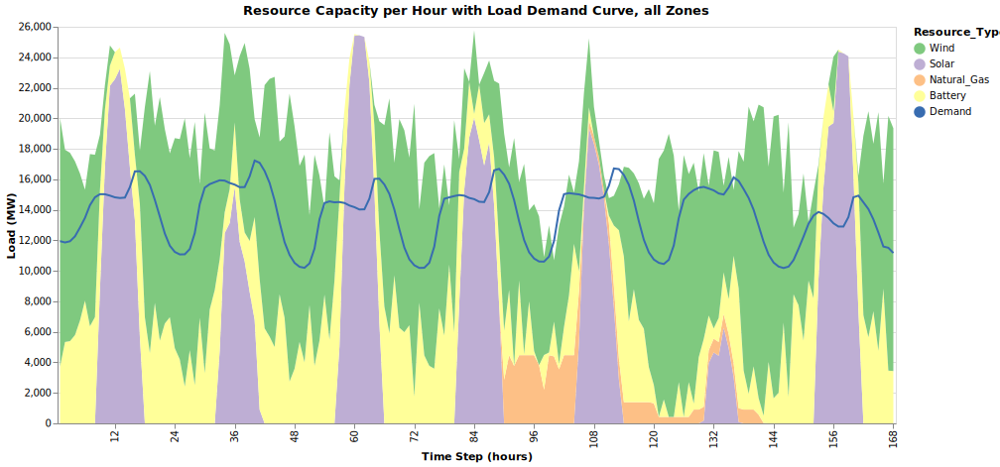
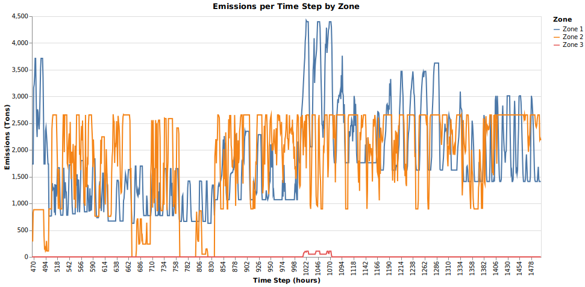

# Tutorial 8: Outputs

[Interactive Notebook of the tutorial](https://github.com/GenXProject/GenX-Tutorials/blob/main/Tutorials/Tutorial_8_Outputs.ipynb)

Once an instance of GenX is run, a series of csv files describing the outputs are created and put in to a folder titled `results`. This folder will appear automatically in the case folder. For a detailed description of all files, see the [GenX Outputs](@ref) documentation. This tutorial goes over key files in `results` and visualizes some of the outputs.

### Table of Contents
* [Power](#power)
* [Cost and Revenue](#cost)
* [Emmissions](#emms)

Let's get things started by running an instance of GenX using `Run.jl`. You can skip this step if you already have a results folder you would like to analyze. 


```julia
using DataFrames
using CSV
using YAML
using GraphRecipes
using Plots
using PlotlyJS
using VegaLite
using StatsPlots
```


```julia
case = joinpath("example_systems/1_three_zones");
```

```julia
include("example_systems/1_three_zones/Run.jl")
```

    Configuring Settings
    Clustering Time Series Data (Grouped)...
    Reading Input CSV Files
    Network.csv Successfully Read!
    Demand (load) data Successfully Read!
    Fuels_data.csv Successfully Read!

    Thermal.csv Successfully Read.
    Vre.csv Successfully Read.
    Storage.csv Successfully Read.
    Resource_energy_share_requirement.csv Successfully Read.
    Resource_capacity_reserve_margin.csv Successfully Read.
    Resource_minimum_capacity_requirement.csv Successfully Read.
    
    Summary of resources loaded into the model:
    -------------------------------------------------------
    	Resource type 		Number of resources
    =======================================================
    	Thermal        		3
    	VRE            		4
    	Storage        		3
    =======================================================
    Total number of resources: 10
    -------------------------------------------------------
    Generators_variability.csv Successfully Read!
    Validating time basis
    Minimum_capacity_requirement.csv Successfully Read!
    CO2_cap.csv Successfully Read!
    CSV Files Successfully Read In From /Users/mayamutic/Desktop/GenX-Tutorials/Tutorials/example_systems/1_three_zones
    Configuring Solver
    Loading Inputs
    Reading Input CSV Files
    Network.csv Successfully Read!
    Demand (load) data Successfully Read!
    Fuels_data.csv Successfully Read!
    
    Summary of resources loaded into the model:
    -------------------------------------------------------
    	Resource type 		Number of resources
    =======================================================
    	Thermal        		3
    	VRE            		4
    	Storage        		3
    =======================================================
    Total number of resources: 10
    -------------------------------------------------------
    Generators_variability.csv Successfully Read!
    Validating time basis
    Minimum_capacity_requirement.csv Successfully Read!
    CO2_cap.csv Successfully Read!
    CSV Files Successfully Read In From /Users/mayamutic/Desktop/GenX-Tutorials/Tutorials/example_systems/1_three_zones
    Generating the Optimization Model

    Thermal.csv Successfully Read.
    Vre.csv Successfully Read.
    Storage.csv Successfully Read.
    Resource_energy_share_requirement.csv Successfully Read.
    Resource_capacity_reserve_margin.csv Successfully Read.
    Resource_minimum_capacity_requirement.csv Successfully Read.

    Discharge Module
    Non-served Energy Module
    Investment Discharge Module
    Unit Commitment Module
    Fuel Module
    CO2 Module
    Investment Transmission Module
    Transmission Module
    Dispatchable Resources Module
    Storage Resources Module
    Storage Investment Module
    Storage Core Resources Module
    Storage Resources with Symmetric Charge/Discharge Capacity Module
    Thermal (Unit Commitment) Resources Module
    CO2 Policies Module
    Minimum Capacity Requirement Module
    Time elapsed for model building is
    5.887781667

    Solving Model
    Running HiGHS 1.6.0: Copyright (c) 2023 HiGHS under MIT licence terms
    Presolving model
    118038 rows, 81083 cols, 466827 nonzeros
    110619 rows, 73664 cols, 468369 nonzeros
    Presolve : Reductions: rows 110619(-42779); columns 73664(-46475); elements 468369(-47001)
    Solving the presolved LP
    IPX model has 110619 rows, 73664 columns and 468369 nonzeros
    Input
        Number of variables:                                73664
        Number of free variables:                           3696
        Number of constraints:                              110619
        Number of equality constraints:                     16605
        Number of matrix entries:                           468369
        Matrix range:                                       [4e-07, 1e+01]
        RHS range:                                          [8e-01, 4e+03]
        Objective range:                                    [1e-04, 7e+02]
        Bounds range:                                       [2e-03, 2e+01]
    Preprocessing
        Dualized model:                                     no
        Number of dense columns:                            15
        Range of scaling factors:                           [5.00e-01, 8.00e+00]
    IPX version 1.0
    Interior Point Solve
     Iter     P.res    D.res            P.obj           D.obj        mu     Time
       0   1.82e+02 5.20e+02   2.74110935e+06 -9.20003322e+06  9.39e+04       0s
       1   1.19e+02 1.85e+02  -5.15491323e+07 -1.56990646e+07  5.70e+04       0s
       2   1.16e+02 1.50e+02  -5.24235846e+07 -4.43639951e+07  6.32e+04       1s
       3   3.82e+01 7.90e+01  -3.78240082e+07 -4.91067811e+07  2.48e+04       1s
     Constructing starting basis...
       4   1.50e+01 4.69e+01  -1.55669921e+07 -5.24473820e+07  1.26e+04       4s
       5   1.08e+01 3.68e+01  -1.04270740e+07 -5.34777833e+07  1.03e+04       5s
       6   2.02e+00 1.32e+01   1.78253836e+06 -4.42778415e+07  3.28e+03       6s
       7   2.13e-01 1.56e+00   2.27050184e+06 -1.69980996e+07  4.42e+02       8s
       8   1.99e-02 3.66e-01   1.38286053e+06 -4.54007601e+06  1.02e+02       9s
       9   7.25e-03 1.59e-01   1.04876462e+06 -2.67941780e+06  5.28e+01      10s
      10   5.00e-03 1.18e-01   9.54695852e+05 -2.19740360e+06  4.20e+01      11s
      11   2.55e-03 8.92e-02   9.62825668e+05 -2.02235540e+06  3.86e+01      12s
      12   1.23e-03 5.57e-02   9.06154486e+05 -1.61397732e+06  2.88e+01      13s
      13   8.25e-04 4.55e-02   8.50982220e+05 -1.42601127e+06  2.47e+01      14s
      14   4.67e-04 2.99e-02   7.87488727e+05 -1.12886839e+06  1.86e+01      15s
      15   2.66e-04 2.09e-02   7.13648088e+05 -9.18336741e+05  1.44e+01      16s
      16   1.08e-04 1.25e-02   5.49221416e+05 -6.47879126e+05  9.37e+00      17s
      17   2.48e-05 7.94e-03   3.46061560e+05 -4.61304054e+05  5.71e+00      19s
      18   1.01e-05 3.42e-03   1.83821789e+05 -2.00914905e+05  2.43e+00      20s
      19   4.07e-06 3.05e-03   8.92521427e+04 -1.79940971e+05  1.62e+00      21s
      20   2.32e-06 6.40e-04   7.78040127e+04 -5.60566929e+04  7.50e-01      22s
      21   8.58e-07 2.28e-04   4.31894440e+04 -2.23356614e+04  3.58e-01      23s
      22   6.57e-07 1.54e-04   4.00530649e+04 -1.69523138e+04  3.10e-01      24s
      23   3.28e-07 9.35e-05   2.85728271e+04 -9.35216394e+03  2.05e-01      25s
      24   3.19e-07 8.61e-05   2.84621914e+04 -8.84896370e+03  2.02e-01      27s
      25   1.88e-07 7.27e-05   2.38512793e+04 -7.05855824e+03  1.67e-01      28s
      26   1.25e-07 4.25e-05   2.06483772e+04 -2.29444044e+03  1.24e-01      29s
      27   8.52e-08 2.94e-05   1.93840344e+04 -7.43312356e+02  1.08e-01      30s
      28   4.26e-08 1.57e-05   1.55476712e+04  2.51649304e+03  7.01e-02      32s
      29   3.28e-08 1.03e-05   1.48244443e+04  3.71569832e+03  5.97e-02      34s
      30   1.97e-08 5.79e-06   1.34432901e+04  5.04894425e+03  4.51e-02      36s
      31   1.60e-08 4.11e-06   1.29661877e+04  5.70523948e+03  3.90e-02      40s
      32   1.29e-08 2.50e-06   1.25046561e+04  6.46897465e+03  3.24e-02      43s
      33   1.10e-08 1.77e-06   1.21681482e+04  6.95806253e+03  2.80e-02      45s
      34   9.03e-09 1.20e-06   1.17942632e+04  7.37735035e+03  2.37e-02      47s
      35   8.36e-09 8.75e-07   1.16689507e+04  7.61101800e+03  2.18e-02      50s
      36   5.05e-09 7.46e-07   1.09362653e+04  7.76380519e+03  1.70e-02      51s
      37   2.31e-09 4.73e-07   1.04305053e+04  8.02182477e+03  1.29e-02      53s
      38   1.54e-09 3.37e-07   1.01805357e+04  8.29224222e+03  1.01e-02      54s
      39   1.40e-09 2.47e-07   1.01569154e+04  8.40516136e+03  9.41e-03      57s
      40   1.32e-09 2.29e-07   1.01417025e+04  8.43289860e+03  9.18e-03      61s
      41   1.30e-09 1.85e-07   1.01370889e+04  8.50324712e+03  8.78e-03      62s
      42   1.09e-09 1.37e-07   1.00815866e+04  8.60006398e+03  7.96e-03      63s
      43   8.94e-10 1.09e-07   1.00184156e+04  8.66341527e+03  7.28e-03      65s
      44   7.15e-10 7.94e-08   9.96247094e+03  8.73797483e+03  6.58e-03      66s
      45   3.38e-10 5.48e-08   9.81246478e+03  8.82514229e+03  5.30e-03      67s
      46   1.96e-10 3.88e-08   9.73048449e+03  8.91021222e+03  4.41e-03      68s
      47   1.58e-10 3.09e-08   9.70120639e+03  8.96100550e+03  3.98e-03      69s
      48   8.73e-11 1.87e-08   9.63351889e+03  9.05587884e+03  3.10e-03      70s
      49   4.53e-11 8.50e-09   9.58546144e+03  9.14690441e+03  2.36e-03      72s
      50   3.66e-11 4.10e-09   9.56746403e+03  9.21860822e+03  1.87e-03      73s
      51   2.08e-11 3.03e-09   9.52048699e+03  9.24367874e+03  1.49e-03      76s
      52   1.09e-11 2.43e-09   9.49319901e+03  9.26588343e+03  1.22e-03      77s
      53   5.73e-12 1.94e-09   9.47529880e+03  9.28196289e+03  1.04e-03      78s
      54   5.27e-12 1.59e-09   9.46285225e+03  9.29875030e+03  8.82e-04      79s
      55   3.67e-12 1.52e-09   9.45597250e+03  9.30095244e+03  8.33e-04      80s
      56   1.75e-12 1.22e-09   9.45179686e+03  9.31195889e+03  7.51e-04      81s
      57   3.04e-11 1.00e-09   9.44732720e+03  9.32669073e+03  6.48e-04      82s
      58   2.55e-11 5.84e-10   9.43948980e+03  9.34808459e+03  4.91e-04      83s
      59   2.06e-11 3.64e-10   9.43331328e+03  9.36391778e+03  3.73e-04      84s
      60   5.92e-12 2.32e-10   9.43127125e+03  9.37217204e+03  3.17e-04      85s
      61   5.80e-12 7.80e-11   9.42595625e+03  9.38759526e+03  2.06e-04      85s
      62   2.43e-11 4.87e-11   9.42485062e+03  9.39270257e+03  1.73e-04      86s
      63   6.10e-12 2.84e-11   9.42230551e+03  9.39721826e+03  1.35e-04      87s
      64   3.02e-11 2.06e-11   9.41851226e+03  9.39922232e+03  1.04e-04      88s
      65   7.68e-12 1.31e-11   9.41545711e+03  9.40267444e+03  6.87e-05      89s
      66   3.56e-11 5.95e-12   9.41476857e+03  9.40633324e+03  4.53e-05      89s
      67   2.52e-11 5.71e-12   9.41439309e+03  9.40677438e+03  4.09e-05      90s
      68   6.47e-11 4.77e-12   9.41368241e+03  9.40741592e+03  3.37e-05      91s
      69   1.02e-11 3.50e-12   9.41352178e+03  9.40807301e+03  2.93e-05      91s
      70   1.81e-11 2.61e-12   9.41317436e+03  9.40888102e+03  2.31e-05      92s
      71   4.19e-11 9.41e-13   9.41301486e+03  9.41024157e+03  1.49e-05      92s
      72   2.36e-10 7.39e-13   9.41247409e+03  9.41108729e+03  7.45e-06      93s
      73   3.36e-10 5.12e-13   9.41246723e+03  9.41147776e+03  5.32e-06      94s
      74   1.71e-10 1.99e-13   9.41229429e+03  9.41188577e+03  2.19e-06      94s
      75   3.35e-10 4.01e-13   9.41222697e+03  9.41203307e+03  1.04e-06      95s
      76   1.60e-10 6.82e-13   9.41217628e+03  9.41205260e+03  6.64e-07      96s
      77   5.99e-10 1.42e-12   9.41215300e+03  9.41209472e+03  3.13e-07      96s
      78   6.44e-11 7.21e-13   9.41214245e+03  9.41212653e+03  8.55e-08      97s
      79   6.69e-11 6.79e-13   9.41213955e+03  9.41213348e+03  3.26e-08      98s
      80   4.03e-10 1.36e-12   9.41213754e+03  9.41213419e+03  1.80e-08      98s
      81   3.37e-10 2.61e-12   9.41213656e+03  9.41213608e+03  2.60e-09      99s
      82*  2.65e-10 6.98e-12   9.41213642e+03  9.41213636e+03  3.52e-10      99s
      83*  2.52e-10 6.65e-12   9.41213641e+03  9.41213640e+03  6.97e-11     101s
      84*  2.01e-10 4.96e-12   9.41213641e+03  9.41213641e+03  1.32e-11     104s
      85*  1.31e-10 6.08e-12   9.41213641e+03  9.41213641e+03  1.20e-12     104s
    Running crossover as requested
        Primal residual before push phase:                  3.02e-07
        Dual residual before push phase:                    4.01e-07
        Number of dual pushes required:                     24726
        Number of primal pushes required:                   3458
    Summary
        Runtime:                                            107.62s
        Status interior point solve:                        optimal
        Status crossover:                                   optimal
        objective value:                                    9.41213641e+03
        interior solution primal residual (abs/rel):        3.75e-09 / 9.14e-13
        interior solution dual residual (abs/rel):          2.40e-09 / 3.42e-12
        interior solution objective gap (abs/rel):          1.95e-07 / 2.08e-11
        basic solution primal infeasibility:                5.02e-14
        basic solution dual infeasibility:                  1.09e-15
    Ipx: IPM       optimal
    Ipx: Crossover optimal
    Solving the original LP from the solution after postsolve
    Model   status      : Optimal
    IPM       iterations: 85
    Crossover iterations: 2764
    Objective value     :  9.4121364078e+03
    HiGHS run time      :        107.89
    LP solved for primal

    Writing Output
    Time elapsed for writing costs is
    0.8427745
    Time elapsed for writing capacity is
    0.277263333
    Time elapsed for writing power is
    0.6167225
    Time elapsed for writing charge is
    0.18541725
    Time elapsed for writing capacity factor is
    0.235379791
    Time elapsed for writing storage is
    0.132649083
    Time elapsed for writing curtailment is
    0.155876791
    Time elapsed for writing nse is
    0.438298833
    Time elapsed for writing power balance is
    0.297414291
    Time elapsed for writing transmission flows is
    0.103818667
    Time elapsed for writing transmission losses is
    0.097776166
    Time elapsed for writing network expansion is
    0.080605
    Time elapsed for writing emissions is
    0.280204166
    Time elapsed for writing reliability is
    0.093714833
    Time elapsed for writing storage duals is
    0.391718917
    Time elapsed for writing commitment is
    0.085516291
    Time elapsed for writing startup is
    0.045873
    Time elapsed for writing shutdown is
    0.027687542
    Time elapsed for writing fuel consumption is
    0.31172675
    Time elapsed for writing co2 is
    0.053309291
    Time elapsed for writing price is
    0.056254791
    Time elapsed for writing energy revenue is
    0.21793425
    Time elapsed for writing charging cost is
    0.155090166
    Time elapsed for writing subsidy is
    0.244266583
    Time elapsed for writing time weights is
    0.061457459
    Time elapsed for writing co2 cap is
    0.084762792
    Time elapsed for writing minimum capacity requirement is
    0.090502375
    Time elapsed for writing net revenue is
    0.8798285
    Wrote outputs to /Users/mayamutic/Desktop/GenX-Tutorials/Tutorials/example_systems/1_three_zones/results
    Time elapsed for writing is
    6.909353542

Below are all 33 files output by running GenX:

```julia
results = cd(readdir,joinpath(case,"results"))
```

    33-element Vector{String}:
     "CO2_prices_and_penalties.csv"
     "ChargingCost.csv"
     "EnergyRevenue.csv"
     "FuelConsumption_plant_MMBTU.csv"
     "FuelConsumption_total_MMBTU.csv"
     "Fuel_cost_plant.csv"
     "MinCapReq_prices_and_penalties.csv"
     "NetRevenue.csv"
     "RegSubsidyRevenue.csv"
     "SubsidyRevenue.csv"
     "capacity.csv"
     "capacityfactor.csv"
     "charge.csv"
     ⋮
     "power.csv"
     "power_balance.csv"
     "prices.csv"
     "reliability.csv"
     "run_settings.yml"
     "shutdown.csv"
     "start.csv"
     "status.csv"
     "storage.csv"
     "storagebal_duals.csv"
     "time_weights.csv"
     "tlosses.csv"

### Power 

The file `power.csv`, shown below, contains the power output in MW discharged by each node at each time step. Note that if `TimeDomainReduction` is enabled, the file will have fewer rows compared to the number of time steps in the `system/Demand_data.csv` file. In this case, the corresponding `Demand_data.csv` file that matches the time series in `power.csv` can be found in the `TDR_results` folder. The first row of `power.csv` indicates the zone each node belongs to, while the second row contains the total power per year. Each subsequent row represents one time step in the series.

```julia
power =  CSV.read(joinpath(case,"results/power.csv"),DataFrame,missingstring="NA")
```

```@raw html
<div><div style = "float: left;"><span>1850×12 DataFrame</span></div><div style = "float: right;"><span style = "font-style: italic;">1825 rows omitted</span></div><div style = "clear: both;"></div></div><div class = "data-frame" style = "overflow-x: scroll;"><table class = "data-frame" style = "margin-bottom: 6px;"><thead><tr class = "header"><th class = "rowNumber" style = "font-weight: bold; text-align: right;">Row</th><th style = "text-align: left;">Resource</th><th style = "text-align: left;">MA_natural_gas_combined_cycle</th><th style = "text-align: left;">CT_natural_gas_combined_cycle</th><th style = "text-align: left;">ME_natural_gas_combined_cycle</th><th style = "text-align: left;">MA_solar_pv</th><th style = "text-align: left;">CT_onshore_wind</th><th style = "text-align: left;">CT_solar_pv</th><th style = "text-align: left;">ME_onshore_wind</th><th style = "text-align: left;">MA_battery</th><th style = "text-align: left;">CT_battery</th><th style = "text-align: left;">ME_battery</th><th style = "text-align: left;">Total</th></tr><tr class = "subheader headerLastRow"><th class = "rowNumber" style = "font-weight: bold; text-align: right;"></th><th title = "String15" style = "text-align: left;">String15</th><th title = "Float64" style = "text-align: left;">Float64</th><th title = "Float64" style = "text-align: left;">Float64</th><th title = "Float64" style = "text-align: left;">Float64</th><th title = "Float64" style = "text-align: left;">Float64</th><th title = "Float64" style = "text-align: left;">Float64</th><th title = "Float64" style = "text-align: left;">Float64</th><th title = "Float64" style = "text-align: left;">Float64</th><th title = "Float64" style = "text-align: left;">Float64</th><th title = "Float64" style = "text-align: left;">Float64</th><th title = "Float64" style = "text-align: left;">Float64</th><th title = "Float64" style = "text-align: left;">Float64</th></tr></thead><tbody><tr><td class = "rowNumber" style = "font-weight: bold; text-align: right;">1</td><td style = "text-align: left;">Zone</td><td style = "text-align: right;">1.0</td><td style = "text-align: right;">2.0</td><td style = "text-align: right;">3.0</td><td style = "text-align: right;">1.0</td><td style = "text-align: right;">2.0</td><td style = "text-align: right;">2.0</td><td style = "text-align: right;">3.0</td><td style = "text-align: right;">1.0</td><td style = "text-align: right;">2.0</td><td style = "text-align: right;">3.0</td><td style = "text-align: right;">0.0</td></tr><tr><td class = "rowNumber" style = "font-weight: bold; text-align: right;">2</td><td style = "text-align: left;">AnnualSum</td><td style = "text-align: right;">1.04015e7</td><td style = "text-align: right;">3.42459e6</td><td style = "text-align: right;">8.94975e5</td><td style = "text-align: right;">2.47213e7</td><td style = "text-align: right;">2.90683e7</td><td style = "text-align: right;">2.69884e7</td><td style = "text-align: right;">2.625e7</td><td style = "text-align: right;">5.06354e6</td><td style = "text-align: right;">1.45833e7</td><td style = "text-align: right;">4.90368e6</td><td style = "text-align: right;">1.463e8</td></tr><tr><td class = "rowNumber" style = "font-weight: bold; text-align: right;">3</td><td style = "text-align: left;">t1</td><td style = "text-align: right;">-0.0</td><td style = "text-align: right;">-0.0</td><td style = "text-align: right;">-0.0</td><td style = "text-align: right;">-0.0</td><td style = "text-align: right;">8510.78</td><td style = "text-align: right;">-0.0</td><td style = "text-align: right;">5300.61</td><td style = "text-align: right;">0.0</td><td style = "text-align: right;">2537.45</td><td style = "text-align: right;">673.34</td><td style = "text-align: right;">17022.2</td></tr><tr><td class = "rowNumber" style = "font-weight: bold; text-align: right;">4</td><td style = "text-align: left;">t2</td><td style = "text-align: right;">-0.0</td><td style = "text-align: right;">-0.0</td><td style = "text-align: right;">-0.0</td><td style = "text-align: right;">-0.0</td><td style = "text-align: right;">8420.78</td><td style = "text-align: right;">-0.0</td><td style = "text-align: right;">6282.04</td><td style = "text-align: right;">0.0</td><td style = "text-align: right;">2537.45</td><td style = "text-align: right;">0.0</td><td style = "text-align: right;">17240.3</td></tr><tr><td class = "rowNumber" style = "font-weight: bold; text-align: right;">5</td><td style = "text-align: left;">t3</td><td style = "text-align: right;">-0.0</td><td style = "text-align: right;">-0.0</td><td style = "text-align: right;">-0.0</td><td style = "text-align: right;">-0.0</td><td style = "text-align: right;">8367.78</td><td style = "text-align: right;">-0.0</td><td style = "text-align: right;">2409.84</td><td style = "text-align: right;">0.0</td><td style = "text-align: right;">2537.45</td><td style = "text-align: right;">1828.24</td><td style = "text-align: right;">15143.3</td></tr><tr><td class = "rowNumber" style = "font-weight: bold; text-align: right;">6</td><td style = "text-align: left;">t4</td><td style = "text-align: right;">-0.0</td><td style = "text-align: right;">-0.0</td><td style = "text-align: right;">-0.0</td><td style = "text-align: right;">-0.0</td><td style = "text-align: right;">8353.78</td><td style = "text-align: right;">-0.0</td><td style = "text-align: right;">2762.24</td><td style = "text-align: right;">1591.46</td><td style = "text-align: right;">2537.45</td><td style = "text-align: right;">0.0</td><td style = "text-align: right;">15244.9</td></tr><tr><td class = "rowNumber" style = "font-weight: bold; text-align: right;">7</td><td style = "text-align: left;">t5</td><td style = "text-align: right;">-0.0</td><td style = "text-align: right;">-0.0</td><td style = "text-align: right;">-0.0</td><td style = "text-align: right;">-0.0</td><td style = "text-align: right;">7482.39</td><td style = "text-align: right;">-0.0</td><td style = "text-align: right;">0.0</td><td style = "text-align: right;">1617.46</td><td style = "text-align: right;">2980.64</td><td style = "text-align: right;">1384.62</td><td style = "text-align: right;">13465.1</td></tr><tr><td class = "rowNumber" style = "font-weight: bold; text-align: right;">8</td><td style = "text-align: left;">t6</td><td style = "text-align: right;">-0.0</td><td style = "text-align: right;">-0.0</td><td style = "text-align: right;">-0.0</td><td style = "text-align: right;">-0.0</td><td style = "text-align: right;">2429.93</td><td style = "text-align: right;">-0.0</td><td style = "text-align: right;">2797.24</td><td style = "text-align: right;">1717.96</td><td style = "text-align: right;">5535.37</td><td style = "text-align: right;">0.0</td><td style = "text-align: right;">12480.5</td></tr><tr><td class = "rowNumber" style = "font-weight: bold; text-align: right;">9</td><td style = "text-align: left;">t7</td><td style = "text-align: right;">-0.0</td><td style = "text-align: right;">-0.0</td><td style = "text-align: right;">-0.0</td><td style = "text-align: right;">-0.0</td><td style = "text-align: right;">11868.8</td><td style = "text-align: right;">-0.0</td><td style = "text-align: right;">1374.73</td><td style = "text-align: right;">1320.78</td><td style = "text-align: right;">871.443</td><td style = "text-align: right;">1340.67</td><td style = "text-align: right;">16776.4</td></tr><tr><td class = "rowNumber" style = "font-weight: bold; text-align: right;">10</td><td style = "text-align: left;">t8</td><td style = "text-align: right;">-0.0</td><td style = "text-align: right;">-0.0</td><td style = "text-align: right;">-0.0</td><td style = "text-align: right;">-0.0</td><td style = "text-align: right;">2656.93</td><td style = "text-align: right;">-0.0</td><td style = "text-align: right;">0.0</td><td style = "text-align: right;">2115.96</td><td style = "text-align: right;">5535.37</td><td style = "text-align: right;">1452.62</td><td style = "text-align: right;">11760.9</td></tr><tr><td class = "rowNumber" style = "font-weight: bold; text-align: right;">11</td><td style = "text-align: left;">t9</td><td style = "text-align: right;">-0.0</td><td style = "text-align: right;">-0.0</td><td style = "text-align: right;">-0.0</td><td style = "text-align: right;">3061.28</td><td style = "text-align: right;">0.0</td><td style = "text-align: right;">3110.8</td><td style = "text-align: right;">2982.24</td><td style = "text-align: right;">868.817</td><td style = "text-align: right;">5389.44</td><td style = "text-align: right;">0.0</td><td style = "text-align: right;">15412.6</td></tr><tr><td class = "rowNumber" style = "font-weight: bold; text-align: right;">12</td><td style = "text-align: left;">t10</td><td style = "text-align: right;">-0.0</td><td style = "text-align: right;">-0.0</td><td style = "text-align: right;">-0.0</td><td style = "text-align: right;">6100.22</td><td style = "text-align: right;">7597.99</td><td style = "text-align: right;">5543.69</td><td style = "text-align: right;">0.0</td><td style = "text-align: right;">0.0</td><td style = "text-align: right;">0.0</td><td style = "text-align: right;">1521.12</td><td style = "text-align: right;">20763.0</td></tr><tr><td class = "rowNumber" style = "font-weight: bold; text-align: right;">13</td><td style = "text-align: left;">t11</td><td style = "text-align: right;">-0.0</td><td style = "text-align: right;">-0.0</td><td style = "text-align: right;">-0.0</td><td style = "text-align: right;">8314.29</td><td style = "text-align: right;">0.0</td><td style = "text-align: right;">6341.98</td><td style = "text-align: right;">3080.24</td><td style = "text-align: right;">0.0</td><td style = "text-align: right;">2458.82</td><td style = "text-align: right;">0.0</td><td style = "text-align: right;">20195.3</td></tr><tr><td style = "text-align: right;">&vellip;</td><td style = "text-align: right;">&vellip;</td><td style = "text-align: right;">&vellip;</td><td style = "text-align: right;">&vellip;</td><td style = "text-align: right;">&vellip;</td><td style = "text-align: right;">&vellip;</td><td style = "text-align: right;">&vellip;</td><td style = "text-align: right;">&vellip;</td><td style = "text-align: right;">&vellip;</td><td style = "text-align: right;">&vellip;</td><td style = "text-align: right;">&vellip;</td><td style = "text-align: right;">&vellip;</td><td style = "text-align: right;">&vellip;</td></tr><tr><td class = "rowNumber" style = "font-weight: bold; text-align: right;">1839</td><td style = "text-align: left;">t1837</td><td style = "text-align: right;">-0.0</td><td style = "text-align: right;">-0.0</td><td style = "text-align: right;">-0.0</td><td style = "text-align: right;">6712.18</td><td style = "text-align: right;">2541.6</td><td style = "text-align: right;">6736.37</td><td style = "text-align: right;">305.608</td><td style = "text-align: right;">1410.33</td><td style = "text-align: right;">763.726</td><td style = "text-align: right;">1427.82</td><td style = "text-align: right;">19897.6</td></tr><tr><td class = "rowNumber" style = "font-weight: bold; text-align: right;">1840</td><td style = "text-align: left;">t1838</td><td style = "text-align: right;">-0.0</td><td style = "text-align: right;">-0.0</td><td style = "text-align: right;">-0.0</td><td style = "text-align: right;">6514.15</td><td style = "text-align: right;">0.0</td><td style = "text-align: right;">6847.24</td><td style = "text-align: right;">3153.24</td><td style = "text-align: right;">0.0</td><td style = "text-align: right;">3464.22</td><td style = "text-align: right;">0.0</td><td style = "text-align: right;">19978.9</td></tr><tr><td class = "rowNumber" style = "font-weight: bold; text-align: right;">1841</td><td style = "text-align: left;">t1839</td><td style = "text-align: right;">-0.0</td><td style = "text-align: right;">-0.0</td><td style = "text-align: right;">-0.0</td><td style = "text-align: right;">5582.07</td><td style = "text-align: right;">3848.88</td><td style = "text-align: right;">6280.2</td><td style = "text-align: right;">0.0</td><td style = "text-align: right;">195.422</td><td style = "text-align: right;">2048.3</td><td style = "text-align: right;">1571.12</td><td style = "text-align: right;">19526.0</td></tr><tr><td class = "rowNumber" style = "font-weight: bold; text-align: right;">1842</td><td style = "text-align: left;">t1840</td><td style = "text-align: right;">-0.0</td><td style = "text-align: right;">-0.0</td><td style = "text-align: right;">-0.0</td><td style = "text-align: right;">3688.13</td><td style = "text-align: right;">9349.98</td><td style = "text-align: right;">4892.7</td><td style = "text-align: right;">3490.61</td><td style = "text-align: right;">1006.02</td><td style = "text-align: right;">0.0</td><td style = "text-align: right;">0.0</td><td style = "text-align: right;">22427.4</td></tr><tr><td class = "rowNumber" style = "font-weight: bold; text-align: right;">1843</td><td style = "text-align: left;">t1841</td><td style = "text-align: right;">-0.0</td><td style = "text-align: right;">-0.0</td><td style = "text-align: right;">-0.0</td><td style = "text-align: right;">509.22</td><td style = "text-align: right;">8124.99</td><td style = "text-align: right;">1351.08</td><td style = "text-align: right;">3653.06</td><td style = "text-align: right;">1218.5</td><td style = "text-align: right;">2507.8</td><td style = "text-align: right;">1828.24</td><td style = "text-align: right;">19192.9</td></tr><tr><td class = "rowNumber" style = "font-weight: bold; text-align: right;">1844</td><td style = "text-align: left;">t1842</td><td style = "text-align: right;">-0.0</td><td style = "text-align: right;">-0.0</td><td style = "text-align: right;">-0.0</td><td style = "text-align: right;">-0.0</td><td style = "text-align: right;">2918.2</td><td style = "text-align: right;">-0.0</td><td style = "text-align: right;">6896.82</td><td style = "text-align: right;">2194.61</td><td style = "text-align: right;">5535.37</td><td style = "text-align: right;">256.863</td><td style = "text-align: right;">17801.9</td></tr><tr><td class = "rowNumber" style = "font-weight: bold; text-align: right;">1845</td><td style = "text-align: left;">t1843</td><td style = "text-align: right;">-0.0</td><td style = "text-align: right;">-0.0</td><td style = "text-align: right;">-0.0</td><td style = "text-align: right;">-0.0</td><td style = "text-align: right;">6800.37</td><td style = "text-align: right;">-0.0</td><td style = "text-align: right;">7324.66</td><td style = "text-align: right;">1838.11</td><td style = "text-align: right;">3950.15</td><td style = "text-align: right;">41.9472</td><td style = "text-align: right;">19955.2</td></tr><tr><td class = "rowNumber" style = "font-weight: bold; text-align: right;">1846</td><td style = "text-align: left;">t1844</td><td style = "text-align: right;">-0.0</td><td style = "text-align: right;">-0.0</td><td style = "text-align: right;">-0.0</td><td style = "text-align: right;">-0.0</td><td style = "text-align: right;">9505.82</td><td style = "text-align: right;">-0.0</td><td style = "text-align: right;">5683.66</td><td style = "text-align: right;">1744.78</td><td style = "text-align: right;">2567.93</td><td style = "text-align: right;">838.077</td><td style = "text-align: right;">20340.3</td></tr><tr><td class = "rowNumber" style = "font-weight: bold; text-align: right;">1847</td><td style = "text-align: left;">t1845</td><td style = "text-align: right;">-0.0</td><td style = "text-align: right;">-0.0</td><td style = "text-align: right;">-0.0</td><td style = "text-align: right;">-0.0</td><td style = "text-align: right;">3491.93</td><td style = "text-align: right;">-0.0</td><td style = "text-align: right;">5128.56</td><td style = "text-align: right;">1597.61</td><td style = "text-align: right;">5535.37</td><td style = "text-align: right;">1107.49</td><td style = "text-align: right;">16861.0</td></tr><tr><td class = "rowNumber" style = "font-weight: bold; text-align: right;">1848</td><td style = "text-align: left;">t1846</td><td style = "text-align: right;">-0.0</td><td style = "text-align: right;">-0.0</td><td style = "text-align: right;">-0.0</td><td style = "text-align: right;">-0.0</td><td style = "text-align: right;">12135.6</td><td style = "text-align: right;">-0.0</td><td style = "text-align: right;">5021.75</td><td style = "text-align: right;">1341.11</td><td style = "text-align: right;">1140.56</td><td style = "text-align: right;">1125.9</td><td style = "text-align: right;">20764.9</td></tr><tr><td class = "rowNumber" style = "font-weight: bold; text-align: right;">1849</td><td style = "text-align: left;">t1847</td><td style = "text-align: right;">-0.0</td><td style = "text-align: right;">-0.0</td><td style = "text-align: right;">-0.0</td><td style = "text-align: right;">-0.0</td><td style = "text-align: right;">8875.71</td><td style = "text-align: right;">-0.0</td><td style = "text-align: right;">3605.98</td><td style = "text-align: right;">974.61</td><td style = "text-align: right;">2665.48</td><td style = "text-align: right;">1783.79</td><td style = "text-align: right;">17905.6</td></tr><tr><td class = "rowNumber" style = "font-weight: bold; text-align: right;">1850</td><td style = "text-align: left;">t1848</td><td style = "text-align: right;">-0.0</td><td style = "text-align: right;">-0.0</td><td style = "text-align: right;">-0.0</td><td style = "text-align: right;">-0.0</td><td style = "text-align: right;">13549.1</td><td style = "text-align: right;">-0.0</td><td style = "text-align: right;">4098.0</td><td style = "text-align: right;">541.61</td><td style = "text-align: right;">205.31</td><td style = "text-align: right;">1478.27</td><td style = "text-align: right;">19872.3</td></tr></tbody></table></div>
```


Below is a visualization of the production over the first 168 hours, with the load demand curve from all three zones plotted on top:


```julia
# Pre-processing
tstart = 3
tend = 170
names_power = ["Solar","Natural_Gas","Battery","Wind"]

power_tot = DataFrame([power[!,5]+power[!,7] power[!,2]+power[!,3]+power[!,4] power[!,9]+power[!,10]+power[!,11] power[!,6]+power[!,8]],
    ["Solar","Natural_Gas","Battery","Wind"])

power_plot = DataFrame([collect(1:length(power_tot[tstart:tend,1])) power_tot[tstart:tend,1] repeat([names_power[1]],length(power_tot[tstart:tend,1]))],
    ["Hour","MW", "Resource_Type"]);

for i in range(2,4)
    power_plot_temp = DataFrame([collect(1:length(power_tot[tstart:tend,i])) power_tot[tstart:tend,i] repeat([names_power[i]],length(power_tot[tstart:tend,i]))],["Hour","MW", "Resource_Type"])
    power_plot = [power_plot; power_plot_temp]
end

demands =  CSV.read(joinpath(case,"TDR_results/Demand_data.csv"),DataFrame,missingstring="NA")
demands_tot = demands[!,"Demand_MW_z1"]+demands[!,"Demand_MW_z2"]+demands[!,"Demand_MW_z3"]
power_plot[!,"Demand_Total"] = repeat(demands_tot[tstart:tend],4);
```

Note that since the `power.csv` file is generated by running GenX with `TimeDomainReduction: 1`, the demands time series must be taken from the `Demand_data.csv` file located in the `TDR_results` folder.

GenX also has the ability to output the reconstructed version of power generation by setting `OutputFullTimeSeries: 1` in `genx_settings.yml`. In this case, a second version of the `power.csv` file will be created inside the `results/Full_TimeSeries` folder. To plot the reconstructed version against the demand, ensure you use the `Demand_data.csv` from the `settings` folder, not the one in the `TDR_results` folder.

Finally, if `TimeDomainReduction: 0` is set, the `power.csv` file will contain the full time series of power generation, and the `Demand_data.csv` should be taken from the `settings` folder.

```julia
power_plot  |>
@vlplot()+
@vlplot(mark={:area},
    x={:Hour,title="Time Step (hours)",labels="Resource_Type:n",axis={values=0:12:168}}, y={:MW,title="Demand (MW)",type="quantitative"},
    color={"Resource_Type:n",scale={scheme="accent"},sort="descending"},order={field="Resource_Type:n"},width=845,height=400)+
@vlplot(mark=:line,x=:Hour,y=:Demand_Total,lables="Demand",color={datum="Demand",legend={title=nothing}},title="Resource Capacity per Hour with Demand Curve, all Zones")
```
    


We can separate it by zone in the following plot:

```julia
Zone1 = [power[2,2] power[2,5] 0 power[2,9]]
Zone2 = [power[2,3] power[2,7] power[2,6] power[2,10]]
Zone3 = [power[2,4] 0 power[2,8] power[2,11]]

colors=[:silver :yellow :deepskyblue :violetred3]

groupedbar(["Zone 1", "Zone 2", "Zone 3"],[Zone1; Zone2; Zone3], bar_position = :stack, bar_width=0.5,size=(400,450),
    labels=["Natural Gas" "Solar" "Wind" "Battery"],
    title="Resource Allocation in MW Per Zone",ylabel="MW",color=colors, titlefontsize=10)
```


Below is a heatmap for the natural gas plant in Massachusetts. It is normalized by the end capacity in `capcity.csv`. To change which plant the heat map plots, change the DataFrame column in `power` when defining `power_cap` below, and the corresponding capacity.


```julia
capacity = CSV.read(joinpath(case,"results/capacity.csv"),DataFrame,missingstring="NA")
Period_map = CSV.read(joinpath(case,"TDR_results/Period_map.csv"),DataFrame,missingstring="NA")

# Take the EndCap and power of MA_natural_gas_combined_cycle
cap = capacity[1,"EndCap"]
power_cap = power[3:end,"MA_natural_gas_combined_cycle"]/cap;

# Reconstruction of all hours of the year from TDR
recon = []
for i in range(1,52)
    index = Period_map[i,"Rep_Period_Index"]
    recon_temp = power_cap[(168*index-167):(168*index)]
    recon = [recon; recon_temp]
end

# Convert to matrix format 
heat = recon[1:24]
for i in range(1,364)
    heat = [heat recon[(i*24-23):(i*24)]]
end

```

```julia
Plots.heatmap(heat,yticks=0:4:24,xticks=([15:30:364;],
        ["Jan","Feb","Mar","Apr","May","Jun","Jul","Aug","Sept","Oct","Nov","Dec"]),
    size=(900,200),c=:lajolla)
```


### Cost and Revenue

The basic cost of each power plant and the revenue it generates can be found in files `costs.csv`, `NetRevenue.csv`,and `EnergyRevenue.csv`. `NetRevenue.csv` breaks down each specific cost per node in each zone, which is useful to visualize what the cost is coming from.


```julia
netrevenue =  CSV.read(joinpath(case,"results/NetRevenue.csv"),DataFrame,missingstring="NA")
```

``` @raw html
<div><div style = "float: left;"><span>10×28 DataFrame</span></div><div style = "clear: both;"></div></div><div class = "data-frame" style = "overflow-x: scroll;"><table class = "data-frame" style = "margin-bottom: 6px;"><thead><tr class = "header"><th class = "rowNumber" style = "font-weight: bold; text-align: right;">Row</th><th style = "text-align: left;">region</th><th style = "text-align: left;">Resource</th><th style = "text-align: left;">zone</th><th style = "text-align: left;">Cluster</th><th style = "text-align: left;">R_ID</th><th style = "text-align: left;">Inv_cost_MW</th><th style = "text-align: left;">Inv_cost_MWh</th><th style = "text-align: left;">Inv_cost_charge_MW</th><th style = "text-align: left;">Fixed_OM_cost_MW</th><th style = "text-align: left;">Fixed_OM_cost_MWh</th><th style = "text-align: left;">Fixed_OM_cost_charge_MW</th><th style = "text-align: left;">Var_OM_cost_out</th><th style = "text-align: left;">Fuel_cost</th><th style = "text-align: left;">Var_OM_cost_in</th><th style = "text-align: left;">StartCost</th><th style = "text-align: left;">Charge_cost</th><th style = "text-align: left;">CO2SequestrationCost</th><th style = "text-align: left;">EnergyRevenue</th><th style = "text-align: left;">SubsidyRevenue</th><th style = "text-align: left;">OperatingReserveRevenue</th><th style = "text-align: left;">OperatingRegulationRevenue</th><th style = "text-align: left;">ReserveMarginRevenue</th><th style = "text-align: left;">ESRRevenue</th><th style = "text-align: left;">EmissionsCost</th><th style = "text-align: left;">RegSubsidyRevenue</th><th style = "text-align: left;">Revenue</th><th style = "text-align: left;">Cost</th><th style = "text-align: left;">Profit</th></tr><tr class = "subheader headerLastRow"><th class = "rowNumber" style = "font-weight: bold; text-align: right;"></th><th title = "String3" style = "text-align: left;">String3</th><th title = "String31" style = "text-align: left;">String31</th><th title = "Int64" style = "text-align: left;">Int64</th><th title = "Int64" style = "text-align: left;">Int64</th><th title = "Int64" style = "text-align: left;">Int64</th><th title = "Float64" style = "text-align: left;">Float64</th><th title = "Float64" style = "text-align: left;">Float64</th><th title = "Float64" style = "text-align: left;">Float64</th><th title = "Float64" style = "text-align: left;">Float64</th><th title = "Float64" style = "text-align: left;">Float64</th><th title = "Float64" style = "text-align: left;">Float64</th><th title = "Float64" style = "text-align: left;">Float64</th><th title = "Float64" style = "text-align: left;">Float64</th><th title = "Float64" style = "text-align: left;">Float64</th><th title = "Float64" style = "text-align: left;">Float64</th><th title = "Float64" style = "text-align: left;">Float64</th><th title = "Float64" style = "text-align: left;">Float64</th><th title = "Float64" style = "text-align: left;">Float64</th><th title = "Float64" style = "text-align: left;">Float64</th><th title = "Float64" style = "text-align: left;">Float64</th><th title = "Float64" style = "text-align: left;">Float64</th><th title = "Float64" style = "text-align: left;">Float64</th><th title = "Float64" style = "text-align: left;">Float64</th><th title = "Float64" style = "text-align: left;">Float64</th><th title = "Float64" style = "text-align: left;">Float64</th><th title = "Float64" style = "text-align: left;">Float64</th><th title = "Float64" style = "text-align: left;">Float64</th><th title = "Float64" style = "text-align: left;">Float64</th></tr></thead><tbody><tr><td class = "rowNumber" style = "font-weight: bold; text-align: right;">1</td><td style = "text-align: left;">MA</td><td style = "text-align: left;">MA_natural_gas_combined_cycle</td><td style = "text-align: right;">1</td><td style = "text-align: right;">1</td><td style = "text-align: right;">1</td><td style = "text-align: right;">5.54734e8</td><td style = "text-align: right;">0.0</td><td style = "text-align: right;">0.0</td><td style = "text-align: right;">8.72561e7</td><td style = "text-align: right;">0.0</td><td style = "text-align: right;">0.0</td><td style = "text-align: right;">3.69253e7</td><td style = "text-align: right;">2.10416e8</td><td style = "text-align: right;">0.0</td><td style = "text-align: right;">3.84832e7</td><td style = "text-align: right;">0.0</td><td style = "text-align: right;">0.0</td><td style = "text-align: right;">2.77103e9</td><td style = "text-align: right;">0.0</td><td style = "text-align: right;">0.0</td><td style = "text-align: right;">0.0</td><td style = "text-align: right;">0.0</td><td style = "text-align: right;">0.0</td><td style = "text-align: right;">1.84321e9</td><td style = "text-align: right;">0.0</td><td style = "text-align: right;">2.77103e9</td><td style = "text-align: right;">2.77103e9</td><td style = "text-align: right;">1.43051e-6</td></tr><tr><td class = "rowNumber" style = "font-weight: bold; text-align: right;">2</td><td style = "text-align: left;">CT</td><td style = "text-align: left;">CT_natural_gas_combined_cycle</td><td style = "text-align: right;">2</td><td style = "text-align: right;">1</td><td style = "text-align: right;">2</td><td style = "text-align: right;">1.42906e8</td><td style = "text-align: right;">0.0</td><td style = "text-align: right;">0.0</td><td style = "text-align: right;">2.11911e7</td><td style = "text-align: right;">0.0</td><td style = "text-align: right;">0.0</td><td style = "text-align: right;">1.22258e7</td><td style = "text-align: right;">4.97792e7</td><td style = "text-align: right;">0.0</td><td style = "text-align: right;">7.75292e6</td><td style = "text-align: right;">0.0</td><td style = "text-align: right;">0.0</td><td style = "text-align: right;">8.4423e8</td><td style = "text-align: right;">0.0</td><td style = "text-align: right;">0.0</td><td style = "text-align: right;">0.0</td><td style = "text-align: right;">0.0</td><td style = "text-align: right;">0.0</td><td style = "text-align: right;">6.10375e8</td><td style = "text-align: right;">0.0</td><td style = "text-align: right;">8.4423e8</td><td style = "text-align: right;">8.4423e8</td><td style = "text-align: right;">1.19209e-7</td></tr><tr><td class = "rowNumber" style = "font-weight: bold; text-align: right;">3</td><td style = "text-align: left;">ME</td><td style = "text-align: left;">ME_natural_gas_combined_cycle</td><td style = "text-align: right;">3</td><td style = "text-align: right;">1</td><td style = "text-align: right;">3</td><td style = "text-align: right;">3.52336e7</td><td style = "text-align: right;">0.0</td><td style = "text-align: right;">0.0</td><td style = "text-align: right;">8.77661e6</td><td style = "text-align: right;">0.0</td><td style = "text-align: right;">0.0</td><td style = "text-align: right;">4.02739e6</td><td style = "text-align: right;">2.26505e7</td><td style = "text-align: right;">0.0</td><td style = "text-align: right;">3.33663e6</td><td style = "text-align: right;">0.0</td><td style = "text-align: right;">0.0</td><td style = "text-align: right;">2.19267e8</td><td style = "text-align: right;">0.0</td><td style = "text-align: right;">0.0</td><td style = "text-align: right;">0.0</td><td style = "text-align: right;">0.0</td><td style = "text-align: right;">0.0</td><td style = "text-align: right;">1.45243e8</td><td style = "text-align: right;">0.0</td><td style = "text-align: right;">2.19267e8</td><td style = "text-align: right;">2.19267e8</td><td style = "text-align: right;">0.0</td></tr><tr><td class = "rowNumber" style = "font-weight: bold; text-align: right;">4</td><td style = "text-align: left;">MA</td><td style = "text-align: left;">MA_solar_pv</td><td style = "text-align: right;">1</td><td style = "text-align: right;">1</td><td style = "text-align: right;">4</td><td style = "text-align: right;">1.27007e9</td><td style = "text-align: right;">0.0</td><td style = "text-align: right;">0.0</td><td style = "text-align: right;">2.79327e8</td><td style = "text-align: right;">0.0</td><td style = "text-align: right;">0.0</td><td style = "text-align: right;">0.0</td><td style = "text-align: right;">0.0</td><td style = "text-align: right;">0.0</td><td style = "text-align: right;">0.0</td><td style = "text-align: right;">0.0</td><td style = "text-align: right;">0.0</td><td style = "text-align: right;">1.5494e9</td><td style = "text-align: right;">0.0</td><td style = "text-align: right;">0.0</td><td style = "text-align: right;">0.0</td><td style = "text-align: right;">0.0</td><td style = "text-align: right;">0.0</td><td style = "text-align: right;">0.0</td><td style = "text-align: right;">0.0</td><td style = "text-align: right;">1.5494e9</td><td style = "text-align: right;">1.5494e9</td><td style = "text-align: right;">-2.86102e-6</td></tr><tr><td class = "rowNumber" style = "font-weight: bold; text-align: right;">5</td><td style = "text-align: left;">CT</td><td style = "text-align: left;">CT_onshore_wind</td><td style = "text-align: right;">2</td><td style = "text-align: right;">1</td><td style = "text-align: right;">5</td><td style = "text-align: right;">1.40748e9</td><td style = "text-align: right;">0.0</td><td style = "text-align: right;">0.0</td><td style = "text-align: right;">6.25617e8</td><td style = "text-align: right;">0.0</td><td style = "text-align: right;">0.0</td><td style = "text-align: right;">2.90683e6</td><td style = "text-align: right;">0.0</td><td style = "text-align: right;">0.0</td><td style = "text-align: right;">0.0</td><td style = "text-align: right;">0.0</td><td style = "text-align: right;">0.0</td><td style = "text-align: right;">2.036e9</td><td style = "text-align: right;">0.0</td><td style = "text-align: right;">0.0</td><td style = "text-align: right;">0.0</td><td style = "text-align: right;">0.0</td><td style = "text-align: right;">0.0</td><td style = "text-align: right;">0.0</td><td style = "text-align: right;">0.0</td><td style = "text-align: right;">2.036e9</td><td style = "text-align: right;">2.036e9</td><td style = "text-align: right;">-5.00679e-6</td></tr><tr><td class = "rowNumber" style = "font-weight: bold; text-align: right;">6</td><td style = "text-align: left;">CT</td><td style = "text-align: left;">CT_solar_pv</td><td style = "text-align: right;">2</td><td style = "text-align: right;">1</td><td style = "text-align: right;">6</td><td style = "text-align: right;">1.35108e9</td><td style = "text-align: right;">0.0</td><td style = "text-align: right;">0.0</td><td style = "text-align: right;">2.97142e8</td><td style = "text-align: right;">0.0</td><td style = "text-align: right;">0.0</td><td style = "text-align: right;">0.0</td><td style = "text-align: right;">0.0</td><td style = "text-align: right;">0.0</td><td style = "text-align: right;">0.0</td><td style = "text-align: right;">0.0</td><td style = "text-align: right;">0.0</td><td style = "text-align: right;">1.64822e9</td><td style = "text-align: right;">0.0</td><td style = "text-align: right;">0.0</td><td style = "text-align: right;">0.0</td><td style = "text-align: right;">0.0</td><td style = "text-align: right;">0.0</td><td style = "text-align: right;">0.0</td><td style = "text-align: right;">0.0</td><td style = "text-align: right;">1.64822e9</td><td style = "text-align: right;">1.64822e9</td><td style = "text-align: right;">9.53674e-7</td></tr><tr><td class = "rowNumber" style = "font-weight: bold; text-align: right;">7</td><td style = "text-align: left;">ME</td><td style = "text-align: left;">ME_onshore_wind</td><td style = "text-align: right;">3</td><td style = "text-align: right;">1</td><td style = "text-align: right;">7</td><td style = "text-align: right;">1.03673e9</td><td style = "text-align: right;">0.0</td><td style = "text-align: right;">0.0</td><td style = "text-align: right;">4.60821e8</td><td style = "text-align: right;">0.0</td><td style = "text-align: right;">0.0</td><td style = "text-align: right;">2.625e6</td><td style = "text-align: right;">0.0</td><td style = "text-align: right;">0.0</td><td style = "text-align: right;">0.0</td><td style = "text-align: right;">0.0</td><td style = "text-align: right;">0.0</td><td style = "text-align: right;">1.50017e9</td><td style = "text-align: right;">0.0</td><td style = "text-align: right;">0.0</td><td style = "text-align: right;">0.0</td><td style = "text-align: right;">0.0</td><td style = "text-align: right;">0.0</td><td style = "text-align: right;">0.0</td><td style = "text-align: right;">0.0</td><td style = "text-align: right;">1.50017e9</td><td style = "text-align: right;">1.50017e9</td><td style = "text-align: right;">2.38419e-6</td></tr><tr><td class = "rowNumber" style = "font-weight: bold; text-align: right;">8</td><td style = "text-align: left;">MA</td><td style = "text-align: left;">MA_battery</td><td style = "text-align: right;">1</td><td style = "text-align: right;">0</td><td style = "text-align: right;">8</td><td style = "text-align: right;">4.29792e7</td><td style = "text-align: right;">2.23673e8</td><td style = "text-align: right;">0.0</td><td style = "text-align: right;">1.07426e7</td><td style = "text-align: right;">5.59033e7</td><td style = "text-align: right;">0.0</td><td style = "text-align: right;">7.59532e5</td><td style = "text-align: right;">0.0</td><td style = "text-align: right;">8.97367e5</td><td style = "text-align: right;">0.0</td><td style = "text-align: right;">1.3432e8</td><td style = "text-align: right;">0.0</td><td style = "text-align: right;">4.48833e8</td><td style = "text-align: right;">0.0</td><td style = "text-align: right;">0.0</td><td style = "text-align: right;">0.0</td><td style = "text-align: right;">0.0</td><td style = "text-align: right;">0.0</td><td style = "text-align: right;">0.0</td><td style = "text-align: right;">0.0</td><td style = "text-align: right;">4.48833e8</td><td style = "text-align: right;">4.69275e8</td><td style = "text-align: right;">-2.0442e7</td></tr><tr><td class = "rowNumber" style = "font-weight: bold; text-align: right;">9</td><td style = "text-align: left;">CT</td><td style = "text-align: left;">CT_battery</td><td style = "text-align: right;">2</td><td style = "text-align: right;">0</td><td style = "text-align: right;">9</td><td style = "text-align: right;">1.08405e8</td><td style = "text-align: right;">5.73615e8</td><td style = "text-align: right;">0.0</td><td style = "text-align: right;">2.70957e7</td><td style = "text-align: right;">1.43365e8</td><td style = "text-align: right;">0.0</td><td style = "text-align: right;">2.1875e6</td><td style = "text-align: right;">0.0</td><td style = "text-align: right;">2.58447e6</td><td style = "text-align: right;">0.0</td><td style = "text-align: right;">5.24177e8</td><td style = "text-align: right;">0.0</td><td style = "text-align: right;">1.31941e9</td><td style = "text-align: right;">0.0</td><td style = "text-align: right;">0.0</td><td style = "text-align: right;">0.0</td><td style = "text-align: right;">0.0</td><td style = "text-align: right;">0.0</td><td style = "text-align: right;">0.0</td><td style = "text-align: right;">0.0</td><td style = "text-align: right;">1.31941e9</td><td style = "text-align: right;">1.38143e9</td><td style = "text-align: right;">-6.20165e7</td></tr><tr><td class = "rowNumber" style = "font-weight: bold; text-align: right;">10</td><td style = "text-align: left;">ME</td><td style = "text-align: left;">ME_battery</td><td style = "text-align: right;">3</td><td style = "text-align: right;">0</td><td style = "text-align: right;">10</td><td style = "text-align: right;">3.58043e7</td><td style = "text-align: right;">1.03994e8</td><td style = "text-align: right;">0.0</td><td style = "text-align: right;">8.94925e6</td><td style = "text-align: right;">2.59915e7</td><td style = "text-align: right;">0.0</td><td style = "text-align: right;">7.35552e5</td><td style = "text-align: right;">0.0</td><td style = "text-align: right;">8.69036e5</td><td style = "text-align: right;">0.0</td><td style = "text-align: right;">3.81057e7</td><td style = "text-align: right;">0.0</td><td style = "text-align: right;">2.03732e8</td><td style = "text-align: right;">0.0</td><td style = "text-align: right;">0.0</td><td style = "text-align: right;">0.0</td><td style = "text-align: right;">0.0</td><td style = "text-align: right;">0.0</td><td style = "text-align: right;">0.0</td><td style = "text-align: right;">0.0</td><td style = "text-align: right;">2.03732e8</td><td style = "text-align: right;">2.14449e8</td><td style = "text-align: right;">-1.0717e7</td></tr></tbody></table></div>
```

```julia
xnames = netrevenue[!,2]
names1 =  ["Investment cost" "Fixed OM cost" "Variable OM cost" "Fuel cost" "Start Cost" "Battery charge cost" "CO2 Sequestration Cost" "Revenue"]

netrev = [netrevenue[!,6]+netrevenue[!,7]+netrevenue[!,8] netrevenue[!,9]+netrevenue[!,11]+netrevenue[!,11] netrevenue[!,12]+netrevenue[!,14] netrevenue[!,13] netrevenue[!,15] netrevenue[!,16] netrevenue[!,17]]

groupedbar(xnames,netrev, bar_position = :stack, bar_width=0.9,size=(850,800),
    labels=names1,title="Cost Allocation per Node with Revenue",xlabel="Node",ylabel="Cost (Dollars)", 
    titlefontsize=10,legend=:outerright,ylims=[0,maximum(netrevenue[!,"Revenue"])+1e8],xrotation = 90)
StatsPlots.scatter!(xnames,netrevenue[!,"Revenue"],label="Revenue",color="black")

```


### Emissions

The file `emmissions.csv` gives the total CO2 emmissions per zone for each hour GenX runs. The first three rows give the marginal CO2 abatement cost in $/ton CO2.


```julia
emm1 =  CSV.read(joinpath(case,"results/emissions.csv"),DataFrame)
```

``` @raw html
<div><div style = "float: left;"><span>1852×5 DataFrame</span></div><div style = "float: right;"><span style = "font-style: italic;">1827 rows omitted</span></div><div style = "clear: both;"></div></div><div class = "data-frame" style = "overflow-x: scroll;"><table class = "data-frame" style = "margin-bottom: 6px;"><thead><tr class = "header"><th class = "rowNumber" style = "font-weight: bold; text-align: right;">Row</th><th style = "text-align: left;">Zone</th><th style = "text-align: left;">1</th><th style = "text-align: left;">2</th><th style = "text-align: left;">3</th><th style = "text-align: left;">Total</th></tr><tr class = "subheader headerLastRow"><th class = "rowNumber" style = "font-weight: bold; text-align: right;"></th><th title = "String15" style = "text-align: left;">String15</th><th title = "Float64" style = "text-align: left;">Float64</th><th title = "Float64" style = "text-align: left;">Float64</th><th title = "Float64" style = "text-align: left;">Float64</th><th title = "Float64" style = "text-align: left;">Float64</th></tr></thead><tbody><tr><td class = "rowNumber" style = "font-weight: bold; text-align: right;">1</td><td style = "text-align: left;">CO2_Price_1</td><td style = "text-align: right;">444.921</td><td style = "text-align: right;">0.0</td><td style = "text-align: right;">0.0</td><td style = "text-align: right;">0.0</td></tr><tr><td class = "rowNumber" style = "font-weight: bold; text-align: right;">2</td><td style = "text-align: left;">CO2_Price_2</td><td style = "text-align: right;">0.0</td><td style = "text-align: right;">468.668</td><td style = "text-align: right;">0.0</td><td style = "text-align: right;">0.0</td></tr><tr><td class = "rowNumber" style = "font-weight: bold; text-align: right;">3</td><td style = "text-align: left;">CO2_Price_3</td><td style = "text-align: right;">0.0</td><td style = "text-align: right;">0.0</td><td style = "text-align: right;">240.86</td><td style = "text-align: right;">0.0</td></tr><tr><td class = "rowNumber" style = "font-weight: bold; text-align: right;">4</td><td style = "text-align: left;">AnnualSum</td><td style = "text-align: right;">4.14279e6</td><td style = "text-align: right;">1.30236e6</td><td style = "text-align: right;">6.03017e5</td><td style = "text-align: right;">6.04816e6</td></tr><tr><td class = "rowNumber" style = "font-weight: bold; text-align: right;">5</td><td style = "text-align: left;">t1</td><td style = "text-align: right;">0.0</td><td style = "text-align: right;">0.0</td><td style = "text-align: right;">0.0</td><td style = "text-align: right;">0.0</td></tr><tr><td class = "rowNumber" style = "font-weight: bold; text-align: right;">6</td><td style = "text-align: left;">t2</td><td style = "text-align: right;">0.0</td><td style = "text-align: right;">0.0</td><td style = "text-align: right;">0.0</td><td style = "text-align: right;">0.0</td></tr><tr><td class = "rowNumber" style = "font-weight: bold; text-align: right;">7</td><td style = "text-align: left;">t3</td><td style = "text-align: right;">0.0</td><td style = "text-align: right;">0.0</td><td style = "text-align: right;">0.0</td><td style = "text-align: right;">0.0</td></tr><tr><td class = "rowNumber" style = "font-weight: bold; text-align: right;">8</td><td style = "text-align: left;">t4</td><td style = "text-align: right;">0.0</td><td style = "text-align: right;">0.0</td><td style = "text-align: right;">0.0</td><td style = "text-align: right;">0.0</td></tr><tr><td class = "rowNumber" style = "font-weight: bold; text-align: right;">9</td><td style = "text-align: left;">t5</td><td style = "text-align: right;">0.0</td><td style = "text-align: right;">0.0</td><td style = "text-align: right;">0.0</td><td style = "text-align: right;">0.0</td></tr><tr><td class = "rowNumber" style = "font-weight: bold; text-align: right;">10</td><td style = "text-align: left;">t6</td><td style = "text-align: right;">0.0</td><td style = "text-align: right;">0.0</td><td style = "text-align: right;">0.0</td><td style = "text-align: right;">0.0</td></tr><tr><td class = "rowNumber" style = "font-weight: bold; text-align: right;">11</td><td style = "text-align: left;">t7</td><td style = "text-align: right;">0.0</td><td style = "text-align: right;">0.0</td><td style = "text-align: right;">0.0</td><td style = "text-align: right;">0.0</td></tr><tr><td class = "rowNumber" style = "font-weight: bold; text-align: right;">12</td><td style = "text-align: left;">t8</td><td style = "text-align: right;">0.0</td><td style = "text-align: right;">0.0</td><td style = "text-align: right;">0.0</td><td style = "text-align: right;">0.0</td></tr><tr><td class = "rowNumber" style = "font-weight: bold; text-align: right;">13</td><td style = "text-align: left;">t9</td><td style = "text-align: right;">0.0</td><td style = "text-align: right;">0.0</td><td style = "text-align: right;">0.0</td><td style = "text-align: right;">0.0</td></tr><tr><td style = "text-align: right;">&vellip;</td><td style = "text-align: right;">&vellip;</td><td style = "text-align: right;">&vellip;</td><td style = "text-align: right;">&vellip;</td><td style = "text-align: right;">&vellip;</td><td style = "text-align: right;">&vellip;</td></tr><tr><td class = "rowNumber" style = "font-weight: bold; text-align: right;">1841</td><td style = "text-align: left;">t1837</td><td style = "text-align: right;">0.0</td><td style = "text-align: right;">0.0</td><td style = "text-align: right;">0.0</td><td style = "text-align: right;">0.0</td></tr><tr><td class = "rowNumber" style = "font-weight: bold; text-align: right;">1842</td><td style = "text-align: left;">t1838</td><td style = "text-align: right;">0.0</td><td style = "text-align: right;">0.0</td><td style = "text-align: right;">0.0</td><td style = "text-align: right;">0.0</td></tr><tr><td class = "rowNumber" style = "font-weight: bold; text-align: right;">1843</td><td style = "text-align: left;">t1839</td><td style = "text-align: right;">0.0</td><td style = "text-align: right;">0.0</td><td style = "text-align: right;">0.0</td><td style = "text-align: right;">0.0</td></tr><tr><td class = "rowNumber" style = "font-weight: bold; text-align: right;">1844</td><td style = "text-align: left;">t1840</td><td style = "text-align: right;">0.0</td><td style = "text-align: right;">0.0</td><td style = "text-align: right;">0.0</td><td style = "text-align: right;">0.0</td></tr><tr><td class = "rowNumber" style = "font-weight: bold; text-align: right;">1845</td><td style = "text-align: left;">t1841</td><td style = "text-align: right;">0.0</td><td style = "text-align: right;">0.0</td><td style = "text-align: right;">0.0</td><td style = "text-align: right;">0.0</td></tr><tr><td class = "rowNumber" style = "font-weight: bold; text-align: right;">1846</td><td style = "text-align: left;">t1842</td><td style = "text-align: right;">0.0</td><td style = "text-align: right;">0.0</td><td style = "text-align: right;">0.0</td><td style = "text-align: right;">0.0</td></tr><tr><td class = "rowNumber" style = "font-weight: bold; text-align: right;">1847</td><td style = "text-align: left;">t1843</td><td style = "text-align: right;">0.0</td><td style = "text-align: right;">0.0</td><td style = "text-align: right;">0.0</td><td style = "text-align: right;">0.0</td></tr><tr><td class = "rowNumber" style = "font-weight: bold; text-align: right;">1848</td><td style = "text-align: left;">t1844</td><td style = "text-align: right;">0.0</td><td style = "text-align: right;">0.0</td><td style = "text-align: right;">0.0</td><td style = "text-align: right;">0.0</td></tr><tr><td class = "rowNumber" style = "font-weight: bold; text-align: right;">1849</td><td style = "text-align: left;">t1845</td><td style = "text-align: right;">0.0</td><td style = "text-align: right;">0.0</td><td style = "text-align: right;">0.0</td><td style = "text-align: right;">0.0</td></tr><tr><td class = "rowNumber" style = "font-weight: bold; text-align: right;">1850</td><td style = "text-align: left;">t1846</td><td style = "text-align: right;">0.0</td><td style = "text-align: right;">0.0</td><td style = "text-align: right;">0.0</td><td style = "text-align: right;">0.0</td></tr><tr><td class = "rowNumber" style = "font-weight: bold; text-align: right;">1851</td><td style = "text-align: left;">t1847</td><td style = "text-align: right;">0.0</td><td style = "text-align: right;">0.0</td><td style = "text-align: right;">0.0</td><td style = "text-align: right;">0.0</td></tr><tr><td class = "rowNumber" style = "font-weight: bold; text-align: right;">1852</td><td style = "text-align: left;">t1848</td><td style = "text-align: right;">0.0</td><td style = "text-align: right;">0.0</td><td style = "text-align: right;">0.0</td><td style = "text-align: right;">0.0</td></tr></tbody></table></div>
```

```julia
# Pre-processing
tstart = 470
tend = 1500
names_emm = ["Zone 1","Zone 2","Zone 3"]

emm_tot = DataFrame([emm1[3:end,2] emm1[3:end,3] emm1[3:end,4]],
    ["Zone 1","Zone 2","Zone 3"])

emm_plot = DataFrame([collect((tstart-3):(tend-3)) emm_tot[tstart:tend,1] repeat([names_emm[1]],(tend-tstart+1))],
    ["Hour","MW","Zone"]);

for i in range(2,3)
    emm_plot_temp = DataFrame([collect((tstart-3):(tend-3)) emm_tot[tstart:tend,i] repeat([names_emm[i]],(tend-tstart+1))],["Hour","MW","Zone"])
    emm_plot = [emm_plot; emm_plot_temp]
end

```

```julia
emm_plot  |>
@vlplot(mark={:line},
    x={:Hour,title="Time Step (hours)",labels="Zone:n",axis={values=tstart:24:tend}}, y={:MW,title="Emmissions (Tons)",type="quantitative"},
    color={"Zone:n"},width=845,height=400,title="Emmissions per Time Step by Zone")
```


Let's try changing the CO2 cap, as in Tutorial 7, and plotting the resulting emmissions.

```julia
genx_settings_TZ = YAML.load(open((joinpath(case,"settings/genx_settings.yml"))))
genx_settings_TZ["CO2Cap"] = 0
YAML.write_file((joinpath(case,"settings/genx_settings.yml")), genx_settings_TZ)

include("example_systems/1_three_zones/Run.jl")

# run outside of notebook
```
    Configuring Settings
    Time Series Data Already Clustered.
    Configuring Solver
    Loading Inputs
    Reading Input CSV Files
    Network.csv Successfully Read!
    Demand (load) data Successfully Read!
    Fuels_data.csv Successfully Read!
    
    Summary of resources loaded into the model:
    -------------------------------------------------------
    	Resource type 		Number of resources
    =======================================================
    	Thermal        		3
    	VRE            		4
    	Storage        		3
    =======================================================
    Total number of resources: 10
    -------------------------------------------------------

    Thermal.csv Successfully Read.
    Vre.csv Successfully Read.
    Storage.csv Successfully Read.
    Resource_energy_share_requirement.csv Successfully Read.
    Resource_capacity_reserve_margin.csv Successfully Read.
    Resource_minimum_capacity_requirement.csv Successfully Read.
    Generators_variability.csv Successfully Read!
    Validating time basis
    Minimum_capacity_requirement.csv Successfully Read!
    CSV Files Successfully Read In From /Users/mayamutic/Desktop/GenX-Tutorials/Tutorials/example_systems/1_three_zones
    Generating the Optimization Model
    Discharge Module
    Non-served Energy Module
    Investment Discharge Module
    Unit Commitment Module
    Fuel Module
    CO2 Module
    Investment Transmission Module
    Transmission Module
    Dispatchable Resources Module
    Storage Resources Module
    Storage Investment Module
    Storage Core Resources Module
    Storage Resources with Symmetric Charge/Discharge Capacity Module
    Thermal (Unit Commitment) Resources Module
    Minimum Capacity Requirement Module
    Time elapsed for model building is
    0.531860834

    Solving Model
    Running HiGHS 1.6.0: Copyright (c) 2023 HiGHS under MIT licence terms
    Presolving model
    118035 rows, 81083 cols, 422475 nonzeros
    110878 rows, 73926 cols, 422989 nonzeros
    Presolve : Reductions: rows 110878(-42517); columns 73926(-46210); elements 422989(-48026)
    Solving the presolved LP
    IPX model has 110878 rows, 73926 columns and 422989 nonzeros
    Input
        Number of variables:                                73926
        Number of free variables:                           3696
        Number of constraints:                              110878
        Number of equality constraints:                     16867
        Number of matrix entries:                           422989
        Matrix range:                                       [4e-07, 1e+01]
        RHS range:                                          [8e-01, 2e+01]
        Objective range:                                    [1e-04, 7e+02]
        Bounds range:                                       [2e-03, 2e+01]
    Preprocessing
        Dualized model:                                     no
        Number of dense columns:                            15
        Range of scaling factors:                           [5.00e-01, 1.00e+00]
    IPX version 1.0
    Interior Point Solve
     Iter     P.res    D.res            P.obj           D.obj        mu     Time
       0   2.34e+01 6.62e+02   3.28242911e+06 -1.30284671e+07  1.55e+04       0s
       1   1.39e+01 1.95e+02  -2.79051574e+06 -1.70869614e+07  8.32e+03       0s
       2   1.34e+01 1.41e+02  -2.86489620e+06 -3.99200815e+07  8.76e+03       0s
       3   4.75e+00 7.73e+01  -3.58904115e+06 -4.55608455e+07  4.46e+03       1s
     Constructing starting basis...
       4   2.62e+00 2.77e+01  -1.46128616e+06 -3.92821768e+07  2.06e+03       3s
       5   2.29e+00 2.23e+01  -1.07522739e+06 -3.64123392e+07  1.79e+03       4s
       6   1.30e+00 6.60e+00   5.76572112e+04 -2.35071885e+07  8.03e+02       6s
       7   5.52e-02 1.21e+00   9.07716904e+05 -1.09217119e+07  1.39e+02       7s
       8   3.19e-03 1.35e-01   4.98206547e+05 -1.86042062e+06  2.08e+01       7s
       9   1.88e-04 3.20e-02   1.94049580e+05 -4.73698668e+05  5.30e+00       8s
      10   5.02e-05 7.56e-03   1.21122260e+05 -1.44306243e+05  1.78e+00       9s
      11   1.41e-05 1.14e-03   4.93526445e+04 -2.41004370e+04  4.23e-01       9s
      12   5.61e-06 1.68e-04   3.67745870e+04 -1.32012445e+04  2.72e-01      10s
      13   1.95e-06 1.01e-05   2.77016719e+04 -6.88123837e+03  1.86e-01      11s
      14   9.38e-07 4.53e-06   1.71337276e+04 -1.48902435e+03  1.00e-01      13s
      15   4.55e-07 2.12e-06   1.18334304e+04  1.03786061e+03  5.79e-02      14s
      16   2.04e-07 1.21e-06   9.18918668e+03  2.04003217e+03  3.84e-02      15s
      17   1.10e-07 6.34e-07   7.84163830e+03  3.03187846e+03  2.58e-02      17s
      18   5.85e-08 3.55e-07   7.07336591e+03  3.60947669e+03  1.86e-02      19s
      19   4.19e-08 1.93e-07   6.81537596e+03  4.04962353e+03  1.48e-02      22s
      20   2.17e-08 1.22e-07   6.38250114e+03  4.36184309e+03  1.08e-02      26s
      21   1.46e-08 8.65e-08   6.15373845e+03  4.59489784e+03  8.36e-03      28s
      22   1.45e-08 8.60e-08   6.21987475e+03  4.64840404e+03  8.43e-03      31s
      23   1.10e-08 6.52e-08   6.17121693e+03  4.72787295e+03  7.74e-03      33s
      24   8.82e-09 4.21e-08   6.08867860e+03  4.94663843e+03  6.13e-03      35s
      25   7.42e-09 1.59e-08   6.06378830e+03  5.01156108e+03  5.64e-03      37s
      26   7.08e-09 2.46e-09   6.05642307e+03  5.09371090e+03  5.16e-03      38s
      27   3.57e-09 1.59e-09   5.87880189e+03  5.21058424e+03  3.58e-03      40s
      28   1.95e-09 1.11e-09   5.81293790e+03  5.25218415e+03  3.01e-03      41s
      29   1.42e-09 7.21e-10   5.77482634e+03  5.32239130e+03  2.43e-03      43s
      30   1.35e-09 6.49e-10   5.77061907e+03  5.32860331e+03  2.37e-03      45s
      31   1.26e-09 5.90e-10   5.76739631e+03  5.33020034e+03  2.35e-03      46s
      32   1.08e-09 4.91e-10   5.75363003e+03  5.35203400e+03  2.15e-03      47s
      33   2.49e-14 4.26e-10   5.68794026e+03  5.36071156e+03  1.76e-03      47s
      34   2.13e-14 2.53e-10   5.66831172e+03  5.41753142e+03  1.35e-03      48s
      35   2.13e-14 1.06e-10   5.63886596e+03  5.49300645e+03  7.82e-04      49s
      36   2.13e-14 5.55e-11   5.61729546e+03  5.52199336e+03  5.11e-04      51s
      37   2.13e-14 2.59e-11   5.60778510e+03  5.54931828e+03  3.14e-04      52s
      38   2.13e-14 1.75e-11   5.60173021e+03  5.55566214e+03  2.47e-04      53s
      39   2.13e-14 1.18e-11   5.59813889e+03  5.56260835e+03  1.91e-04      54s
      40   2.13e-14 1.01e-11   5.59718690e+03  5.56442962e+03  1.76e-04      55s
      41   2.13e-14 1.00e-11   5.59698222e+03  5.56447950e+03  1.74e-04      55s
      42   2.13e-14 4.04e-12   5.59428165e+03  5.57215354e+03  1.19e-04      56s
      43   2.13e-14 2.50e-12   5.59133373e+03  5.57571709e+03  8.38e-05      56s
      44   2.13e-14 1.48e-12   5.59035970e+03  5.57874298e+03  6.23e-05      56s
      45   2.13e-14 1.22e-12   5.58936152e+03  5.57965257e+03  5.21e-05      57s
      46   2.13e-14 1.25e-12   5.58736745e+03  5.58061357e+03  3.62e-05      57s
      47   2.13e-14 5.68e-13   5.58697892e+03  5.58214126e+03  2.60e-05      57s
      48   2.13e-14 5.36e-13   5.58691900e+03  5.58233212e+03  2.46e-05      58s
      49   2.13e-14 3.73e-13   5.58656054e+03  5.58365417e+03  1.56e-05      58s
      50   2.13e-14 3.55e-13   5.58656104e+03  5.58367145e+03  1.55e-05      58s
      51   2.13e-14 2.31e-13   5.58641950e+03  5.58394090e+03  1.33e-05      59s
      52   2.13e-14 2.56e-13   5.58608647e+03  5.58430397e+03  9.56e-06      59s
      53   2.13e-14 1.43e-13   5.58604712e+03  5.58455329e+03  8.01e-06      59s
      54   2.13e-14 3.13e-13   5.58604145e+03  5.58455679e+03  7.96e-06      59s
      55   2.13e-14 1.99e-13   5.58598248e+03  5.58506295e+03  4.93e-06      60s
      56   2.13e-14 2.56e-13   5.58593821e+03  5.58507236e+03  4.64e-06      60s
      57   2.13e-14 1.99e-13   5.58578478e+03  5.58540690e+03  2.03e-06      60s
      58   2.84e-14 2.91e-13   5.58578450e+03  5.58540754e+03  2.02e-06      61s
      59   2.13e-14 2.56e-13   5.58572083e+03  5.58541744e+03  1.63e-06      61s
      60   2.84e-14 2.56e-13   5.58571491e+03  5.58541894e+03  1.59e-06      61s
      61   2.13e-14 1.63e-13   5.58565078e+03  5.58546281e+03  1.01e-06      61s
      62   2.13e-14 3.41e-13   5.58557843e+03  5.58548803e+03  4.85e-07      62s
      63   2.13e-14 3.98e-13   5.58557613e+03  5.58548563e+03  4.85e-07      62s
      64   2.13e-14 3.69e-13   5.58556537e+03  5.58552541e+03  2.14e-07      62s
      65   2.13e-14 3.13e-13   5.58556537e+03  5.58552559e+03  2.13e-07      62s
      66   2.13e-14 1.42e-13   5.58555314e+03  5.58553125e+03  1.17e-07      63s
      67   2.13e-14 1.74e-13   5.58555081e+03  5.58553284e+03  9.64e-08      63s
      68   2.13e-14 2.13e-13   5.58554989e+03  5.58553484e+03  8.07e-08      63s
      69   2.13e-14 5.68e-13   5.58554752e+03  5.58553671e+03  5.80e-08      63s
      70   2.13e-14 4.83e-13   5.58554607e+03  5.58553831e+03  4.16e-08      64s
      71   2.13e-14 2.13e-13   5.58554582e+03  5.58554198e+03  2.06e-08      64s
      72   2.13e-14 8.92e-13   5.58554574e+03  5.58554196e+03  2.03e-08      64s
      73   2.13e-14 1.09e-12   5.58554539e+03  5.58554200e+03  1.82e-08      64s
      74   2.13e-14 3.23e-12   5.58554405e+03  5.58554312e+03  4.99e-09      65s
      75   2.13e-14 5.31e-12   5.58554382e+03  5.58554334e+03  2.58e-09      65s
      76   2.13e-14 7.04e-12   5.58554366e+03  5.58554353e+03  7.22e-10      65s
      77*  2.84e-14 1.57e-12   5.58554362e+03  5.58554357e+03  2.79e-10      65s
      78*  3.55e-14 4.18e-12   5.58554360e+03  5.58554358e+03  1.16e-10      65s
      79*  3.55e-14 5.29e-12   5.58554360e+03  5.58554360e+03  2.36e-11      66s
      80*  3.55e-14 5.19e-12   5.58554360e+03  5.58554360e+03  3.40e-12      66s
      81*  3.55e-14 1.16e-11   5.58554360e+03  5.58554360e+03  3.27e-13      66s
      82*  3.55e-14 9.05e-12   5.58554360e+03  5.58554360e+03  2.97e-14      66s
    Running crossover as requested
        Primal residual before push phase:                  9.82e-08
        Dual residual before push phase:                    1.24e-07
        Number of dual pushes required:                     18968
        Number of primal pushes required:                   2204
    Summary
        Runtime:                                            66.29s
        Status interior point solve:                        optimal
        Status crossover:                                   optimal
        objective value:                                    5.58554360e+03
        interior solution primal residual (abs/rel):        1.51e-10 / 8.54e-12
        interior solution dual residual (abs/rel):          8.46e-10 / 1.20e-12
        interior solution objective gap (abs/rel):          2.29e-09 / 4.10e-13
        basic solution primal infeasibility:                1.43e-14
        basic solution dual infeasibility:                  6.89e-16
    Ipx: IPM       optimal
    Ipx: Crossover optimal
    Solving the original LP from the solution after postsolve
    Model   status      : Optimal
    IPM       iterations: 82
    Crossover iterations: 1447
    Objective value     :  5.5855435982e+03
    HiGHS run time      :         66.51
    LP solved for primal

    Writing Output
    Time elapsed for writing costs is
    0.099885792
    Time elapsed for writing capacity is
    0.000646583
    Time elapsed for writing power is
    0.021790625
    Time elapsed for writing charge is
    0.0167645
    Time elapsed for writing capacity factor is
    0.021259458
    Time elapsed for writing storage is
    0.009532667
    Time elapsed for writing curtailment is
    0.019054083
    Time elapsed for writing nse is
    0.0452305
    Time elapsed for writing power balance is
    0.053504209
    Time elapsed for writing transmission flows is
    0.004709417
    Time elapsed for writing transmission losses is
    0.013975458
    Time elapsed for writing network expansion is
    0.000157
    Time elapsed for writing emissions is
    0.050411042
    Time elapsed for writing reliability is
    0.005842667
    Time elapsed for writing storage duals is
    0.024307708
    Time elapsed for writing commitment is
    0.006124458
    Time elapsed for writing startup is
    0.012590917
    Time elapsed for writing shutdown is
    0.012514292
    Time elapsed for writing fuel consumption is
    0.054159667
    Time elapsed for writing co2 is
    0.019371417
    Time elapsed for writing price is
    0.005712875
    Time elapsed for writing energy revenue is
    0.010585041
    Time elapsed for writing charging cost is
    0.005354792
    Time elapsed for writing subsidy is
    0.000396208
    Time elapsed for writing time weights is
    0.000497875
    Time elapsed for writing minimum capacity requirement is
    0.000146875
    Time elapsed for writing net revenue is
    0.011134208
    Wrote outputs to /Users/mayamutic/Desktop/GenX-Tutorials/Tutorials/example_systems/1_three_zones/results_1
    Time elapsed for writing is
    0.530491792

```julia
emm2 =  CSV.read(joinpath(case,"results_1/emissions.csv"),DataFrame)
```

``` @raw html
<div><div style = "float: left;"><span>1849×5 DataFrame</span></div><div style = "float: right;"><span style = "font-style: italic;">1824 rows omitted</span></div><div style = "clear: both;"></div></div><div class = "data-frame" style = "overflow-x: scroll;"><table class = "data-frame" style = "margin-bottom: 6px;"><thead><tr class = "header"><th class = "rowNumber" style = "font-weight: bold; text-align: right;">Row</th><th style = "text-align: left;">Zone</th><th style = "text-align: left;">1</th><th style = "text-align: left;">2</th><th style = "text-align: left;">3</th><th style = "text-align: left;">Total</th></tr><tr class = "subheader headerLastRow"><th class = "rowNumber" style = "font-weight: bold; text-align: right;"></th><th title = "String15" style = "text-align: left;">String15</th><th title = "Float64" style = "text-align: left;">Float64</th><th title = "Float64" style = "text-align: left;">Float64</th><th title = "Float64" style = "text-align: left;">Float64</th><th title = "Float64" style = "text-align: left;">Float64</th></tr></thead><tbody><tr><td class = "rowNumber" style = "font-weight: bold; text-align: right;">1</td><td style = "text-align: left;">AnnualSum</td><td style = "text-align: right;">1.68155e7</td><td style = "text-align: right;">1.41088e7</td><td style = "text-align: right;">4310.21</td><td style = "text-align: right;">3.09286e7</td></tr><tr><td class = "rowNumber" style = "font-weight: bold; text-align: right;">2</td><td style = "text-align: left;">t1</td><td style = "text-align: right;">997.169</td><td style = "text-align: right;">0.0</td><td style = "text-align: right;">0.0</td><td style = "text-align: right;">997.169</td></tr><tr><td class = "rowNumber" style = "font-weight: bold; text-align: right;">3</td><td style = "text-align: left;">t2</td><td style = "text-align: right;">997.169</td><td style = "text-align: right;">0.0</td><td style = "text-align: right;">0.0</td><td style = "text-align: right;">997.169</td></tr><tr><td class = "rowNumber" style = "font-weight: bold; text-align: right;">4</td><td style = "text-align: left;">t3</td><td style = "text-align: right;">997.169</td><td style = "text-align: right;">0.0</td><td style = "text-align: right;">0.0</td><td style = "text-align: right;">997.169</td></tr><tr><td class = "rowNumber" style = "font-weight: bold; text-align: right;">5</td><td style = "text-align: left;">t4</td><td style = "text-align: right;">997.169</td><td style = "text-align: right;">0.0</td><td style = "text-align: right;">0.0</td><td style = "text-align: right;">997.169</td></tr><tr><td class = "rowNumber" style = "font-weight: bold; text-align: right;">6</td><td style = "text-align: left;">t5</td><td style = "text-align: right;">997.169</td><td style = "text-align: right;">0.0</td><td style = "text-align: right;">0.0</td><td style = "text-align: right;">997.169</td></tr><tr><td class = "rowNumber" style = "font-weight: bold; text-align: right;">7</td><td style = "text-align: left;">t6</td><td style = "text-align: right;">997.169</td><td style = "text-align: right;">0.0</td><td style = "text-align: right;">0.0</td><td style = "text-align: right;">997.169</td></tr><tr><td class = "rowNumber" style = "font-weight: bold; text-align: right;">8</td><td style = "text-align: left;">t7</td><td style = "text-align: right;">997.169</td><td style = "text-align: right;">0.0</td><td style = "text-align: right;">0.0</td><td style = "text-align: right;">997.169</td></tr><tr><td class = "rowNumber" style = "font-weight: bold; text-align: right;">9</td><td style = "text-align: left;">t8</td><td style = "text-align: right;">997.169</td><td style = "text-align: right;">0.0</td><td style = "text-align: right;">0.0</td><td style = "text-align: right;">997.169</td></tr><tr><td class = "rowNumber" style = "font-weight: bold; text-align: right;">10</td><td style = "text-align: left;">t9</td><td style = "text-align: right;">997.169</td><td style = "text-align: right;">0.0</td><td style = "text-align: right;">0.0</td><td style = "text-align: right;">997.169</td></tr><tr><td class = "rowNumber" style = "font-weight: bold; text-align: right;">11</td><td style = "text-align: left;">t10</td><td style = "text-align: right;">1471.46</td><td style = "text-align: right;">0.0</td><td style = "text-align: right;">0.0</td><td style = "text-align: right;">1471.46</td></tr><tr><td class = "rowNumber" style = "font-weight: bold; text-align: right;">12</td><td style = "text-align: left;">t11</td><td style = "text-align: right;">997.169</td><td style = "text-align: right;">0.0</td><td style = "text-align: right;">0.0</td><td style = "text-align: right;">997.169</td></tr><tr><td class = "rowNumber" style = "font-weight: bold; text-align: right;">13</td><td style = "text-align: left;">t12</td><td style = "text-align: right;">1115.81</td><td style = "text-align: right;">0.0</td><td style = "text-align: right;">0.0</td><td style = "text-align: right;">1115.81</td></tr><tr><td style = "text-align: right;">&vellip;</td><td style = "text-align: right;">&vellip;</td><td style = "text-align: right;">&vellip;</td><td style = "text-align: right;">&vellip;</td><td style = "text-align: right;">&vellip;</td><td style = "text-align: right;">&vellip;</td></tr><tr><td class = "rowNumber" style = "font-weight: bold; text-align: right;">1838</td><td style = "text-align: left;">t1837</td><td style = "text-align: right;">2789.35</td><td style = "text-align: right;">1012.99</td><td style = "text-align: right;">0.0</td><td style = "text-align: right;">3802.34</td></tr><tr><td class = "rowNumber" style = "font-weight: bold; text-align: right;">1839</td><td style = "text-align: left;">t1838</td><td style = "text-align: right;">2835.21</td><td style = "text-align: right;">1012.99</td><td style = "text-align: right;">0.0</td><td style = "text-align: right;">3848.2</td></tr><tr><td class = "rowNumber" style = "font-weight: bold; text-align: right;">1840</td><td style = "text-align: left;">t1839</td><td style = "text-align: right;">2520.57</td><td style = "text-align: right;">1012.99</td><td style = "text-align: right;">0.0</td><td style = "text-align: right;">3533.56</td></tr><tr><td class = "rowNumber" style = "font-weight: bold; text-align: right;">1841</td><td style = "text-align: left;">t1840</td><td style = "text-align: right;">1496.47</td><td style = "text-align: right;">445.85</td><td style = "text-align: right;">0.0</td><td style = "text-align: right;">1942.32</td></tr><tr><td class = "rowNumber" style = "font-weight: bold; text-align: right;">1842</td><td style = "text-align: left;">t1841</td><td style = "text-align: right;">2571.26</td><td style = "text-align: right;">1012.99</td><td style = "text-align: right;">0.0</td><td style = "text-align: right;">3584.25</td></tr><tr><td class = "rowNumber" style = "font-weight: bold; text-align: right;">1843</td><td style = "text-align: left;">t1842</td><td style = "text-align: right;">2835.21</td><td style = "text-align: right;">1012.99</td><td style = "text-align: right;">0.0</td><td style = "text-align: right;">3848.2</td></tr><tr><td class = "rowNumber" style = "font-weight: bold; text-align: right;">1844</td><td style = "text-align: left;">t1843</td><td style = "text-align: right;">2835.21</td><td style = "text-align: right;">1012.99</td><td style = "text-align: right;">0.0</td><td style = "text-align: right;">3848.2</td></tr><tr><td class = "rowNumber" style = "font-weight: bold; text-align: right;">1845</td><td style = "text-align: left;">t1844</td><td style = "text-align: right;">2625.42</td><td style = "text-align: right;">960.184</td><td style = "text-align: right;">0.0</td><td style = "text-align: right;">3585.6</td></tr><tr><td class = "rowNumber" style = "font-weight: bold; text-align: right;">1846</td><td style = "text-align: left;">t1845</td><td style = "text-align: right;">2506.32</td><td style = "text-align: right;">342.391</td><td style = "text-align: right;">0.0</td><td style = "text-align: right;">2848.71</td></tr><tr><td class = "rowNumber" style = "font-weight: bold; text-align: right;">1847</td><td style = "text-align: left;">t1846</td><td style = "text-align: right;">2277.59</td><td style = "text-align: right;">342.391</td><td style = "text-align: right;">0.0</td><td style = "text-align: right;">2619.98</td></tr><tr><td class = "rowNumber" style = "font-weight: bold; text-align: right;">1848</td><td style = "text-align: left;">t1847</td><td style = "text-align: right;">1960.08</td><td style = "text-align: right;">524.526</td><td style = "text-align: right;">0.0</td><td style = "text-align: right;">2484.6</td></tr><tr><td class = "rowNumber" style = "font-weight: bold; text-align: right;">1849</td><td style = "text-align: left;">t1848</td><td style = "text-align: right;">1566.77</td><td style = "text-align: right;">342.391</td><td style = "text-align: right;">0.0</td><td style = "text-align: right;">1909.16</td></tr></tbody></table></div>
```
```julia
# Pre-processing
tstart = 470
tend = 1500
names_emm = ["Zone 1","Zone 2","Zone 3"]

emm_tot2 = DataFrame([emm2[3:end,2] emm2[3:end,3] emm2[3:end,4]],
    ["Zone 1","Zone 2","Zone 3"])

emm_plot2 = DataFrame([collect((tstart-3):(tend-3)) emm_tot2[tstart:tend,1] repeat([names_emm[1]],(tend-tstart+1))],
    ["Hour","MW","Zone"]);

for i in range(2,3)
    emm_plot_temp = DataFrame([collect((tstart-3):(tend-3)) emm_tot2[tstart:tend,i] repeat([names_emm[i]],(tend-tstart+1))],["Hour","MW","Zone"])
    emm_plot2 = [emm_plot2; emm_plot_temp]
end
```


```julia
emm_plot2  |>
@vlplot(mark={:line},
    x={:Hour,title="Time Step (hours)",labels="Zone:n",axis={values=tstart:24:tend}}, y={:MW,title="Emmissions (Tons)",type="quantitative"},
    color={"Zone:n"},width=845,height=400,title="Emmissions per Time Step by Zone")
```
    

    


We can see how the emmissions, summed over all zones, compare in the following plot:


```julia
emm1sum = sum(eachcol(emm_tot));
emm2sum = sum(eachcol(emm_tot2));

Plots.plot(collect((tstart-3):(tend-3)),emm1sum[tstart:tend],size=(800,400),label="Demand Based CO2 Cap",
    xlabel="Time Step (Hours)",ylabel="Emmissions (Tons)",thickness_scaling = 1.1,linewidth = 1.5,
    title="Emmisions per Time Step",xticks=tstart:72:tend)
Plots.plot!(collect((tstart-3):(tend-3)),emm2sum[tstart:tend],label="No CO2 Cap",linewidth = 1.5)
```


Finally, set the CO2 Cap back to 2:

```julia
genx_settings_TZ["CO2Cap"] = 2
YAML.write_file((joinpath(case,"settings/genx_settings.yml")), genx_settings_TZ)
```
