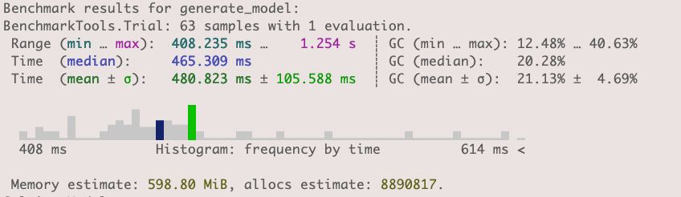
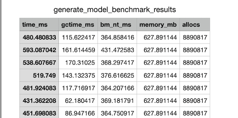

# How to contribute to GenX

## Introduction

GenX is an open-source project, and we welcome contributions from the community. This guide aims to help you get started with GenX and explain how to contribute to the project. In general, the two main ways to contribute to GenX are:

1. Use of [GitHub issues](https://docs.github.com/en/issues/tracking-your-work-with-issues/creating-an-issue) to report bugs and request new features
2. Use of [GitHub pull requests (PR)](https://docs.github.com/en/pull-requests/collaborating-with-pull-requests/proposing-changes-to-your-work-with-pull-requests/creating-a-pull-request) to submit code changes

!!! tip
    We encourage every contributors to read this [guide](https://github.com/SciML/ColPrac), which contains some guidelines on how to contribute to a collaborative project like GenX.

The following sections describe in more detail how to work with GenX resources and how to add a new resource to GenX.

## GenX resources

In GenX, a resource is defined as an instance of a `GenX resource type`, a subtype of an `AbstractResource`. This allows the code to use multiple dispatch and define a common interface (behavior) for all resources in the code. 
Type hierarchy of GenX resources:


!!! note
    All the interface and utility functions available for resources are defined in the [resources.jl](https://github.com/GenXProject/GenX/blob/develop/src/model/resources/resources.jl) file. 

The set of all the resource types available in GenX are contained in the `resource_types` `Tuple` defined at the of the `resources.jl` file. During the initialization process, GenX reads the input data files and creates a new instance of the corresponding resource type for each row in the file. 

### Resource design principles

Resources in GenX are constructed from a set of input files (in `.csv` format, one for each type of resource) located in the `Resources` folder inside the `case` folder. Each row in one of these files defines a new resource instance, and each column corresponds to an attribute of that resource type. 

!!! warning
    The first column of each input data file should be called `Resource` and contain a unique identifier for each resource.

For example, in the case below, the files `Hydro.csv`, `Thermal.csv`, `Vre.csv`, and `Storage.csv` contain the resource data for the hydro, thermal, VRE, and storage resources, respectively. These files are read by GenX during the initialization process and used to create the corresponding resource instances.

```
case_folder
    ├── Resources
    │   ├── Hydro.csv
    │   ├── Thermal.csv
    │   ├── Vre.csv
    │   └── Storage.csv
    ├── Generators_variability.csv
    //
    ├── Setting
    │   └── genx_settings.yml
    └── Run.jl
```

When loading the file `Thermal.csv` below, GenX will create three new resources of type `Thermal` and assign the values of the attributes of each resource from the columns in the input data file:

```
Thermal.csv

 resource            │ zone  │ existing_cap_mw │ inv_cost_per_mwyr │ heat_rate_mmbtu_per_mwh │
 String              │ Int64 │ Float64         │ Float64           │ Float64                 │
────────────────────-┼───────┼─────────────────┼───────────────────┼─────────────────────────│
 NG_combined_cycle_1 │ 1     │ 100.0           │ 239841            │ 7.89                    │
 NG_combined_cycle_2 │ 2     │ 200.0           │ 0.0               │ 8.29                    │
 Biomass             │ 3     │ 200.0           │ 81998             │ 9.9                     │
```
These three resources, together with all the other resources in the data files, will be stored in the GenX `inputs` dictionary with the key `RESOURCES`.

```julia
julia> gen = inputs["RESOURCES"]
julia> length(gen)  # returns the number of resources in the model
julia> thermal(gen)  # returns the indices of all thermal resources (Vector{Int64})
julia> gen.Thermal  # returns the thermal resources (Vector{Thermal})
julia> gen.Thermal == gen[thermal(gen)]  # returns true
```

### Working with GenX resources
To access the attributes of each resource, you can either use a function interface or the standard `.` notation. 

For example, let's assume that `thermal_gen` is the vector of the three `Thermal` resources created from the input data file `Thermal.csv` shown above. 

!!! note
    In the example below, we create the vector `thermal_gen` manually. However, in practice, this vector is automatically created by GenX when loading the input data file `Thermal.csv`.

```@meta
DocTestSetup = quote
    using GenX: Thermal, resource_name, existing_cap_mw, inv_cost_per_mwyr, ids_with, ids_with_positive, ids_with_nonneg, ids_with_policy, resource_id, esr, has
end
```

```jldoctest example_thermal
julia> thermal_gen = [Thermal(Dict(:resource => "NG_combined_cycle_1", 
                                :existing_cap_mw => 100.0, 
                                :inv_cost_per_mwyr => 239841, 
                                :heat_rate_mmbtu_per_mwh => 7.89,
                                :id => 23,
                                :max_cap_mw => 100.0,
                                :esr_1 => 1,)),
                        Thermal(Dict(:resource => "NG_combined_cycle_2",
                                :existing_cap_mw => 200.0,
                                :inv_cost_per_mwyr => 0.0,
                                :heat_rate_mmbtu_per_mwh => 8.29,
                                :max_cap_mw => 0,
                                :id => 24)),
                        Thermal(Dict(:resource => "Biomass",
                                :existing_cap_mw => 200.0,
                                :inv_cost_per_mwyr => 81998,
                                :heat_rate_mmbtu_per_mwh => 9.9, 
                                :max_cap_mw => 0,
                                :lds => 1,
                                :new_build => 1,
                                :id => 25))];
```

To access the attributes of the resources in `thermal_gen`, you can either use the function interfaces defined in `resources.jl` (recommended), or you can use the standard `.` notation:

```jldoctest example_thermal
julia> resource_name(thermal_gen[1])
"NG_combined_cycle_1"
julia> resource_name.(thermal_gen)
3-element Vector{String}:
 "NG_combined_cycle_1"
 "NG_combined_cycle_2"
 "Biomass"
julia> existing_cap_mw(thermal_gen[1])
100.0
julia> existing_cap_mw.(thermal_gen)
3-element Vector{Float64}:
 100.0
 200.0
 200.0
julia> thermal_gen[1].existing_cap_mw
100.0
```

Moreover, inside the `resources.jl` file, there is a set of utility functions to work with all the resources and that can be used as building blocks to create more complex functions:

- [`Base.get(r::AbstractResource, sym::Symbol, default)`](@ref): Returns the value of the attribute `sym` of the resource `r`. If the attribute is not defined for the resource, it returns the `default` value of that attribute.

Example: 
```jldoctest example_thermal
julia> get(thermal_gen[1], :existing_cap_mw, 0)
100.0
julia> get(thermal_gen[1], :new_build, 0)
0
```

- [`GenX.haskey(r::AbstractResource, sym::Symbol)`](@ref): Returns `true` if the resource `r` has the attribute `sym`, and `false` otherwise.

Example: 
```jldoctest example_thermal
julia> haskey(thermal_gen[1], :existing_cap_mw)
true
julia> haskey(thermal_gen[1], :new_build)
false
```

- [`Base.findall(f::Function, rs::Vector{<:AbstractResource})`](@ref): Returns the indices of the resources in `rs` for which the function `f` returns `true`.

Example: 
```jldoctest example_thermal
julia> findall(r -> isa(r,Thermal), thermal_gen) # returns the indices of the thermal resources in thermal_gen
3-element Vector{Int64}:
 23
 24
 25
julia> findall(r -> get(r, :lds, 0) > 0, thermal_gen)  # returns the indices of the resources in thermal_gen that have a Long Duration Storage (lds) attribute greater than 0
1-element Vector{Int64}:
 25
julia> findall(r -> get(r, :new_build, 0) == 1, thermal_gen) # returns the indices of the resources in thermal_gen that are buildable (new_build = 1)
1-element Vector{Int64}:
 25
```
- [`GenX.ids_with(rs::Vector{T}, f::Function, default=default_zero) where T <: AbstractResource`](@ref): Returns the indices of the resources in the vector `rs` for which the function `f` is different from `default`.

Example: 
```jldoctest example_thermal
julia> ids_with(thermal_gen, inv_cost_per_mwyr)
2-element Vector{Int64}:
 23
 25
```
A similar function works with `Symbol`s and `String`s instead of getter functions:
```jldoctest example_thermal
julia> ids_with(thermal_gen, :inv_cost_per_mwyr)
2-element Vector{Int64}:
 23
 25
```

- [`GenX.ids_with_policy(rs::Vector{T}, name::Symbol; tag::Int64) where T <: AbstractResource`](@ref): Returns the indices of the resources in the vector `rs` that have a policy with the name `name` and the tag `tag`.

Example: 
```jldoctest example_thermal
julia> ids_with_policy(thermal_gen, esr, tag=1)
1-element Vector{Int64}:
 23
```

- [`GenX.ids_with_positive(rs::Vector{T}, f::Function) where T <: AbstractResource`](@ref): Returns the indices of the resources in the vector `rs` for which the getter function `f` returns a positive value.

Example: 
```jldoctest example_thermal
julia> ids_with_positive(thermal_gen, inv_cost_per_mwyr)
2-element Vector{Int64}:
 23 
 25
```
A similar function works with `Symbol`s and `String`s instead of getter functions:
```jldoctest example_thermal
julia> ids_with_positive(thermal_gen, :inv_cost_per_mwyr)
2-element Vector{Int64}:
 23
 25
```

- [`GenX.ids_with_nonneg(rs::Vector{T}, f::Function) where T <: AbstractResource`](@ref): Returns the indices of the resources in `rs` for which the getter function `f` returns a non-negative value.

Other useful functions available in GenX are:
- [`GenX.resource_id(r::AbstractResource)`](@ref): Returns the `id` of the resource `r`.
Example: 
```jldoctest example_thermal
julia> resource_id(thermal_gen[1])
23
julia> resource_id.(thermal_gen)
3-element Vector{Int64}:
 23
 24
 25
```
- [`GenX.resource_name(r::AbstractResource)`](@ref): Returns the `name` of the resource `r`.
Example: 
```jldoctest example_thermal
julia> resource_name(thermal_gen[1])
"NG_combined_cycle_1"
julia> resource_name.(thermal_gen)
3-element Vector{String}:
 "NG_combined_cycle_1"
 "NG_combined_cycle_2"
 "Biomass"
```


## How to add a new resource to GenX
### Overview
GenX is designed to be modular and highly flexible to comply with the rapidly changing electricity landscape. For this reason, adding a new resource to GenX is relatively straightforward. This guide will walk you through the steps to do it.

!!! tip
    Before you start, ensure you have read the section of the documentation about [2.1.4 Resources input files](@ref). This will help you understand the data format that GenX expects for each resource and where to place the input data files. 


### Step 1: Define the new resource data type
The first step to add a new resource to GenX is to create a new GenX resource type. This is done by adding a new element to the `resource_types` list of symbols defined at the top of the [resources.jl](https://github.com/GenXProject/GenX/blob/develop/src/model/resources/resources.jl) file. This list contains the names of all the resource types available in GenX. 

For example, to add a new resource type called `new_resource`, you would need to add a new `Symbol`, `:NewResource` to the `resource_types` list:
```julia
const resource_types = (:Thermal,
                        :Vre,
                        :Hydro,
                        :Storage,
                        :MustRun,
                        :FlexDemand,
                        :VreStorage,
                        :Electrolyzer,
                        :NewResource)
```
We encourage you to use `CamelCase` for the name of the new resource type.

The lines right after the `resource_types` list automatically create a new `struct` (composite type) for the new resource type. More importantly, the new resource type will be defined as a subtype of the GenX `AbstractResource` type. This is important because it allows the code to use multiple dispach and define a common interface (behavior) for all resources in GenX. For instance, the `resource_id()` function will return the `id` of any resource in GenX, regardless of its type (and therefore will automatically work for the newly created `new_resource`).

### Step 2: Add the filename of the new resource type to GenX

In GenX, the attributes of a resource are automatically defined from the columns of the corresponding input data file (e.g., `Thermal.csv` file for the `Thermal` resources, `Hydro.csv` file for the `Hydro` resource, etc). The first column of these files should be called `Resource` and contain a unique identifier for each resource. The rest of the columns in the input data file will be used to define the attributes of the new resource type. 

So, the second step to add a new resource type to GenX is to add the filename of the input data file to GenX. The list of input data files that GenX loads during the initialization process are defined at the top of the [`load_resource_data.jl`](https://github.com/GenXProject/GenX/tree/main/src/load_inputs/load_resources_data.jl)
file, inside an internal function called `_get_resource_info()`. This function returns a `NamedTuple` called `resource_info` with the name of the input data file and the name of the resource type for each resource that is available in GenX. 

To add the new resource type to GenX, add a new item to `resource_info`, where the first field is the name of the input data file and the second is the name of the resource type that was created in Step 1. The names in `resource_info` are only used to make the code more readable and are arbitrary. 

For example, if you are adding a new resource type called `new_resource`, you would need to add the following line to the `resource_info`: `new_resource = (filename="New_resource.csv", type=NewResource)`, as follows: 

```julia
function _get_resource_info()
    resource_info = (
        hydro   = (filename="Hydro.csv", type=Hydro),
        thermal = (filename="Thermal.csv", type=Thermal),
        vre     = (filename="Vre.csv", type=Vre),
        storage = (filename="Storage.csv", type=Storage),
        flex_demand  = (filename="Flex_demand.csv", type=FlexDemand),
        must_run = (filename="Must_run.csv", type=MustRun),
        electrolyzer = (filename="Electrolyzer.csv", type=Electrolyzer),
        vre_stor = (filename="Vre_stor.csv", type=VreStorage)
        new_resource = (filename="New_resource.csv", type=NewResource)
    )
    return resource_info
end
```
With this simple edit, whenever the file `New_resource.csv` is found in the input data folder, GenX will automatically perform the following steps:

1. Load the new resource input file,
2. Create a new instance of the `NewResource` type for each row in the input data file,
3. Define the attributes of each `NewResource` from the columns in the input data file,
4. Populate the attributes of each `NewResource` with the values read from the input data file.
5. Add the new resources to the vector of resources in the model.

For example, if the input data file `New_resource.csv` contains the following data:
```
New_resource.csv

 Resource │ Zone  | Exisiting_capacity | attribute_1 | attribute_2
 String   │ Int64 | Float64            | Float64     | Float64
──────────┼───────┼────────────────────┼─────────────┼────────────
 new_res1 │ 1     │ 100.0              │ 6.2         │ 0.4
 new_res2 │ 1     │ 200.0              │ 0.1         │ 4.0
 new_res3 │ 2     │ 300.0              │ 2.0         │ 0.1
```
GenX will create three new resources of type `NewResource` with the following attributes:
- `resource`: `String` with the name of the resource (e.g., `new_res1`, `new_res2`, `new_res3`)
- `zone`: `Int64` with the zone of the resource (e.g., `1`, `1`, `2`)
- `existing_capacity`: `Float64` with the existing capacity of the resource (e.g., `100.0`, `200.0`, `300.0`)
- `attribute_1`: `Float64` with the value of `attribute_1` (e.g., `6.2`, `0.1`, `2.0`)
- `attribute_2`: `Float64` with the value of `attribute_2` (e.g., `0.4`, `4.0`, `0.1`)


See Step 3 for more details on how to work with the new resource type.

!!! warning
    Each resource type must contain a `Resource` attribute. This attribute should be `String` that uniquely identifies the resource. 

### Step 3: Work with the new resource type
Once the new resource type has been defined and added to GenX, you can work with it as you would with any other resource type. To improve the robustness and readability of the code, we recommend that you define getter functions for the new attributes of the new resource type (e.g., a function `zone(r) = r.zone` to get the zone of the resource `r`). These functions can be defined in the `resources.jl` file. However, this is not strictly necessary, and you can access the attributes of the new resource type directly using the standard `.` notation:

!!! tip
    To simplify the creation of getter functions for the new resource type, you can use the `@interface` macro available in GenX. This macro automatically creates a new function with the same name as the attribute and which returns the value of the attribute. For example, if you want to create a getter function for the `attribute_1` of the `NewResource` type, these two ways are equivalent:
    ```julia
    julia> default_attribute_1 = 0.0    # default value for attribute_1
    julia> attribute_1(res::NewResource) = get(res, :attribute_1, default_attribute_1)
    attribute_1 (generic function with 1 method)
    julia> @interface(attribute_1, 0.0, NewResource)
    attribute_1 (generic function with 1 method)
    ```
    And then:
    ```julia
    julia> attribute_1(new_res1)
    6.2
    julia> new_res1.attribute_1
    6.2
    ```

```@meta
DocTestSetup = nothing
```

## Benchmark Macro
### How Benchmark Macro Defined 
#### Benchmark Macro
A customized benchmark macro has been defined at [`src/benchmark/benchmark_macro.jl`](@ref benchmarked). See a snippet of the macro below.

```
macro benchmarked(args...)
    _, params = BenchmarkTools.prunekwargs(args...)
    bench, trial, result = gensym(), gensym(), gensym()
    trialmin, trialallocs = gensym(), gensym()
    tune_phase = BenchmarkTools.hasevals(params) ? :() : :($BenchmarkTools.tune!($bench))
    return esc(...
```

#### Benchmark Flag
A flag to enable or disable benchmark usage for running an example case has been set for just one example at: [`example_systems/1_three_zones/settings/genx_settings.yml`](https://github.com/GenXProject/GenX.jl/blob/main/example_systems/1_three_zones/settings/genx_settings.yml). 

```
# Get benchmark analysis data for a function;
# 0 = off or disabled; 1 = on or enabled;
# By default this flag is disabled;
# It is only set up for this example case only;
Benchmark: 0
```

!!! note 
    If you want to add this benchmark macro to your own example case, you may follow suit as the above setting up a flag in your example's genx_settings.yml file.
    ```
    NetworkExpansion: 1
    Trans_Loss_Segments: 1
    EnergyShareRequirement: 0
    CapacityReserveMargin: 0
    CO2Cap: 2
    StorageLosses: 1
    MinCapReq: 1
    MaxCapReq: 0
    ParameterScale: 1
    WriteShadowPrices: 1
    UCommit: 2
    TimeDomainReduction: 1 
    Benchmark: 1 
    ``` 
## How to Use Benchmark Macro
#### Step 1: Use Enabled Benchmark Flag
So, the benchmark flag is set currently disabled in `genx_settings.yml` file of `example_case/1_three_zones.` We enabled it first by setting the value to be `1`:

    Benchmark: 1
    
#### Step 2: Use the Macro
Once we have enabled the benchmark flag. We use the macro for a function that we want to get benchmark data. Use ```generate_model``` as an example. Go to `src/case_runners/case_runner.jl` for this `1_three_zone` example case and make additions to these lines:

```julia
    time_elapsed = @elapsed EP = generate_model(mysetup, myinputs, OPTIMIZER)
    println("Time elapsed for model building is")
    println(time_elapsed)
```

Add benchmark flag checking statement and use the macro for generate_model function.  Add an output print statement and display the benchmark analysis data to the standard output.

```julia
    ## Benchmark enabled
    if mysetup["Benchmark"] == 1
        EP, bm_results = @benchmarked generate_model($mysetup, $myinputs, $OPTIMIZER) seconds=30 samples=1000 evals=1
        println("Benchmark results for generate_model: ")
        BenchmarkTools.display(bm_results)
    else
        time_elapsed = @elapsed EP = generate_model(mysetup, myinputs, OPTIMIZER)
        println("Time elapsed for model building is")
        println(time_elapsed)
    end
```    

#### Step 3: Run Case with Benchmark Results
We then run the example case which we have just added benchmark macro. A snapshot of the benchmark results with a histogram from the output of the run is captured, below.




## Turn Benchmark Results into CSV
We want to save the benchmark results in a file each time we run an example case and would like to make a comparison of them for future analysis.  A function to create a cvs file has been provided together with the benchmark macro. 

#### Use the Function Provided
We provide this function [generate\_benchmark\_csv](@ref benchmarked) to generate a csv file that includes the complete benchmark results for the example case.

In the same case_runner.jl file that we use benchmark macro, we use this function for producing a csv file with all the benchmark results.


