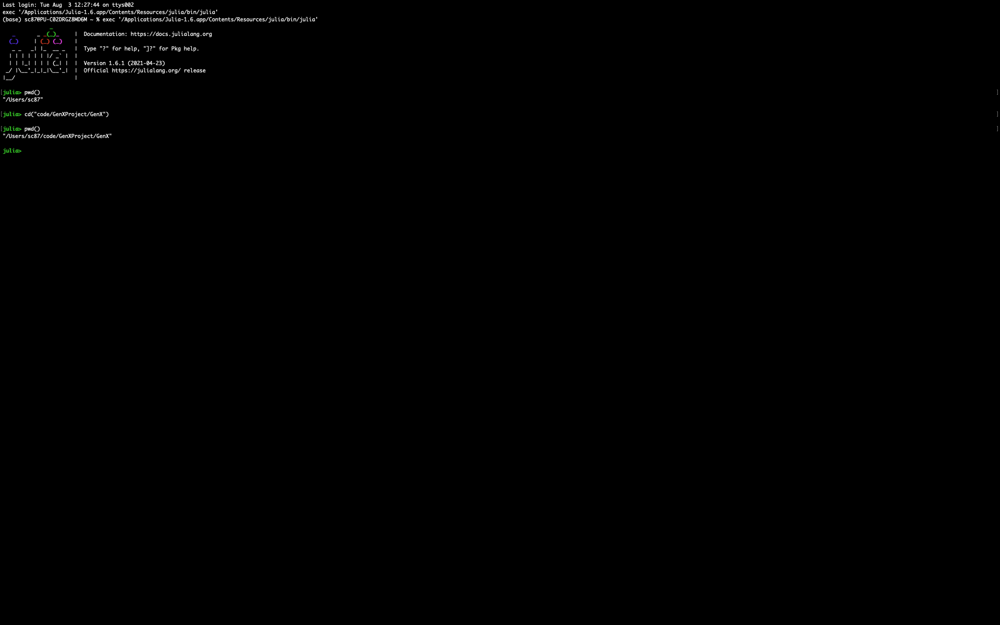

# GenX Documentation

```@meta
CurrentModule = GenX
```

## Overview

GenX is a highly-configurable, [open source](https://github.com/GenXProject/GenX/blob/main/LICENSE) electricity resource capacity expansion model that incorporates several state-of-the-art practices in electricity system planning to offer improved decision support for a changing electricity landscape.

The model was [originally developed](https://energy.mit.edu/publication/enhanced-decision-support-changing-electricity-landscape/) by [Jesse D. Jenkins](https://mae.princeton.edu/people/faculty/jenkins) and [Nestor A. Sepulveda](https://energy.mit.edu/profile/nestor-sepulveda/) at the Massachusetts Institute of Technology and is now jointly maintained by [a team of contributors](https://energy.mit.edu/genx/#team) at the MIT Energy Initiative (led by [Dharik Mallapragada](https://energy.mit.edu/profile/dharik-mallapragada/)) and the Princeton University ZERO Lab (led by Jenkins).

GenX is a constrained linear or mixed integer linear optimization model that determines the portfolio of electricity generation, storage, transmission, and demand-side resource investments and operational decisions to meet electricity demand in one or more future planning years at lowest cost, while subject to a variety of power system operational constraints, resource availability limits, and other imposed environmental, market design, and policy constraints.

GenX features a modular and transparent code structure developed in [Julia](http://julialang.org/) + [JuMP](http://jump.dev/). The model is designed to be highly flexible and configurable for use in a variety of applications from academic research and technology evaluation to public policy and regulatory analysis and resource planning. Depending on the planning problem or question to be studied, GenX can be configured with varying levels of model resolution and scope, with regards to: (1) temporal resolution of time series data such as electricity demand and renewable energy availability; (2) power system operational detail and unit commitment constraints; and (3) geospatial resolution and transmission network representation. The model is also capable of representing a full range of conventional and novel electricity resources, including thermal generators, variable renewable resources (wind and solar), run-of-river, reservoir and pumped-storage hydroelectric generators, energy storage devices, demand-side flexibility, demand response, and several advanced technologies such as long-duration energy storage.

## Requirements

GenX currently exists in version 0.2.0 and runs only on Julia v1.6.x and v1.5.x series, where x>=0 and a minimum version of JuMP v0.21.x. There is also an older version of GenX, which is also currently maintained and runs on Julia 1.3.x and 1.4.x series (For those users who has previously cloned GenX, and has been running it successfully so far, and therefore might be unwilling to run it on the latest version of Julia: please look into the GitHub branch, [old_version](https://github.com/GenXProject/GenX/tree/old_version)). It is currently setup to use one of the following open-source freely available solvers: A) [Clp](https://github.com/jump-dev/Clp.jl) for linear programming (LP) problems and (B) [Cbc](https://github.com/jump-dev/Cbc.jl) for mixed integer linear programming (MILP) problems. (C) [SCIP](https://www.scipopt.org) for faster solution of MILP problems. At this stage, we suggest users to prefer SCIP over Cbc, while solving MILP problem instances, because, the write outputs is much faster with SCIP. We also provide the option to use one of these two commercial solvers: D) [Gurobi](https://www.gurobi.com), and E) [CPLEX](https://www.ibm.com/analytics/cplex-optimizer). Note that using Gurobi and CPLEX requires a valid license on the host machine. There are two ways to run GenX with either type of solver options (open-source free or, licensed commercial) as detailed in the section, `Running an Instance of GenX`.

The file `julenv.jl` in the parent directory lists all of the packages and their versions needed to run GenX. You can see all of the packages installed in your Julia environment and their version numbers by running `pkg> status` on the package manager command line in the Jula REPL.

## Running an Instance of GenX

Download or clone the GenX repository on your machine in a directory named 'GenX'. Create this new directory in a location where you wish to store the GenXJulEnv environment.

The Run.jl file in each of the example sub-folders within `Example_Systems/` provides an example of how to use GenX.jl for capacity expansion modeling. The following are the main steps performed in the Run.jl script:

1. Establish path to environment setup files and GenX source files.
2. Read in model settings `genx_settings.yml` from the example directory.
3. Configure solver settings.
4. Load the model inputs from the example directory and perform time-domain clustering if required.
5. Generate a GenX model instance.
6. Solve the model.
7. Write the output files to a specified directory.

Here are step-by-step instructions for running Run.jl, following the two slightly different methods:

### Method 1: Creating the Julia environment and installing dependencies from Project.toml file

1. Start an instance of the Julia kernel from inside the GenX/ folder (which corresponds to the GenX repo, that you've just cloned) by typing `julia --project="GenX"`.
2. Go to the package prompt by typing `]`. You will see that you're within a Julia virtual environment named `(GenX)`. However, at this point, this environment isn't loaded with the dependencies. Type `activate .` to activate the dependecnies in the environment.
3. If it's your first time running GenX (or, if you have pulled after some major upgrades/release/version) run `instantiate` from the `(GenX) pkg` prompt.
4. If you have an old `Manifest.toml` file file at the same file hierarchy as the `Project.toml` file and you get an error while running through the above steps, please delete the existing `Manifest.toml` file and execute steps 1-3 again.
5. In order to make sure that the dependecies have been installed, type `st` in the package prompt.

Execution of the entire sequence of the four steps above should look like the figure below:


*Figure.Creating the Julia environment and installing dependencies from Project.toml file from inside the GenX folder: Steps 1-4*

6. Type the back key to come back to the `julia>` prompt.
7. Run the script by executing the command `julia> include(“<path to your case>/Run.jl”)`. For example, in order to run the ISONE_Singlezone case within the Example_Systems/RealSystemExample/, type `include("Example_Systems/RealSystemExample/ISONE_Singlezone/Run.jl")` from the `julia>` prompt (while being still in the GenX i.e. the root level in the folder hierarchy)

Execution of the steps 5 and 6 above should look like the figure below:


*Figure.Creating the Julia environment and installing dependencies from Project.toml file from inside the GenX folder: Steps 5-6*

8. After the script runs to completion, results will be written to a folder called “Results”, also located in the same directory as `Run.jl`.

If however, the user opens a julia kernel, while not yet inside the GenX folder, it's still possible to reach to the GenX folder while being inside the Julia REPL by executing the `pwd()` command first to check where on the directory structure the user is currently, and then by executing the `cd(<path to GenX>)` command. Afterwards, the steps are the same as above. This is shown in the three figures below:


*Figure.Creating the Julia environment and installing dependencies from Project.toml file from inside the GenX folder: Changing path to GenX*


*Figure.Creating the Julia environment and installing dependencies from Project.toml file from inside the GenX folder: Steps 1-4*


*Figure.Creating the Julia environment and installing dependencies from Project.toml file from inside the GenX folder: Steps 5-6*

### Method 2: Creating the Julia environment and installing the dependencies by building the Project.toml files by running activation script

1. Start an instance of the Julia kernel.
2. Make your present working directory to be where the Run.jl is located. To do this, you can use the Julia command `julia> cd(“/path/to/directory/containing/file)`, using the actual pathname of the directory containing Run.jl. Note that all your inputs files should be in this directory in addition to Run.jl. Details about the required input files can be found in the documentation linked above or in the examples provided in the folder `Example_Systems/`. You can check your present working directory by running the command `julia> pwd()`.
3. Uncomment the following lines of code at the beginning of the `Run.jl` file (which is currently commented out):
    `environment_path = "../../../package_activate.jl"`
    `include(environment_path)`
4. Run the script by executing the command `julia> include(“Run.jl”)`.
5. After the script runs to completion, results will be written to a folder called “Results”, also located in the same directory as `Run.jl`.

Note that if you have not already installed the required Julia packages, you are using a version of JuMP other than v0.21.4, or you do not have a valid Gurobi license on your host machine, you will receive an error message and Run.jl will not run to completion.

If you want to use either of Gurobi or CPLEX solvers, instead or Clp or Cbc do the following:

1. Uncomment the relevant lines in the `[deps]` and `[compat]` in the Project.toml file within GenX/ folder. If the CPLEX and/or Gurobi lines are missing, add the following lines to the `[deps]`:
`CPLEX = "a076750e-1247-5638-91d2-ce28b192dca0"`
`Gurobi = "2e9cd046-0924-5485-92f1-d5272153d98b"`
and the following lines to the `[compat]`:
`CPLEX = "0.7.7"`
`Gurobi = "0.9.14"`
depending on whether you are going to use CPLEX or Gurobi, respectively.
2. Uncomment the relevent `using Gurobi` and/or `using CPLEX` at the beginning of the `GenX.jl` file
3. Set the appropriate solver in the `genx_settings.yml` file
4. Make sure you have a valid license and the actual solvers for either of Gurobi or CPLEX installed on your machine

## Running Modeling to Generate Alternatives with GenX

GenX includes a modeling to generate alternatives (MGA) package that can be used to automatically enumerate a diverse set of near cost-optimal solutions to electricity system planning problems. To use the MGA algorithm, user will need to perform the following tasks:

1. Add a `Resource_Type` column in the `Generators_data.csv` file denoting the type of each technology.
2. Add a `MGA` column in the `Generators_data.csv` file denoting the availability of the technology.
3. Set the `ModelingToGenerateAlternatives` flag in the `GenX_Settings.yml` file to 1.
4. Set the `ModelingtoGenerateAlternativeSlack` flag in the `GenX_Settings.yml` file to the desirable level of slack.
5. Solve the model using `Run.jl` file.

Results from the MGA algorithm would be saved in `MGA_max` and `MGA_min` folders in the `Example_Systems/` folder.

## Running Method of Morris with GenX

GenX includes Method of Morris package that can be used for performing extensive one-at-a-time sensitivity analysis. To use the Method of Morris algorithm, user will need to perform the following tasks:

1. Create `Method_of_morris_range.csv` file to provide inputs required for runiing the Method of Morris script.
2. Set the `MethodofMorris` flag in the `GenX_Settings.yml` file to 1.
3. Solve the model using `Run.jl` file.
4. Results of the Method of Morris script will be stored in the `Results` folder in the `morris.csv` file.

